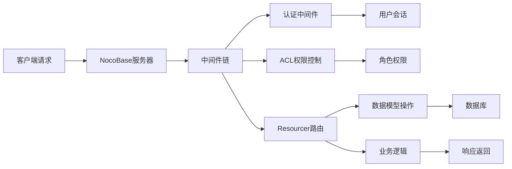
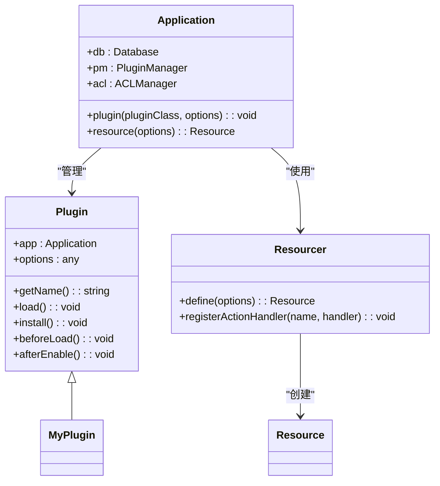
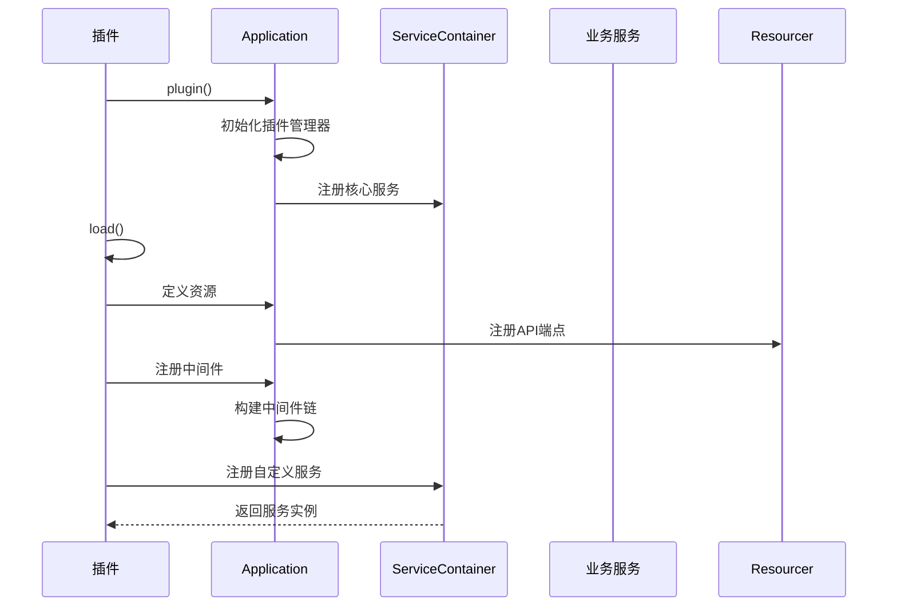
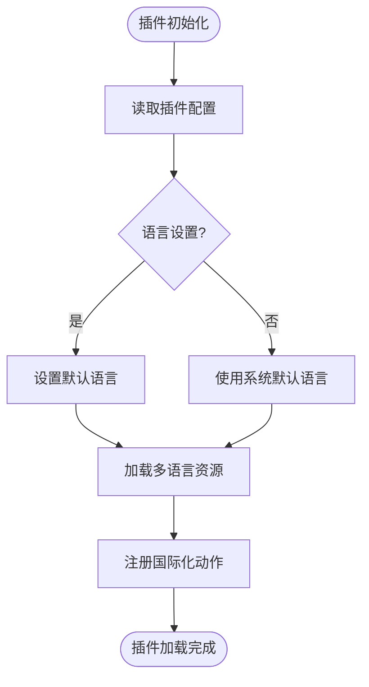

# 功能扩展

<cite>
**本文档中引用的文件**  
- [custom-plugin.ts](file://examples/app/custom-plugin.ts)
- [application.ts](file://packages/core/server/src/application.ts)
- [plugin.ts](file://packages/core/server/src/plugin.ts)
- [server.ts](file://packages/plugins/@nocobase/plugin-acl/src/server/server.ts)
- [i18n.ts](file://examples/app/i18n.ts)
- [index.ts](file://packages/core/server/src/middlewares/index.ts)
</cite>

## 目录
1. [简介](#简介)
2. [项目结构](#项目结构)
3. [核心组件](#核心组件)
4. [架构概述](#架构概述)
5. [详细组件分析](#详细组件分析)
6. [依赖分析](#依赖分析)
7. [性能考虑](#性能考虑)
8. [故障排除指南](#故障排除指南)
9. [结论](#结论)

## 简介
本文档深入讲解如何在NocoBase插件中实现服务器端和客户端功能扩展。涵盖API端点定义、数据模型创建、业务逻辑实现、服务注册、中间件使用、依赖注入机制、插件交互、配置管理以及国际化支持的最佳实践。通过完整的代码示例展示从功能设计到实现的完整流程，并解释关键实现细节。

## 项目结构
NocoBase插件系统采用模块化架构，核心功能分布在`packages/core`和`packages/plugins`目录中。插件开发主要涉及服务器端和客户端两个部分，通过清晰的目录结构组织代码。

```mermaid
graph TD
A[NocoBase插件结构] --> B[pkg/core]
A --> C[pkg/plugins]
B --> D[server]
B --> E[client]
C --> F[@nocobase/plugin-acl]
C --> G[@nocobase/plugin-auth]
D --> H[application.ts]
D --> I[plugin.ts]
E --> J[client模块]
F --> K[server/server.ts]
F --> L[client/client.ts]
```

**Diagram sources**
- [application.ts](file://packages/core/server/src/application.ts)
- [plugin.ts](file://packages/core/server/src/plugin.ts)

**Section sources**
- [application.ts](file://packages/core/server/src/application.ts)
- [plugin.ts](file://packages/core/server/src/plugin.ts)

## 核心组件
NocoBase插件系统的核心组件包括Application、Plugin、Resourcer、Database等。Application是整个系统的入口点，负责管理插件生命周期、服务注册和中间件链。Plugin是功能扩展的基本单元，通过继承Plugin类实现自定义功能。

**Section sources**
- [application.ts](file://packages/core/server/src/application.ts)
- [plugin.ts](file://packages/core/server/src/plugin.ts)

## 架构概述
NocoBase采用基于Koa的微内核架构，通过插件机制实现功能扩展。系统启动时加载所有注册的插件，每个插件可以定义自己的数据模型、API端点、中间件和业务逻辑。



**Diagram sources**
- [application.ts](file://packages/core/server/src/application.ts)
- [plugin.ts](file://packages/core/server/src/plugin.ts)

## 详细组件分析

### 服务器端功能实现
在插件中实现服务器端功能需要继承Plugin类并重写load方法。可以通过app.resource定义新的API端点，通过db.collection定义数据模型。



**Diagram sources**
- [plugin.ts](file://packages/core/server/src/plugin.ts)
- [application.ts](file://packages/core/server/src/application.ts)

### 客户端功能开发
客户端功能开发涉及UI组件、页面、路由和状态管理的添加。通过client模块可以扩展用户界面，添加新的页面和组件。

**Section sources**
- [server.ts](file://packages/plugins/@nocobase/plugin-acl/src/server/server.ts)

### 依赖注入与服务注册
NocoBase使用依赖注入机制管理服务实例。通过app.container可以注册和获取服务，实现松耦合的组件交互。



**Diagram sources**
- [application.ts](file://packages/core/server/src/application.ts)
- [plugin.ts](file://packages/core/server/src/plugin.ts)

### 配置管理与国际化
插件配置管理通过options参数实现，支持在插件注册时传入配置。国际化支持通过i18n模块实现，可以在插件中定义多语言资源。



**Diagram sources**
- [i18n.ts](file://examples/app/i18n.ts)
- [plugin.ts](file://packages/core/server/src/plugin.ts)

## 依赖分析
NocoBase插件系统具有清晰的依赖关系，核心包提供基础功能，插件包实现具体业务功能。通过合理的依赖管理，确保系统的可扩展性和维护性。

```mermaid
graph TD
A[@nocobase/core] --> B[@nocobase/database]
A --> C[@nocobase/resourcer]
A --> D[@nocobase/acl]
A --> E[@nocobase/auth]
A --> F[@nocobase/logger]
G[@nocobase/plugin-acl] --> A
H[@nocobase/plugin-auth] --> A
I[@nocobase/plugin-workflow] --> A
J[@nocobase/plugin-data-source-manager] --> A
K[@nocobase/plugin-ui-schema-storage] --> A
```

**Diagram sources**
- [package.json](file://packages/core/server/package.json)
- [plugin.ts](file://packages/core/server/src/plugin.ts)

**Section sources**
- [plugin.ts](file://packages/core/server/src/plugin.ts)

## 性能考虑
在插件开发中需要考虑性能优化，包括数据库查询优化、缓存使用、中间件性能监控等。通过合理的架构设计和代码优化，确保系统在高并发场景下的稳定运行。

## 故障排除指南
插件开发过程中可能遇到各种问题，包括插件加载失败、API端点无法访问、权限控制异常等。通过日志记录、调试工具和错误处理机制，可以快速定位和解决问题。

**Section sources**
- [application.ts](file://packages/core/server/src/application.ts)
- [plugin.ts](file://packages/core/server/src/plugin.ts)

## 结论
NocoBase插件系统提供了强大的功能扩展能力，通过清晰的架构设计和丰富的API接口，开发者可以轻松实现各种业务需求。遵循最佳实践，合理使用依赖注入、服务注册和国际化支持，可以构建高效、可维护的插件应用。