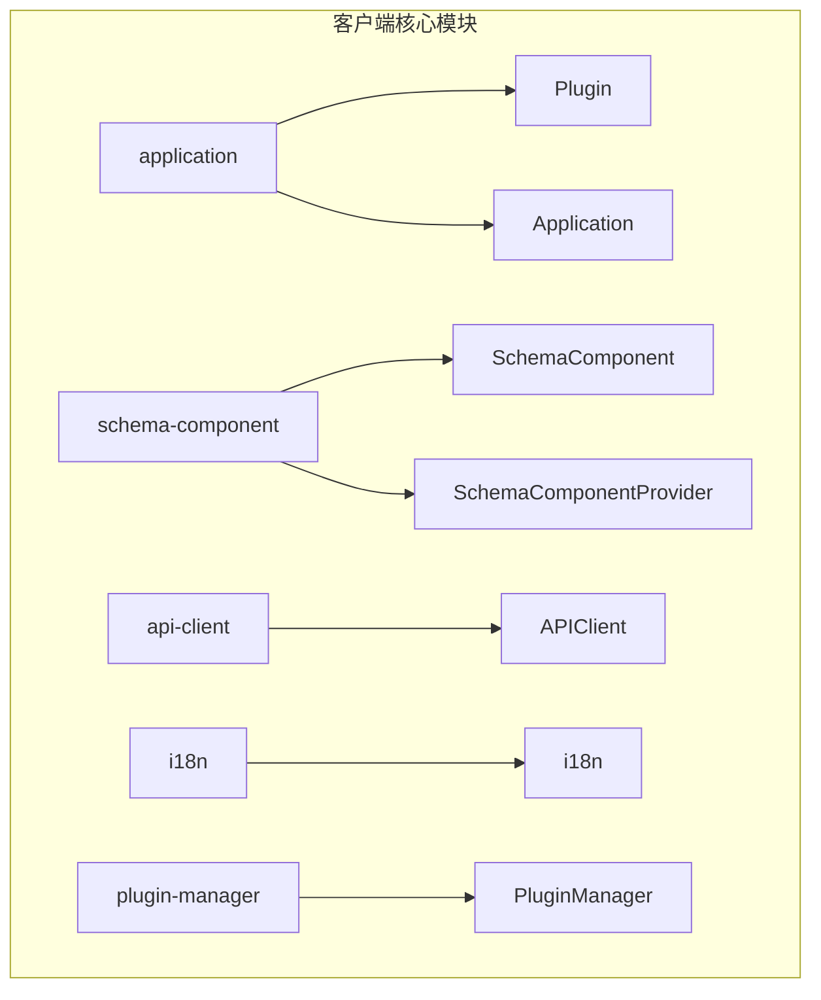
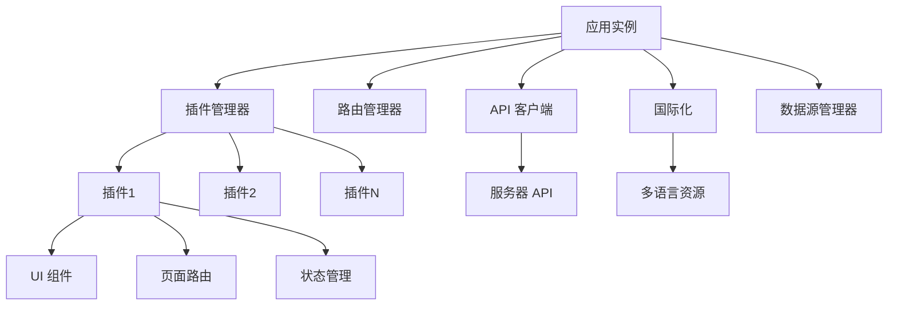
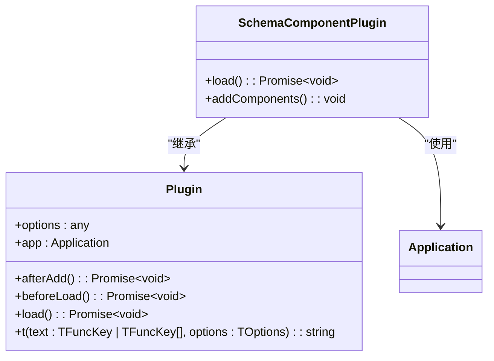
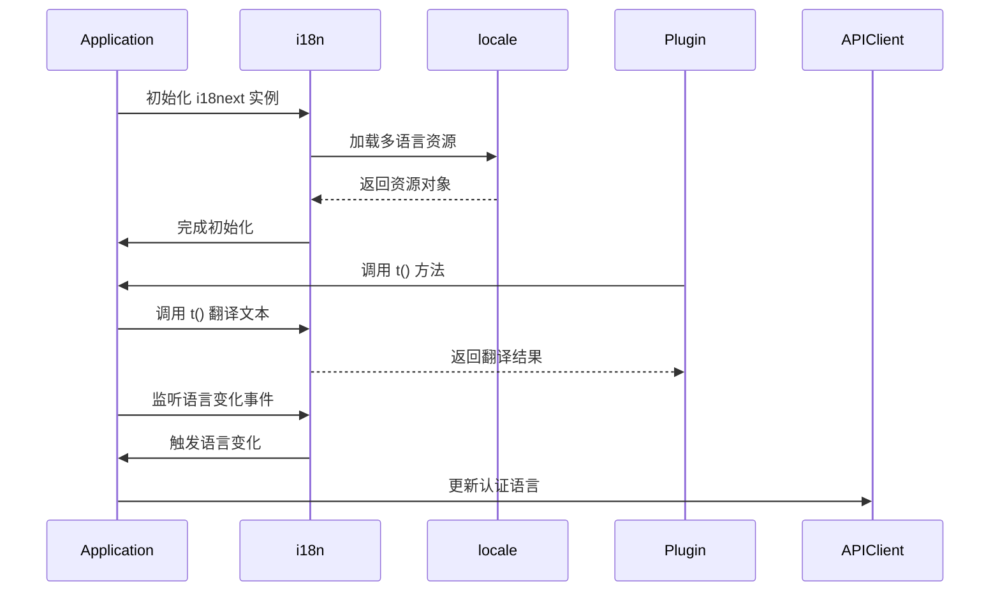
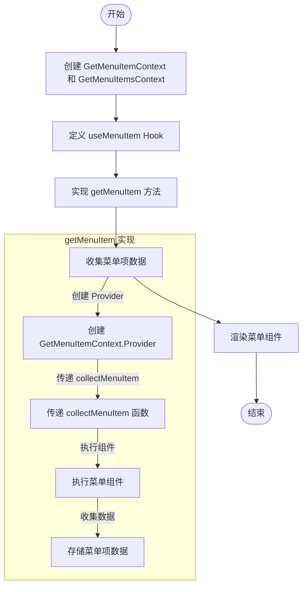
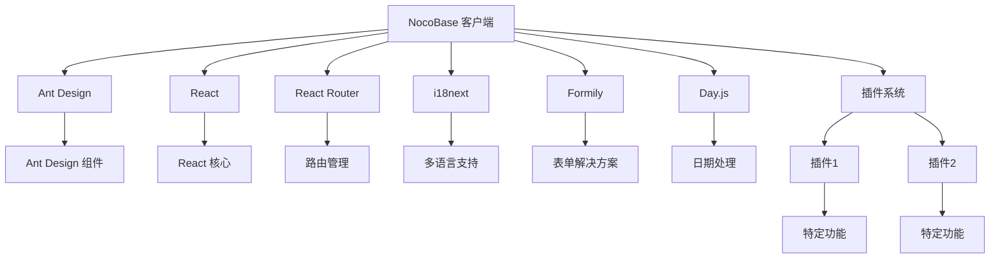

# 客户端扩展

<cite>
**本文档中引用的文件**  
- [Plugin.ts](file://packages/core/client/src/application/Plugin.ts)
- [Application.tsx](file://packages/core/client/src/application/Application.tsx)
- [index.ts](file://packages/core/client/src/index.ts)
- [i18n.ts](file://packages/core/client/src/i18n/i18n.ts)
- [useMenuItem.tsx](file://packages/core/client/src/hooks/useMenuItem.tsx)
- [SchemaComponentPlugin.tsx](file://packages/core/client/src/schema-component/core/index.tsx)
- [schema-component/index.tsx](file://packages/core/client/src/schema-component/index.tsx)
</cite>

## 目录
1. [简介](#简介)
2. [项目结构](#项目结构)
3. [核心组件](#核心组件)
4. [架构概述](#架构概述)
5. [详细组件分析](#详细组件分析)
6. [依赖分析](#依赖分析)
7. [性能考虑](#性能考虑)
8. [故障排除指南](#故障排除指南)
9. [结论](#结论)

## 简介
本文档深入讲解如何在 NocoBase 插件中进行客户端功能扩展，涵盖 UI 组件、页面、路由和状态管理的添加方法。重点介绍使用 schema 系统定义界面结构，通过插件 API 注册新页面和菜单项，以及实现自定义 React 组件和 Hooks 的最佳实践。同时详细说明客户端依赖管理机制、第三方 UI 库引入方式、与服务器端 API 的交互方法、国际化支持、样式定制、主题适配和生命周期事件处理。

## 项目结构
NocoBase 客户端扩展功能主要集中在 `packages/core/client` 目录下，该目录包含了构建插件所需的核心模块和工具。



**Diagram sources**
- [Plugin.ts](file://packages/core/client/src/application/Plugin.ts)
- [Application.tsx](file://packages/core/client/src/application/Application.tsx)
- [schema-component/index.tsx](file://packages/core/client/src/schema-component/index.tsx)

**Section sources**
- [index.ts](file://packages/core/client/src/index.ts)

## 核心组件
NocoBase 客户端扩展的核心组件包括插件系统、应用实例、schema 组件系统、API 客户端和国际化支持。这些组件共同构成了插件开发的基础架构，使开发者能够灵活地扩展系统功能。

**Section sources**
- [index.ts](file://packages/core/client/src/index.ts)
- [Application.tsx](file://packages/core/client/src/application/Application.tsx)

## 架构概述
NocoBase 客户端采用模块化架构，通过插件系统实现功能扩展。核心架构包括应用实例、插件管理器、路由管理器、schema 组件系统和状态管理。



**Diagram sources**
- [Application.tsx](file://packages/core/client/src/application/Application.tsx)
- [Plugin.ts](file://packages/core/client/src/application/Plugin.ts)

## 详细组件分析
### 插件系统分析
NocoBase 的插件系统基于类继承实现，所有插件都继承自 `Plugin` 基类，通过重写生命周期方法来实现特定功能。

#### 插件类结构
```mermaid
classDiagram
class Plugin {
+options : any
+app : Application
+pluginManager : PluginManager
+pm : PluginManager
+router : RouterManager
+pluginSettingsManager : PluginSettingsManager
+schemaInitializerManager : SchemaInitializerManager
+schemaSettingsManager : SchemaSettingsManager
+dataSourceManager : DataSourceManager
+afterAdd() : Promise~void~
+beforeLoad() : Promise~void~
+load() : Promise~void~
+t(text : TFuncKey | TFuncKey[], options : TOptions) : string
}
class Application {
+eventBus : EventTarget
+providers : ComponentAndProps[]
+router : RouterManager
+scopes : Record~string, any~
+i18n : i18next
+ws : WebSocketClient
+apiClient : APIClient
+components : Record~string, ComponentType~
+pluginManager : PluginManager
+pluginSettingsManager : PluginSettingsManager
+devDynamicImport : DevDynamicImport
+requirejs : RequireJS
+notification : any
+schemaInitializerManager : SchemaInitializerManager
+schemaSettingsManager : SchemaSettingsManager
+dataSourceManager : DataSourceManager
+name : string
+favicon : string
+globalVars : Record~string, any~
+globalVarCtxs : Record~string, any~
+jsonLogic : JsonLogic
+loading : boolean
+maintained : boolean
+maintaining : boolean
+error : any
+hasLoadError : boolean
+wsAuthorized : boolean
+variables : Variable[]
+updateFavicon(favicon? : string) : void
+setWsAuthorized(authorized : boolean) : void
+constructor(options : ApplicationOptions)
+initRequireJs() : void
+addDefaultProviders() : void
+addReactRouterComponents() : void
+addRoutes() : void
+getOptions() : ApplicationOptions
+getName() : string | null
+getPublicPath() : string
+getApiUrl(pathname : string) : string
+getRouteUrl(pathname : string) : string
+getHref(pathname : string) : string
+getCollectionManager(dataSource? : string) : CollectionManager
+getComposeProviders() : React.ComponentType
+use~T~(component : ComponentType, props? : T) : number
+addProvider~T~(component : ComponentType, props? : T) : number
+addProviders(providers : (ComponentType | [ComponentType, any])[]) : void
+load() : Promise~void~
+loadWebSocket() : Promise~void~
+getComponent~T~(Component : ComponentTypeAndString~T~, isShowError : boolean) : ComponentType~T~ | undefined
+renderComponent~T~(Component : ComponentTypeAndString, props? : T, children? : ReactNode) : ReactElement
+addComponent(component : ComponentType, name? : string) : void
+addComponents(components : Record~string, ComponentType~) : void
+addScopes(scopes : Record~string, any~) : void
+getRootComponent() : React.ComponentType
+mount(containerOrSelector : Element | ShadowRoot | string) : any
+addFieldInterfaces(fieldInterfaceClasses : CollectionFieldInterfaceFactory[]) : void
+addFieldInterfaceComponentOption(fieldName : string, componentOption : CollectionFieldInterfaceComponentOption) : void
+addFieldInterfaceOperator(name : string, operatorOption : any) : void
+addGlobalVar(key : string, value : any, varCtx? : any) : void
+getGlobalVar(key : string) : any
+getGlobalVarCtx(key : string) : any
+addUserCenterSettingsItem(item : SchemaSettingsItemType & { aclSnippet? : string }) : void
+registerVariable(variable : Variable) : void
+getVariables() : Variable[]
}
Plugin --> Application : "依赖"
```

**Diagram sources**
- [Plugin.ts](file://packages/core/client/src/application/Plugin.ts)
- [Application.tsx](file://packages/core/client/src/application/Application.tsx)

### Schema 组件系统分析
Schema 组件系统是 NocoBase 实现可视化配置的核心，通过 JSON schema 定义界面结构。

#### Schema 组件插件


**Diagram sources**
- [SchemaComponentPlugin.tsx](file://packages/core/client/src/schema-component/core/index.tsx)
- [Plugin.ts](file://packages/core/client/src/application/Plugin.ts)

### 国际化支持分析
NocoBase 提供完整的国际化支持，基于 i18next 实现多语言功能。

#### 国际化实现


**Diagram sources**
- [i18n.ts](file://packages/core/client/src/i18n/i18n.ts)
- [Application.tsx](file://packages/core/client/src/application/Application.tsx)

### 菜单系统分析
NocoBase 的菜单系统通过 React Context 实现组件间通信，支持动态菜单项收集和渲染。

#### 菜单系统流程


**Diagram sources**
- [useMenuItem.tsx](file://packages/core/client/src/hooks/useMenuItem.tsx)

**Section sources**
- [useMenuItem.tsx](file://packages/core/client/src/hooks/useMenuItem.tsx)

## 依赖分析
NocoBase 客户端依赖多个核心包和第三方库，形成完整的依赖关系网络。



**Diagram sources**
- [package.json](file://packages/core/client/package.json)
- [index.ts](file://packages/core/client/src/index.ts)

## 性能考虑
在开发 NocoBase 插件时，需要考虑以下性能优化点：
- 使用懒加载减少初始加载时间
- 合理使用 React.memo 避免不必要的重新渲染
- 优化 schema 解析性能
- 减少不必要的网络请求
- 使用 Web Workers 处理复杂计算

## 故障排除指南
### 常见问题
- **插件未加载**：检查插件是否正确注册到应用实例
- **国际化失效**：确认语言包是否正确加载，命名空间是否匹配
- **路由不生效**：检查路由配置是否正确，路径是否冲突
- **组件无法渲染**：确认组件是否已通过 addComponents 注册

**Section sources**
- [Application.tsx](file://packages/core/client/src/application/Application.tsx)
- [Plugin.ts](file://packages/core/client/src/application/Plugin.ts)

## 结论
NocoBase 提供了强大的客户端扩展能力，通过插件系统、schema 组件、国际化支持等机制，使开发者能够灵活地定制和扩展系统功能。理解这些核心组件的工作原理和相互关系，是开发高质量插件的关键。