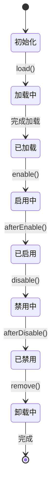
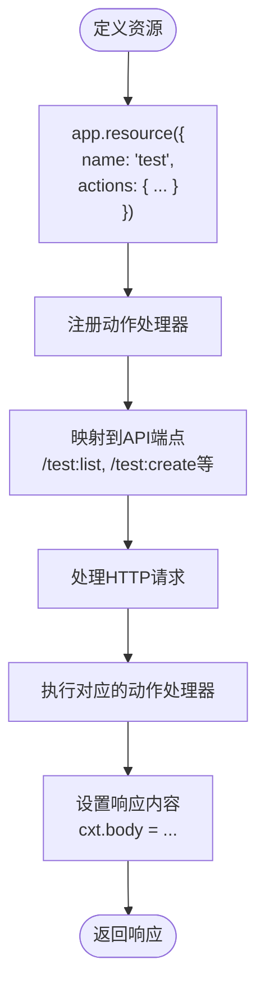
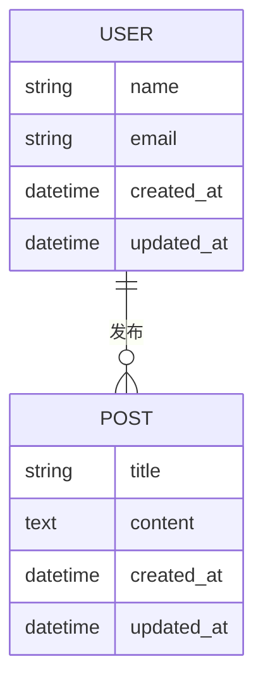
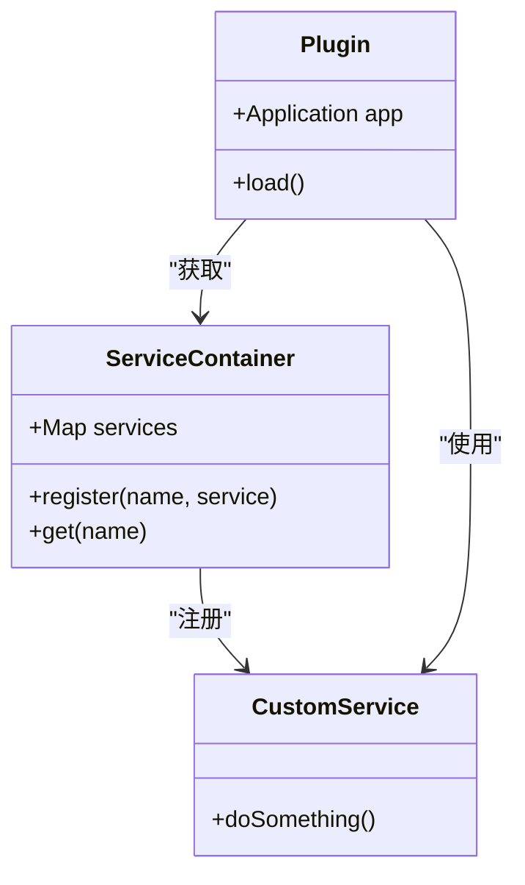
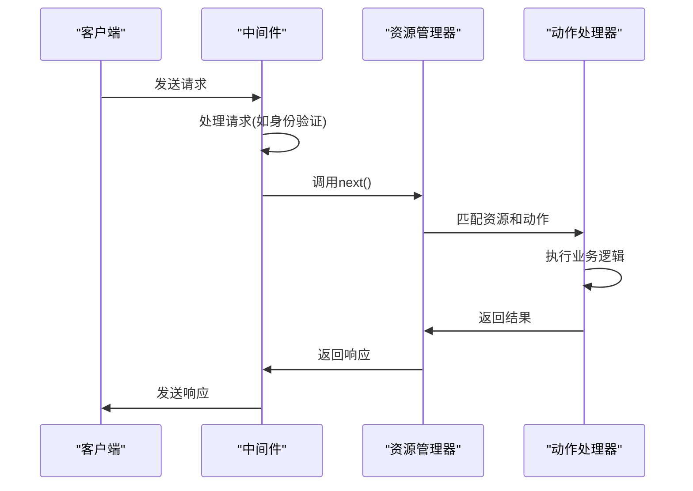
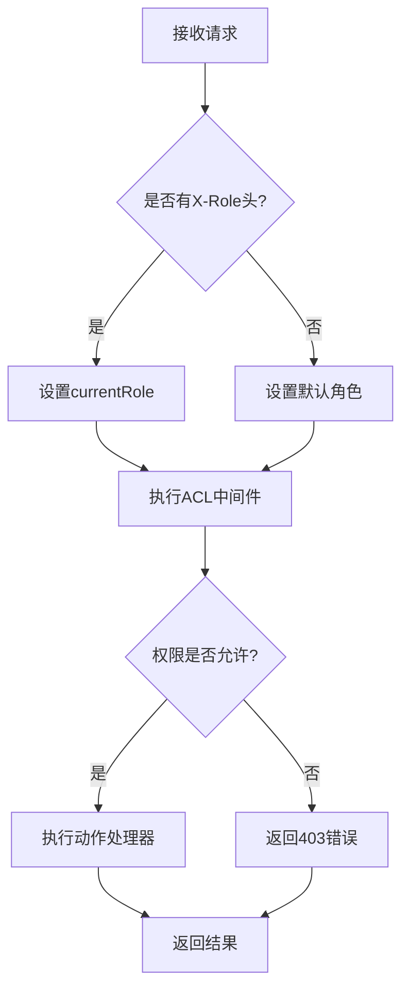
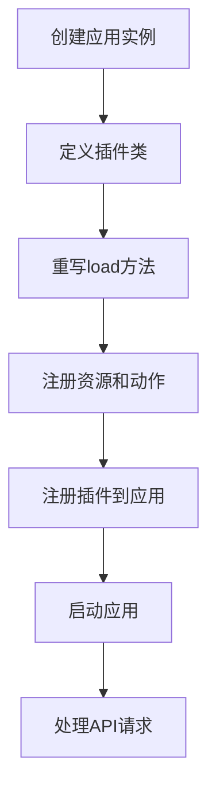

# 服务端扩展

<cite>
**本文档中引用的文件**   
- [index.ts](file://packages/core/server/src/index.ts)
- [application.ts](file://packages/core/server/src/application.ts)
- [plugin.ts](file://packages/core/server/src/plugin.ts)
- [resourcer.ts](file://packages/core/resourcer/src/resourcer.ts)
- [database.ts](file://packages/core/database/src/database.ts)
- [custom-plugin.ts](file://examples/app/custom-plugin.ts)
- [simple.ts](file://examples/app/resource-actions/simple.ts)
- [acl.ts](file://examples/app/acl.ts)
- [middleware/resourcer.ts](file://examples/app/middleware/resourcer.ts)
- [multi-app.ts](file://examples/app/multi-app.ts)
- [service-container.ts](file://packages/core/server/src/service-container.ts)
- [plugin-manager.ts](file://packages/core/server/src/plugin-manager/plugin-manager.ts)
</cite>

## 目录
1. [介绍](#介绍)
2. [插件架构与生命周期](#插件架构与生命周期)
3. [API端点定义与资源管理](#api端点定义与资源管理)
4. [数据模型与集合定义](#数据模型与集合定义)
5. [依赖注入与服务注册](#依赖注入与服务注册)
6. [中间件与请求处理](#中间件与请求处理)
7. [权限控制与安全机制](#权限控制与安全机制)
8. [配置管理与迁移脚本](#配置管理与迁移脚本)
9. [插件间通信与调用](#插件间通信与调用)
10. [完整实现示例](#完整实现示例)

## 介绍

NocoBase是一个可扩展的低代码平台，其服务端插件系统提供了强大的功能扩展能力。本文档深入探讨如何通过插件机制扩展NocoBase的服务端功能，包括定义API端点、数据模型、业务逻辑，以及实现自定义服务和中间件。我们将详细说明插件的依赖注入机制、服务注册方式、配置管理最佳实践、迁移脚本编写方法以及插件生命周期事件的处理。

**Section sources**
- [index.ts](file://packages/core/server/src/index.ts)
- [application.ts](file://packages/core/server/src/application.ts)

## 插件架构与生命周期

NocoBase的插件系统基于`Plugin`抽象类实现，所有插件都必须继承此类。插件的生命周期由一系列钩子方法控制，包括`afterAdd`、`beforeLoad`、`load`、`install`、`upgrade`、`beforeEnable`、`afterEnable`、`beforeDisable`、`afterDisable`、`beforeRemove`和`afterRemove`。这些钩子允许插件在不同阶段执行特定的初始化和清理操作。

插件通过`PluginManager`进行管理，该管理器负责插件的加载、启用、禁用和卸载。插件可以通过`app.plugin()`方法注册到应用中，也可以通过配置文件批量注册。每个插件实例都拥有对应用实例的引用，可以通过`this.app`访问应用的各个服务和功能。

**Diagram sources **
- [plugin.ts](file://packages/core/server/src/plugin.ts)
- [plugin-manager.ts](file://packages/core/server/src/plugin-manager/plugin-manager.ts)

**Section sources**
- [plugin.ts](file://packages/core/server/src/plugin.ts)
- [plugin-manager.ts](file://packages/core/server/src/plugin-manager/plugin-manager.ts)

## API端点定义与资源管理

NocoBase使用`resourcer`模块来管理API端点。通过`app.resource()`或`app.resourcer.define()`方法可以定义新的资源和动作。每个资源对应一个API端点前缀，而动作则对应具体的HTTP操作。例如，`list`、`create`、`get`、`update`和`delete`是默认的动作名称，但可以自定义。

资源定义包括名称、动作处理器和可选的配置选项。动作处理器是异步函数，接收上下文对象`ctx`和`next`函数作为参数。`ctx`对象包含了请求和响应的所有信息，以及通过插件系统注入的额外属性。

**Diagram sources **
- [resourcer.ts](file://packages/core/resourcer/src/resourcer.ts)
- [simple.ts](file://examples/app/resource-actions/simple.ts)

**Section sources**
- [resourcer.ts](file://packages/core/resourcer/src/resourcer.ts)
- [simple.ts](file://examples/app/resource-actions/simple.ts)

## 数据模型与集合定义

NocoBase的数据库模块基于Sequelize实现，提供了`collection()`方法来定义数据模型（集合）。每个集合对应数据库中的一个表，包含字段定义、索引、关联关系等配置。字段类型包括`string`、`integer`、`date`、`boolean`、`json`等基本类型，以及`belongsToMany`、`hasMany`等关系类型。

集合定义可以通过`app.db.collection()`方法完成，该方法接收一个配置对象，包含名称、字段、关联等信息。字段配置支持验证规则、默认值、唯一性约束等高级特性。关联关系自动创建相应的外键和索引，简化了数据库设计。

**Diagram sources **
- [database.ts](file://packages/core/database/src/database.ts)
- [custom-plugin.ts](file://examples/app/custom-plugin.ts)

**Section sources**
- [database.ts](file://packages/core/database/src/database.ts)
- [custom-plugin.ts](file://examples/app/custom-plugin.ts)

## 依赖注入与服务注册

NocoBase实现了简单的依赖注入容器`ServiceContainer`，用于管理服务实例的生命周期。服务可以通过`container.register(name, service)`方法注册，并通过`container.get(name)`方法获取。这种机制允许插件之间共享服务实例，促进代码复用和解耦。

插件可以通过`this.app.container`访问服务容器，注册自己的服务或将其他插件的服务注入到自己的逻辑中。服务可以是类实例、工厂函数或简单的值对象。容器支持延迟初始化，只有在首次获取时才创建实例。

**Diagram sources **
- [service-container.ts](file://packages/core/server/src/service-container.ts)
- [application.ts](file://packages/core/server/src/application.ts)

**Section sources**
- [service-container.ts](file://packages/core/server/src/service-container.ts)
- [application.ts](file://packages/core/server/src/application.ts)

## 中间件与请求处理

NocoBase基于Koa框架构建，因此完全兼容Koa的中间件机制。通过`app.use()`方法可以注册全局中间件，而`app.resourcer.use()`则用于注册资源特定的中间件。中间件函数接收`ctx`和`next`参数，可以修改请求和响应，或终止请求处理流程。

资源中间件在动作处理器执行前被调用，可以用于身份验证、日志记录、数据预处理等通用功能。中间件的执行顺序由注册顺序决定，但可以通过`before`和`after`选项进行精确控制。错误处理中间件可以捕获后续中间件抛出的异常，提供统一的错误响应。

**Diagram sources **
- [application.ts](file://packages/core/server/src/application.ts)
- [resourcer.ts](file://packages/core/resourcer/src/resourcer.ts)
- [middleware/resourcer.ts](file://examples/app/middleware/resourcer.ts)

**Section sources**
- [application.ts](file://packages/core/server/src/application.ts)
- [resourcer.ts](file://packages/core/resourcer/src/resourcer.ts)
- [middleware/resourcer.ts](file://examples/app/middleware/resourcer.ts)

## 权限控制与安全机制

NocoBase内置了基于角色的访问控制（RBAC）系统，通过`acl`模块实现。权限规则可以定义在插件中，指定哪些角色可以访问哪些资源和动作。权限检查通过中间件`app.acl.middleware()`自动执行，无需在每个动作处理器中手动验证。

权限定义包括角色名称、允许的动作和可访问的字段。例如，可以定义管理员角色可以导出数据，而普通用户只能查看部分字段。权限系统支持细粒度的字段级控制，确保数据安全。上下文中的`currentRole`变量用于标识当前用户的角色，通常通过请求头或会话信息设置。

**Diagram sources **
- [acl.ts](file://examples/app/acl.ts)
- [application.ts](file://packages/core/server/src/application.ts)

**Section sources**
- [acl.ts](file://examples/app/acl.ts)
- [application.ts](file://packages/core/server/src/application.ts)

## 配置管理与迁移脚本

插件的配置通过构造函数的`options`参数传递，可以在插件实例化时指定。配置项包括名称、版本、启用状态等元数据，以及插件特定的设置。配置的最佳实践是提供合理的默认值，并允许通过环境变量或配置文件覆盖。

数据库迁移脚本用于管理数据库模式的变更，确保插件升级时数据结构的一致性。迁移文件通常放在`server/migrations`目录下，按时间顺序命名。`loadMigrations()`方法自动加载这些脚本，并在应用启动时执行。迁移脚本应包含`up`和`down`方法，分别用于应用和回滚变更。

**Section sources**
- [plugin.ts](file://packages/core/server/src/plugin.ts)
- [custom-plugin.ts](file://examples/app/custom-plugin.ts)

## 插件间通信与调用

插件之间可以通过服务容器进行通信，共享数据和功能。一个插件可以注册服务，另一个插件则可以获取并使用该服务。此外，插件还可以通过事件系统进行松耦合的通信，监听和触发自定义事件。

跨插件调用API端点时，可以直接通过`app.resourcer.execute()`方法，指定资源名称和动作名称。这种方式避免了HTTP网络开销，提高了性能。插件管理器确保所有插件在调用前已正确加载和初始化。

**Section sources**
- [application.ts](file://packages/core/server/src/application.ts)
- [resourcer.ts](file://packages/core/resourcer/src/resourcer.ts)

## 完整实现示例

以下是一个完整的插件实现示例，展示了从定义到注册的全过程。该插件定义了一个名为`test`的资源，包含`list`动作，返回简单的文本响应。插件继承自`Plugin`类，重写了`load`方法来注册资源。最后，通过`app.plugin()`方法将插件注册到应用中。

**Diagram sources **
- [custom-plugin.ts](file://examples/app/custom-plugin.ts)
- [application.ts](file://packages/core/server/src/application.ts)

**Section sources**
- [custom-plugin.ts](file://examples/app/custom-plugin.ts)
- [application.ts](file://packages/core/server/src/application.ts)