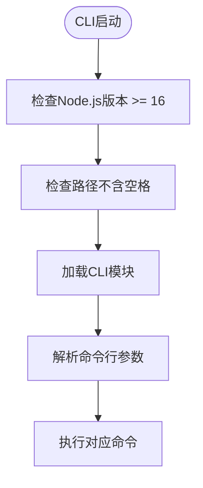
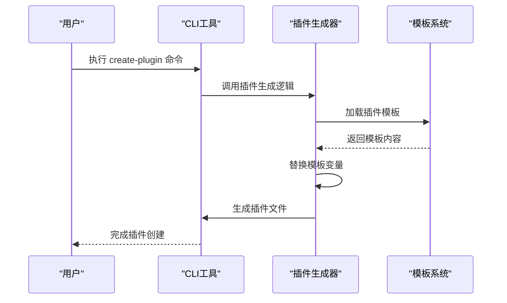
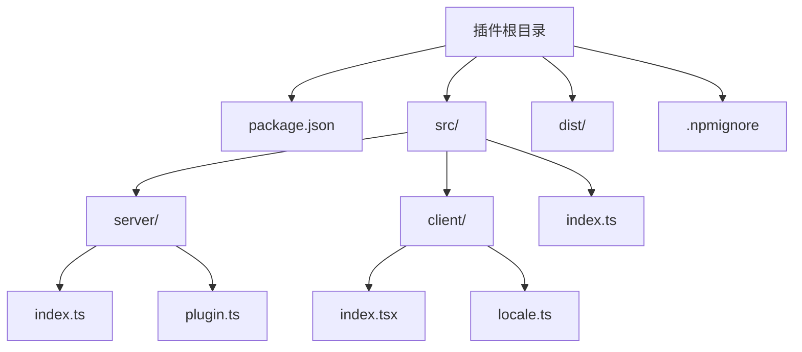
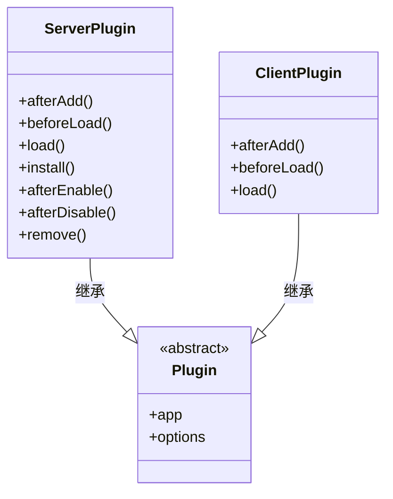
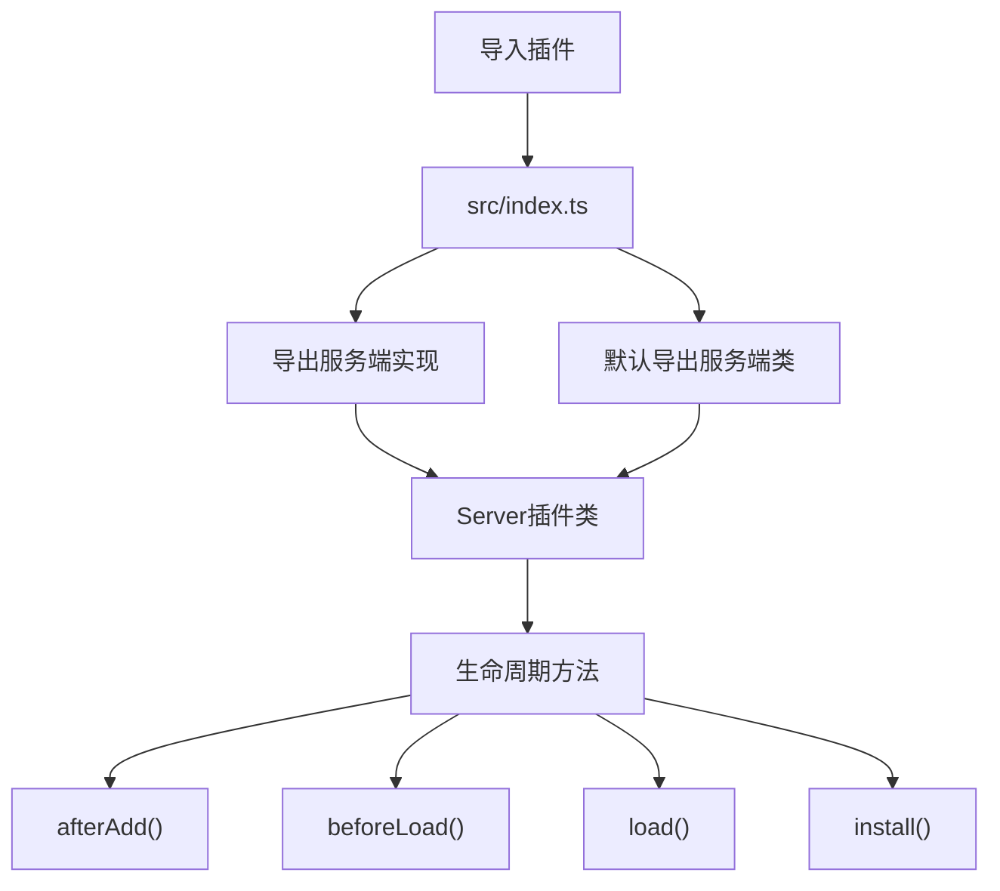
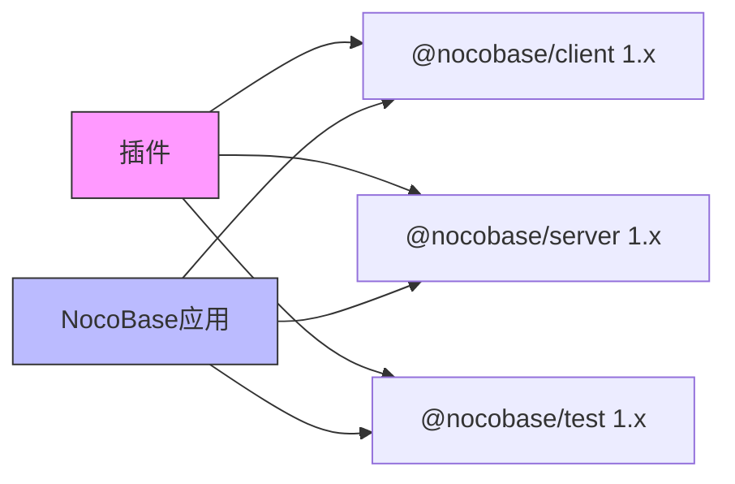
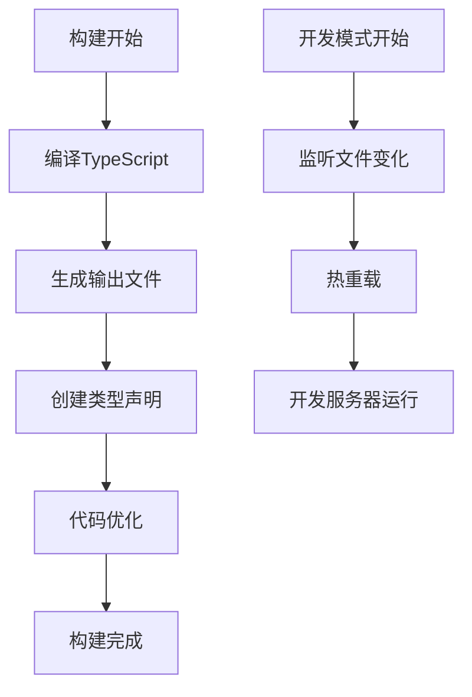
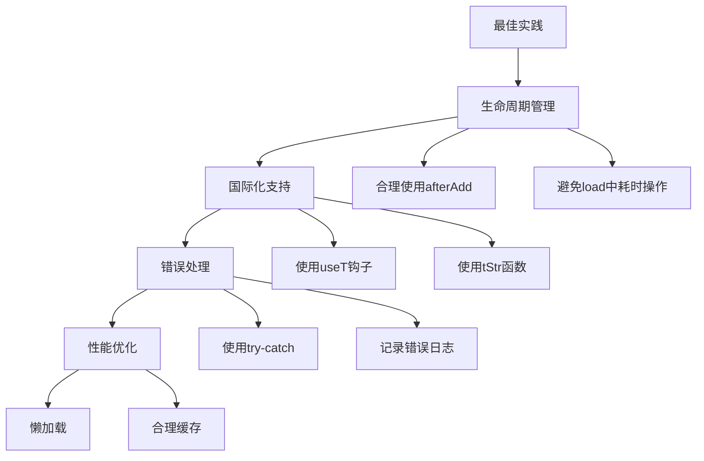

# 插件创建

<cite>
**本文档中引用的文件**  
- [package.json](file://packages/core/cli/package.json)
- [bin/index.js](file://packages/core/cli/bin/index.js)
- [src/index.js](file://packages/core/cli/src/index.js)
- [src/cli.js](file://packages/core/cli/src/cli.js)
- [src/util.js](file://packages/core/cli/src/util.js)
- [src/commands/create-plugin.js](file://packages/core/cli/src/commands/create-plugin.js)
- [src/plugin-generator.js](file://packages/core/cli/src/plugin-generator.js)
- [templates/plugin/package.json.tpl](file://packages/core/cli/templates/plugin/package.json.tpl)
- [templates/plugin/src/index.ts](file://packages/core/cli/templates/plugin/src/index.ts)
- [templates/plugin/src/client/index.tsx.tpl](file://packages/core/cli/templates/plugin/src/client/index.tsx.tpl)
- [templates/plugin/src/server/index.ts.tpl](file://packages/core/cli/templates/plugin/src/server/index.ts.tpl)
- [templates/plugin/src/server/plugin.ts.tpl](file://packages/core/cli/templates/plugin/src/server/plugin.ts.tpl)
- [templates/plugin/src/client/locale.ts](file://packages/core/cli/templates/plugin/src/client/locale.ts)
</cite>

## 目录

1. [简介](#简介)
2. [CLI工具概述](#cli工具概述)
3. [创建插件命令详解](#创建插件命令详解)
4. [插件模板结构分析](#插件模板结构分析)
5. [服务端与客户端目录作用](#服务端与客户端目录作用)
6. [入口文件实现方式](#入口文件实现方式)
7. [插件创建完整步骤](#插件创建完整步骤)
8. [命名规范与依赖管理](#命名规范与依赖管理)
9. [构建配置说明](#构建配置说明)
10. [常见配置与最佳实践](#常见配置与最佳实践)

## 简介

NocoBase是一个低代码开发平台，支持通过插件机制扩展其功能。本指南详细介绍了如何使用NocoBase的CLI工具创建新插件，包括命令语法、参数选项、生成的文件结构以及从零开始创建插件的完整流程。

**Section sources**
- [package.json](file://packages/core/cli/package.json#L1-L39)
- [bin/index.js](file://packages/core/cli/bin/index.js#L1-L40)

## CLI工具概述

NocoBase的CLI工具是用于创建和管理项目的命令行接口。它提供了多种命令来简化开发流程，其中`create-plugin`命令专门用于生成新的插件骨架。

CLI工具通过Node.js运行，要求版本不低于16，并且安装路径不能包含空格字符。工具的主要入口文件位于`bin/index.js`，该文件负责初始化环境并解析命令行参数。



**Diagram sources**
- [bin/index.js](file://packages/core/cli/bin/index.js#L1-L40)
- [src/index.js](file://packages/core/cli/src/index.js#L1-L15)

**Section sources**
- [bin/index.js](file://packages/core/cli/bin/index.js#L1-L40)
- [src/index.js](file://packages/core/cli/src/index.js#L1-L15)

## 创建插件命令详解

`create-plugin`命令用于生成新的插件项目骨架。该命令由CLI工具提供，可以通过`nocobase create-plugin`调用。

命令的基本语法如下：
```
nocobase create-plugin <plugin-name> [options]
```

支持的主要选项包括：
- `--name`：指定插件名称
- `--version`：指定初始版本号
- `--description`：插件描述信息
- `--author`：作者信息
- `--license`：许可证类型

该命令会使用预定义的模板生成插件的基本结构，并自动处理变量替换，如插件名称、版本号等。



**Diagram sources**
- [src/commands/create-plugin.js](file://packages/core/cli/src/commands/create-plugin.js)
- [src/plugin-generator.js](file://packages/core/cli/src/plugin-generator.js)

**Section sources**
- [src/commands/create-plugin.js](file://packages/core/cli/src/commands/create-plugin.js)
- [src/plugin-generator.js](file://packages/core/cli/src/plugin-generator.js)

## 插件模板结构分析

当使用`create-plugin`命令时，CLI工具会基于预定义的模板生成插件的基本结构。模板位于`packages/core/cli/templates/plugin`目录下。

生成的插件项目包含以下主要文件和目录：
- `package.json`：项目配置文件，包含依赖和元数据
- `src/`：源代码目录
  - `src/server/`：服务端代码
  - `src/client/`：客户端代码
  - `src/index.ts`：主入口文件
- `dist/`：编译输出目录（生成后）
- `.npmignore`：npm发布时忽略的文件列表

模板使用Handlebars语法进行变量替换，例如`{{{packageName}}}`会被实际的包名称替换。



**Diagram sources**
- [templates/plugin/package.json.tpl](file://packages/core/cli/templates/plugin/package.json.tpl)
- [templates/plugin/src/index.ts](file://packages/core/cli/templates/plugin/src/index.ts)

**Section sources**
- [templates/plugin/package.json.tpl](file://packages/core/cli/templates/plugin/package.json.tpl)
- [templates/plugin/src/index.ts](file://packages/core/cli/templates/plugin/src/index.ts)

## 服务端与客户端目录作用

NocoBase插件采用前后端分离的架构设计，因此插件模板中明确区分了`server`和`client`两个目录。

### 服务端目录 (server)

服务端目录包含运行在Node.js环境中的代码，主要负责：
- 数据库操作
- API路由定义
- 业务逻辑处理
- 权限控制
- 插件生命周期管理

服务端代码通过继承`Plugin`类来实现插件功能，可以重写`afterAdd`、`beforeLoad`、`load`、`install`等生命周期方法。

### 客户端目录 (client)

客户端目录包含运行在浏览器环境中的代码，主要负责：
- 用户界面组件
- 前端路由
- 状态管理
- 国际化支持
- 与服务端API通信

客户端代码同样通过继承`Plugin`类来扩展前端功能，可以在`load`方法中注册组件、提供者、路由等。



**Diagram sources**
- [templates/plugin/src/server/plugin.ts.tpl](file://packages/core/cli/templates/plugin/src/server/plugin.ts.tpl)
- [templates/plugin/src/client/index.tsx.tpl](file://packages/core/cli/templates/plugin/src/client/index.tsx.tpl)

**Section sources**
- [templates/plugin/src/server/plugin.ts.tpl](file://packages/core/cli/templates/plugin/src/server/plugin.ts.tpl)
- [templates/plugin/src/client/index.tsx.tpl](file://packages/core/cli/templates/plugin/src/client/index.tsx.tpl)

## 入口文件实现方式

插件的入口文件是`src/index.ts`，它是插件对外暴露的主要接口。这个文件采用了简洁的设计模式，只包含两行代码：

```typescript
export * from './server';
export { default } from './server';
```

这种设计有以下几个优点：
1. **统一入口**：无论是在服务端还是客户端使用，都通过同一个入口导入
2. **默认导出**：将服务端插件类作为默认导出，便于直接使用
3. **完整导出**：通过`export *`导出所有服务端成员，保持API完整性

当插件被加载时，系统会自动识别并分别加载服务端和客户端的实现。服务端插件负责初始化后端逻辑，而客户端插件则负责扩展前端界面。



**Diagram sources**
- [templates/plugin/src/index.ts](file://packages/core/cli/templates/plugin/src/index.ts)
- [templates/plugin/src/server/plugin.ts.tpl](file://packages/core/cli/templates/plugin/src/server/plugin.ts.tpl)

**Section sources**
- [templates/plugin/src/index.ts](file://packages/core/cli/templates/plugin/src/index.ts)
- [templates/plugin/src/server/plugin.ts.tpl](file://packages/core/cli/templates/plugin/src/server/plugin.ts.tpl)

## 插件创建完整步骤

以下是使用CLI工具从零开始创建NocoBase插件的完整步骤：

1. **安装CLI工具**
   ```bash
   npm install -g @nocobase/cli
   ```

2. **创建新插件**
   ```bash
   nocobase create-plugin my-first-plugin
   ```

3. **进入插件目录**
   ```bash
   cd my-first-plugin
   ```

4. **安装依赖**
   ```bash
   npm install
   ```

5. **开发模式运行**
   ```bash
   npm run dev
   ```

6. **构建生产版本**
   ```bash
   npm run build
   ```

7. **在NocoBase应用中使用**
   将插件添加到应用的`packages/`目录下，并在`app.ts`中注册。

整个过程自动化程度高，CLI工具会处理大部分配置工作，开发者可以专注于业务逻辑的实现。


**Section sources**
- [src/commands/create-plugin.js](file://packages/core/cli/src/commands/create-plugin.js)
- [src/plugin-generator.js](file://packages/core/cli/src/plugin-generator.js)

## 命名规范与依赖管理

### 命名规范

NocoBase插件的命名应遵循以下规范：
- 使用小写字母和连字符（kebab-case）
- 以`@nocobase/plugin-`为前缀（如果是官方插件）
- 避免使用保留字和特殊字符
- 名称应简洁且具有描述性

例如：`my-awesome-plugin`、`data-export-tool`等。

### 依赖管理

插件的`package.json`文件中定义了两种主要的依赖关系：

1. **dependencies**：常规依赖，在安装时会一同安装
2. **peerDependencies**：同级依赖，要求宿主应用提供这些依赖

典型的peerDependencies配置：
```json
{
  "peerDependencies": {
    "@nocobase/client": "1.x",
    "@nocobase/server": "1.x",
    "@nocobase/test": "1.x"
  }
}
```

这种设计确保了插件与宿主应用使用相同版本的核心包，避免了版本冲突和内存中存在多个实例的问题。



**Diagram sources**
- [templates/plugin/package.json.tpl](file://packages/core/cli/templates/plugin/package.json.tpl)

**Section sources**
- [templates/plugin/package.json.tpl](file://packages/core/cli/templates/plugin/package.json.tpl)

## 构建配置说明

NocoBase插件的构建配置由CLI工具自动管理，无需手动配置构建工具。CLI工具使用`tsup`作为打包工具，提供了开箱即用的TypeScript支持。

构建过程主要包括以下步骤：
1. 编译TypeScript代码
2. 生成服务端和客户端的输出文件
3. 创建类型声明文件
4. 优化代码体积

默认的构建脚本在`package.json`中定义：
```json
{
  "scripts": {
    "build": "nocobase build",
    "dev": "nocobase dev"
  }
}
```

`build`命令会生成生产就绪的代码，而`dev`命令则启动开发服务器，支持热重载功能。



**Section sources**
- [src/commands/build.js](file://packages/core/cli/src/commands/build.js)
- [src/commands/dev.js](file://packages/core/cli/src/commands/dev.js)

## 常见配置与最佳实践

### 国际化支持

插件模板提供了内置的国际化支持。通过`locale.ts`文件可以方便地使用翻译功能：

```typescript
import { useT, tStr } from './locale';

function MyComponent() {
  const t = useT();
  return <div>{t('Hello World')}</div>;
}
```

### 生命周期管理

合理使用插件生命周期方法是开发高质量插件的关键：

- `afterAdd`：插件被添加后调用
- `beforeLoad`：插件加载前调用
- `load`：插件加载时调用
- `install`：插件首次安装时调用
- `afterEnable`：插件启用后调用

### 错误处理

在插件代码中应妥善处理异步操作的错误，避免影响整个应用的稳定性：

```typescript
async load() {
  try {
    // 初始化逻辑
  } catch (error) {
    this.app.logger.error('Failed to load plugin', error);
  }
}
```

### 性能优化

- 避免在`load`方法中执行耗时操作
- 使用懒加载模式按需加载资源
- 合理使用缓存机制



**Diagram sources**
- [templates/plugin/src/client/locale.ts](file://packages/core/cli/templates/plugin/src/client/locale.ts)
- [templates/plugin/src/server/plugin.ts.tpl](file://packages/core/cli/templates/plugin/src/server/plugin.ts.tpl)

**Section sources**
- [templates/plugin/src/client/locale.ts](file://packages/core/cli/templates/plugin/src/client/locale.ts)
- [templates/plugin/src/server/plugin.ts.tpl](file://packages/core/cli/templates/plugin/src/server/plugin.ts.tpl)