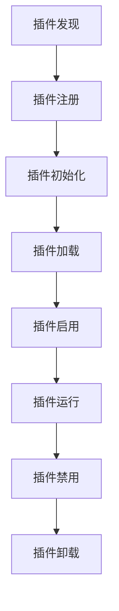
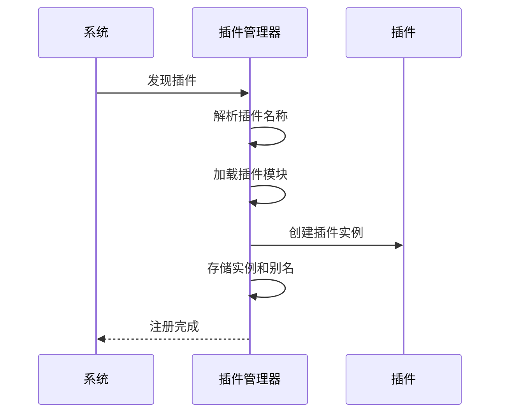
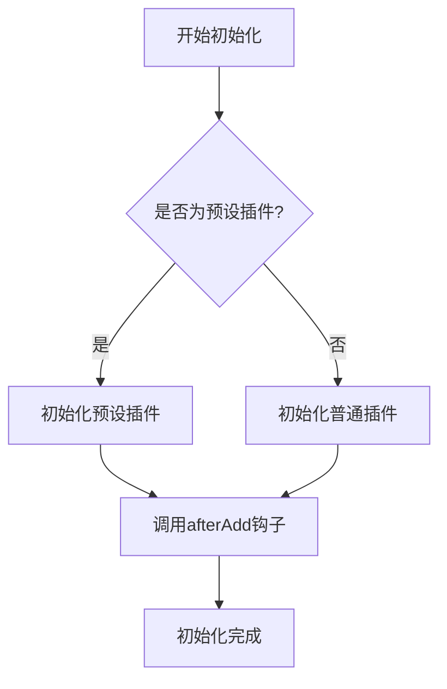
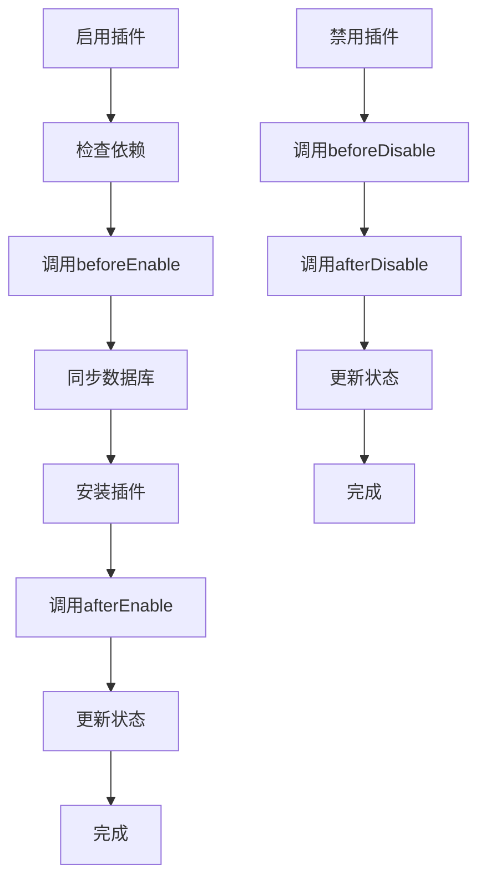
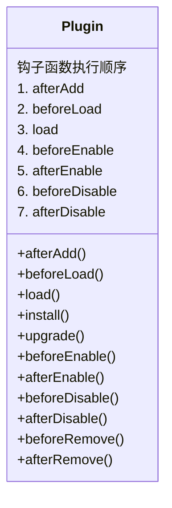
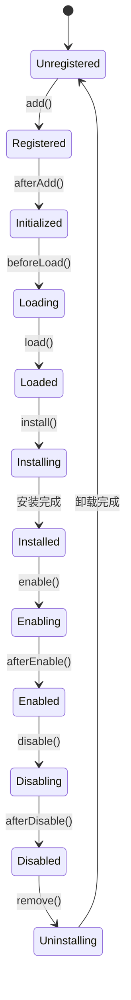
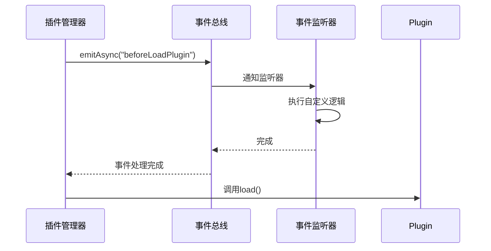
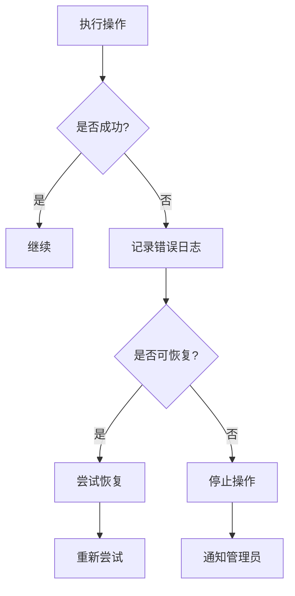
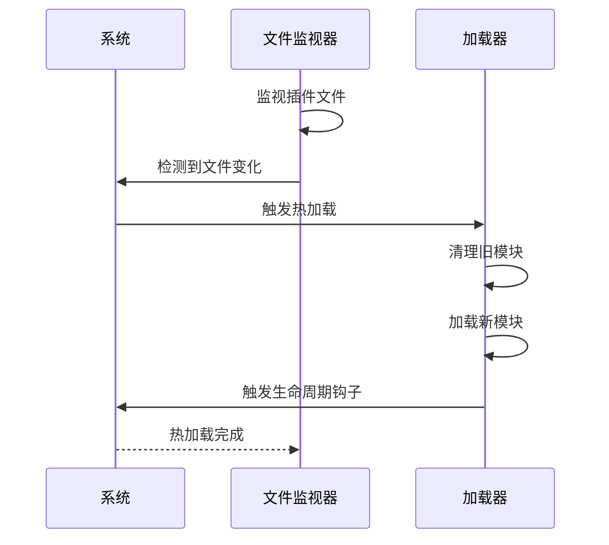

# 插件生命周期

<cite>
**本文档中引用的文件**  
- [plugin-manager.ts](file://packages/core/server/src/plugin-manager/plugin-manager.ts)
- [plugin.ts](file://packages/core/server/src/plugin.ts)
- [PluginManager.ts](file://packages/core/client/src/application/PluginManager.ts)
- [Plugin.ts](file://packages/core/client/src/application/Plugin.ts)
- [application.ts](file://packages/core/server/src/application.ts)
- [plugin-manager-repository.ts](file://packages/core/server/src/plugin-manager/plugin-manager-repository.ts)
</cite>

## 目录
1. [引言](#引言)
2. [插件生命周期概述](#插件生命周期概述)
3. [插件发现与注册](#插件发现与注册)
4. [插件初始化阶段](#插件初始化阶段)
5. [插件加载阶段](#插件加载阶段)
6. [插件启动与停止](#插件启动与停止)
7. [生命周期钩子函数](#生命周期钩子函数)
8. [插件状态管理](#插件状态管理)
9. [生命周期事件监听](#生命周期事件监听)
10. [错误处理与恢复机制](#错误处理与恢复机制)
11. [热加载与动态更新](#热加载与动态更新)
12. [生产环境最佳实践](#生产环境最佳实践)

## 引言

NocoBase 是一个高度模块化的低代码开发平台，其核心架构依赖于灵活的插件系统。插件生命周期管理是 NocoBase 架构中的关键组成部分，它定义了插件从被发现到最终卸载的完整过程。本文档深入探讨 NocoBase 插件系统的生命周期机制，详细解释各个阶段的执行流程、钩子函数的作用时机、状态管理策略以及在实际开发中如何正确实现和管理插件。

通过理解插件生命周期，开发者可以更好地设计和实现插件，确保其在不同阶段正确初始化、配置和运行。同时，系统管理员可以利用这些知识来优化插件管理策略，提高系统的稳定性和可维护性。

**Section sources**
- [plugin-manager.ts](file://packages/core/server/src/plugin-manager/plugin-manager.ts#L1-L1167)
- [plugin.ts](file://packages/core/server/src/plugin.ts#L1-L254)

## 插件生命周期概述

NocoBase 插件生命周期是一个有序的、可扩展的过程，涵盖了插件从发现到卸载的各个阶段。整个生命周期可以分为五个主要阶段：发现、注册、初始化、加载和停止。每个阶段都有特定的任务和目标，确保插件能够正确地集成到主应用程序中。

插件生命周期的设计遵循了依赖注入和事件驱动的原则，允许插件在不同阶段执行特定的操作，同时保持与其他组件的松耦合。这种设计不仅提高了系统的灵活性，还增强了可测试性和可维护性。

生命周期管理由 `PluginManager` 类负责，该类在服务器端和客户端分别实现了相应的管理逻辑。服务器端的 `PluginManager` 负责处理数据库迁移、服务注册等后端任务，而客户端的 `PluginManager` 则专注于路由、UI 组件等前端资源的管理。



**Diagram sources**
- [plugin-manager.ts](file://packages/core/server/src/plugin-manager/plugin-manager.ts#L57-L1167)
- [PluginManager.ts](file://packages/core/client/src/application/PluginManager.ts#L24-L115)

**Section sources**
- [plugin-manager.ts](file://packages/core/server/src/plugin-manager/plugin-manager.ts#L57-L1167)
- [PluginManager.ts](file://packages/core/client/src/application/PluginManager.ts#L24-L115)

## 插件发现与注册

插件发现是生命周期的第一步，系统需要识别可用的插件并将其纳入管理范围。NocoBase 通过多种方式发现插件，包括静态配置、动态扫描和远程获取。在服务器端，插件通常通过 `package.json` 中的依赖项或配置文件进行声明，而客户端则可以通过 API 请求从服务器获取已启用的插件列表。

插件注册过程由 `PluginManager` 的 `add` 方法实现。当一个插件被发现后，系统会调用 `add` 方法将其添加到插件实例集合中。注册过程中，系统会解析插件名称，加载对应的模块，并创建插件实例。插件实例被存储在 `pluginInstances` 映射中，同时通过别名在 `pluginAliases` 映射中进行索引，以便后续快速查找。



**Diagram sources**
- [plugin-manager.ts](file://packages/core/server/src/plugin-manager/plugin-manager.ts#L317-L374)
- [PluginManager.ts](file://packages/core/client/src/application/PluginManager.ts#L70-L84)

**Section sources**
- [plugin-manager.ts](file://packages/core/server/src/plugin-manager/plugin-manager.ts#L317-L374)
- [PluginManager.ts](file://packages/core/client/src/application/PluginManager.ts#L70-L84)

## 插件初始化阶段

插件初始化阶段是插件生命周期中的关键环节，它确保插件在正式加载前完成必要的准备工作。初始化过程由 `PluginManager` 的 `initPlugins` 方法驱动，该方法会依次调用所有已注册插件的 `afterAdd` 钩子函数。

在服务器端，初始化过程包括预设插件的初始化和普通插件的初始化。预设插件通常包含核心功能，需要在其他插件之前加载。`initPresetPlugins` 方法负责处理预设插件的初始化，而 `initOtherPlugins` 方法则处理其余插件。客户端的初始化过程类似，但还包括从远程获取已启用插件列表的功能。

初始化阶段的主要任务包括：
- 设置插件选项和配置
- 建立插件间的依赖关系
- 注册插件提供的服务和资源
- 执行插件特定的初始化逻辑



**Diagram sources**
- [plugin-manager.ts](file://packages/core/server/src/plugin-manager/plugin-manager.ts#L379-L382)
- [PluginManager.ts](file://packages/core/client/src/application/PluginManager.ts#L41-L68)

**Section sources**
- [plugin-manager.ts](file://packages/core/server/src/plugin-manager/plugin-manager.ts#L379-L382)
- [PluginManager.ts](file://packages/core/client/src/application/PluginManager.ts#L41-L68)

## 插件加载阶段

插件加载阶段是生命周期中最复杂的部分，涉及多个子阶段和钩子函数的调用。加载过程由 `PluginManager` 的 `load` 方法控制，该方法会按顺序执行一系列操作，确保插件能够正确地集成到应用程序中。

加载过程分为两个主要步骤：`beforeLoad` 和 `load`。首先，系统会遍历所有插件实例，调用它们的 `beforeLoad` 方法。这个阶段通常用于执行加载前的准备工作，如验证配置、检查依赖等。然后，系统会再次遍历插件实例，调用它们的 `load` 方法，执行实际的加载逻辑。

在服务器端，加载过程还包括数据库同步、命令加载等额外步骤。`loadCollections` 方法负责加载插件定义的数据模型，而 `loadCommands` 方法则负责注册插件提供的命令行工具。客户端的加载过程相对简单，主要集中在资源的动态加载和事件的分发上。

```mermaid
sequenceDiagram
participant PluginManager as 插件管理器
participant Plugin as 插件
participant EventBus as 事件总线
PluginManager->>PluginManager : 开始加载插件
loop 每个插件
PluginManager->>Plugin : 调用beforeLoad()
end
loop 每个插件
PluginManager->>Plugin : 调用load()
Plugin->>EventBus : 分发loaded事件
end
PluginManager-->> : 加载完成
```

**Diagram sources**
- [plugin-manager.ts](file://packages/core/server/src/plugin-manager/plugin-manager.ts#L426-L508)
- [PluginManager.ts](file://packages/core/client/src/application/PluginManager.ts#L102-L113)

**Section sources**
- [plugin-manager.ts](file://packages/core/server/src/plugin-manager/plugin-manager.ts#L426-L508)
- [PluginManager.ts](file://packages/core/client/src/application/PluginManager.ts#L102-L113)

## 插件启动与停止

插件的启动和停止是生命周期中的动态管理环节，允许系统在运行时启用或禁用插件。这一功能对于系统的灵活性和可维护性至关重要，特别是在生产环境中需要进行热更新或故障恢复时。

插件的启用由 `enable` 方法实现。该方法会检查插件的依赖关系，确保所有必需的插件都已启用。然后，系统会依次调用 `beforeEnable`、数据库同步、安装（如果需要）和 `afterEnable` 钩子函数。类似地，插件的禁用由 `disable` 方法实现，它会调用 `beforeDisable` 和 `afterDisable` 钩子函数，并更新数据库中的插件状态。

启动和停止过程的设计考虑了事务性和原子性，确保在出现错误时能够进行适当的回滚。例如，在启用插件时如果发生错误，系统会尝试恢复到之前的状态，避免留下不一致的配置。



**Diagram sources**
- [plugin-manager.ts](file://packages/core/server/src/plugin-manager/plugin-manager.ts#L553-L725)
- [plugin-manager-repository.ts](file://packages/core/server/src/plugin-manager/plugin-manager-repository.ts#L56-L81)

**Section sources**
- [plugin-manager.ts](file://packages/core/server/src/plugin-manager/plugin-manager.ts#L553-L725)
- [plugin-manager-repository.ts](file://packages/core/server/src/plugin-manager/plugin-manager-repository.ts#L56-L81)

## 生命周期钩子函数

NocoBase 插件系统提供了一系列生命周期钩子函数，允许插件在特定时机执行自定义逻辑。这些钩子函数是插件与主应用程序交互的主要方式，也是实现插件功能的关键。

主要的生命周期钩子函数包括：
- `afterAdd`: 插件注册后立即调用，用于执行注册后的初始化工作
- `beforeLoad`: 加载前调用，用于执行加载前的准备工作
- `load`: 主要的加载方法，用于执行插件的核心逻辑
- `beforeEnable`: 启用前调用，用于执行启用前的验证和准备工作
- `afterEnable`: 启用后调用，用于执行启用后的后续工作
- `beforeDisable`: 禁用前调用，用于执行清理工作
- `afterDisable`: 禁用后调用，用于执行禁用后的收尾工作
- `install`: 安装时调用，用于执行数据库迁移等安装任务
- `upgrade`: 升级时调用，用于执行版本升级相关的逻辑

这些钩子函数的设计遵循了单一职责原则，每个钩子都有明确的职责和执行时机。开发者应该根据具体需求选择合适的钩子函数，并确保在钩子函数中执行的操作是幂等的，以避免重复执行时产生意外的副作用。



**Diagram sources**
- [plugin.ts](file://packages/core/server/src/plugin.ts#L114-L134)
- [Plugin.ts](file://packages/core/client/src/application/Plugin.ts#L50-L54)

**Section sources**
- [plugin.ts](file://packages/core/server/src/plugin.ts#L114-L134)
- [Plugin.ts](file://packages/core/client/src/application/Plugin.ts#L50-L54)

## 插件状态管理

插件状态管理是确保系统稳定性和一致性的关键机制。NocoBase 使用一个复杂的状态系统来跟踪插件的当前状态和历史变化。每个插件实例都有一个 `state` 对象，用于存储运行时状态信息。

状态管理主要通过以下几个方面实现：
- 内存状态：存储在插件实例的 `state` 属性中，用于跟踪插件的运行时状态
- 持久化状态：存储在数据库的 `applicationPlugins` 表中，用于持久化插件的启用、安装等状态
- 临时状态：用于跟踪加载、安装等过程中的中间状态

`PluginManager` 负责协调这些状态的更新和同步。例如，在插件加载过程中，`state.loaded` 标志会被设置为 `true`，同时数据库中的记录也会被更新。这种双重状态管理机制确保了即使在系统重启后，插件的状态也能正确恢复。

状态转换遵循严格的规则，避免出现不一致的状态。例如，一个插件必须先被安装才能启用，必须先被禁用才能卸载。这些规则通过状态检查和验证逻辑来强制执行。



**Diagram sources**
- [plugin.ts](file://packages/core/server/src/plugin.ts#L55-L56)
- [plugin-manager.ts](file://packages/core/server/src/plugin-manager/plugin-manager.ts#L467-L468)

**Section sources**
- [plugin.ts](file://packages/core/server/src/plugin.ts#L55-L56)
- [plugin-manager.ts](file://packages/core/server/src/plugin-manager/plugin-manager.ts#L467-L468)

## 生命周期事件监听

NocoBase 的插件系统采用事件驱动架构，通过事件总线（EventBus）实现组件间的松耦合通信。生命周期事件是这一架构的核心部分，允许系统和其他插件对插件状态的变化做出响应。

主要的生命周期事件包括：
- `beforeLoadPlugin`: 在插件加载前触发
- `afterLoadPlugin`: 在插件加载后触发
- `beforeInstallPlugin`: 在插件安装前触发
- `afterInstallPlugin`: 在插件安装后触发
- `beforeEnablePlugin`: 在插件启用前触发
- `afterEnablePlugin`: 在插件启用后触发
- `beforeDisablePlugin`: 在插件禁用前触发
- `afterDisablePlugin`: 在插件禁用后触发

这些事件不仅为系统提供了扩展点，还为监控和审计功能提供了基础。例如，`auditManager` 会监听这些事件来记录插件操作的审计日志。开发者也可以注册自己的事件监听器，实现自定义的业务逻辑。

事件系统的设计考虑了性能和可靠性，采用异步发布-订阅模式，确保事件处理不会阻塞主流程。同时，系统提供了错误处理机制，防止事件处理器中的异常影响整个系统的稳定性。



**Diagram sources**
- [plugin-manager.ts](file://packages/core/server/src/plugin-manager/plugin-manager.ts#L463-L468)
- [application.ts](file://packages/core/server/src/application.ts#L708-L709)

**Section sources**
- [plugin-manager.ts](file://packages/core/server/src/plugin-manager/plugin-manager.ts#L463-L468)
- [application.ts](file://packages/core/server/src/application.ts#L708-L709)

## 错误处理与恢复机制

插件生命周期中的错误处理是确保系统健壮性的关键。NocoBase 设计了一套完善的错误处理和恢复机制，能够在出现异常时保护系统的整体稳定性。

错误处理主要体现在以下几个方面：
- 钩子函数的异常捕获：每个钩子函数的调用都被包裹在 try-catch 块中，防止异常传播到主流程
- 事务性操作：关键操作如数据库更新被包装在事务中，确保原子性
- 回滚机制：在出现错误时，系统会尝试恢复到之前的状态
- 日志记录：详细的错误日志被记录，便于故障排查

特别值得注意的是 `tryReloadOrRestart` 机制，它在关键操作失败时被调用，尝试重新加载或重启应用程序。这个机制在启用或禁用插件时尤为重要，因为它可以确保即使在部分失败的情况下，系统也能恢复到一个一致的状态。

恢复策略根据错误的严重程度和类型有所不同。对于可恢复的错误，系统会尝试自动恢复；对于严重错误，则会记录日志并停止相关操作，等待人工干预。



**Diagram sources**
- [plugin-manager.ts](file://packages/core/server/src/plugin-manager/plugin-manager.ts#L609-L613)
- [plugin-manager.ts](file://packages/core/server/src/plugin-manager/plugin-manager.ts#L679-L682)

**Section sources**
- [plugin-manager.ts](file://packages/core/server/src/plugin-manager/plugin-manager.ts#L609-L613)
- [plugin-manager.ts](file://packages/core/server/src/plugin-manager/plugin-manager.ts#L679-L682)

## 热加载与动态更新

热加载和动态更新是 NocoBase 插件系统的高级功能，允许在不重启服务器的情况下更新插件。这一功能对于生产环境的维护和升级至关重要，可以最大限度地减少服务中断时间。

热加载的实现依赖于模块热替换（Hot Module Replacement）技术和动态导入机制。当检测到插件文件发生变化时，系统会自动重新加载相关模块，并触发相应的生命周期钩子。这个过程需要特别注意状态的清理和重建，以避免内存泄漏和状态不一致。

动态更新则涉及更复杂的流程，包括：
- 下载新的插件包
- 验证包的完整性和兼容性
- 备份当前版本
- 执行升级脚本
- 重新加载插件

这些操作需要谨慎处理，特别是在涉及数据库迁移时。NocoBase 提供了 `upgrade` 钩子函数，专门用于处理版本升级相关的逻辑，确保数据迁移的安全性和一致性。



**Diagram sources**
- [devtools/umiConfig.js](file://packages/core/devtools/umiConfig.js#L156-L202)
- [plugin-manager.ts](file://packages/core/server/src/plugin-manager/plugin-manager.ts#L773-L799)

**Section sources**
- [devtools/umiConfig.js](file://packages/core/devtools/umiConfig.js#L156-L202)
- [plugin-manager.ts](file://packages/core/server/src/plugin-manager/plugin-manager.ts#L773-L799)

## 生产环境最佳实践

在生产环境中管理插件生命周期需要遵循一系列最佳实践，以确保系统的稳定性、安全性和可维护性。以下是一些关键的建议：

1. **依赖管理**：明确声明插件的依赖关系，使用 `peerDependencies` 确保版本兼容性
2. **状态检查**：在关键操作前进行状态检查，避免非法状态转换
3. **错误处理**：实现健壮的错误处理机制，确保异常不会影响系统整体
4. **日志记录**：详细记录生命周期事件和操作日志，便于故障排查
5. **测试覆盖**：为生命周期钩子编写全面的单元测试和集成测试
6. **性能优化**：避免在钩子函数中执行耗时操作，必要时使用异步处理
7. **安全考虑**：验证输入参数，防止恶意代码注入
8. **文档化**：为插件的生命周期行为提供清晰的文档说明

此外，建议在生产环境中使用灰度发布策略，先在小范围内测试新插件或更新，确认无误后再全面推广。同时，建立完善的监控和告警系统，及时发现和处理生命周期相关的异常情况。

**Section sources**
- [plugin-manager.ts](file://packages/core/server/src/plugin-manager/plugin-manager.ts#L1-L1167)
- [plugin.ts](file://packages/core/server/src/plugin.ts#L1-L254)