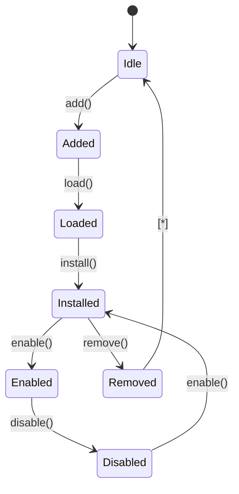
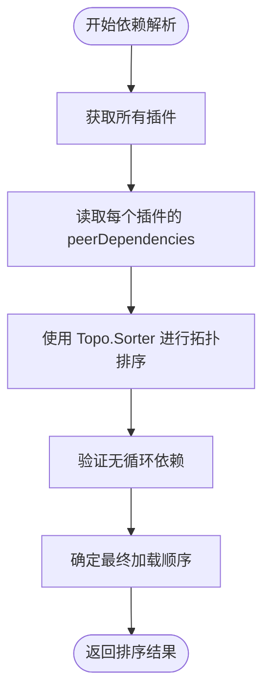
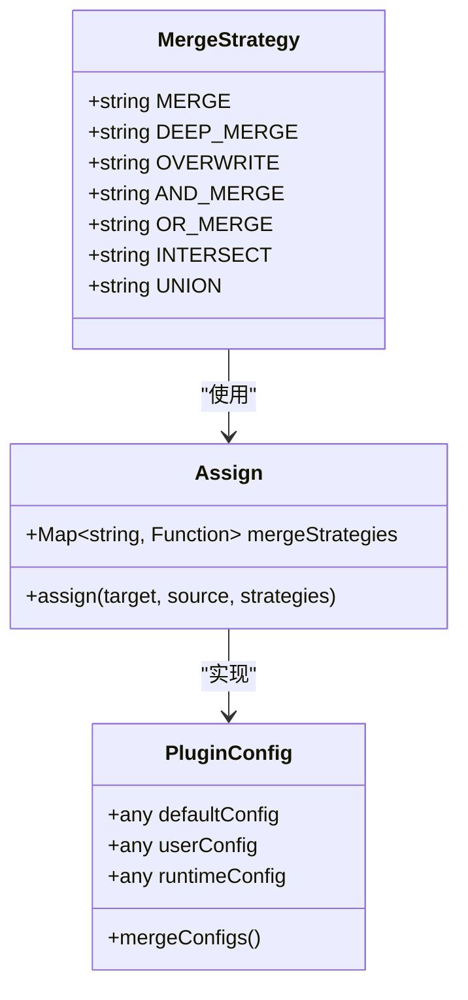
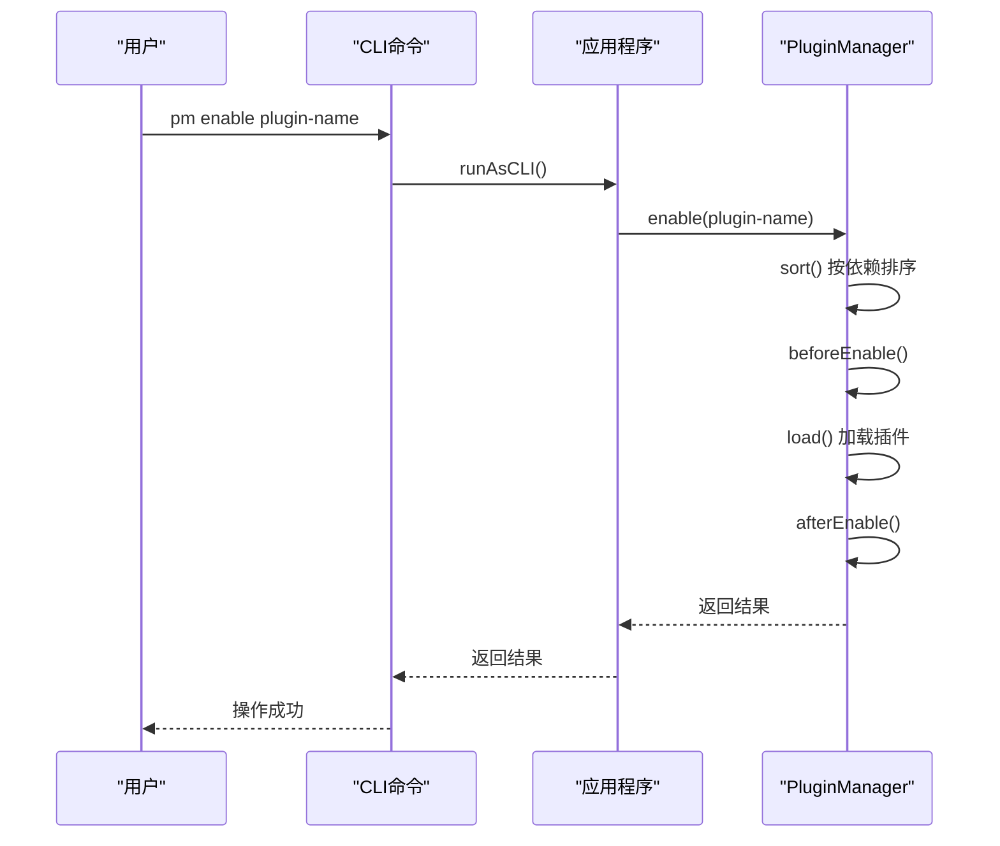
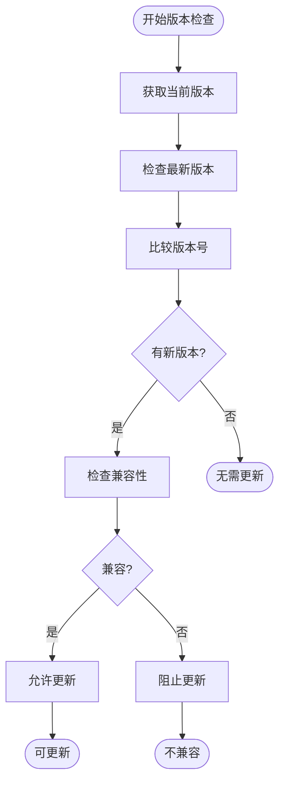
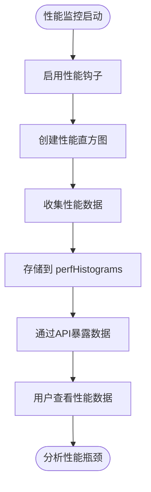
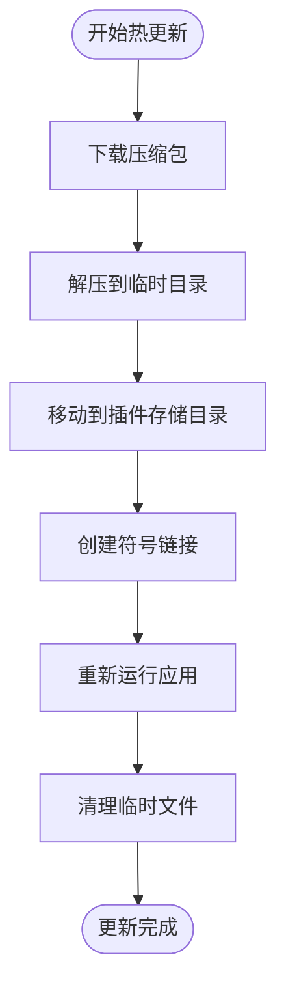

# 插件管理

<cite>
**本文档引用的文件**
- [plugin-manager.ts](file://packages/core/server/src/plugin-manager/plugin-manager.ts)
- [plugin-manager-repository.ts](file://packages/core/server/src/plugin-manager/plugin-manager-repository.ts)
- [plugin.ts](file://packages/core/server/src/plugin.ts)
- [pm.ts](file://packages/core/server/src/commands/pm.ts)
- [assign.ts](file://packages/core/utils/src/assign.ts)
- [helper.ts](file://packages/core/server/src/helper.ts)
- [custom-plugin.ts](file://examples/app/custom-plugin.ts)
- [PluginManager.ts](file://packages/core/client/src/application/PluginManager.ts)
- [remotePlugins.ts](file://packages/core/client/src/application/utils/remotePlugins.ts)
</cite>

## 目录
1. [插件生命周期管理](#插件生命周期管理)
2. [插件依赖关系解析](#插件依赖关系解析)
3. [插件配置管理](#插件配置管理)
4. [CLI工具操作](#cli工具操作)
5. [版本管理与兼容性](#版本管理与兼容性)
6. [性能监控与故障排查](#性能监控与故障排查)
7. [热加载与动态更新](#热加载与动态更新)

## 插件生命周期管理

NocoBase的插件管理系统通过`PluginManager`类管理插件的完整生命周期，包括加载、初始化、启动和卸载等阶段。插件生命周期由一系列有序的事件和状态转换组成，确保系统稳定运行。

插件生命周期的核心流程如下：
1. **添加（add）**：将插件注册到系统中，创建插件实例并建立别名映射
2. **加载（load）**：执行插件的加载逻辑，包括集合定义、资源注册等
3. **安装（install）**：同步数据库结构，执行迁移脚本
4. **启用（enable）**：激活插件功能，使其对系统可用
5. **禁用（disable）**：停用插件功能，但保留其数据和配置
6. **移除（remove）**：从系统中完全删除插件

**Diagram sources**
- [plugin-manager.ts](file://packages/core/server/src/plugin-manager/plugin-manager.ts#L317-L374)
- [plugin.ts](file://packages/core/server/src/plugin.ts#L114-L135)

**Section sources**
- [plugin-manager.ts](file://packages/core/server/src/plugin-manager/plugin-manager.ts#L426-L508)
- [plugin.ts](file://packages/core/server/src/plugin.ts#L114-L135)

## 插件依赖关系解析

NocoBase使用拓扑排序算法来解析和处理插件之间的依赖关系，确保插件按照正确的顺序加载。系统通过`peerDependencies`字段在`package.json`中声明插件依赖，`PluginManagerRepository`类负责执行依赖解析和排序。

依赖解析的关键机制包括：
- 使用`@hapi/topo`库进行拓扑排序
- 基于`peerDependencies`声明确定加载顺序
- 在启用插件前验证所有必需依赖已启用
- 提供循环依赖检测和处理

**Diagram sources**
- [plugin-manager-repository.ts](file://packages/core/server/src/plugin-manager/plugin-manager-repository.ts#L124-L141)
- [plugin-manager.ts](file://packages/core/server/src/plugin-manager/plugin-manager.ts#L1151-L1163)

**Section sources**
- [plugin-manager-repository.ts](file://packages/core/server/src/plugin-manager/plugin-manager-repository.ts#L124-L141)

## 插件配置管理

NocoBase实现了多层级的插件配置管理机制，支持默认配置、用户配置和运行时配置的合并。系统使用`assign`函数和多种合并策略来处理配置的优先级和合并逻辑。

配置管理的核心组件包括：
- **合并策略**：提供多种配置合并方式，如深度合并、覆盖、并集等
- **配置层级**：支持从默认值到用户自定义的多层级配置
- **运行时配置**：允许在运行时动态修改插件配置

**Diagram sources**
- [assign.ts](file://packages/core/utils/src/assign.ts#L34-L147)
- [plugin-manager.ts](file://packages/core/server/src/plugin-manager/plugin-manager.ts#L335-L374)

**Section sources**
- [assign.ts](file://packages/core/utils/src/assign.ts#L1-L147)

## CLI工具操作

NocoBase提供了完整的CLI工具来管理插件的安装、更新和删除操作。`pm`命令集提供了对插件生命周期的完整控制，支持通过命令行界面执行各种插件管理任务。

主要CLI命令包括：
- `pm add`：添加新插件
- `pm enable`：启用插件
- `pm disable`：禁用插件
- `pm remove`：移除插件
- `pm update`：更新插件

**Diagram sources**
- [pm.ts](file://packages/core/server/src/commands/pm.ts#L17-L125)
- [plugin-manager.ts](file://packages/core/server/src/plugin-manager/plugin-manager.ts#L553-L684)

**Section sources**
- [pm.ts](file://packages/core/server/src/commands/pm.ts#L17-L125)

## 版本管理与兼容性

NocoBase实现了完善的插件版本管理和兼容性检查机制。系统通过`package.json`中的版本信息来跟踪插件版本，并提供版本兼容性验证功能。

版本管理的关键特性包括：
- 自动检测新版本
- 兼容性检查（使用semver）
- 版本升级路径管理
- 依赖版本范围验证

**Diagram sources**
- [plugin-manager.ts](file://packages/core/server/src/plugin-manager/plugin-manager.ts#L994-L998)
- [utils.ts](file://packages/core/server/src/plugin-manager/utils.ts#L400-L411)

**Section sources**
- [utils.ts](file://packages/core/server/src/plugin-manager/utils.ts#L400-L411)

## 性能监控与故障排查

NocoBase内置了性能监控和故障排查工具，帮助开发者识别和解决插件相关的问题。系统提供了性能直方图收集、错误日志记录和调试信息输出等功能。

性能监控的主要功能包括：
- 性能指标收集
- 耗时操作跟踪
- 内存使用监控
- 错误日志记录

**Diagram sources**
- [helper.ts](file://packages/core/server/src/helper.ts#L138-L168)
- [plugin-manager.ts](file://packages/core/server/src/plugin-manager/plugin-manager.ts#L427-L428)

**Section sources**
- [helper.ts](file://packages/core/server/src/helper.ts#L138-L168)

## 热加载与动态更新

NocoBase支持插件的热加载和动态更新功能，允许在不重启服务的情况下更新插件。系统通过动态模块加载和重新运行机制实现这一功能。

热加载的关键步骤包括：
1. 下载新版本插件包
2. 解压到临时目录
3. 移动到插件存储目录
4. 创建符号链接
5. 重新加载应用

**Diagram sources**
- [utils.ts](file://packages/core/server/src/plugin-manager/utils.ts#L157-L219)
- [helper.ts](file://packages/core/server/src/helper.ts#L133-L135)

**Section sources**
- [utils.ts](file://packages/core/server/src/plugin-manager/utils.ts#L157-L219)
- [helper.ts](file://packages/core/server/src/helper.ts#L133-L135)