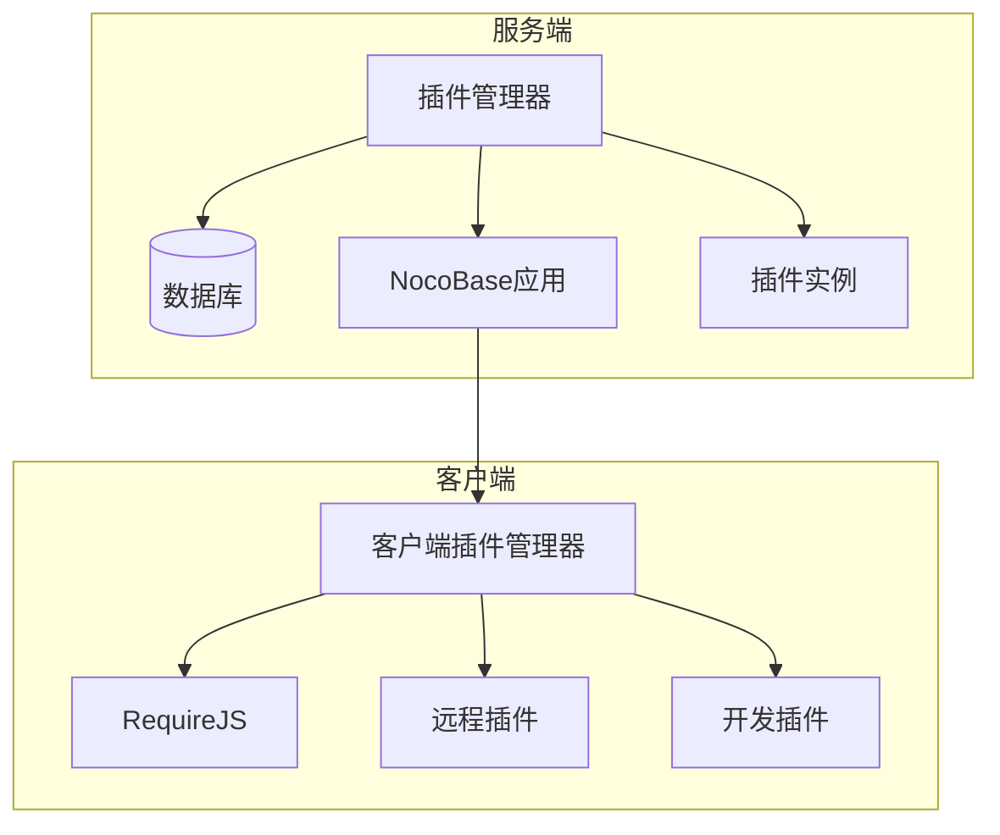
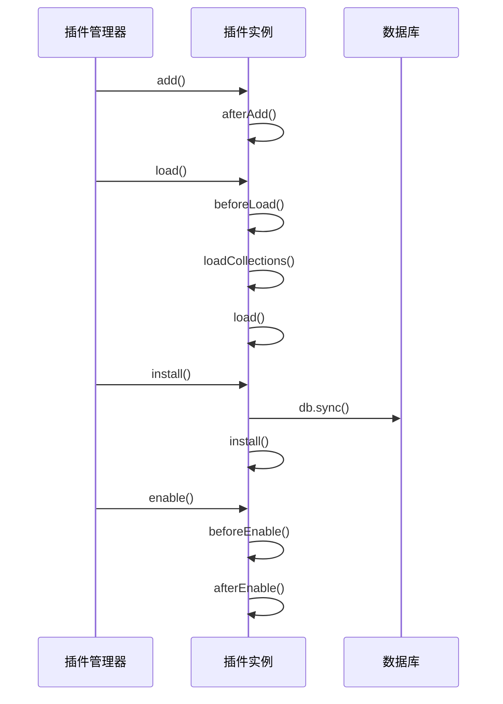
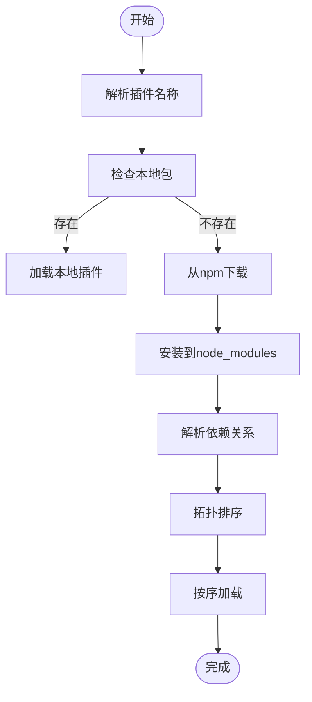
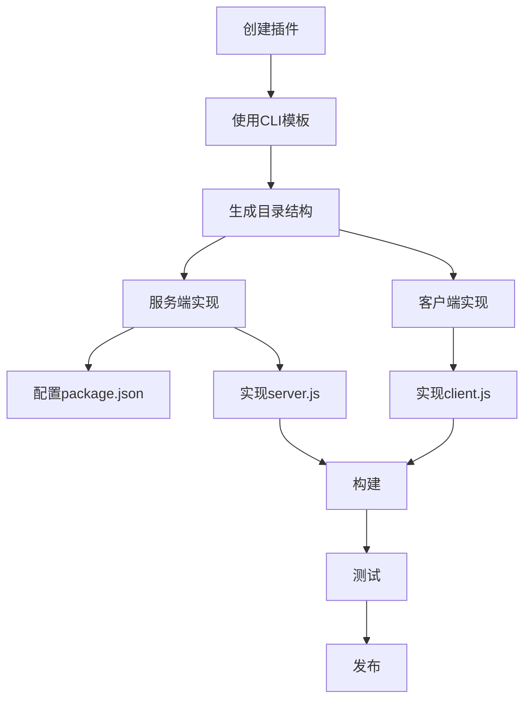
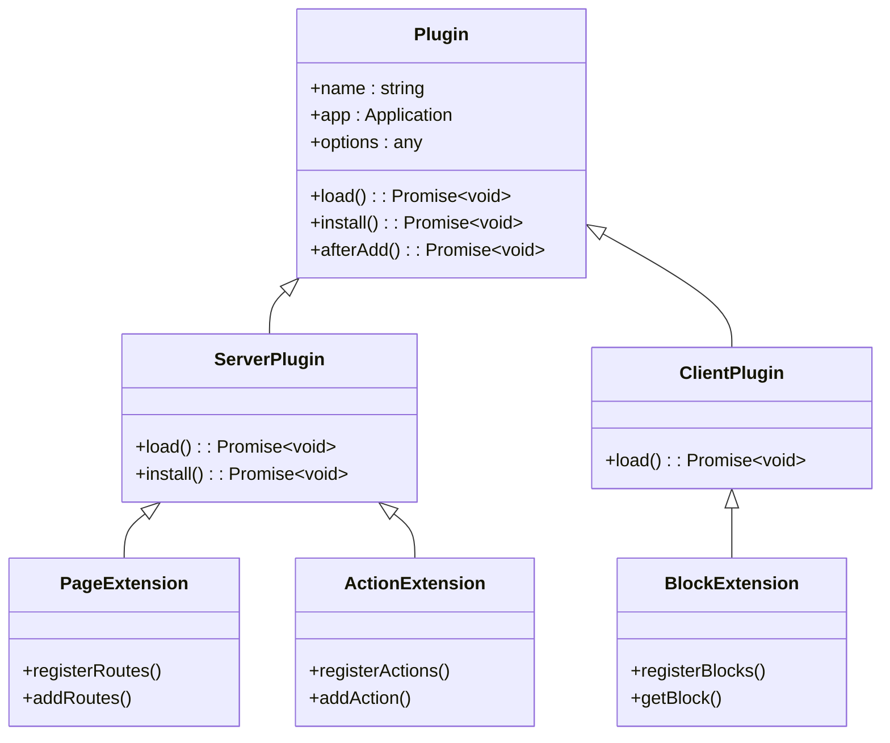
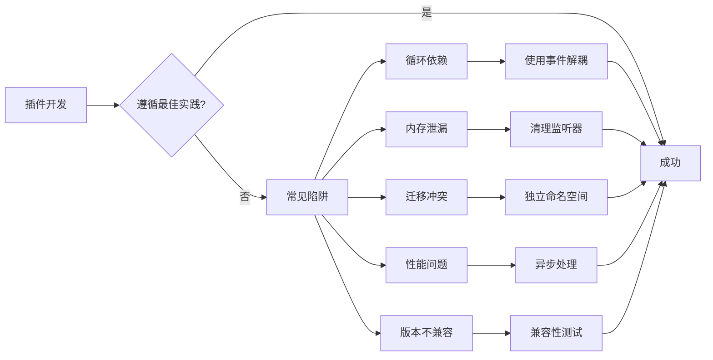

# 插件系统

<cite>
**本文档中引用的文件**  
- [plugin-manager.ts](file://packages/core/server/src/plugin-manager/plugin-manager.ts)
- [plugin.ts](file://packages/core/server/src/plugin.ts)
- [plugin-manager.ts](file://packages/core/client/src/plugin-manager.ts)
- [plugin.ts](file://packages/core/client/src/plugin.ts)
- [plugin-generator.ts](file://packages/core/cli/src/plugin-generator.ts)
- [app.ts](file://packages/core/app/src/index.ts)
- [server.js](file://packages/core/cli/templates/plugin/server.js)
- [package.json](file://packages/core/cli/package.json)
- [plugin-manager-repository.ts](file://packages/core/server/src/plugin-manager/plugin-manager-repository.ts)
- [plugin-acl/server.js](file://packages/plugins/@nocobase/plugin-acl/server.js)
</cite>

## 目录
1. [引言](#引言)
2. [插件化架构设计原理](#插件化架构设计原理)
3. [插件生命周期管理](#插件生命周期管理)
4. [插件依赖关系与版本冲突处理](#插件依赖关系与版本冲突处理)
5. [自定义插件创建指南](#自定义插件创建指南)
6. [插件扩展功能](#插件扩展功能)
7. [插件开发最佳实践与常见陷阱](#插件开发最佳实践与常见陷阱)
8. [结论](#结论)

## 引言

NocoBase 是一个基于插件架构的低代码开发平台，其核心设计理念是将所有功能模块化为插件。这种设计使得系统具有高度的可扩展性和灵活性，开发者可以通过添加、启用或禁用插件来定制应用功能。本文档详细阐述 NocoBase 的插件系统，包括其设计原理、生命周期管理、依赖处理机制以及如何开发和使用自定义插件。

**Section sources**
- [app.ts](file://packages/core/app/src/index.ts#L1-L22)

## 插件化架构设计原理

NocoBase 的整个系统基于插件化架构构建，所有核心功能（如 ACL、认证、数据源管理等）均以插件形式存在。这种设计实现了关注点分离，提升了系统的可维护性和可扩展性。

插件系统由服务端和客户端两部分组成：
- **服务端插件管理器**：负责插件的加载、初始化、依赖解析和生命周期管理
- **客户端插件系统**：通过 RequireJS 动态加载前端插件模块

插件命名遵循统一规范：`@nocobase/plugin-{name}` 或 `@nocobase/preset-{name}`，便于系统识别和管理。



**Diagram sources**
- [plugin-manager.ts](file://packages/core/server/src/plugin-manager/plugin-manager.ts#L57-L800)
- [plugin-manager.ts](file://packages/core/client/src/plugin-manager.ts#L1-L200)

**Section sources**
- [plugin-manager.ts](file://packages/core/server/src/plugin-manager/plugin-manager.ts#L57-L800)

## 插件生命周期管理

NocoBase 插件具有完整的生命周期，包括加载、初始化、启动和卸载等阶段。

### 生命周期阶段

1. **添加 (add)**：将插件注册到系统中
2. **加载 (load)**：加载插件代码和资源
3. **安装 (install)**：执行数据库同步和初始化逻辑
4. **启用 (enable)**：激活插件功能
5. **禁用 (disable)**：停用插件功能
6. **移除 (remove)**：从系统中删除插件

### 生命周期方法

插件类提供以下生命周期钩子方法：
- `afterAdd()`：插件添加后调用
- `beforeLoad()`：加载前调用
- `load()`：加载插件
- `install()`：安装插件
- `beforeEnable()` / `afterEnable()`：启用前后调用
- `beforeDisable()` / `afterDisable()`：禁用前后调用



**Diagram sources**
- [plugin-manager.ts](file://packages/core/server/src/plugin-manager/plugin-manager.ts#L426-L508)
- [plugin.ts](file://packages/core/server/src/plugin.ts#L1-L100)

**Section sources**
- [plugin-manager.ts](file://packages/core/server/src/plugin-manager/plugin-manager.ts#L426-L508)

## 插件依赖关系与版本冲突处理

NocoBase 提供了完善的插件依赖管理和版本控制机制。

### 依赖解析

插件管理器使用拓扑排序算法（Topo）来解析插件间的依赖关系，确保插件按正确的顺序加载。依赖信息通常在插件的 `package.json` 中声明。

### 版本兼容性检查

系统通过 `checkAndGetCompatible` 方法检查插件版本兼容性，避免因版本不匹配导致的运行时错误。

### 依赖处理流程

1. 解析插件名称和包名
2. 检查本地是否存在插件包
3. 若不存在，则从 npm 仓库下载
4. 使用拓扑排序确定加载顺序
5. 按序加载和初始化插件



**Diagram sources**
- [plugin-manager.ts](file://packages/core/server/src/plugin-manager/plugin-manager.ts#L122-L246)
- [utils.ts](file://packages/core/server/src/plugin-manager/utils.ts#L1-L50)

**Section sources**
- [plugin-manager.ts](file://packages/core/server/src/plugin-manager/plugin-manager.ts#L122-L246)

## 自定义插件创建指南

### 使用CLI工具生成插件模板

NocoBase 提供了命令行工具来快速创建插件项目：

```bash
npx @nocobase/cli plugin:create my-plugin
```

该命令会使用模板生成完整的插件结构。

### 插件元数据定义

插件的核心元数据在 `package.json` 中定义：

```json
{
  "name": "@nocobase/plugin-my-feature",
  "version": "1.0.0",
  "nocobase": {
    "type": "plugin",
    "main": "server.js",
    "client": "client.js"
  }
}
```

### 服务端功能实现

服务端插件通常继承 `Plugin` 基类并实现相应方法：

```typescript
import { Plugin } from '@nocobase/server';

export class MyPlugin extends Plugin {
  async load() {
    // 注册路由、资源等
  }
  
  async install() {
    // 数据库迁移
  }
}
```

### 客户端功能实现

客户端插件通过导出配置对象来扩展UI：

```javascript
export default {
  name: 'my-plugin',
  components: { /* 自定义组件 */ },
  routes: [ /* 路由配置 */ ],
  providers: [ /* 依赖注入提供者 */ ]
};
```



**Diagram sources**
- [plugin-generator.ts](file://packages/core/cli/src/plugin-generator.ts#L1-L200)
- [server.js](file://packages/core/cli/templates/plugin/server.js#L1-L2)

**Section sources**
- [plugin-generator.ts](file://packages/core/cli/src/plugin-generator.ts#L1-L200)

## 插件扩展功能

NocoBase 插件可以扩展多种系统功能：

### 页面扩展

通过注册新的路由和页面组件来扩展UI界面。

### 块(Blocks)扩展

创建可复用的内容块，如图表块、表单块等。

### 动作(Actions)扩展

添加自定义操作，如批量编辑、导出等。

### API扩展

通过 `app.resourcer` 定义新的REST API端点。

### 数据源扩展

实现自定义数据源适配器，连接外部系统。



**Diagram sources**
- [plugin.ts](file://packages/core/server/src/plugin.ts#L1-L100)
- [plugin.ts](file://packages/core/client/src/plugin.ts#L1-L100)

**Section sources**
- [plugin.ts](file://packages/core/server/src/plugin.ts#L1-L100)

## 插件开发最佳实践与常见陷阱

### 最佳实践

1. **单一职责**：每个插件应专注于一个特定功能
2. **依赖声明**：明确声明插件依赖关系
3. **版本管理**：遵循语义化版本控制
4. **错误处理**：妥善处理生命周期中的异常
5. **资源清理**：在卸载时清理注册的资源

### 常见陷阱与规避

1. **循环依赖**：避免插件间的循环依赖
   - 规避方法：使用延迟加载或事件机制

2. **内存泄漏**：未正确清理事件监听器
   - 规避方法：在 `afterDisable` 中移除所有监听器

3. **数据库迁移冲突**：多个插件同时修改同一表结构
   - 规避方法：使用独立的迁移命名空间

4. **性能问题**：在 `load` 阶段执行耗时操作
   - 规避方法：将耗时操作移到 `install` 或后台任务

5. **版本不兼容**：未测试与其他插件的兼容性
   - 规避方法：建立完整的测试套件



**Diagram sources**
- [plugin-manager.ts](file://packages/core/server/src/plugin-manager/plugin-manager.ts#L317-L315)
- [plugin.ts](file://packages/core/server/src/plugin.ts#L1-L100)

**Section sources**
- [plugin-manager.ts](file://packages/core/server/src/plugin-manager/plugin-manager.ts#L317-L315)

## 结论

NocoBase 的插件系统提供了一套完整、灵活且强大的扩展机制。通过将所有功能模块化为插件，系统实现了高度的可定制性和可扩展性。开发者可以轻松创建自定义插件来满足特定业务需求，同时系统提供了完善的生命周期管理、依赖处理和错误恢复机制，确保插件系统的稳定运行。遵循最佳实践并规避常见陷阱，可以开发出高质量、可维护的插件，充分发挥 NocoBase 平台的潜力。