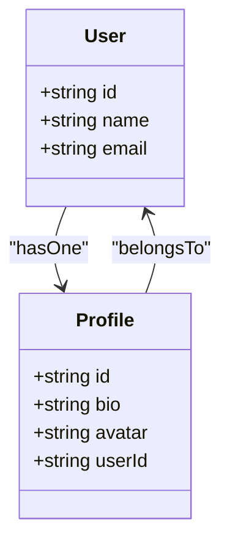
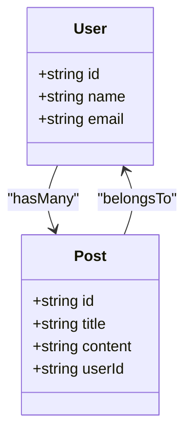
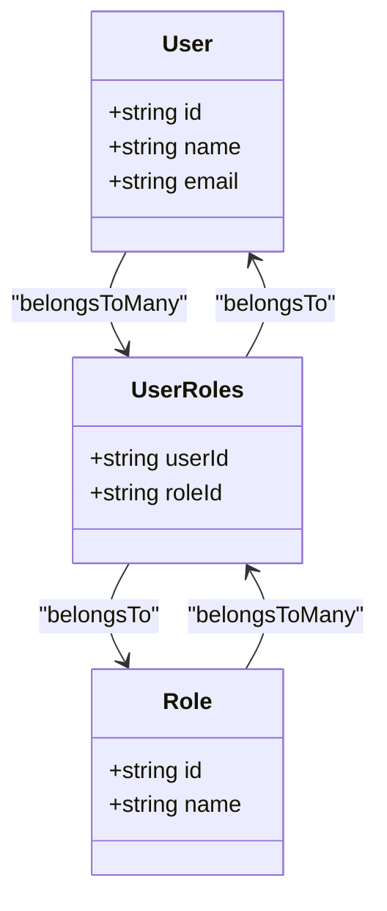

# 数据建模

<cite>
**本文档引用的文件**   
- [collection.ts](file://packages/core/database/src/collection.ts)
- [field.ts](file://packages/core/database/src/fields/field.ts)
- [belongs-to-field.ts](file://packages/core/database/src/fields/belongs-to-field.ts)
- [has-many-field.ts](file://packages/core/database/src/fields/has-many-field.ts)
- [has-one-field.ts](file://packages/core/database/src/fields/has-one-field.ts)
- [belongs-to-many-field.ts](file://packages/core/database/src/fields/belongs-to-many-field.ts)
- [database.ts](file://packages/core/database/src/database.ts)
- [collections.ts](file://packages/plugins/@nocobase/plugin-data-source-main/src/server/collections/collections.ts)
- [fields.ts](file://packages/plugins/@nocobase/plugin-data-source-main/src/server/collections/fields.ts)
</cite>

## 目录
1. [引言](#引言)
2. [数据模型设计原理](#数据模型设计原理)
3. [集合、字段和关系的概念](#集合字段和关系的概念)
4. [数据结构定义与管理](#数据结构定义与管理)
5. [关系型数据建模](#关系型数据建模)
6. [数据验证规则与业务逻辑](#数据验证规则与业务逻辑)
7. [数据迁移指导](#数据迁移指导)
8. [性能优化建议](#性能优化建议)
9. [结论](#结论)

## 引言

NocoBase 是一个低代码开发平台，其核心功能之一是强大的数据建模能力。本文档旨在全面解释 NocoBase 的数据建模系统，涵盖从基础概念到高级特性的各个方面。我们将深入探讨集合（Collection）、字段（Field）和关系（Relation）的设计原理，详细说明如何定义和管理数据结构，包括各种字段类型的配置选项。此外，文档还将重点介绍关系型数据建模的实现方式，涵盖一对一、一对多、多对多关系的处理机制。我们还将讨论数据验证规则、业务逻辑实现、数据迁移策略以及性能优化的最佳实践。

**Section sources**
- [collection.ts](file://packages/core/database/src/collection.ts)
- [field.ts](file://packages/core/database/src/fields/field.ts)

## 数据模型设计原理

NocoBase 的数据模型设计基于模块化和可扩展的原则，利用了 Sequelize ORM 框架的强大功能。整个系统围绕 `Collection`（集合）和 `Field`（字段）两个核心概念构建。`Collection` 类似于传统数据库中的表，代表一个数据实体，而 `Field` 则是该实体的属性或列。

数据模型的设计遵循分层架构，其中 `Database` 类作为顶层管理器，负责协调所有集合和字段的生命周期。每个 `Collection` 实例都与一个 Sequelize `Model` 相关联，这使得 NocoBase 能够无缝地与底层数据库交互。字段的定义不仅包括基本的数据类型（如字符串、数字、日期），还支持复杂的验证规则、默认值、索引和关系映射。

系统通过 `Field` 类的继承体系来支持多种字段类型。每种字段类型（如 `StringField`、`NumberField`、`DateField`）都是 `Field` 基类的子类，它们可以覆盖特定的方法来定义自己的行为。这种设计模式允许平台轻松扩展，支持自定义字段类型，同时保持核心逻辑的简洁性。

**Section sources**
- [collection.ts](file://packages/core/database/src/collection.ts)
- [field.ts](file://packages/core/database/src/fields/field.ts)
- [database.ts](file://packages/core/database/src/database.ts)

## 集合字段和关系的概念

在 NocoBase 中，**集合**（Collection）是数据组织的基本单位，相当于数据库中的表。每个集合都有一个唯一的名称，并包含一组字段。集合的定义通过 `CollectionOptions` 接口进行，该接口允许指定集合的名称、标题、字段列表、继承关系等属性。

**字段**（Field）是集合的组成部分，代表数据的具体属性。字段可以是简单的数据类型，如字符串、数字、布尔值，也可以是复杂类型，如 JSON、日期时间等。每个字段都有一个名称和一个类型，类型决定了字段在数据库中的存储方式和在用户界面中的表现形式。

**关系**（Relation）是连接两个集合的桥梁，允许在不同数据实体之间建立关联。NocoBase 支持多种关系类型，包括：
- **belongsTo**：表示一个集合属于另一个集合，通常在子集合中创建外键。
- **hasOne**：表示一个集合有一个关联的记录，通常在父集合中创建外键。
- **hasMany**：表示一个集合可以有多个关联的记录，通常在子集合中创建外键。
- **belongsToMany**：表示多对多关系，需要一个中间表来存储关联。

关系字段的定义包含了目标集合、外键、源键等关键属性，这些属性共同决定了关系的建立方式和数据的查询路径。

**Section sources**
- [collection.ts](file://packages/core/database/src/collection.ts)
- [field.ts](file://packages/core/database/src/fields/field.ts)
- [belongs-to-field.ts](file://packages/core/database/src/fields/belongs-to-field.ts)
- [has-many-field.ts](file://packages/core/database/src/fields/has-many-field.ts)
- [has-one-field.ts](file://packages/core/database/src/fields/has-one-field.ts)
- [belongs-to-many-field.ts](file://packages/core/database/src/fields/belongs-to-many-field.ts)

## 数据结构定义与管理

在 NocoBase 中，数据结构的定义和管理是通过编程接口和配置文件相结合的方式实现的。开发者可以通过代码或配置文件来定义集合和字段，系统会自动将这些定义同步到数据库中。

### 集合定义

集合的定义主要通过 `CollectionOptions` 接口完成。以下是一个典型的集合定义示例：

```typescript
const usersCollection = new Collection({
  name: 'users',
  fields: [
    {
      type: 'bigInt',
      name: 'id',
      primaryKey: true,
    },
    {
      type: 'string',
      name: 'username',
      unique: true,
    },
    {
      type: 'integer',
      name: 'age',
    },
    {
      name: 'email',
      type: 'string',
      unique: true,
    },
  ],
});
```

在这个例子中，`users` 集合包含了四个字段：`id`、`username`、`age` 和 `email`。每个字段都指定了类型和名称，部分字段还设置了唯一性约束。

### 字段类型与配置

NocoBase 支持多种字段类型，每种类型都有其特定的配置选项。常见的字段类型包括：

- **字符串字段**（StringField）：用于存储文本数据，可以设置最大长度、是否唯一等。
- **数字字段**（NumberField）：用于存储整数或浮点数，可以设置精度和范围。
- **日期字段**（DateField）：用于存储日期和时间，支持不同的格式和时区。
- **布尔字段**（BooleanField）：用于存储真/假值。
- **JSON 字段**（JsonField）：用于存储结构化的 JSON 数据。

字段的配置选项可以通过 `FieldOptions` 接口进行定义，包括 `name`、`type`、`unique`、`defaultValue` 等。

### 关系字段配置

关系字段的配置更为复杂，需要指定目标集合、外键、源键等属性。例如，定义一个 `belongsTo` 关系字段：

```typescript
{
  type: 'belongsTo',
  name: 'role',
  target: 'roles',
  foreignKey: 'roleId',
  targetKey: 'id',
  onDelete: 'CASCADE',
}
```

在这个例子中，`users` 集合中的 `role` 字段与 `roles` 集合建立了 `belongsTo` 关系，外键为 `roleId`，目标键为 `id`，删除行为为级联删除。

**Section sources**
- [collection.ts](file://packages/core/database/src/collection.ts)
- [field.ts](file://packages/core/database/src/fields/field.ts)
- [belongs-to-field.ts](file://packages/core/database/src/fields/belongs-to-field.ts)
- [has-many-field.ts](file://packages/core/database/src/fields/has-many-field.ts)
- [has-one-field.ts](file://packages/core/database/src/fields/has-one-field.ts)
- [belongs-to-many-field.ts](file://packages/core/database/src/fields/belongs-to-many-field.ts)

## 关系型数据建模

NocoBase 提供了强大的关系型数据建模功能，支持多种关系类型，包括一对一、一对多和多对多关系。这些关系的实现基于 Sequelize ORM 的关联机制，并通过 NocoBase 的抽象层进行了封装和扩展。

### 一对一关系

一对一关系通过 `hasOne` 和 `belongsTo` 字段类型实现。`hasOne` 表示一个集合有一个关联的记录，而 `belongsTo` 表示一个集合属于另一个集合。通常，`belongsTo` 字段会在子集合中创建外键。



**Diagram sources**
- [has-one-field.ts](file://packages/core/database/src/fields/has-one-field.ts)
- [belongs-to-field.ts](file://packages/core/database/src/fields/belongs-to-field.ts)

### 一对多关系

一对多关系通过 `hasMany` 和 `belongsTo` 字段类型实现。`hasMany` 表示一个集合可以有多个关联的记录，而 `belongsTo` 表示一个集合属于另一个集合。通常，`belongsTo` 字段会在子集合中创建外键。



**Diagram sources**
- [has-many-field.ts](file://packages/core/database/src/fields/has-many-field.ts)
- [belongs-to-field.ts](file://packages/core/database/src/fields/belongs-to-field.ts)

### 多对多关系

多对多关系通过 `belongsToMany` 字段类型实现，需要一个中间表来存储关联。中间表通常包含两个外键，分别指向两个相关集合的主键。



**Diagram sources**
- [belongs-to-many-field.ts](file://packages/core/database/src/fields/belongs-to-many-field.ts)
- [belongs-to-field.ts](file://packages/core/database/src/fields/belongs-to-field.ts)

## 数据验证规则与业务逻辑

NocoBase 提供了灵活的数据验证机制，允许开发者为字段定义复杂的验证规则。这些规则可以在数据创建或更新时自动执行，确保数据的完整性和一致性。

### 数据验证规则

数据验证规则通过 `ValidationOptions` 接口定义，支持多种验证类型，如必填、唯一性、长度限制、正则表达式匹配等。验证规则可以组合使用，形成复杂的验证逻辑。

```typescript
{
  type: 'string',
  name: 'email',
  validation: {
    type: 'string',
    rules: [
      { name: 'required', message: '邮箱不能为空' },
      { name: 'email', message: '邮箱格式不正确' },
      { name: 'unique', message: '邮箱已存在' },
    ],
  },
}
```

### 业务逻辑实现

业务逻辑可以通过自定义字段类型或插件来实现。NocoBase 允许开发者在字段的 `setter` 和 `getter` 方法中添加自定义逻辑，例如数据转换、计算字段值等。此外，还可以通过事件监听器在数据操作的各个阶段插入自定义逻辑，如 `beforeCreate`、`afterUpdate` 等。

**Section sources**
- [field.ts](file://packages/core/database/src/fields/field.ts)
- [collection.ts](file://packages/core/database/src/collection.ts)

## 数据迁移指导

数据迁移是数据建模过程中不可或缺的一部分，尤其是在应用迭代和版本升级时。NocoBase 提供了强大的数据迁移工具，支持模式变更、数据转换和版本控制。

### 模式变更

模式变更包括添加、删除或修改字段和集合。NocoBase 的 `Collection` 类提供了 `addField`、`removeField` 和 `updateField` 方法，允许动态修改数据结构。这些操作会自动同步到数据库中，确保数据的一致性。

### 数据转换

数据转换涉及将现有数据从一种格式转换为另一种格式。NocoBase 的迁移脚本支持自定义逻辑，可以在迁移过程中执行数据转换。例如，将旧的日期格式转换为新的 ISO 格式。

### 版本控制

NocoBase 使用 Umzug 作为迁移管理器，支持版本化的迁移脚本。每个迁移脚本都有一个唯一的名称和时间戳，确保迁移的顺序性和可追溯性。迁移脚本可以是 JavaScript 或 TypeScript 文件，支持异步操作。

**Section sources**
- [collection.ts](file://packages/core/database/src/collection.ts)
- [database.ts](file://packages/core/database/src/database.ts)

## 性能优化建议

为了确保 NocoBase 应用的高性能，以下是一些关键的性能优化建议：

### 索引策略

合理使用索引可以显著提高查询性能。对于经常用于查询条件的字段，应创建索引。NocoBase 的 `Field` 类支持 `index` 选项，可以为字段创建单列或多列索引。

```typescript
{
  type: 'string',
  name: 'email',
  index: true,
}
```

### 查询优化

避免不必要的关联查询，特别是在大数据集上。使用懒加载（lazy loading）和预加载（eager loading）来优化查询性能。NocoBase 的 `Repository` 类提供了丰富的查询方法，支持分页、排序和过滤。

### 缓存机制

利用缓存机制减少数据库查询次数。NocoBase 支持多种缓存策略，包括内存缓存和分布式缓存。对于频繁访问但不经常变化的数据，可以使用缓存来提高响应速度。

**Section sources**
- [field.ts](file://packages/core/database/src/fields/field.ts)
- [collection.ts](file://packages/core/database/src/collection.ts)
- [database.ts](file://packages/core/database/src/database.ts)

## 结论

NocoBase 的数据建模系统提供了一套完整且灵活的工具，使开发者能够高效地定义和管理数据结构。通过深入理解集合、字段和关系的概念，以及掌握数据验证、业务逻辑和性能优化的最佳实践，开发者可以构建出高性能、可维护的应用程序。本文档旨在为开发者提供全面的指导，帮助他们在 NocoBase 平台上实现复杂的数据建模需求。