# API权限控制

<cite>
**本文档中引用的文件**  
- [acl.ts](file://packages/core/acl/src/acl.ts)
- [acl-role.ts](file://packages/core/acl/src/acl-role.ts)
- [acl-resource.ts](file://packages/core/acl/src/acl-resource.ts)
- [acl-available-strategy.ts](file://packages/core/acl/src/acl-available-strategy.ts)
- [allow-manager.ts](file://packages/core/acl/src/allow-manager.ts)
- [fixed-params-manager.ts](file://packages/core/acl/src/fixed-params-manager.ts)
- [snippet-manager.ts](file://packages/core/acl/src/snippet-manager.ts)
</cite>

## 目录
1. [简介](#简介)
2. [权限控制架构](#权限控制架构)
3. [核心组件分析](#核心组件分析)
4. [角色定义与策略配置](#角色定义与策略配置)
5. [权限验证流程](#权限验证流程)
6. [资源动作级别的权限控制](#资源动作级别的权限控制)
7. [中间件实现细粒度访问控制](#中间件实现细粒度访问控制)
8. [权限继承与覆盖规则](#权限继承与覆盖规则)
9. [自定义动作的权限策略配置](#自定义动作的权限策略配置)
10. [基于条件的动态权限控制](#基于条件的动态权限控制)

## 简介
NocoBase的API权限控制系统基于访问控制列表（ACL）机制，提供了一套完整的权限管理解决方案。该系统支持角色定义、策略配置、权限验证等核心功能，能够实现细粒度的资源动作级别访问控制。通过中间件机制，系统能够在请求处理流程中动态验证权限，并根据配置的策略执行相应的权限控制逻辑。

## 权限控制架构
NocoBase的ACL系统采用分层架构设计，主要包括角色管理、资源管理、策略管理和权限验证等核心组件。系统通过事件驱动的方式，在权限分配和验证过程中触发相应的处理逻辑。

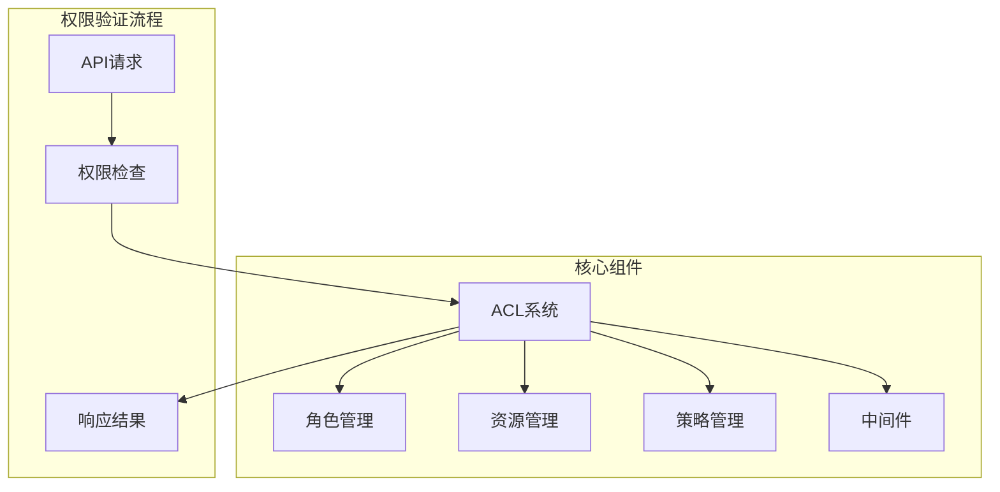

**图表来源**  
- [acl.ts](file://packages/core/acl/src/acl.ts#L66-L603)
- [acl-role.ts](file://packages/core/acl/src/acl-role.ts#L33-L215)

## 核心组件分析

### ACL类
ACL类是权限控制系统的核心，负责管理所有权限相关的操作。它维护了角色、可用策略、允许管理器等关键组件的引用，并提供了权限验证的主要接口。

**组件来源**  
- [acl.ts](file://packages/core/acl/src/acl.ts#L66-L603)

### 角色管理
角色管理通过ACLRole类实现，每个角色都关联一组资源权限配置。角色可以定义具体的策略，并为不同资源的动作设置详细的权限参数。

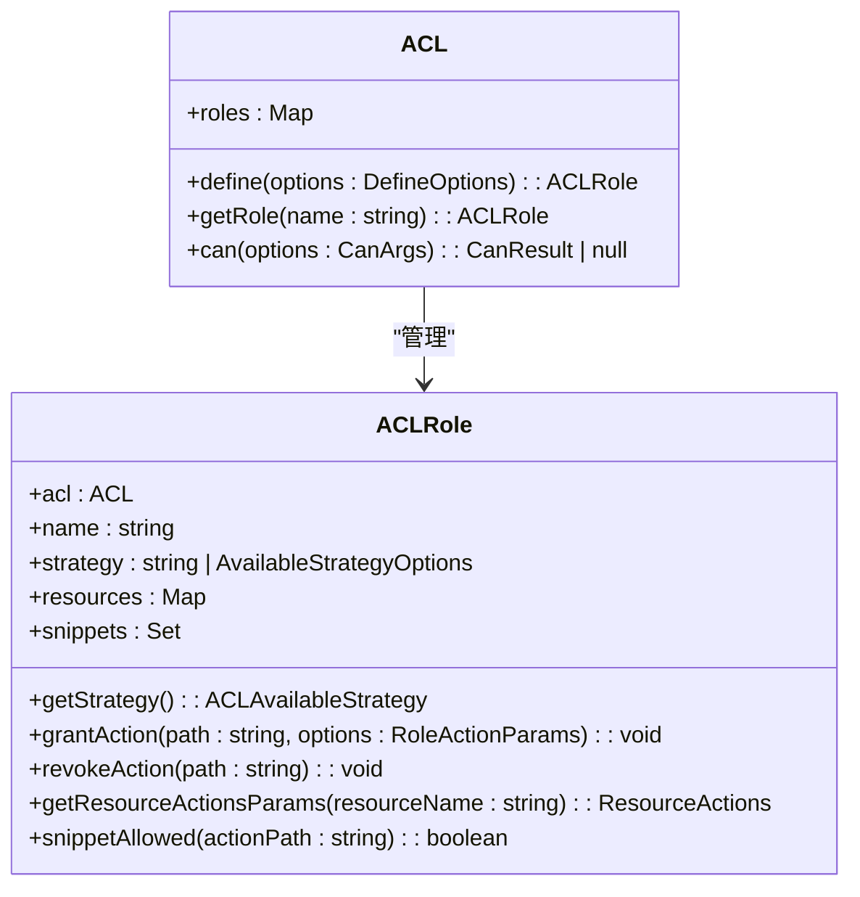

**图表来源**  
- [acl-role.ts](file://packages/core/acl/src/acl-role.ts#L33-L215)
- [acl.ts](file://packages/core/acl/src/acl.ts#L66-L603)

### 资源管理
资源管理通过ACLResource类实现，负责管理特定资源的权限配置。每个资源可以配置多个动作的权限参数，支持字段级的访问控制。

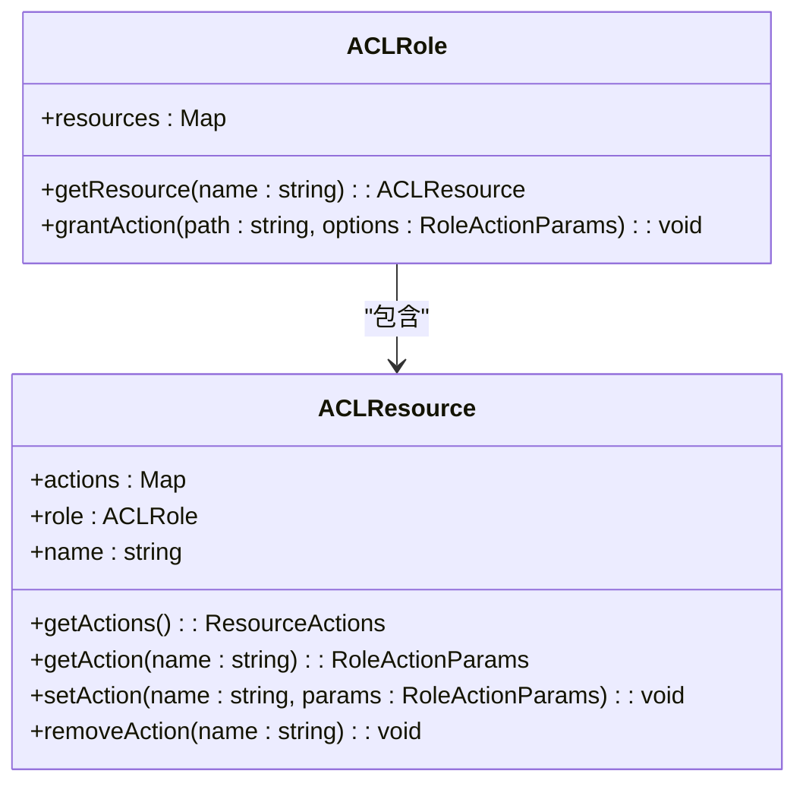

**图表来源**  
- [acl-resource.ts](file://packages/core/acl/src/acl-resource.ts#L22-L84)
- [acl-role.ts](file://packages/core/acl/src/acl-role.ts#L33-L215)

## 角色定义与策略配置
NocoBase的权限系统通过角色来组织权限配置。每个角色可以定义自己的策略，并为不同的资源和动作设置具体的权限参数。

### 角色定义
角色通过`define`方法进行定义，需要指定角色名称、策略和具体的权限配置：

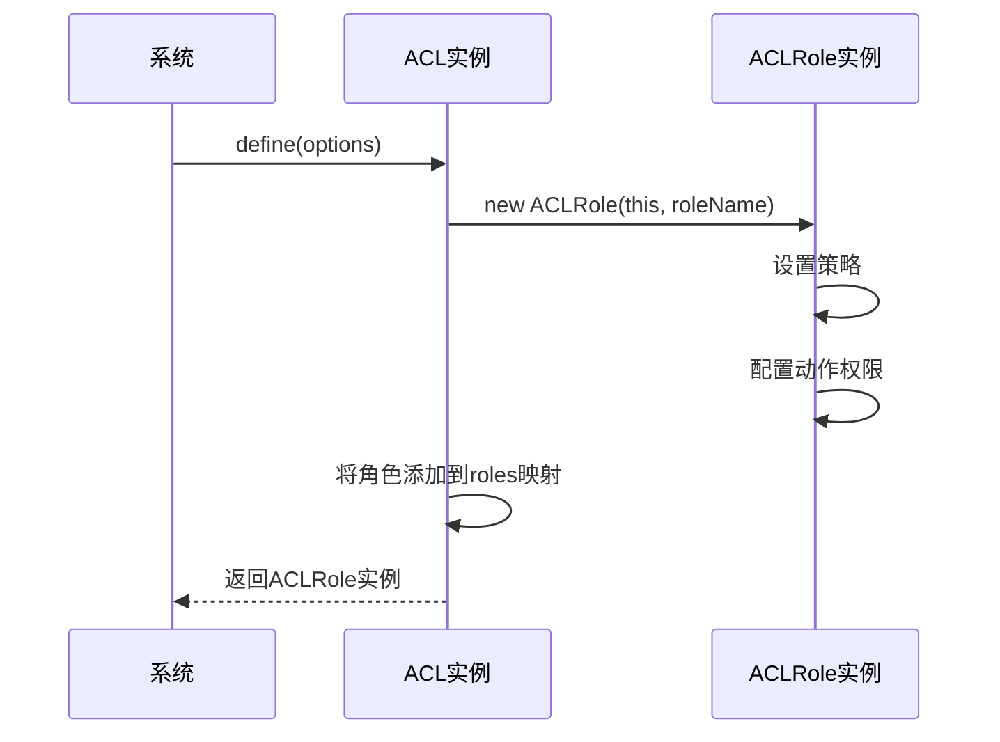

**图表来源**  
- [acl.ts](file://packages/core/acl/src/acl.ts#L151-L168)
- [acl-role.ts](file://packages/core/acl/src/acl-role.ts#L42-L45)

### 策略配置
策略配置通过AvailableStrategyOptions接口定义，支持多种预定义的策略模式：

```mermaid
classDiagram
class ACLAvailableStrategy {
+acl : ACL
+options : AvailableStrategyOptions
+actionsAsObject : { [key : string] : string }
+allowConfigure : boolean
+matchAction(actionName : string) : boolean | object
+allow(resourceName : string, actionName : string) : boolean | object
}
class AvailableStrategyOptions {
+displayName? : string
+actions? : false | '*' | string | string[]
+allowConfigure? : boolean
+resource? : '*'
}
ACLAvailableStrategy --> AvailableStrategyOptions
```

**图表来源**  
- [acl-available-strategy.ts](file://packages/core/acl/src/acl-available-strategy.ts#L34-L81)
- [acl.ts](file://packages/core/acl/src/acl.ts#L70-L80)

## 权限验证流程
权限验证是ACL系统的核心功能，通过`can`方法实现。验证流程考虑了单个角色和多个角色的情况，并支持权限合并。

### 单角色权限验证
当指定单个角色时，系统直接查询该角色的权限配置：

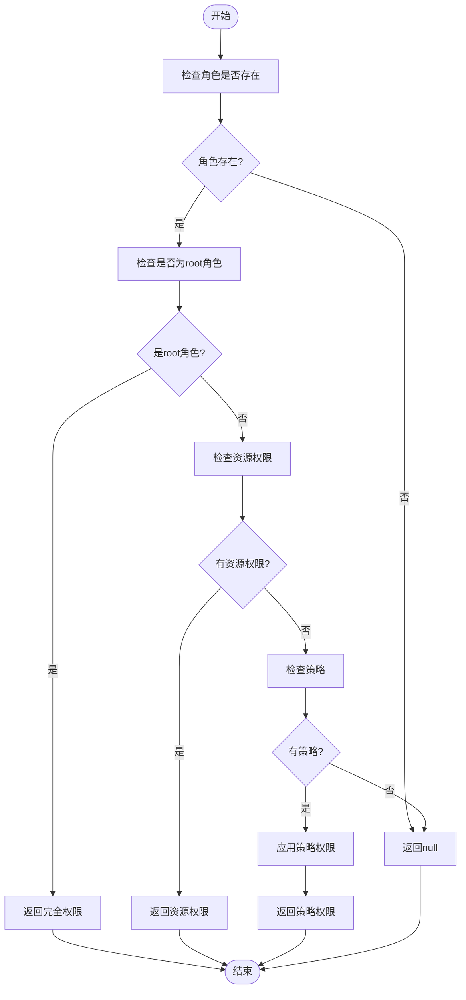

**图表来源**  
- [acl.ts](file://packages/core/acl/src/acl.ts#L210-L322)

### 多角色权限验证
当指定多个角色时，系统会合并各个角色的权限：

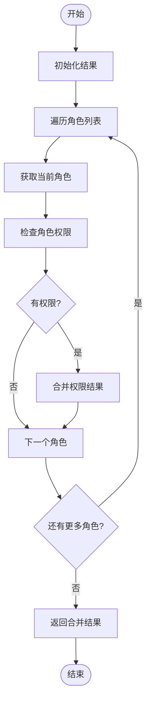

**图表来源**  
- [acl.ts](file://packages/core/acl/src/acl.ts#L224-L241)

## 资源动作级别的权限控制
NocoBase支持在资源动作级别实施精细的权限控制，允许为每个资源的每个动作配置不同的权限参数。

### 权限参数配置
权限参数通过RoleActionParams接口定义，支持多种控制选项：

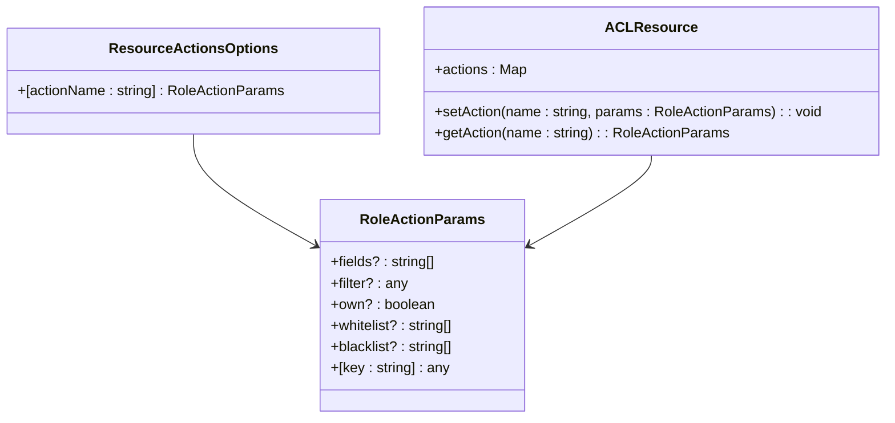

**图表来源**  
- [acl-role.ts](file://packages/core/acl/src/acl-role.ts#L16-L28)
- [acl-resource.ts](file://packages/core/acl/src/acl-resource.ts#L22-L84)

### 字段级访问控制
系统支持通过fields、whitelist和blacklist参数实现字段级的访问控制：

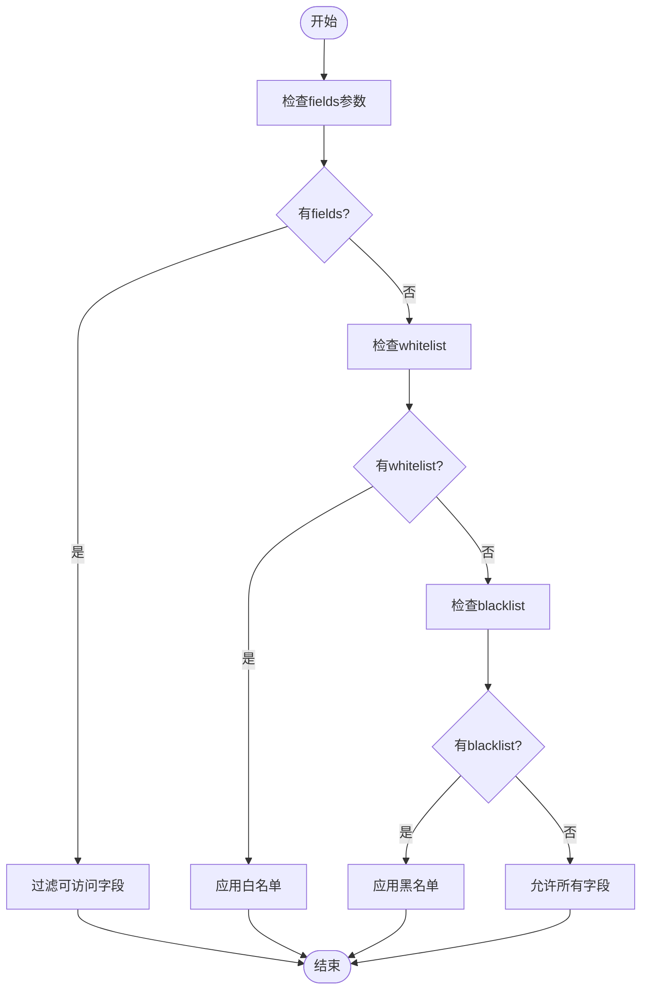

**图表来源**  
- [acl.ts](file://packages/core/acl/src/acl.ts#L512-L557)
- [fixed-params-manager.ts](file://packages/core/acl/src/fixed-params-manager.ts#L49-L58)

## 中间件实现细粒度访问控制
ACL系统通过Koa中间件机制实现细粒度的访问控制，在请求处理流程中动态验证和应用权限。

### 中间件注册
系统在构造函数中自动注册核心中间件：

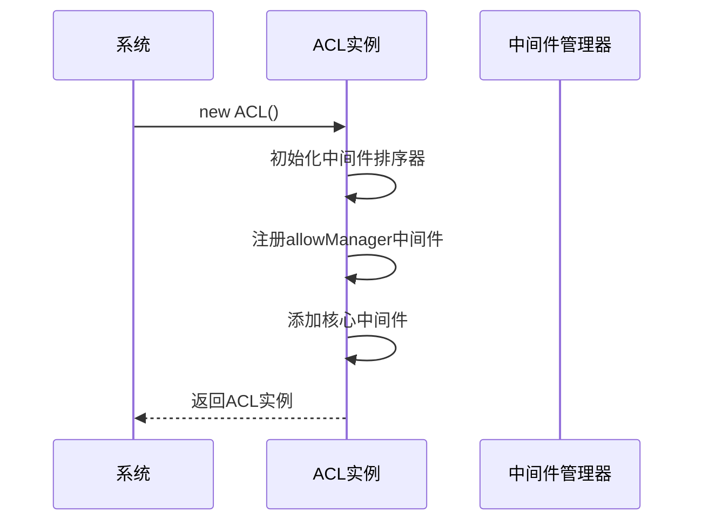

**图表来源**  
- [acl.ts](file://packages/core/acl/src/acl.ts#L100-L130)

### 权限验证中间件
核心权限验证中间件负责最终的权限检查和参数合并：

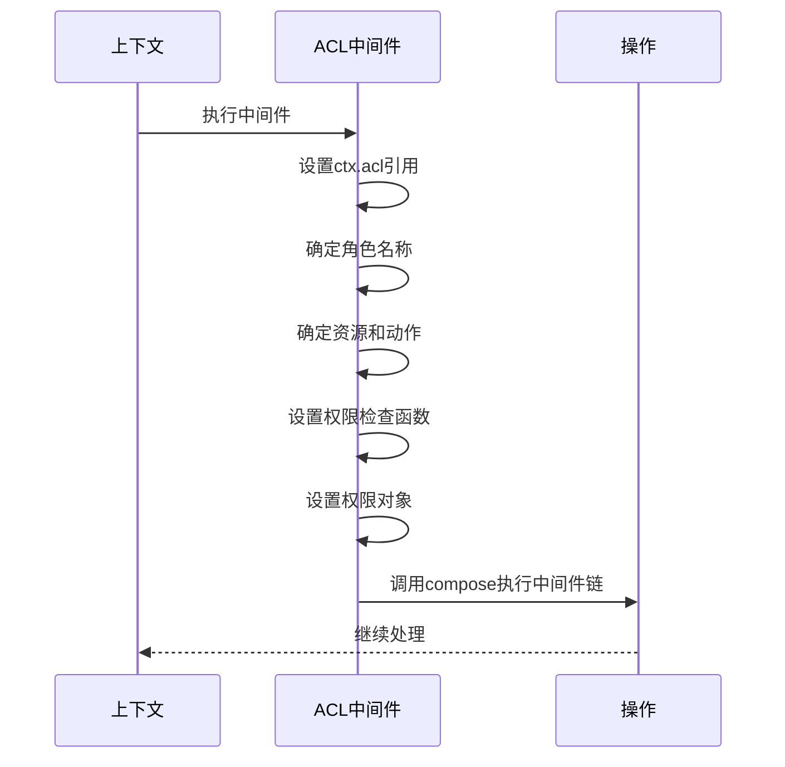

**图表来源**  
- [acl.ts](file://packages/core/acl/src/acl.ts#L381-L417)

### 核心中间件逻辑
核心中间件执行最终的权限验证和参数处理：

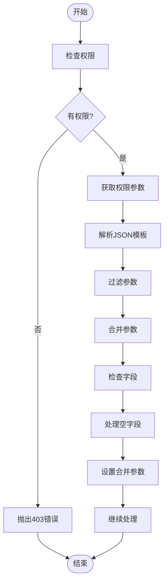

**图表来源**  
- [acl.ts](file://packages/core/acl/src/acl.ts#L495-L574)

## 权限继承与覆盖规则
NocoBase的权限系统支持复杂的权限继承和覆盖机制，确保权限配置的灵活性和可维护性。

### 权限继承
权限继承通过角色的策略配置实现，允许基础权限的复用：

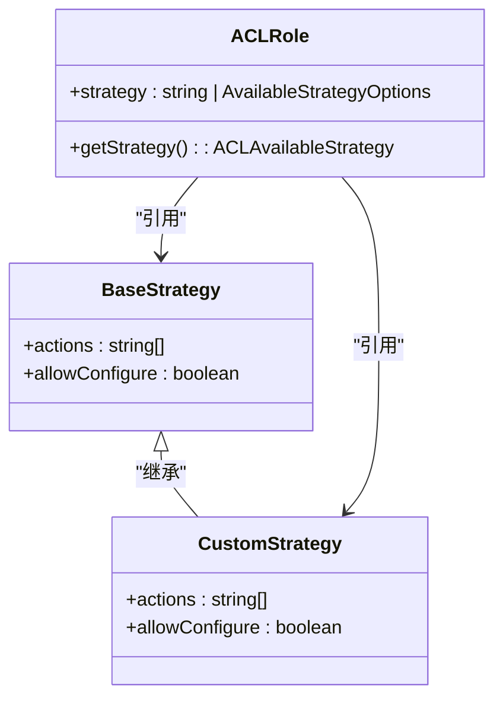

**图表来源**  
- [acl-available-strategy.ts](file://packages/core/acl/src/acl-available-strategy.ts#L34-L81)
- [acl-role.ts](file://packages/core/acl/src/acl-role.ts#L55-L67)

### 权限覆盖
权限覆盖通过资源动作的直接配置实现，允许对继承的权限进行精细化调整：

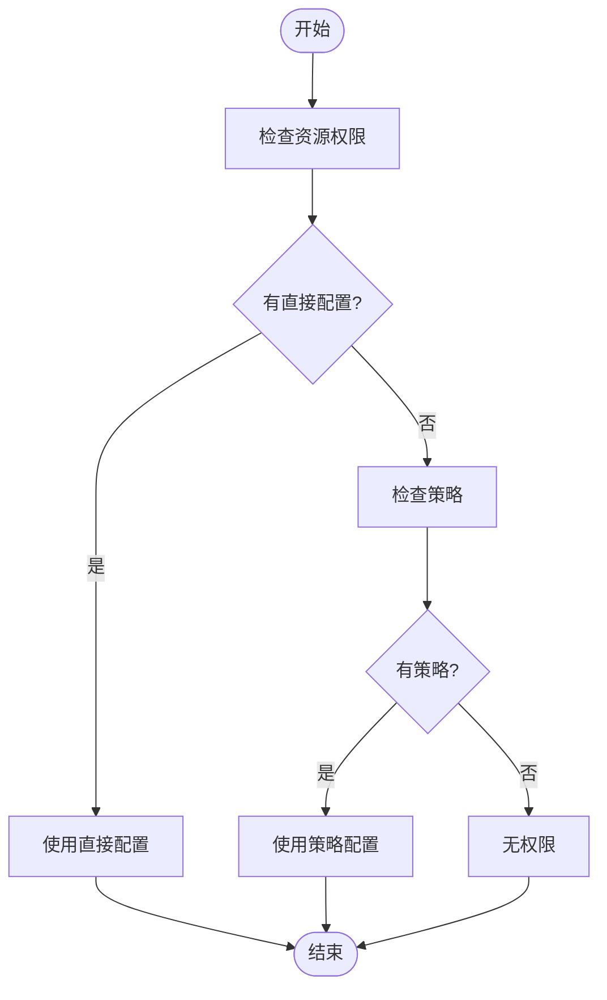

**图表来源**  
- [acl.ts](file://packages/core/acl/src/acl.ts#L278-L322)

## 自定义动作的权限策略配置
系统支持为自定义动作配置权限策略，通过可用动作定义和别名机制实现。

### 可用动作定义
通过setAvailableAction方法定义系统支持的动作：

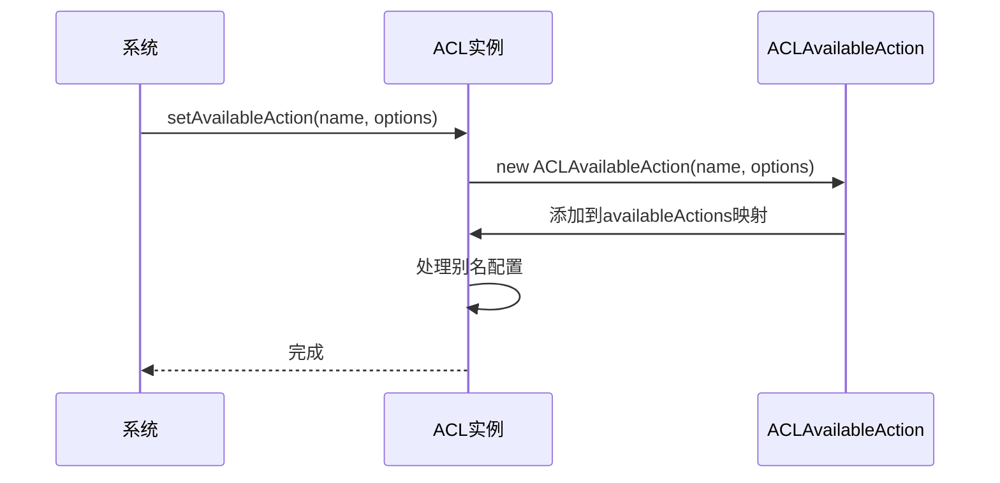

**图表来源**  
- [acl.ts](file://packages/core/acl/src/acl.ts#L182-L191)
- [acl-available-action.ts](file://packages/core/acl/src/acl-available-action.ts#L24-L26)

### 动作别名
系统支持为动作配置别名，提高配置的灵活性：

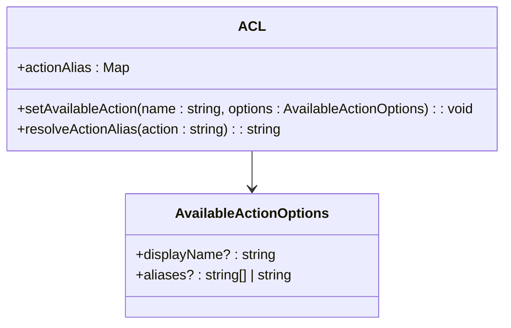

**图表来源**  
- [acl.ts](file://packages/core/acl/src/acl.ts#L90-L91)
- [acl-available-action.ts](file://packages/core/acl/src/acl-available-action.ts#L10-L22)

## 基于条件的动态权限控制
NocoBase支持基于条件的动态权限控制，通过条件函数和片段管理实现复杂的权限逻辑。

### 条件函数
系统内置了多种条件函数，支持动态权限判断：

```mermaid
classDiagram
class AllowManager {
+registeredCondition : Map<string, ConditionFunc>
+registerAllowCondition(name : string, condition : ConditionFunc) : void
+isAllowed(resourceName : string, actionName : string, ctx : any) : boolean
}
class ConditionFunc {
<<function>>
(ctx : any) : Promise<boolean> | boolean
}
AllowManager --> ConditionFunc
```

**图表来源**  
- [allow-manager.ts](file://packages/core/acl/src/allow-manager.ts#L14-L112)

### 片段管理
通过片段管理器实现基于模式匹配的权限控制：

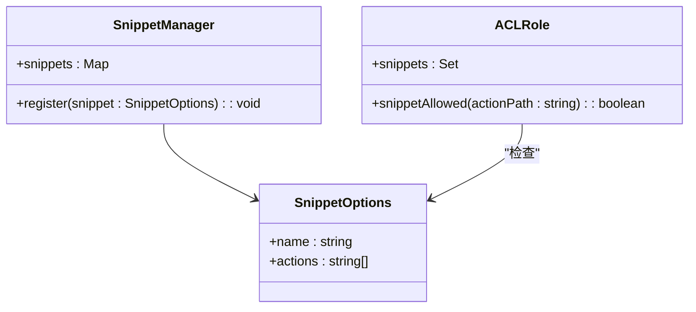

**图表来源**  
- [snippet-manager.ts](file://packages/core/acl/src/snippet-manager.ts)
- [acl-role.ts](file://packages/core/acl/src/acl-role.ts#L36-L40)