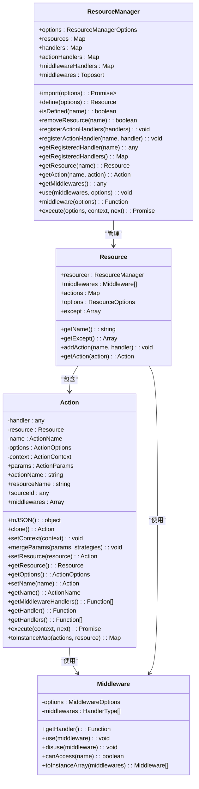
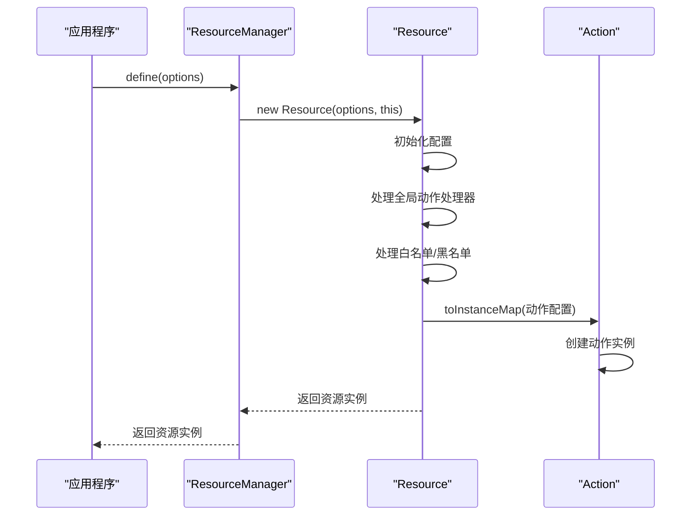
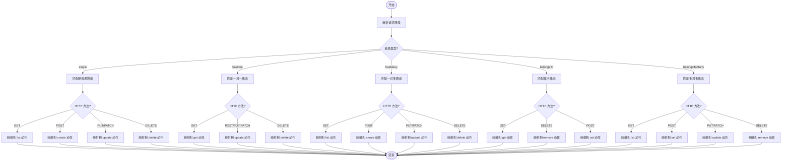
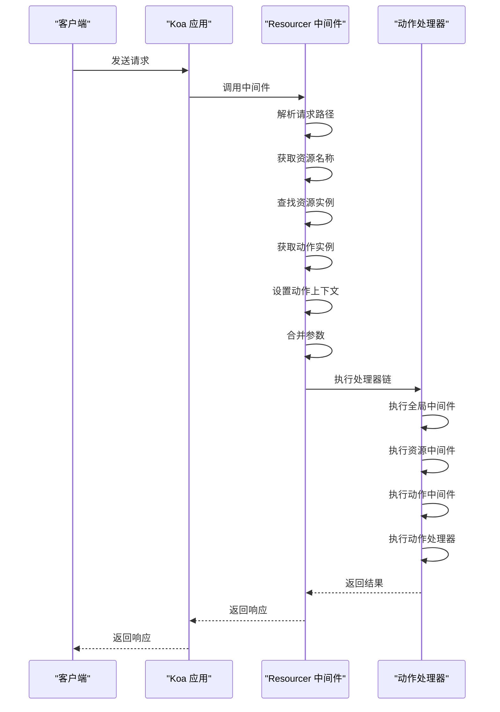
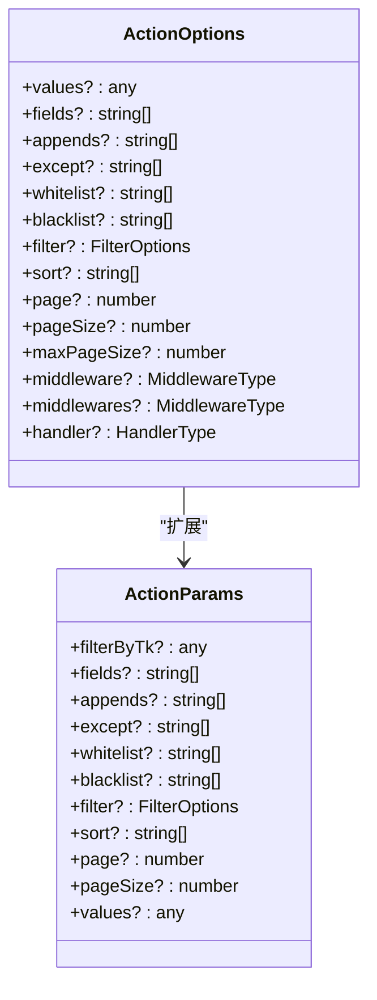
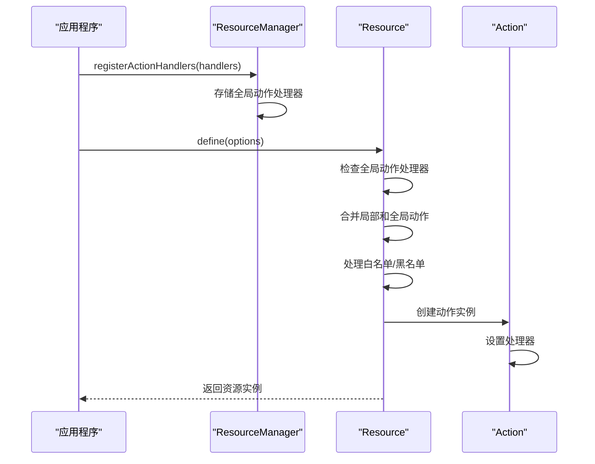
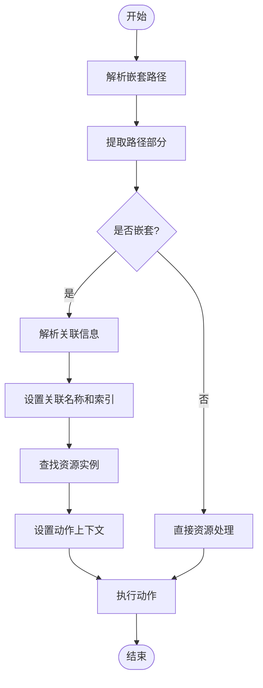

# API资源定义

<cite>
**本文档中引用的文件**  
- [Resourcer.ts](file://packages/core/resourcer/src/Resourcer.ts)
- [Resource.ts](file://packages/core/resourcer/src/Resource.ts)
- [Action.ts](file://packages/core/resourcer/src/Action.ts)
- [middleware.ts](file://packages/core/resourcer/src/middleware.ts)
- [utils.ts](file://packages/core/resourcer/src/utils.ts)
- [simple.ts](file://examples/app/resource-actions/simple.ts)
- [action-with-default-options.ts](file://examples/app/resource-actions/action-with-default-options.ts)
- [global-action.ts](file://examples/app/resource-actions/global-action.ts)
- [custom-plugin.ts](file://examples/app/custom-plugin.ts)
</cite>

## 目录
1. [简介](#简介)
2. [核心组件](#核心组件)
3. [资源注册机制](#资源注册机制)
4. [路由生成规则](#路由生成规则)
5. [请求处理流程](#请求处理流程)
6. [资源类结构与配置](#资源类结构与配置)
7. [内置动作实现原理](#内置动作实现原理)
8. [自定义动作扩展](#自定义动作扩展)
9. [资源继承与嵌套资源](#资源继承与嵌套资源)
10. [代码示例](#代码示例)

## 简介
NocoBase 的 Resourcer 模块提供了一套完整的 API 资源定义系统，将数据模型映射为 RESTful API 资源。该系统通过资源注册、路由生成和请求处理三个核心机制，实现了灵活的 API 定义和扩展能力。Resourcer 模块支持多种资源类型、内置动作和自定义扩展，为开发者提供了强大的 API 构建工具。

## 核心组件

Resourcer 模块由三个核心类组成：ResourceManager、Resource 和 Action。ResourceManager 是资源管理的顶层容器，负责管理所有资源实例和全局配置。Resource 表示一个具体的 API 资源，包含资源的配置、动作和中间件。Action 表示资源上的具体操作，如创建、读取、更新和删除等。



**图源**
- [Resourcer.ts](file://packages/core/resourcer/src/Resourcer.ts)
- [Resource.ts](file://packages/core/resourcer/src/Resource.ts)
- [Action.ts](file://packages/core/resourcer/src/Action.ts)
- [middleware.ts](file://packages/core/resourcer/src/middleware.ts)

**节源**
- [Resourcer.ts](file://packages/core/resourcer/src/Resourcer.ts#L161-L429)
- [Resource.ts](file://packages/core/resourcer/src/Resource.ts#L61-L123)
- [Action.ts](file://packages/core/resourcer/src/Action.ts#L212-L407)
- [middleware.ts](file://packages/core/resourcer/src/middleware.ts#L33-L92)

## 资源注册机制

Resourcer 模块提供了灵活的资源注册机制，支持通过配置对象或文件目录批量注册资源。ResourceManager 类的 define 方法用于注册单个资源，而 import 方法支持从指定目录批量导入资源配置。

资源注册时，系统会根据资源配置创建 Resource 实例，并将其存储在 ResourceManager 的 resources 映射中。每个资源都有唯一的名称，用于标识和访问。资源可以配置动作、中间件和类型等属性，这些配置在注册时被解析和验证。



**图源**
- [Resourcer.ts](file://packages/core/resourcer/src/Resourcer.ts#L211-L216)
- [Resource.ts](file://packages/core/resourcer/src/Resource.ts#L72-L90)

**节源**
- [Resourcer.ts](file://packages/core/resourcer/src/Resourcer.ts#L211-L216)
- [Resource.ts](file://packages/core/resourcer/src/Resource.ts#L72-L90)

## 路由生成规则

Resourcer 模块根据资源类型和 HTTP 方法自动生成 RESTful 路由。路由生成规则由 utils.ts 文件中的 parseRequest 函数实现，该函数解析请求路径并映射到相应的资源和动作。

系统支持多种资源类型，包括 single（单资源）、hasOne（一对一）、hasMany（一对多）、belongsTo（属于）和 belongsToMany（多对多）。每种资源类型都有对应的路由模式和动作映射。例如，single 类型的资源支持 /:resourceName 路径用于列表和创建操作，/:resourceName/:resourceIndex 路径用于详情、更新和删除操作。



**图源**
- [utils.ts](file://packages/core/resourcer/src/utils.ts#L55-L214)

**节源**
- [utils.ts](file://packages/core/resourcer/src/utils.ts#L55-L214)

## 请求处理流程

Resourcer 模块的请求处理流程由 middleware 方法实现，该方法返回一个 Koa 中间件函数。当请求到达时，中间件会解析请求路径，查找对应的资源和动作，然后执行动作处理器。

处理流程包括：解析请求路径获取资源和动作信息、验证资源是否存在、创建动作上下文、合并请求参数和配置参数、执行中间件链和动作处理器。整个流程通过 Koa 的 compose 函数实现，确保中间件和处理器按正确顺序执行。



**图源**
- [Resourcer.ts](file://packages/core/resourcer/src/Resourcer.ts#L311-L391)

**节源**
- [Resourcer.ts](file://packages/core/resourcer/src/Resourcer.ts#L311-L391)

## 资源类结构与配置

Resource 类是 API 资源的核心表示，包含资源的配置、动作和中间件。资源配置通过 ResourceOptions 接口定义，支持名称、类型、动作、白名单、黑名单和中间件等属性。

资源名称是资源的唯一标识，用于路由和访问。资源类型决定资源的路由模式和关联行为，支持 single、hasOne、hasMany、belongsTo 和 belongsToMany 五种类型。动作配置允许为资源定义特定的操作处理器，可以是函数、配置对象或模块路径。

```mermaid
classDiagram
class ResourceOptions {
+name : string
+type? : ResourceType
+actions? : { [key : string] : ActionType }
+only? : Array<ActionName>
+except? : Array<ActionName>
+middleware? : MiddlewareType
+middlewares? : MiddlewareType
}
class ResourceType {
<<enumeration>>
single
hasOne
hasMany
belongsTo
belongsToMany
}
class ActionType {
<<enumeration>>
string
HandlerType
ActionOptions
}
ResourceOptions --> ResourceType : "引用"
ResourceOptions --> ActionType : "引用"
```

**图源**
- [Resource.ts](file://packages/core/resourcer/src/Resource.ts#L17-L59)

**节源**
- [Resource.ts](file://packages/core/resourcer/src/Resource.ts#L17-L59)

## 内置动作实现原理

Resourcer 模块提供了一系列内置动作，包括 list、create、get、update、destroy、set、add 和 remove。这些动作通过 Action 类实现，每个动作都有默认的处理器和参数配置。

内置动作的实现基于 Koa 中间件模式，动作处理器作为中间件函数执行。动作支持丰富的参数配置，如 fields（字段过滤）、filter（查询过滤）、sort（排序）、page（分页）等。参数配置支持客户端参数和服务器端默认参数的合并。



**图源**
- [Action.ts](file://packages/core/resourcer/src/Action.ts#L54-L125)

**节源**
- [Action.ts](file://packages/core/resourcer/src/Action.ts#L54-L125)

## 自定义动作扩展

Resourcer 模块支持灵活的自定义动作扩展，允许开发者为资源添加新的操作。自定义动作可以通过资源配置的 actions 属性直接定义，也可以通过全局动作注册机制共享。

全局动作注册通过 ResourceManager 的 registerActionHandlers 方法实现，注册的动作可以在任何资源中使用。局部动作则通过资源配置的 actions 属性定义，仅在特定资源中可用。动作处理器可以是函数、配置对象或模块路径。



**图源**
- [Resourcer.ts](file://packages/core/resourcer/src/Resourcer.ts#L252-L261)
- [Resource.ts](file://packages/core/resourcer/src/Resource.ts#L78-L82)

**节源**
- [Resourcer.ts](file://packages/core/resourcer/src/Resourcer.ts#L252-L261)
- [Resource.ts](file://packages/core/resourcer/src/Resource.ts#L78-L82)

## 资源继承与嵌套资源

Resourcer 模块支持资源继承和嵌套资源，允许构建复杂的资源关系。资源继承通过资源类型实现，不同类型的资源有不同的路由模式和动作映射。嵌套资源通过关联名称和索引实现，支持多层嵌套。

嵌套资源的路由格式为 /:associatedName/:associatedIndex/:resourceName，系统会自动解析关联信息并设置到动作上下文中。这种机制支持复杂的业务场景，如用户的文章列表、订单的商品详情等。



**图源**
- [utils.ts](file://packages/core/resourcer/src/utils.ts#L75-L89)
- [Resourcer.ts](file://packages/core/resourcer/src/Resourcer.ts#L340-L359)

**节源**
- [utils.ts](file://packages/core/resourcer/src/utils.ts#L75-L89)
- [Resourcer.ts](file://packages/core/resourcer/src/Resourcer.ts#L340-L359)

## 代码示例

以下示例展示了如何定义和注册自定义 API 资源，以及如何通过插件扩展现有资源功能。

### 简单资源定义
```typescript
app.resource({
  name: 'test',
  actions: {
    async list(ctx, next) {
      ctx.body = 'test list';
      await next();
    },
  },
});
```

### 带默认参数的动作
```typescript
app.resource({
  name: 'test',
  actions: {
    find: {
      filter: {
        field1: 'value1',
      },
      handler: async (ctx, next) => {
        ctx.body = {
          'ctx.action.params': ctx.action.params,
        };
        await next();
      },
    },
  },
});
```

### 全局动作注册
```typescript
app.resourcer.registerActionHandlers({
  async import(ctx, next) {
    ctx.body = {
      'ctx.action.params': ctx.action.params,
    };
    await next();
  },
  async export(ctx, next) {
    ctx.body = {
      'ctx.action.params': ctx.action.params,
    };
    await next();
  },
});
```

### 插件中定义资源
```typescript
class MyPlugin extends Plugin {
  async load() {
    this.app.resource({
      name: 'test',
      actions: {
        async list(ctx) {
          ctx.body = 'test list';
        },
      },
    });
  }
}
```

**节源**
- [simple.ts](file://examples/app/resource-actions/simple.ts#L33-L41)
- [action-with-default-options.ts](file://examples/app/resource-actions/action-with-default-options.ts#L33-L48)
- [global-action.ts](file://examples/app/resource-actions/global-action.ts#L38-L62)
- [custom-plugin.ts](file://examples/app/custom-plugin.ts#L40-L47)