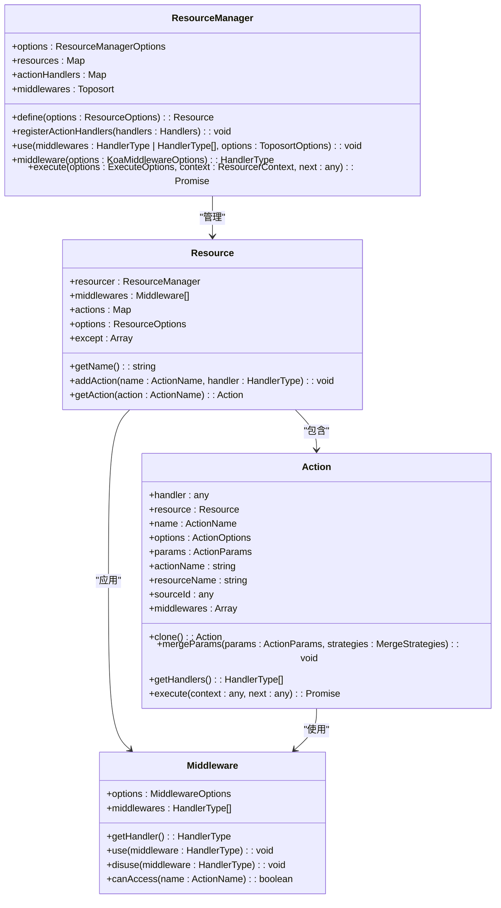
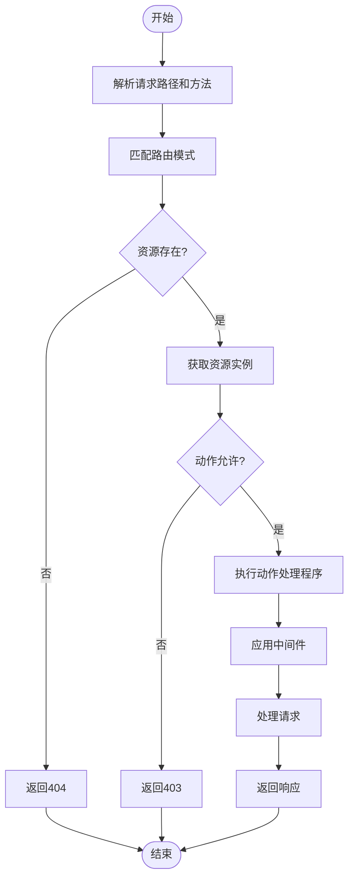
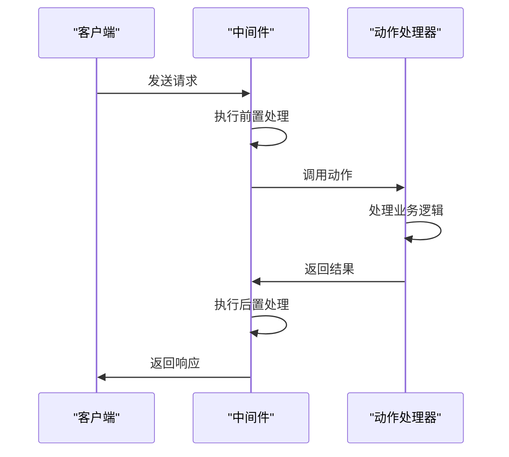
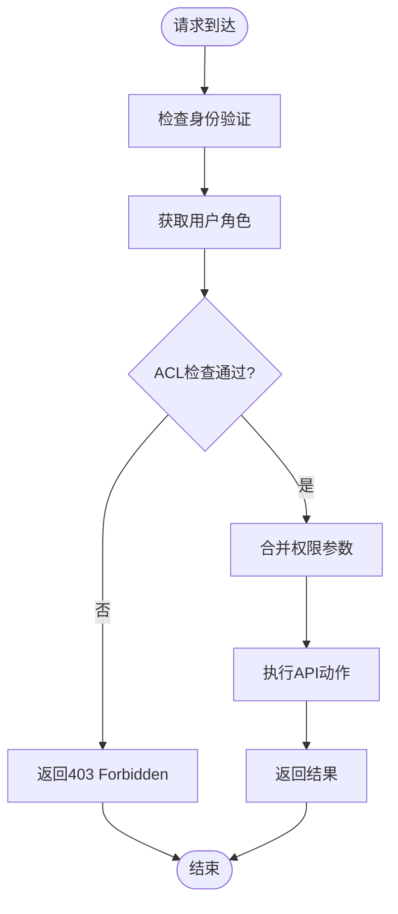

# API资源管理

<cite>
**本文档中引用的文件**  
- [index.ts](file://packages/core/resourcer/src/index.ts)
- [Resourcer.ts](file://packages/core/resourcer/src/Resourcer.ts)
- [Resource.ts](file://packages/core/resourcer/src/Resource.ts)
- [Action.ts](file://packages/core/resourcer/src/Action.ts)
- [middleware.ts](file://packages/core/resourcer/src/middleware.ts)
- [utils.ts](file://packages/core/resourcer/src/utils.ts)
- [simple.ts](file://examples/app/resource-actions/simple.ts)
- [action-with-default-options.ts](file://examples/app/resource-actions/action-with-default-options.ts)
- [global-action.ts](file://examples/app/resource-actions/global-action.ts)
- [action-merge-params.ts](file://examples/app/resource-actions/action-merge-params.ts)
- [acl.ts](file://examples/app/acl.ts)
</cite>

## 目录
1. [简介](#简介)
2. [核心组件](#核心组件)
3. [资源注册与路由定义](#资源注册与路由定义)
4. [数据操作动作实现](#数据操作动作实现)
5. [API权限控制](#api权限控制)
6. [API版本控制与自定义动作](#api版本控制与自定义动作)
7. [API性能优化](#api性能优化)
8. [实际应用示例](#实际应用示例)
9. [结论](#结论)

## 简介

NocoBase的API资源管理模块（Resourcer）是一个强大的系统，用于将数据模型暴露为RESTful API。该模块通过统一的接口和配置方式，实现了资源的注册、路由的自动映射、请求的处理以及权限的控制。Resourcer模块基于Koa框架构建，利用中间件机制实现了灵活的请求处理流程。

Resourcer模块的核心设计理念是将数据模型与API端点进行映射，通过声明式的方式定义资源及其操作。每个资源可以定义多种动作（如create、list、get、update、destroy等），这些动作对应于不同的HTTP请求方法和路径。模块还支持全局动作的注册，使得常用的操作可以在多个资源间共享。

**Section sources**
- [Resourcer.ts](file://packages/core/resourcer/src/Resourcer.ts#L1-L430)
- [Resource.ts](file://packages/core/resourcer/src/Resource.ts#L1-L126)

## 核心组件

Resourcer模块由几个核心组件构成：ResourceManager、Resource、Action和Middleware。这些组件共同协作，实现了API资源的完整管理功能。

ResourceManager是整个模块的入口点，负责管理所有注册的资源。它提供了资源注册、中间件注册、全局动作注册等功能。Resource代表一个具体的API资源，包含资源名称、类型和可用的动作。Action定义了资源上的具体操作，如创建、读取、更新和删除等。Middleware则用于在请求处理过程中插入自定义逻辑，如权限验证、日志记录等。

这些组件之间的关系是层次化的：ResourceManager管理多个Resource，每个Resource包含多个Action，并可以应用Middleware来增强其功能。这种设计使得API的结构清晰，易于维护和扩展。



**Diagram sources **
- [Resourcer.ts](file://packages/core/resourcer/src/Resourcer.ts#L161-L427)
- [Resource.ts](file://packages/core/resourcer/src/Resource.ts#L61-L123)
- [Action.ts](file://packages/core/resourcer/src/Action.ts#L212-L407)
- [middleware.ts](file://packages/core/resourcer/src/middleware.ts#L33-L92)

**Section sources**
- [Resourcer.ts](file://packages/core/resourcer/src/Resourcer.ts#L161-L427)
- [Resource.ts](file://packages/core/resourcer/src/Resource.ts#L61-L123)
- [Action.ts](file://packages/core/resourcer/src/Action.ts#L212-L407)
- [middleware.ts](file://packages/core/resourcer/src/middleware.ts#L33-L92)

## 资源注册与路由定义

Resourcer模块通过ResourceManager的`define`方法来注册资源。每个资源需要提供一个唯一的名称和可选的配置选项。资源的配置包括其类型（如single、hasOne、hasMany等）、可用的动作以及中间件。

路由的定义是自动完成的，基于资源名称和动作名称生成相应的API端点。模块使用path-to-regexp库来解析请求路径，并根据HTTP方法和路径模式匹配相应的资源和动作。例如，对名为"users"的资源的列表请求将映射到`/users`路径的GET请求。

资源还可以通过`import`方法从指定目录下的配置文件中批量导入。这使得资源的配置可以分散在多个文件中，便于大型项目的管理。导入时支持多种文件格式（js、ts、json），并会自动处理模块的加载。



**Diagram sources **
- [Resourcer.ts](file://packages/core/resourcer/src/Resourcer.ts#L311-L391)
- [utils.ts](file://packages/core/resourcer/src/utils.ts#L55-L213)

**Section sources**
- [Resourcer.ts](file://packages/core/resourcer/src/Resourcer.ts#L211-L216)
- [utils.ts](file://packages/core/resourcer/src/utils.ts#L55-L213)

## 数据操作动作实现

Resourcer模块支持多种标准的数据操作动作，包括create、list、get、update和destroy。每个动作对应于特定的HTTP方法和业务逻辑。动作的实现通过Action类来定义，可以是简单的函数，也可以是包含多个配置选项的复杂对象。

动作的配置选项包括默认值、字段过滤、排序规则、分页参数等。这些选项可以在资源定义时设置，也可以在运行时通过请求参数覆盖。例如，list动作可以配置默认的排序字段和每页显示数量，同时允许客户端通过查询参数修改这些设置。

动作的执行是通过中间件堆栈完成的。当一个请求匹配到特定的动作时，相关的中间件会按顺序执行，最后调用动作的处理函数。这种设计使得可以在动作执行前后插入自定义逻辑，如数据验证、日志记录或缓存处理。



**Diagram sources **
- [Action.ts](file://packages/core/resourcer/src/Action.ts#L384-L386)
- [Resourcer.ts](file://packages/core/resourcer/src/Resourcer.ts#L386-L386)

**Section sources**
- [Action.ts](file://packages/core/resourcer/src/Action.ts#L124-L210)
- [Resourcer.ts](file://packages/core/resourcer/src/Resourcer.ts#L406-L411)

## API权限控制

API权限控制是通过ACL（访问控制列表）系统实现的。ACL系统允许为不同的角色定义对资源和动作的访问权限。权限配置可以包括允许的字段、过滤条件等，从而实现细粒度的访问控制。

权限控制通过中间件机制集成到请求处理流程中。当一个请求到达时，ACL中间件会检查当前用户的角色，并根据预定义的权限规则决定是否允许访问。如果允许，还会将权限相关的参数合并到动作参数中，影响最终的数据查询和返回。

权限系统支持跳过检查的机制，允许在特定情况下绕过权限验证。这在实现某些公共API或调试功能时非常有用。同时，系统也支持动态权限计算，可以根据请求上下文实时决定访问权限。



**Diagram sources **
- [acl.ts](file://examples/app/acl.ts#L31-L38)
- [action-merge-params.ts](file://examples/app/resource-actions/action-merge-params.ts#L44-L61)

**Section sources**
- [acl.ts](file://examples/app/acl.ts#L31-L38)
- [action-merge-params.ts](file://examples/app/resource-actions/action-merge-params.ts#L44-L61)

## API版本控制与自定义动作

Resourcer模块支持API版本控制，可以通过在资源路径中包含版本号来实现。例如，`/v1/users`和`/v2/users`可以指向同一资源的不同版本。版本控制使得可以在不影响现有客户端的情况下引入新的API功能。

自定义动作的实现非常灵活。除了标准的CRUD动作外，开发者可以定义任意名称的自定义动作。这些动作可以注册为全局动作，供所有资源使用，也可以作为特定资源的私有动作。自定义动作的处理函数可以执行任何业务逻辑，从简单的数据转换到复杂的业务流程。

动作名称的映射是可配置的，允许使用自定义的访问器名称。例如，可以将"delete"动作映射为"remove"，或将"update"动作映射为"edit"。这种灵活性使得API的设计可以更好地匹配业务术语和用户习惯。

**Section sources**
- [Resourcer.ts](file://packages/core/resourcer/src/Resourcer.ts#L28-L76)
- [global-action.ts](file://examples/app/resource-actions/global-action.ts#L38-L51)

## API性能优化

API性能优化主要通过响应缓存、请求节流和错误处理策略来实现。响应缓存可以显著减少数据库查询次数，提高API的响应速度。缓存策略可以根据资源和动作的特性进行配置，如对读取操作启用缓存，对写入操作禁用缓存。

请求节流用于防止API被过度使用或滥用。通过限制单位时间内的请求数量，可以保护服务器资源，防止DDoS攻击。节流策略可以根据客户端IP、用户身份或API密钥进行配置，实现细粒度的流量控制。

错误处理策略确保API在出现异常时能够返回有意义的错误信息，同时保护系统的安全。错误处理中间件可以捕获未处理的异常，记录详细的错误日志，并返回标准化的错误响应。这有助于客户端开发者快速定位和解决问题，同时防止敏感信息泄露。

**Section sources**
- [middleware.ts](file://packages/core/resourcer/src/middleware.ts#L15-L31)
- [Action.ts](file://packages/core/resourcer/src/Action.ts#L384-L390)

## 实际应用示例

以下是一些实际应用示例，展示了如何使用Resourcer模块来定义和使用API资源。

最简单的资源定义只需要提供资源名称和动作处理函数。例如，一个返回静态消息的测试资源可以这样定义：

```typescript
app.resource({
  name: 'test',
  actions: {
    async list(ctx, next) {
      ctx.body = 'test list';
      await next();
    },
  },
});
```

带默认参数的动作定义允许在配置中设置默认的过滤条件、字段列表等。这些默认值可以在运行时被客户端请求参数覆盖：

```typescript
app.resource({
  name: 'test',
  actions: {
    find: {
      filter: {
        field1: 'value1',
      },
      handler: async (ctx, next) => {
        ctx.body = {
          'ctx.action.params': ctx.action.params,
        };
        await next();
      },
    },
  },
});
```

全局动作的注册使得常用的操作可以在多个资源间共享。例如，导入和导出功能可以定义为全局动作，然后在需要的资源中启用：

```typescript
app.resourcer.registerActionHandlers({
  async import(ctx, next) {
    ctx.body = {
      'ctx.action.params': ctx.action.params,
    };
    await next();
  },
  async export(ctx, next) {
    ctx.body = {
      'ctx.action.params': ctx.action.params,
    };
    await next();
  },
});
```

动作参数的多来源合并展示了如何从不同来源（中间件、ACL、客户端请求等）合并参数。这种机制使得权限控制、默认配置和用户输入可以协同工作：

```typescript
app.resourcer.use(async (ctx, next) => {
  ctx.action.mergeParams({
    filter: {
      col1: 'val1',
    },
    fields: ['col1', 'col2', 'col4'],
  });
  await next();
});
```

**Section sources**
- [simple.ts](file://examples/app/resource-actions/simple.ts#L33-L41)
- [action-with-default-options.ts](file://examples/app/resource-actions/action-with-default-options.ts#L33-L47)
- [global-action.ts](file://examples/app/resource-actions/global-action.ts#L38-L62)
- [action-merge-params.ts](file://examples/app/resource-actions/action-merge-params.ts#L33-L85)

## 结论

NocoBase的API资源管理模块提供了一个强大而灵活的框架，用于构建RESTful API。通过ResourceManager、Resource、Action和Middleware等核心组件的协作，实现了资源的声明式定义、自动路由映射和统一的请求处理。

该模块的设计充分考虑了实际应用的需求，支持细粒度的权限控制、灵活的自定义动作和多种性能优化策略。通过示例代码可以看出，无论是简单的CRUD操作还是复杂的业务逻辑，都可以通过一致的接口和配置方式来实现。

未来的发展方向可能包括更智能的缓存策略、更强大的查询语言支持以及更好的开发者工具集成。总体而言，Resourcer模块为构建现代化的API服务提供了一个坚实的基础。