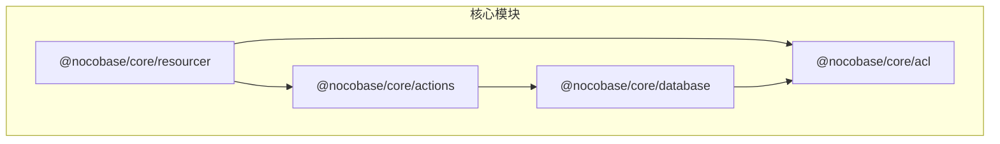
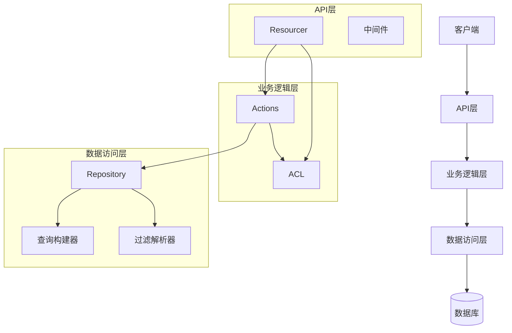
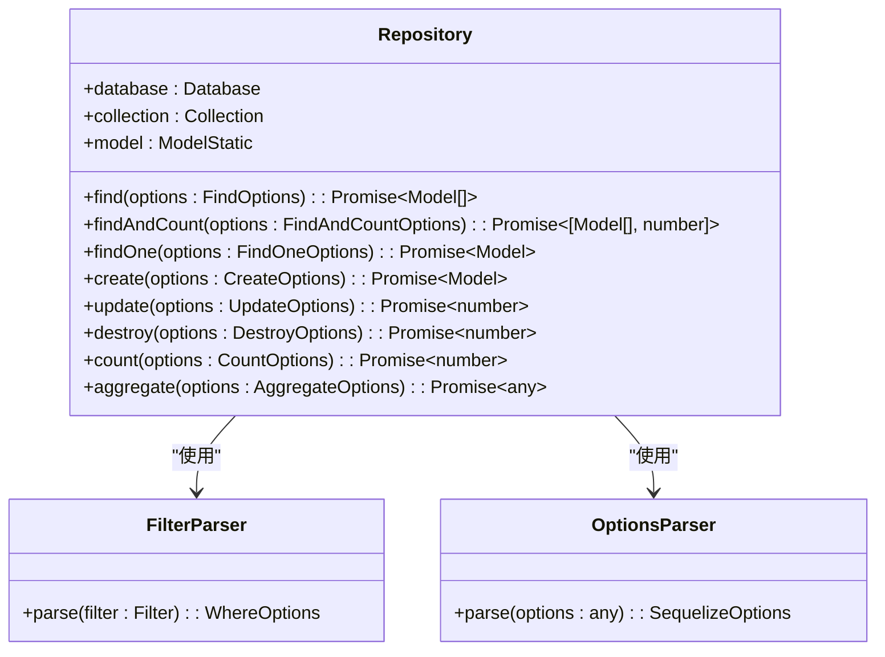
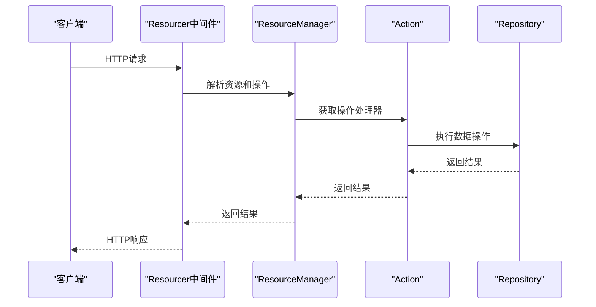
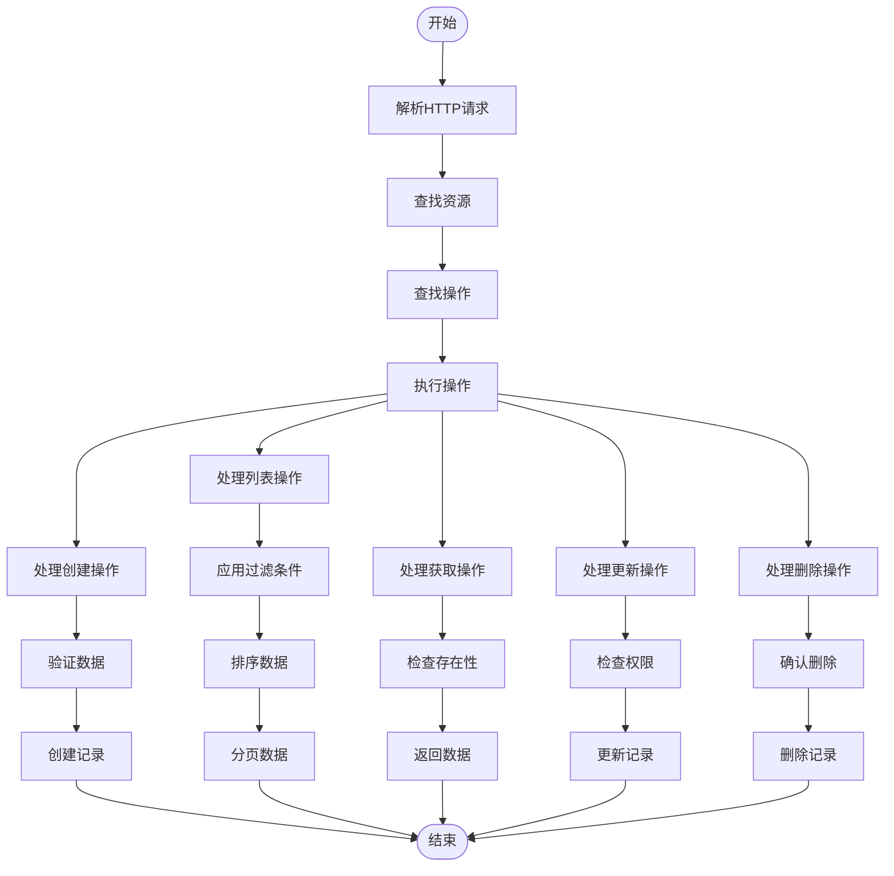
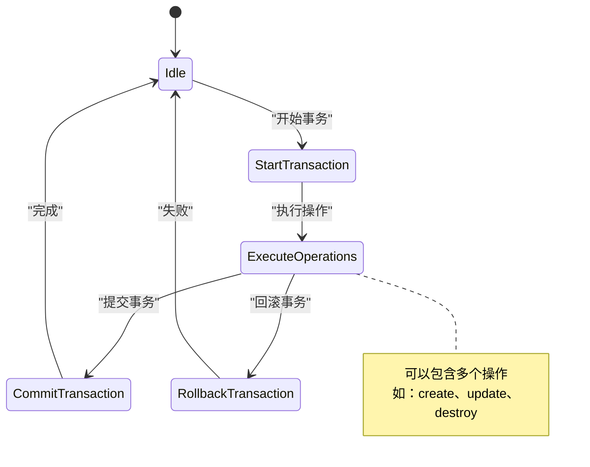
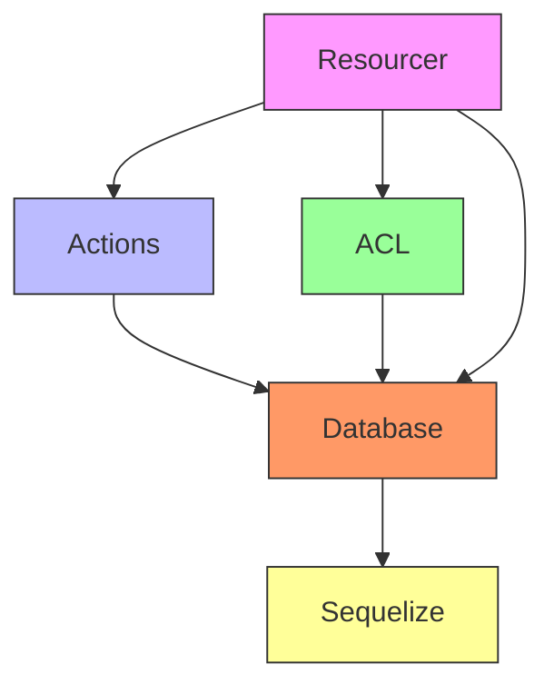
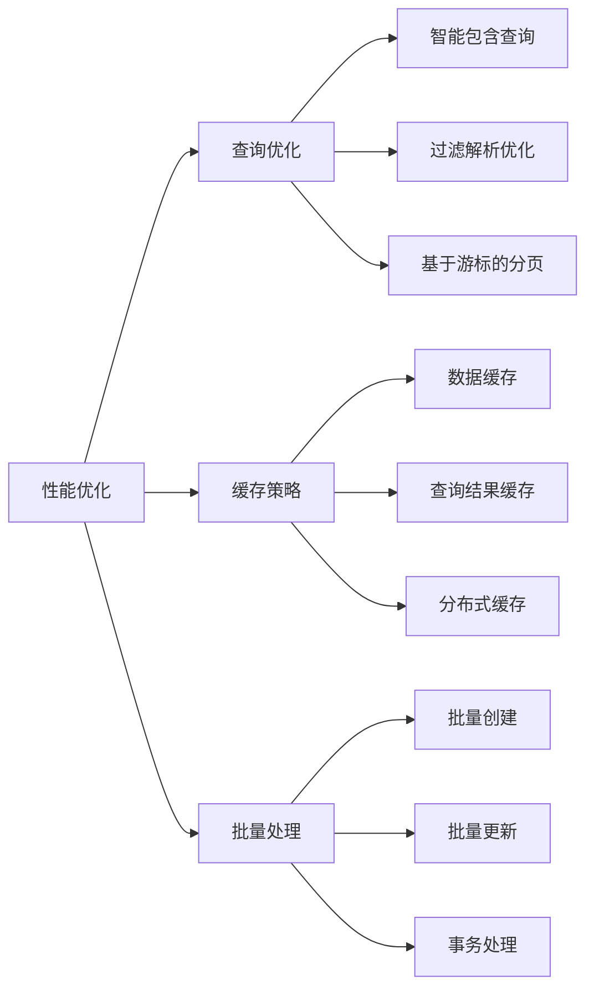

# 数据操作API

<cite>
**本文档引用的文件**
- [index.ts](file://packages/core/resourcer/src/index.ts)
- [resourcer.ts](file://packages/core/resourcer/src/resourcer.ts)
- [index.ts](file://packages/core/actions/src/index.ts)
- [repository.ts](file://packages/core/database/src/repository.ts)
- [index.ts](file://packages/core/database/src/index.ts)
- [acl.ts](file://packages/core/acl/src/acl.ts)
- [create.ts](file://packages/core/actions/src/actions/create.ts)
- [list.ts](file://packages/core/actions/src/actions/list.ts)
- [get.ts](file://packages/core/actions/src/actions/get.ts)
- [update.ts](file://packages/core/actions/src/actions/update.ts)
- [destroy.ts](file://packages/core/actions/src/actions/destroy.ts)
</cite>

## 目录
1. [简介](#简介)
2. [项目结构](#项目结构)
3. [核心组件](#核心组件)
4. [架构概述](#架构概述)
5. [详细组件分析](#详细组件分析)
6. [依赖分析](#依赖分析)
7. [性能考虑](#性能考虑)
8. [故障排除指南](#故障排除指南)
9. [结论](#结论)

## 简介
NocoBase提供了一套全面的数据操作API系统，通过Repository模式实现CRUD操作，并通过Resourcer模块将这些操作暴露为RESTful API。本系统集成了查询构建器、过滤条件、排序和分页功能，同时提供了批量操作、事务处理和数据导入导出能力。API权限控制基于ACL（访问控制列表）实现，确保数据安全。系统还包含性能优化策略，如查询优化、缓存策略和批量处理最佳实践。

## 项目结构
NocoBase的数据操作API系统主要由几个核心包组成：`@nocobase/core/resourcer`负责将数据操作暴露为RESTful API，`@nocobase/core/actions`定义了各种数据操作动作，`@nocobase/core/database`提供了底层的数据访问和操作功能，`@nocobase/core/acl`实现了API权限控制。



**Diagram sources**
- [resourcer.ts](file://packages/core/resourcer/src/resourcer.ts)
- [index.ts](file://packages/core/actions/src/index.ts)
- [repository.ts](file://packages/core/database/src/repository.ts)
- [acl.ts](file://packages/core/acl/src/acl.ts)

**Section sources**
- [index.ts](file://packages/core/resourcer/src/index.ts)
- [index.ts](file://packages/core/actions/src/index.ts)
- [index.ts](file://packages/core/database/src/index.ts)
- [index.ts](file://packages/core/acl/src/index.ts)

## 核心组件
NocoBase数据操作API的核心组件包括Resourcer、Action、Repository和ACL系统。Resourcer是API层的核心，负责将HTTP请求映射到具体的数据操作。Action定义了各种数据操作的逻辑，如create、list、get、update和destroy。Repository提供了对数据库的抽象访问，封装了查询构建、过滤、排序和分页等功能。ACL系统实现了基于角色的访问控制，确保只有授权用户才能执行特定操作。

**Section sources**
- [resourcer.ts](file://packages/core/resourcer/src/resourcer.ts)
- [index.ts](file://packages/core/actions/src/index.ts)
- [repository.ts](file://packages/core/database/src/repository.ts)
- [acl.ts](file://packages/core/acl/src/acl.ts)

## 架构概述
NocoBase数据操作API采用分层架构设计，从上到下分为API层、业务逻辑层和数据访问层。API层由Resourcer模块实现，负责处理HTTP请求和响应。业务逻辑层由Actions模块组成，定义了各种数据操作的具体实现。数据访问层由Database模块提供，通过Repository模式封装了对数据库的访问。



**Diagram sources**
- [resourcer.ts](file://packages/core/resourcer/src/resourcer.ts)
- [index.ts](file://packages/core/actions/src/index.ts)
- [repository.ts](file://packages/core/database/src/repository.ts)

## 详细组件分析

### 数据操作实现机制
NocoBase通过Repository模式实现数据操作，提供了丰富的查询构建器、过滤条件、排序和分页功能。Repository类封装了对数据库的访问，提供了find、findAndCount、create、update、destroy等方法。



**Diagram sources**
- [repository.ts](file://packages/core/database/src/repository.ts)
- [filter-parser.ts](file://packages/core/database/src/filter-parser.ts)
- [options-parser.ts](file://packages/core/database/src/options-parser.ts)

**Section sources**
- [repository.ts](file://packages/core/database/src/repository.ts)

### Resourcer模块分析
Resourcer模块负责将数据操作暴露为RESTful API，通过中间件将HTTP请求映射到具体的数据操作。它支持自定义路由、前缀和action名称，并提供了灵活的中间件机制。



**Diagram sources**
- [resourcer.ts](file://packages/core/resourcer/src/resourcer.ts)
- [action.ts](file://packages/core/resourcer/src/action.ts)
- [repository.ts](file://packages/core/database/src/repository.ts)

**Section sources**
- [resourcer.ts](file://packages/core/resourcer/src/resourcer.ts)

### 数据操作动作配置
NocoBase支持多种数据操作动作，包括create、list、get、update和destroy等。这些动作通过Actions模块定义，并可以通过配置进行定制。



**Diagram sources**
- [index.ts](file://packages/core/actions/src/index.ts)
- [create.ts](file://packages/core/actions/src/actions/create.ts)
- [list.ts](file://packages/core/actions/src/actions/list.ts)
- [get.ts](file://packages/core/actions/src/actions/get.ts)
- [update.ts](file://packages/core/actions/src/actions/update.ts)
- [destroy.ts](file://packages/core/actions/src/actions/destroy.ts)

**Section sources**
- [index.ts](file://packages/core/actions/src/index.ts)

### 批量操作与事务处理
NocoBase支持批量操作和事务处理，确保数据的一致性和完整性。批量操作通过createMany和updateMany方法实现，事务处理通过@transaction装饰器实现。



**Diagram sources**
- [repository.ts](file://packages/core/database/src/repository.ts)
- [transaction-decorator.ts](file://packages/core/database/src/decorators/transaction-decorator.ts)

**Section sources**
- [repository.ts](file://packages/core/database/src/repository.ts)

### API权限控制
NocoBase的API权限控制基于ACL（访问控制列表）实现，通过角色和策略定义访问权限。ACL系统与Resourcer和Actions模块集成，确保只有授权用户才能执行特定操作。

```mermaid
erDiagram
USER {
string id PK
string username
string email
}
ROLE {
string id PK
string name
string description
}
PERMISSION {
string id PK
string action
string resource
json strategy
}
USER ||--o{ ROLE : "拥有"
ROLE ||--o{ PERMISSION : "包含"
note over ROLE,PERMISSION
角色包含多个权限
权限定义了对资源的操作和策略
end note
```

**Diagram sources**
- [acl.ts](file://packages/core/acl/src/acl.ts)
- [acl-role.ts](file://packages/core/acl/src/acl-role.ts)
- [acl-resource.ts](file://packages/core/acl/src/acl-resource.ts)

**Section sources**
- [acl.ts](file://packages/core/acl/src/acl.ts)

## 依赖分析
NocoBase数据操作API系统的组件之间存在明确的依赖关系。Resourcer依赖于Actions和ACL，Actions依赖于Database，Database依赖于Sequelize等底层库。



**Diagram sources**
- [resourcer.ts](file://packages/core/resourcer/src/resourcer.ts)
- [index.ts](file://packages/core/actions/src/index.ts)
- [repository.ts](file://packages/core/database/src/repository.ts)
- [acl.ts](file://packages/core/acl/src/acl.ts)

**Section sources**
- [resourcer.ts](file://packages/core/resourcer/src/resourcer.ts)
- [index.ts](file://packages/core/actions/src/index.ts)
- [repository.ts](file://packages/core/database/src/repository.ts)
- [acl.ts](file://packages/core/acl/src/acl.ts)

## 性能考虑
NocoBase数据操作API系统包含多种性能优化策略。对于大数据集，系统提供了基于游标的分页查询（chunkWithCursor），避免了传统分页的性能问题。查询优化方面，系统支持智能的包含查询（eager loading）和过滤解析。缓存策略通过Cache模块实现，可以缓存频繁访问的数据。



**Diagram sources**
- [repository.ts](file://packages/core/database/src/repository.ts)
- [cursor-builder.ts](file://packages/core/database/src/cursor-builder.ts)
- [eager-loading-tree.ts](file://packages/core/database/src/eager-loading/eager-loading-tree.ts)
- [cache.ts](file://packages/core/cache/src/index.ts)

## 故障排除指南
在使用NocoBase数据操作API时，可能会遇到一些常见问题。对于权限问题，需要检查ACL配置是否正确。对于性能问题，建议使用基于游标的分页处理大数据集。对于数据一致性问题，应确保在需要时使用事务处理。

**Section sources**
- [acl.ts](file://packages/core/acl/src/acl.ts)
- [repository.ts](file://packages/core/database/src/repository.ts)

## 结论
NocoBase数据操作API系统提供了一套完整、灵活且安全的数据操作解决方案。通过Repository模式和Resourcer模块，系统实现了从数据库访问到RESTful API暴露的完整链条。ACL系统确保了数据的安全访问，而丰富的性能优化策略则保证了系统的高效运行。这套系统既适合简单的CRUD操作，也能满足复杂的业务需求。