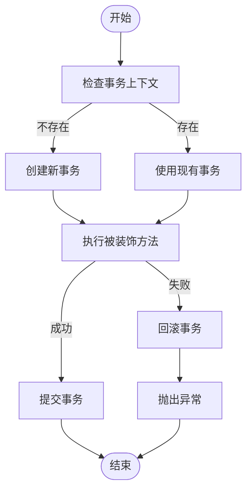
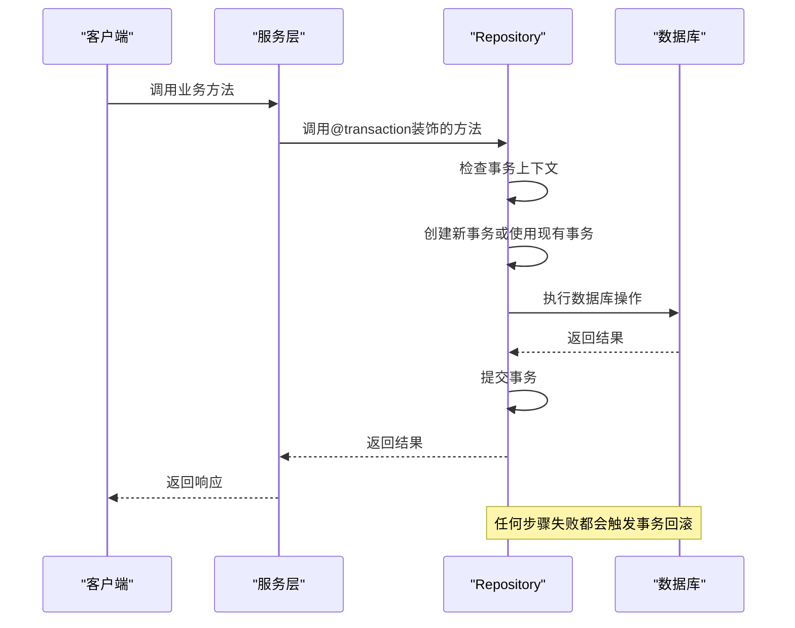
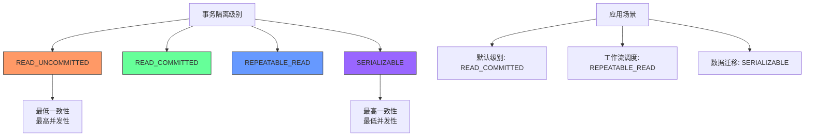
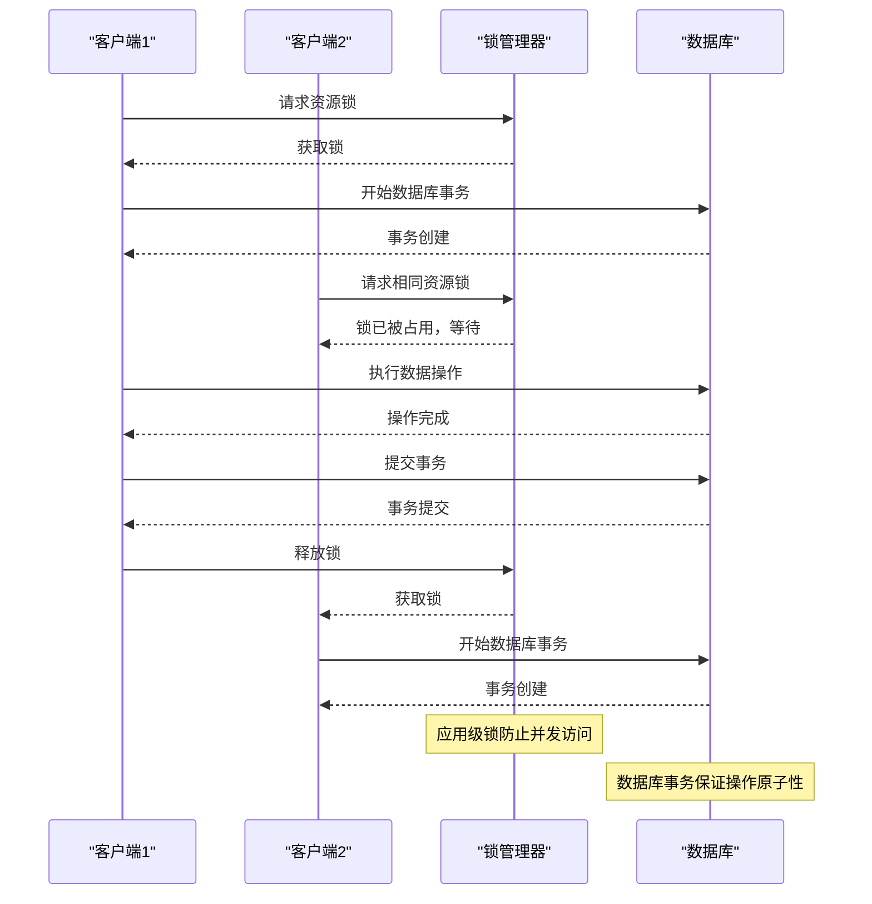

# 事务管理

<cite>
**本文档引用的文件**   
- [transaction-decorator.ts](file://packages/core/database/src/decorators/transaction-decorator.ts)
- [repository.ts](file://packages/core/database/src/repository.ts)
- [relation-repository.ts](file://packages/core/database/src/relation-repository/relation-repository.ts)
- [Dispatcher.ts](file://packages/plugins/@nocobase/plugin-workflow/src/server/Dispatcher.ts)
- [change-table-name.ts](file://packages/plugins/@nocobase/plugin-workflow-manual/src/server/migrations/20250316100513-change-table-name.ts)
- [ui-schema-storage/repository.ts](file://packages/plugins/@nocobase/plugin-ui-schema-storage/src/server/repository.ts)
</cite>

## 目录
1. [事务实现机制](#事务实现机制)
2. [事务装饰器的使用方法](#事务装饰器的使用方法)
3. [嵌套事务处理策略](#嵌套事务处理策略)
4. [隔离级别配置](#隔离级别配置)
5. [事务与Repository模式的协同工作](#事务与repository模式的协同工作)
6. [并发环境下的锁机制](#并发环境下的锁机制)
7. [实际代码示例](#实际代码示例)

## 事务实现机制

NocoBase的事务管理基于Sequelize ORM框架实现，通过装饰器模式提供声明式事务控制。事务的生命周期包括创建、提交和回滚三个阶段。

事务的创建通过`transactionWrapperBuilder`函数实现，该函数返回一个装饰器工厂函数。当装饰的方法被调用时，系统会检查是否已经存在事务上下文。如果不存在，则创建新的事务；如果已存在，则使用现有的事务上下文，从而支持事务的嵌套和传播。

事务的提交和回滚在装饰器的实现中自动处理。当被装饰的方法成功执行后，系统会自动提交事务；如果方法执行过程中抛出异常，则会自动回滚事务并重新抛出异常。



**Diagram sources**
- [transaction-decorator.ts](file://packages/core/database/src/decorators/transaction-decorator.ts#L12-L83)

**Section sources**
- [transaction-decorator.ts](file://packages/core/database/src/decorators/transaction-decorator.ts#L12-L83)

## 事务装饰器的使用方法

事务装饰器通过`@transaction()`语法应用于服务层的方法，实现声明式事务管理。装饰器可以应用于Repository类的方法，确保数据库操作的原子性。

基本使用方式如下：
```typescript
@transaction()
async updateMany(options: UpdateManyOptions) {
  // 事务性操作
}
```

当需要自定义事务参数注入时，可以提供事务注入器函数：
```typescript
@transaction((args, transaction) => {
  return {
    filterByTk: args[0],
    transaction,
  };
})
async destroy(options?: TargetKey | TargetKey[] | DestroyOptions) {
  // 事务性操作
}
```

在服务层集成时，事务装饰器确保了业务逻辑的原子性。例如，在`UiSchemaRepository`中，多个相关的数据库操作被包装在同一个事务中：

```typescript
@transaction()
protected async insertAfterEnd(targetUid: string, schema: any, options?: InsertAdjacentOptions) {
  return await this.insertBeside(targetUid, schema, 'after', options);
}
```



**Diagram sources**
- [repository.ts](file://packages/core/database/src/repository.ts#L811-L835)
- [ui-schema-storage/repository.ts](file://packages/plugins/@nocobase/plugin-ui-schema-storage/src/server/repository.ts#L1064-L1066)

**Section sources**
- [transaction-decorator.ts](file://packages/core/database/src/decorators/transaction-decorator.ts#L12-L83)
- [repository.ts](file://packages/core/database/src/repository.ts#L811-L835)

## 嵌套事务处理策略

NocoBase的事务系统支持嵌套事务处理，通过事务传播机制确保复杂业务逻辑的数据一致性。当一个被`@transaction`装饰的方法调用另一个同样被装饰的方法时，系统会自动处理事务的传播。

嵌套事务的核心策略是：如果当前执行上下文已经存在事务，则复用该事务；否则创建新事务。这种策略确保了即使在方法调用链中存在多个事务装饰器，所有操作仍然在同一个事务上下文中执行。

在`transactionWrapperBuilder`的实现中，系统首先检查方法调用参数中是否已经包含事务对象：
```typescript
if (arguments.length > 0 && typeof arguments[0] === 'object') {
  transaction = arguments[0]['transaction'];
}
```

如果未找到现有事务，则创建新事务：
```typescript
if (!transaction) {
  transaction = await transactionGenerator.apply(this);
  newTransaction = true;
}
```

这种设计模式确保了事务的透明传播，开发者无需关心事务在调用链中的传播细节，只需在需要事务保证的方法上添加装饰器即可。

```mermaid
flowchart TD
A[主业务方法] --> |调用| B[子业务方法1]
B --> |调用| C[子业务方法2]
C --> |调用| D[数据库操作]
A --> E["@transaction装饰器"]
E --> F["检查事务上下文"]
F --> |无事务| G["创建新事务"]
G --> H["执行方法体"]
B --> I["@transaction装饰器"]
I --> J["检查事务上下文"]
J --> |有事务| K["使用现有事务"]
K --> L["执行方法体"]
C --> M["@transaction装饰器"]
M --> N["检查事务上下文"]
N --> |有事务| O["使用现有事务"]
O --> P["执行方法体"]
G --> Q["提交事务"]
H --> Q
L --> Q
P --> Q
style G fill:#f9f,stroke:#333
style K fill:#bbf,stroke:#333
style O fill:#bbf,stroke:#333
Note over G: 主事务创建
Note over K,O: 子事务复用主事务
```

**Diagram sources**
- [transaction-decorator.ts](file://packages/core/database/src/decorators/transaction-decorator.ts#L21-L28)

**Section sources**
- [transaction-decorator.ts](file://packages/core/database/src/decorators/transaction-decorator.ts#L12-L83)

## 隔离级别配置

NocoBase根据不同的数据库方言配置适当的事务隔离级别，以平衡数据一致性和并发性能。系统在工作流调度器等关键组件中显式设置隔离级别。

在`Dispatcher.ts`中，系统根据数据库类型选择合适的隔离级别：
```typescript
const isolationLevel = 
  this.plugin.db.options.dialect === 'sqlite' ? [][0] : Transaction.ISOLATION_LEVELS.REPEATABLE_READ;
```

对于需要更高一致性的场景，系统使用可序列化隔离级别。在工作流手动插件的迁移脚本中：
```typescript
await db.sequelize.transaction(
  {
    isolationLevel: Transaction.ISOLATION_LEVELS.SERIALIZABLE,
  },
  async (transaction) => {
    // 高一致性要求的操作
  }
);
```

支持的隔离级别包括：
- **READ_UNCOMMITTED**: 允许读取未提交的数据变更
- **READ_COMMITTED**: 只允许读取已提交的数据变更
- **REPEATABLE_READ**: 确保在同一事务中多次读取同一数据得到相同结果
- **SERIALIZABLE**: 最高级别，确保事务完全串行执行

系统根据操作的性质和数据库类型自动选择最合适的隔离级别，开发者也可以在特定场景下手动指定。



**Diagram sources**
- [Dispatcher.ts](file://packages/plugins/@nocobase/plugin-workflow/src/server/Dispatcher.ts#L381-L385)
- [change-table-name.ts](file://packages/plugins/@nocobase/plugin-workflow-manual/src/server/migrations/20250316100513-change-table-name.ts#L41-L44)

**Section sources**
- [Dispatcher.ts](file://packages/plugins/@nocobase/plugin-workflow/src/server/Dispatcher.ts#L380-L419)

## 事务与Repository模式的协同工作

NocoBase的事务管理与Repository模式深度集成，确保数据访问层的操作具有事务性保证。Repository类中的关键方法都使用了事务装饰器，确保原子性操作。

在`Repository`基类中，多个数据操作方法都被`@transaction`装饰：
```typescript
@transaction()
async updateMany(options: UpdateManyOptions) {
  const transaction = await this.getTransaction(options);
  // 批量更新操作
}

@transaction((args, transaction) => {
  return {
    filterByTk: args[0],
    transaction,
  };
})
async destroy(options?: TargetKey | TargetKey[] | DestroyOptions) {
  const transaction = await this.getTransaction(options);
  // 删除操作
}
```

关系型Repository也继承了事务特性：
```typescript
@transaction()
async destroy(options?: Transactionable): Promise<boolean> {
  const transaction = await this.getTransaction(options);
  // 关系删除操作
}
```

这种设计确保了即使在复杂的关联操作中，数据一致性也能得到保证。当更新或删除操作涉及多个相关实体时，所有变更都在同一个事务中完成。

```mermaid
classDiagram
class Repository {
+getTransaction(options)
+find(options)
+findAndCount(options)
+findOne(options)
+create(options)
+update(options)
+destroy(options)
+updateMany(options)
}
class RelationRepository {
+getSourceModel(transaction)
+find(options)
+findOne(options)
+set(options)
+destroy(options)
+update(options)
}
Repository <|-- RelationRepository
Repository <|-- HasOneRepository
Repository <|-- BelongsToRepository
Repository <|-- BelongsToManyRepository
Repository <|-- HasManyRepository
class TransactionDecorator {
+transactionWrapperBuilder(generator)
+transaction(injector)
}
TransactionDecorator ..> Repository : 装饰
TransactionDecorator ..> RelationRepository : 装饰
note right of Repository
大多数数据操作方法
都使用@transaction装饰器
确保事务性
end
note right of TransactionDecorator
提供声明式事务管理
自动处理提交和回滚
end
```

**Diagram sources**
- [repository.ts](file://packages/core/database/src/repository.ts#L811-L835)
- [relation-repository.ts](file://packages/core/database/src/relation-repository/relation-repository.ts#L72-L89)

**Section sources**
- [repository.ts](file://packages/core/database/src/repository.ts#L185-L187)
- [relation-repository.ts](file://packages/core/database/src/relation-repository/relation-repository.ts#L24-L26)

## 并发环境下的锁机制

在并发环境下，NocoBase通过事务隔离和锁管理器协同工作，防止数据竞争和不一致。系统使用`LockManager`组件处理应用级锁，与数据库事务级锁形成互补。

`LockManager`提供了分布式锁机制，支持多种锁适配器：
```typescript
export class LockManager {
  private registry = new Registry<LockAdapterConfig>();
  private adapters = new Map<string, ILockAdapter>();
  
  public async acquire(key: string, ttl = 500): Promise<Releaser> {
    const client = await this.getAdapter();
    return client.acquire(key, ttl);
  }
  
  public async runExclusive<T>(key: string, fn: () => Promise<T>, ttl = 500): Promise<T> {
    const client = await this.getAdapter();
    return client.runExclusive(key, fn, ttl);
  }
}
```

在计数器等共享资源访问场景中，系统结合使用事务和应用级锁：
```typescript
async incrby(key: string, value: number, ttl?: number) {
  const lockKey = `lock:${key}`;
  const release = await this.lockManager.acquire(lockKey, 3000);
  try {
    const v = (await this.cache.get(key)) as number;
    const newValue = (v || 0) + value;
    await this.cache.set(key, newValue, ttl);
    return newValue;
  } finally {
    await release();
  }
}
```

这种双重保护机制确保了在高并发场景下的数据一致性，既利用了数据库事务的ACID特性，又通过应用级锁避免了长事务带来的性能问题。



**Diagram sources**
- [lock-manager.ts](file://packages/core/lock-manager/src/lock-manager.ts#L1-L169)
- [lock-counter.ts](file://packages/core/cache/src/counter/lock-counter.ts#L34-L46)

**Section sources**
- [lock-manager.ts](file://packages/core/lock-manager/src/lock-manager.ts#L1-L169)

## 实际代码示例

以下示例展示了在复杂业务逻辑中如何正确使用事务保证数据一致性：

```typescript
// 示例1: 批量更新操作
@transaction()
async updateMany(options: UpdateManyOptions) {
  const transaction = await this.getTransaction(options);
  const { records } = options;
  const instances = [];

  for (const values of records) {
    const filterByTk = values[this.model.primaryKeyAttribute];
    if (!filterByTk) {
      throw new Error('filterByTk无效');
    }
    const instance = await this.update({ values, filterByTk, transaction });
    instances.push(instance);
  }

  return instances;
}
```

```typescript
// 示例2: 带异常处理的事务
async resetSeq(options?: RunOptions) {
  const { transaction } = options;

  try {
    // 执行序列重置操作
    await this.performSequenceReset(transaction);
    
    transaction && (await transaction.commit());
    return imported;
  } catch (error) {
    transaction && (await transaction.rollback());
    this.logger?.error(`导入失败: ${this.renderErrorMessage(error)}`, {
      originalError: error.stack || error.toString(),
    });
    throw error;
  }
}
```

```typescript
// 示例3: 嵌套事务调用
@transaction()
async complexBusinessOperation(data) {
  // 步骤1: 创建主记录
  const mainRecord = await this.createMainRecord(data, { transaction });
  
  // 步骤2: 创建关联记录（自动使用同一事务）
  await this.createRelatedRecords(mainRecord.id, data.related, { transaction });
  
  // 步骤3: 更新统计信息
  await this.updateStatistics(mainRecord.category, { transaction });
  
  return mainRecord;
}
```

这些示例展示了事务在不同场景下的应用，包括批量操作、异常处理和嵌套调用，确保了复杂业务逻辑的数据一致性。

**Section sources**
- [repository.ts](file://packages/core/database/src/repository.ts#L811-L827)
- [xlsx-importer.ts](file://packages/plugins/@nocobase/plugin-action-import/src/server/services/xlsx-importer.ts#L129-L137)