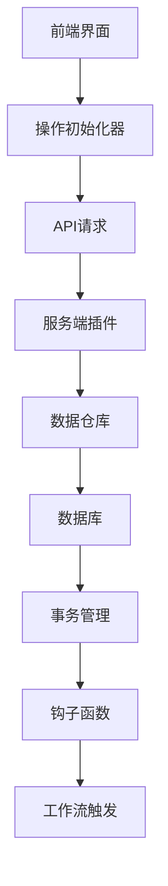
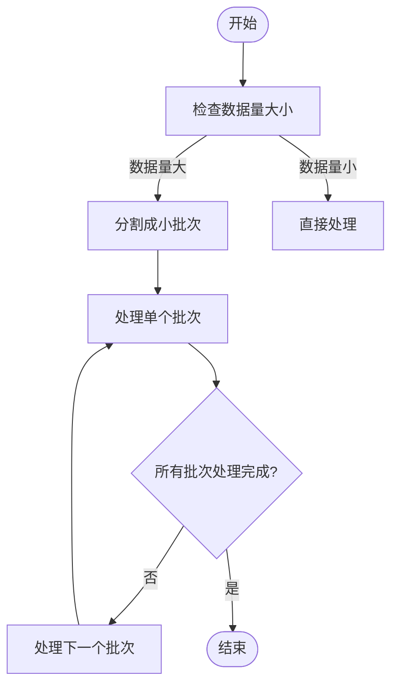
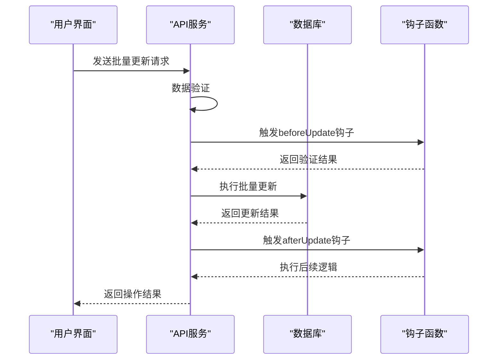

# 批量操作

<cite>
**本文档引用的文件**  
- [bulk-update.md](file://packages/core/client/docs/zh-CN/ui-schema/actions/bulk-update.md)
- [plugin.ts](file://packages/plugins/@nocobase/plugin-action-bulk-update/src/server/plugin.ts)
- [BulkUpdateActionInitializer.tsx](file://packages/plugins/@nocobase/plugin-action-bulk-update/src/client/BulkUpdateActionInitializer.tsx)
- [BulkEditActionInitializer.tsx](file://packages/plugins/@nocobase/plugin-action-bulk-edit/src/client/BulkEditActionInitializer.tsx)
- [plugin.ts](file://packages/plugins/@nocobase/plugin-action-bulk-edit/src/server/plugin.ts)
- [bulk-destroy](file://packages/core/client/src/modules/actions/bulk-destroy)
- [action-hooks.ts](file://packages/core/client/src/collection-manager/action-hooks.ts)
- [repository.ts](file://packages/core/database/src/repository.ts)
- [base-exporter.ts](file://packages/plugins/@nocobase/plugin-action-export/src/server/services/base-exporter.ts)
- [xlsx-importer.ts](file://packages/plugins/@nocobase/plugin-action-import/src/server/services/xlsx-importer.ts)
</cite>

## 目录
1. [简介](#简介)
2. [批量操作类型](#批量操作类型)
3. [实现机制](#实现机制)
4. [性能优化策略](#性能优化策略)
5. [内存管理方法](#内存管理方法)
6. [参数配置](#参数配置)
7. [数据验证与钩子函数集成](#数据验证与钩子函数集成)
8. [大规模数据处理最佳实践](#大规模数据处理最佳实践)
9. [错误恢复机制](#错误恢复机制)
10. [实际应用示例](#实际应用示例)

## 简介
NocoBase提供了一套完整的批量操作解决方案，支持批量创建、更新和删除操作。这些功能通过专门的插件实现，包括`plugin-action-bulk-edit`和`plugin-action-bulk-update`，为用户提供高效的数据管理能力。

**Section sources**
- [bulk-update.md](file://packages/core/client/docs/zh-CN/ui-schema/actions/bulk-update.md)

## 批量操作类型
NocoBase支持三种主要的批量操作类型：批量创建、批量更新和批量删除。每种操作都有其特定的使用场景和实现方式。

### 批量创建
批量创建操作允许用户一次性创建多个记录。这种操作通常用于数据导入场景，可以显著提高数据录入效率。

### 批量更新
批量更新操作允许用户同时更新多个选中的记录。用户可以通过表单界面选择要更新的字段和值，然后应用到所有选中的记录上。

**Section sources**
- [BulkUpdateActionInitializer.tsx](file://packages/plugins/@nocobase/plugin-action-bulk-update/src/client/BulkUpdateActionInitializer.tsx)

### 批量删除
批量删除操作允许用户同时删除多个选中的记录。系统会提示用户确认删除操作，并提供相应的错误处理机制。

**Section sources**
- [bulk-destroy](file://packages/core/client/src/modules/actions/bulk-destroy)

## 实现机制
NocoBase的批量操作基于模块化架构设计，前端和后端分别由不同的组件协同工作。

**Diagram sources**
- [plugin.ts](file://packages/plugins/@nocobase/plugin-action-bulk-update/src/server/plugin.ts)
- [BulkUpdateActionInitializer.tsx](file://packages/plugins/@nocobase/plugin-action-bulk-update/src/client/BulkUpdateActionInitializer.tsx)

### 前端实现
前端批量操作通过Schema初始化器实现，使用`BulkUpdateActionInitializer`和`BulkEditActionInitializer`等组件来配置操作的UI和行为。

**Section sources**
- [BulkUpdateActionInitializer.tsx](file://packages/plugins/@nocobase/plugin-action-bulk-update/src/client/BulkUpdateActionInitializer.tsx)
- [BulkEditActionInitializer.tsx](file://packages/plugins/@nocobase/plugin-action-bulk-edit/src/client/BulkEditActionInitializer.tsx)

### 后端实现
后端批量操作由专门的插件处理，如`PluginActionBulkUpdateServer`和`PluginActionBulkEditServer`，这些插件继承自基础的Plugin类并实现特定的功能。

**Section sources**
- [plugin.ts](file://packages/plugins/@nocobase/plugin-action-bulk-update/src/server/plugin.ts)
- [plugin.ts](file://packages/plugins/@nocobase/plugin-action-bulk-edit/src/server/plugin.ts)

## 性能优化策略
为了确保批量操作的高性能，NocoBase采用了多种优化策略。

### 分批处理
对于大规模数据操作，系统采用分批处理机制，将大数据集分割成小批次进行处理，避免内存溢出和超时问题。

**Diagram sources**
- [repository.ts](file://packages/core/database/src/repository.ts)

### 并行处理
在适当的情况下，系统会并行处理多个批次，充分利用多核CPU的优势，加快处理速度。

## 内存管理方法
NocoBase通过多种机制来有效管理批量操作过程中的内存使用。

### 流式处理
对于大型数据集，系统采用流式处理方式，逐条读取和处理数据，而不是一次性加载所有数据到内存中。

### 对象池
系统使用对象池技术重用对象实例，减少垃圾回收的压力，提高内存使用效率。

**Section sources**
- [base-exporter.ts](file://packages/plugins/@nocobase/plugin-action-export/src/server/services/base-exporter.ts)

## 参数配置
批量操作支持多种参数配置，以满足不同场景的需求。

### 批量大小
用户可以配置每次处理的记录数量，平衡性能和资源消耗。

### 错误处理模式
系统提供多种错误处理模式，包括继续执行、停止执行和跳过错误记录。

### 事务控制
批量操作支持事务控制，确保数据的一致性和完整性。

**Section sources**
- [BulkUpdateActionInitializer.tsx](file://packages/plugins/@nocobase/plugin-action-bulk-update/src/client/BulkUpdateActionInitializer.tsx)

## 数据验证与钩子函数集成
NocoBase的批量操作与数据验证和钩子函数紧密集成，确保数据质量和业务逻辑的正确执行。

### 数据验证
在批量操作执行前，系统会对所有数据进行验证，确保符合预定义的规则和约束。

### 钩子函数
系统在批量操作的关键节点触发钩子函数，允许开发者自定义业务逻辑。

**Diagram sources**
- [xlsx-importer.ts](file://packages/plugins/@nocobase/plugin-action-import/src/server/services/xlsx-importer.ts)

## 大规模数据处理最佳实践
在处理大规模数据时，应遵循以下最佳实践。

### 分批处理策略
将大数据集分成适当大小的批次进行处理，避免单次操作过大导致系统资源耗尽。

### 进度监控
实现进度监控机制，实时显示处理进度，让用户了解操作状态。

### 资源限制
设置合理的资源使用限制，防止批量操作影响系统的其他功能。

**Section sources**
- [base-exporter.ts](file://packages/plugins/@nocobase/plugin-action-export/src/server/services/base-exporter.ts)

## 错误恢复机制
NocoBase提供完善的错误恢复机制，确保批量操作的可靠性和数据安全。

### 断点续传
当批量操作因故中断时，系统能够记录已处理的进度，支持从断点处继续执行。

### 数据回滚
在事务模式下，如果操作失败，系统会自动回滚已做的更改，保持数据一致性。

### 错误日志
详细记录操作过程中的错误信息，便于问题排查和修复。

## 实际应用示例
以下是几个典型的批量操作应用场景。

### 大规模数据导入
使用批量创建功能快速导入大量历史数据。

### 批量状态更新
在项目管理应用中，批量更新多个任务的状态。

### 数据清理
定期执行批量删除操作，清理过期或无效的数据记录。

**Section sources**
- [action-hooks.ts](file://packages/core/client/src/collection-manager/action-hooks.ts)
- [repository.ts](file://packages/core/database/src/repository.ts)