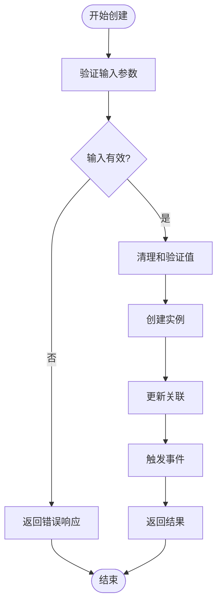
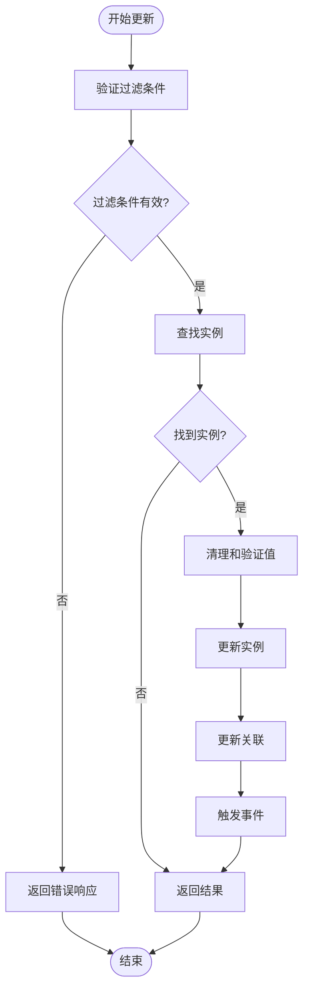
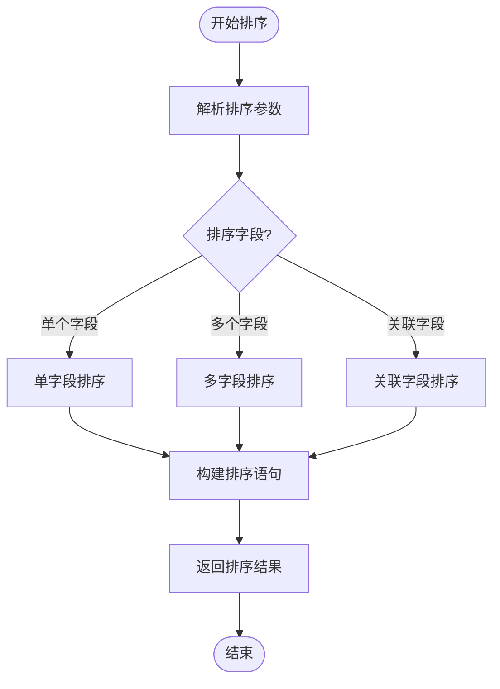
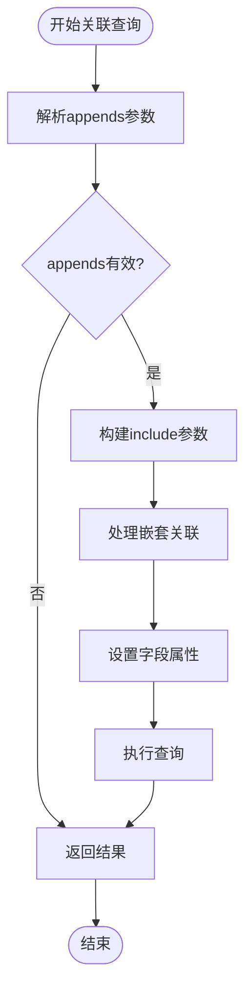
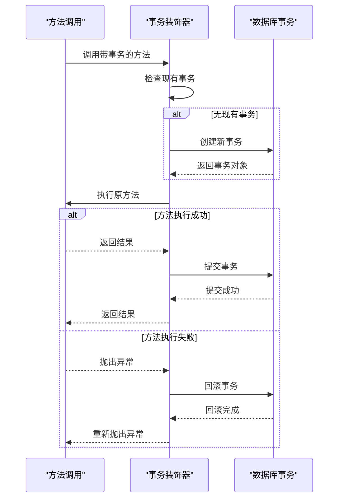
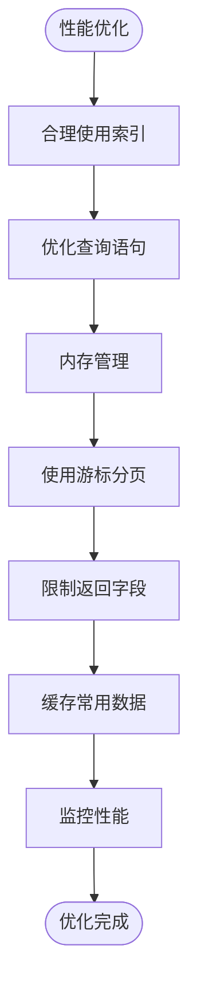

# 数据访问操作

<cite>
**本文档中引用的文件**   
- [repository.ts](file://packages/core/database/src/repository.ts)
- [options-parser.ts](file://packages/core/database/src/options-parser.ts)
- [filter-parser.ts](file://packages/core/database/src/filter-parser.ts)
- [transaction-decorator.ts](file://packages/core/database/src/decorators/transaction-decorator.ts)
- [load-default-actions.ts](file://packages/core/data-source-manager/src/load-default-actions.ts)
- [create-action.test.ts](file://packages/core/actions/src/__tests__/create-action.test.ts)
- [list-action.test.ts](file://packages/core/actions/src/__tests__/list-action.test.ts)
- [destroy-action.test.ts](file://packages/core/actions/src/__tests__/destroy-action.test.ts)
</cite>

## 目录
1. [简介](#简介)
2. [Repository模式实现](#repository模式实现)
3. [CRUD操作详解](#crud操作详解)
4. [查询构建器功能](#查询构建器功能)
5. [事务处理机制](#事务处理机制)
6. [批量操作实现](#批量操作实现)
7. [性能优化建议](#性能优化建议)
8. [实际代码示例](#实际代码示例)

## 简介
NocoBase提供了一套完整的数据访问操作机制，基于Repository模式实现了对数据的增删改查操作。本文档详细介绍了NocoBase中数据访问的核心组件和功能，包括CRUD操作的具体实现、查询构建器的功能、事务处理机制、批量操作以及性能优化建议。

**Section sources**
- [repository.ts](file://packages/core/database/src/repository.ts#L1-L981)

## Repository模式实现
NocoBase的Repository模式是数据访问的核心，它封装了对数据库的底层操作，提供了统一的接口供上层应用调用。Repository类实现了对数据的增删改查操作，通过装饰器和参数解析器来处理各种复杂的查询需求。

Repository模式的主要特点包括：
- 统一的数据访问接口
- 支持复杂的查询条件构建
- 内置事务管理
- 支持关联查询和嵌套操作
- 提供批量操作支持

**Section sources**
- [repository.ts](file://packages/core/database/src/repository.ts#L250-L981)

## CRUD操作详解
NocoBase提供了完整的CRUD操作支持，包括创建(create)、读取(get/list)、更新(update)和删除(destroy)操作。这些操作通过Repository类的方法实现，每个方法都有详细的参数配置和处理逻辑。

### 创建操作
创建操作通过`create`方法实现，支持单个和批量创建。方法接受一个包含值和选项的对象作为参数，其中值是需要创建的数据，选项包括白名单、黑名单、关联值更新等配置。



**Diagram sources**
- [repository.ts](file://packages/core/database/src/repository.ts#L655-L700)

### 读取操作
读取操作包括`get`和`list`两种方法。`get`方法用于获取单个记录，`list`方法用于获取多个记录。这些方法支持分页、排序、字段选择和关联查询等高级功能。

**Section sources**
- [repository.ts](file://packages/core/database/src/repository.ts#L589-L607)
- [load-default-actions.ts](file://packages/core/data-source-manager/src/load-default-actions.ts#L26-L29)

### 更新操作
更新操作通过`update`方法实现，支持单个和批量更新。方法需要指定过滤条件来确定要更新的记录，并提供新的值。更新操作也支持关联值的更新。



**Diagram sources**
- [repository.ts](file://packages/core/database/src/repository.ts#L728-L808)

### 删除操作
删除操作通过`destroy`方法实现，支持通过主键或过滤条件删除记录。方法可以处理单个或多个记录的删除，并支持事务管理。

**Section sources**
- [repository.ts](file://packages/core/database/src/repository.ts#L829-L933)
- [destroy-action.test.ts](file://packages/core/actions/src/__tests__/destroy-action.test.ts#L74-L162)

## 查询构建器功能
NocoBase的查询构建器提供了强大的查询功能，支持过滤条件、排序、分页、字段选择和关联查询等操作。

### 过滤条件
过滤条件通过`filter`参数实现，支持多种操作符，如等于、不等于、大于、小于等。过滤条件可以嵌套使用，支持逻辑运算符`$and`和`$or`。

**Section sources**
- [filter-parser.ts](file://packages/core/database/src/filter-parser.ts#L27-L277)

### 排序
排序通过`sort`参数实现，支持单个或多个字段的排序。排序字段可以是关联字段，支持升序和降序排序。



**Diagram sources**
- [options-parser.ts](file://packages/core/database/src/options-parser.ts#L134-L203)

### 分页
分页通过`limit`和`offset`参数实现，支持简单分页和游标分页两种模式。简单分页适用于数据量较小的场景，游标分页适用于大数据量的场景。

**Section sources**
- [options-parser.ts](file://packages/core/database/src/options-parser.ts#L446-L489)

### 字段选择
字段选择通过`fields`参数实现，允许指定需要返回的字段。支持排除字段的`except`参数，可以灵活控制返回的数据结构。

**Section sources**
- [options-parser.ts](file://packages/core/database/src/options-parser.ts#L205-L259)

### 关联查询
关联查询通过`appends`参数实现，支持多级关联查询。可以指定关联字段和查询条件，实现复杂的关联数据获取。



**Diagram sources**
- [options-parser.ts](file://packages/core/database/src/options-parser.ts#L317-L467)

## 事务处理机制
NocoBase的事务处理机制通过装饰器实现，确保数据操作的原子性和一致性。事务装饰器自动管理事务的开始、提交和回滚，简化了事务处理的复杂性。

### 事务创建
事务通过`@transaction()`装饰器创建，该装饰器会自动检查是否存在现有事务，如果不存在则创建新事务。

**Section sources**
- [transaction-decorator.ts](file://packages/core/database/src/decorators/transaction-decorator.ts#L12-L83)

### 事务提交
当方法执行成功时，事务装饰器会自动提交事务。提交操作确保所有数据库更改被永久保存。

### 事务回滚
当方法执行过程中发生错误时，事务装饰器会自动回滚事务。回滚操作撤销所有数据库更改，保持数据的一致性。



**Diagram sources**
- [transaction-decorator.ts](file://packages/core/database/src/decorators/transaction-decorator.ts#L17-L78)

## 批量操作实现
NocoBase支持批量创建、更新和删除操作，提高了数据处理的效率。

### 批量创建
批量创建通过`createMany`方法实现，接受一个值数组作为参数，一次性创建多个记录。

**Section sources**
- [repository.ts](file://packages/core/database/src/repository.ts#L708-L720)

### 批量更新
批量更新通过`updateMany`方法实现，接受一个值数组作为参数，对多个记录进行更新。

**Section sources**
- [repository.ts](file://packages/core/database/src/repository.ts#L811-L827)

### 批量删除
批量删除通过`destroy`方法的`filterByTk`参数实现，可以一次性删除多个记录。

**Section sources**
- [repository.ts](file://packages/core/database/src/repository.ts#L835-L933)

## 性能优化建议
为了提高数据访问的性能，NocoBase提供了一些优化建议和机制。

### 索引使用
合理使用索引可以显著提高查询性能。建议在经常用于查询条件的字段上创建索引。

**Section sources**
- [cursor-builder.ts](file://packages/core/database/src/cursor-builder.ts#L85-L195)

### 查询优化
避免使用复杂的嵌套查询，尽量简化查询条件。使用分页和字段选择来减少数据传输量。

### 内存管理
对于大数据量的操作，建议使用游标分页而不是简单分页，以减少内存占用。



**Diagram sources**
- [repository.ts](file://packages/core/database/src/repository.ts#L490-L512)

## 实际代码示例
以下是一些实际的代码示例，展示了各种数据操作场景的实现方式。

### 创建记录示例
```typescript
// 创建单个记录
const post = await Post.repository.create({
  values: {
    title: 'Hello World',
    content: 'This is my first post'
  }
});

// 批量创建记录
const posts = await Post.repository.createMany({
  records: [
    { title: 'Post 1', content: 'Content 1' },
    { title: 'Post 2', content: 'Content 2' }
  ]
});
```

**Section sources**
- [create-action.test.ts](file://packages/core/actions/src/__tests__/create-action.test.ts#L56-L129)

### 查询记录示例
```typescript
// 查询单个记录
const post = await Post.repository.findOne({
  filterByTk: 1,
  appends: ['comments', 'tags']
});

// 查询多个记录
const posts = await Post.repository.find({
  filter: {
    status: 'published'
  },
  sort: ['-createdAt'],
  limit: 10,
  offset: 0
});
```

**Section sources**
- [list-action.test.ts](file://packages/core/actions/src/__tests__/list-action.test.ts#L93-L197)

### 更新记录示例
```typescript
// 更新单个记录
await Post.repository.update({
  filterByTk: 1,
  values: {
    title: 'Updated Title'
  }
});

// 批量更新记录
await Post.repository.updateMany({
  records: [
    { id: 1, title: 'Post 1 Updated' },
    { id: 2, title: 'Post 2 Updated' }
  ]
});
```

### 删除记录示例
```typescript
// 删除单个记录
await Post.repository.destroy({
  filterByTk: 1
});

// 通过过滤条件删除多个记录
await Post.repository.destroy({
  filter: {
    status: 'draft'
  }
});
```

**Section sources**
- [destroy-action.test.ts](file://packages/core/actions/src/__tests__/destroy-action.test.ts#L74-L162)