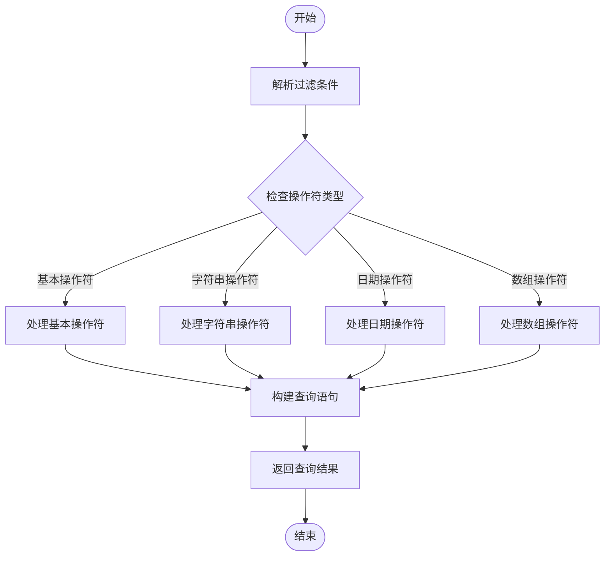

# 查询构建器

<cite>
**本文档中引用的文件**   
- [options-parser.ts](file://packages/core/database/src/options-parser.ts)
- [filter-parser.ts](file://packages/core/database/src/filter-parser.ts)
- [repository.ts](file://packages/core/database/src/repository.ts)
- [database.ts](file://packages/core/database/src/database.ts)
- [mysql-query-interface.ts](file://packages/core/database/src/query-interface/mysql-query-interface.ts)
- [postgres-query-interface.ts](file://packages/core/database/src/query-interface/postgres-query-interface.ts)
- [sqlite-query-interface.ts](file://packages/core/database/src/query-interface/sqlite-query-interface.ts)
- [filter-match.ts](file://packages/core/database/src/filter-match.ts)
</cite>

## 目录
1. [介绍](#介绍)
2. [查询接口设计原理](#查询接口设计原理)
3. [过滤条件语法](#过滤条件语法)
4. [排序、分页与字段选择](#排序分页与字段选择)
5. [关联查询](#关联查询)
6. [复杂查询条件组合](#复杂查询条件组合)
7. [数据库方言适配机制](#数据库方言适配机制)
8. [实际应用示例](#实际应用示例)
9. [结论](#结论)

## 介绍
NocoBase查询构建器是一个功能强大的数据查询系统，为用户提供了一套完整的API来构建复杂的数据库查询。该系统支持多种数据库后端，包括MySQL、PostgreSQL和SQLite，并提供了统一的查询接口。查询构建器的设计目标是简化复杂查询的构建过程，同时保持高性能和可扩展性。

## 查询接口设计原理
NocoBase查询构建器基于Sequelize ORM框架构建，通过封装底层数据库操作，提供了一套简洁而强大的查询API。系统的核心组件包括选项解析器（OptionsParser）、过滤解析器（FilterParser）和查询接口（QueryInterface）。

查询构建器采用链式调用模式，允许用户通过方法链构建复杂的查询条件。系统通过解析器将高级查询语法转换为底层数据库查询语句，同时处理不同数据库方言之间的差异。

**图源**
- [database.ts](file://packages/core/database/src/database.ts#L137-L164)
- [repository.ts](file://packages/core/database/src/repository.ts#L30-L50)
- [options-parser.ts](file://packages/core/database/src/options-parser.ts#L25-L47)
- [filter-parser.ts](file://packages/core/database/src/filter-parser.ts#L27-L39)
- [query-interface.ts](file://packages/core/database/src/query-interface/query-interface.ts#L15-L16)

## 过滤条件语法
NocoBase查询构建器提供了丰富的过滤操作符，支持相等、不等、包含、范围等多种查询条件。

### 基本操作符
查询构建器支持以下基本操作符：
- `$eq`：等于
- `$ne`：不等于
- `$gt`：大于
- `$gte`：大于等于
- `$lt`：小于
- `$lte`：小于等于
- `$in`：在指定值列表中
- `$notIn`：不在指定值列表中

### 字符串操作符
对于字符串字段，查询构建器提供了专门的操作符：
- `$includes`：包含指定子字符串
- `$notIncludes`：不包含指定子字符串
- `$empty`：为空值或空字符串
- `$notEmpty`：非空值或非空字符串

### 日期时间操作符
对于日期时间字段，查询构建器提供了专门的操作符：
- `$dateOn`：日期相等（忽略时间部分）
- `$dateBefore`：日期在指定日期之前
- `$dateAfter`：日期在指定日期之后
- `$dateBetween`：日期在指定范围内

**图源**
- [filter-parser.ts](file://packages/core/database/src/filter-parser.ts#L79-L81)
- [filter-match.ts](file://packages/core/database/src/filter-match.ts#L14-L49)

## 排序分页与字段选择
查询构建器提供了完整的排序、分页和字段选择功能，允许用户精确控制查询结果。

### 排序配置
排序功能通过`sort`参数配置，支持单字段和多字段排序。排序方向通过前缀`-`表示降序，无前缀表示升序。

**图源**
- [options-parser.ts](file://packages/core/database/src/options-parser.ts#L134-L203)
- [repository.ts](file://packages/core/database/src/repository.ts#L122-L132)

### 分页配置
分页功能通过`page`和`pageSize`参数配置，系统会自动将其转换为`limit`和`offset`参数。

### 字段选择
字段选择功能通过`fields`和`except`参数配置，允许用户指定需要返回的字段或排除的字段。

**图源**
- [repository.ts](file://packages/core/database/src/repository.ts#L104-L132)
- [options-parser.ts](file://packages/core/database/src/options-parser.ts#L205-L300)

## 关联查询
查询构建器提供了强大的关联查询功能，支持多级嵌套关联查询。

### 关联查询语法
关联查询通过`appends`参数配置，使用点号`.`表示关联层级。例如`posts.comments`表示查询文章的评论。

### 关联字段选择
可以在关联查询中指定需要返回的字段，例如`posts(title,content).comments(content)`。

### 关联查询排除
通过`except`参数可以排除关联查询中的特定字段。

**图源**
- [options-parser.ts](file://packages/core/database/src/options-parser.ts#L317-L466)
- [repository.ts](file://packages/core/database/src/repository.ts#L127-L128)

## 复杂查询条件组合
查询构建器支持复杂的查询条件组合，包括AND、OR逻辑和嵌套条件。

### AND/OR逻辑
使用`$and`和`$or`操作符可以组合多个查询条件。

### 嵌套条件
查询条件可以嵌套多层，形成复杂的查询逻辑树。

**图源**
- [filter-parser.ts](file://packages/core/database/src/filter-parser.ts#L105-L110)
- [filter-match.ts](file://packages/core/database/src/filter-match.ts#L45-L46)

## 数据库方言适配机制
查询构建器通过适配器模式处理不同数据库方言之间的差异。

### 方言适配器
系统为每种数据库方言提供了专门的查询接口实现：
- MySQL：MysqlQueryInterface
- PostgreSQL：PostgresQueryInterface
- SQLite：SqliteQueryInterface

### 差异处理
不同数据库在以下方面存在差异：
- NULL值排序
- JSON数组查询
- 自动递增字段处理

**图源**
- [query-interface-builder.ts](file://packages/core/database/src/query-interface/query-interface-builder.ts#L15-L34)
- [mysql-query-interface.ts](file://packages/core/database/src/query-interface/mysql-query-interface.ts#L17-L149)
- [postgres-query-interface.ts](file://packages/core/database/src/query-interface/postgres-query-interface.ts#L16-L249)
- [sqlite-query-interface.ts](file://packages/core/database/src/query-interface/sqlite-query-interface.ts#L17-L154)

## 实际应用示例
以下是几个实际应用示例，展示如何使用查询构建器实现复杂查询。

### 复杂过滤查询

### 关联查询示例

**图源**
- [options-parser.ts](file://packages/core/database/src/options-parser.ts#L317-L466)
- [filter-parser.ts](file://packages/core/database/src/filter-parser.ts#L97-L277)

## 结论
NocoBase查询构建器是一个功能强大且灵活的数据查询系统，通过统一的API接口支持多种数据库后端。系统的设计充分考虑了性能、可扩展性和易用性，为开发者提供了构建复杂查询的完整解决方案。通过深入理解查询构建器的设计原理和实现机制，开发者可以更有效地利用这一工具，构建高性能的数据应用。