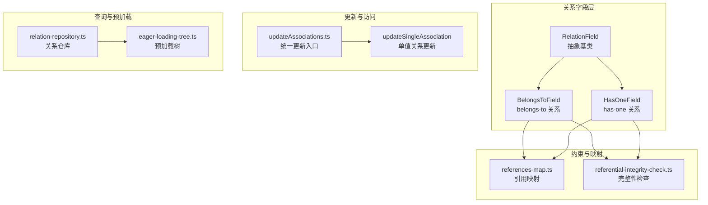
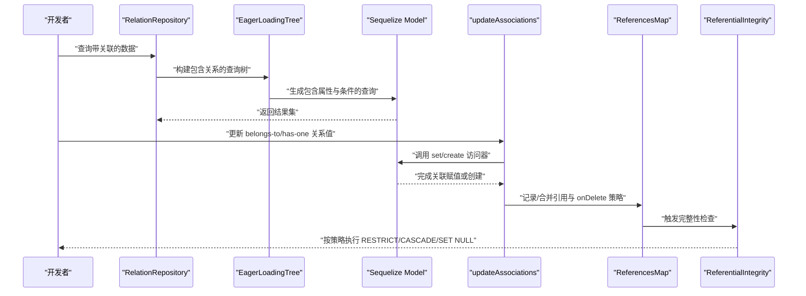
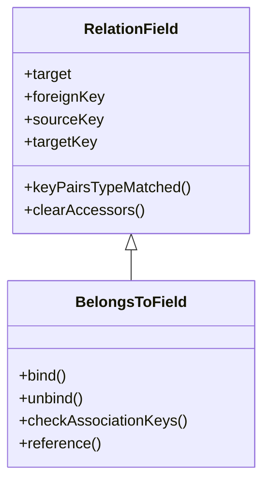
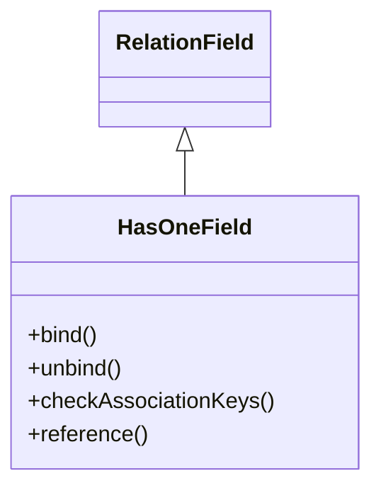
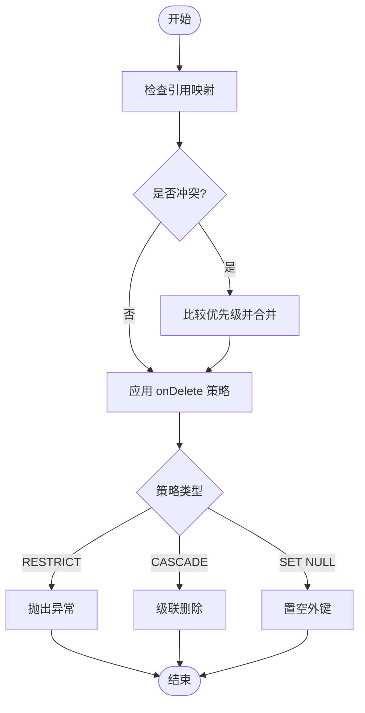
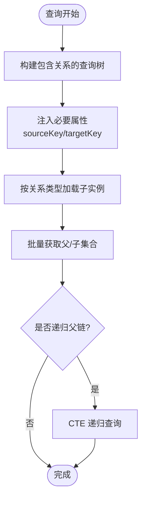
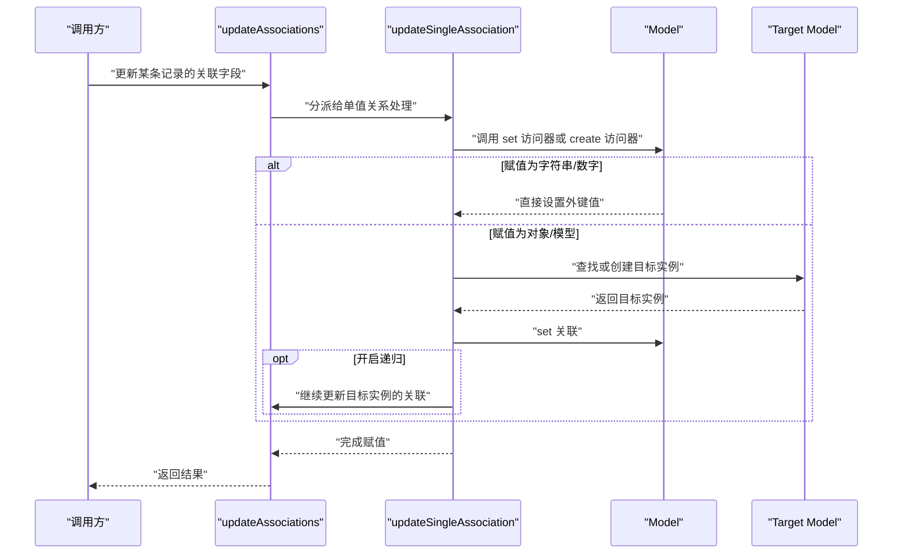
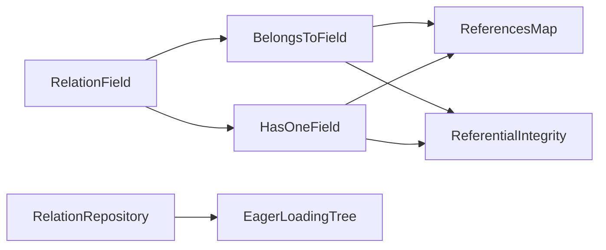

# 一对一关系

<cite>
**本文引用的文件列表**
- [belongs-to-field.ts](file://packages/core/database/src/fields/belongs-to-field.ts)
- [has-one-field.ts](file://packages/core/database/src/fields/has-one-field.ts)
- [relation-field.ts](file://packages/core/database/src/fields/relation-field.ts)
- [update-associations.ts](file://packages/core/database/src/update-associations.ts)
- [eager-loading-tree.ts](file://packages/core/database/src/eager-loading/eager-loading-tree.ts)
- [relation-repository.ts](file://packages/core/database/src/relation-repository/relation-repository.ts)
- [references-map.ts](file://packages/core/database/src/features/references-map.ts)
- [referential-integrity-check.ts](file://packages/core/database/src/features/referential-integrity-check.ts)
- [one-belongs-to-one-interface.ts](file://packages/core/interfaces/one-belongs-to-one-interface.ts)
- [beforeInitOptions.ts](file://packages/plugins/@nocobase/plugin-data-source-main/src/server/hooks/beforeInitOptions.ts)
</cite>

## 目录
1. [简介](#简介)
2. [项目结构与定位](#项目结构与定位)
3. [核心组件](#核心组件)
4. [架构总览](#架构总览)
5. [详细组件分析](#详细组件分析)
6. [依赖关系分析](#依赖关系分析)
7. [性能与优化](#性能与优化)
8. [故障排查指南](#故障排查指南)
9. [结论](#结论)
10. [附录：使用示例与最佳实践](#附录使用示例与最佳实践)

## 简介
本篇文档聚焦于 NocoBase 中“一对一”关系的建模与实现，系统性阐述 belongs-to 与 has-one 的关系机制、外键定义、约束与级联策略、查询优化（索引与预加载）、以及常见问题（循环引用、空值处理）的最佳实践。读者可据此在数据模型中正确声明与使用一对一关系，并获得稳定的运行与良好的性能表现。

## 项目结构与定位
- 一对一关系由“关系字段类”负责定义与绑定，底层基于 Sequelize 的关联 API 实现。
- 关系字段在绑定时会校验外键与目标键类型一致性，并自动维护索引与引用映射。
- 更新路径通过统一的更新器处理 belongs-to/has-one 的赋值、创建、递归更新等逻辑。
- 预加载树用于构建包含关系的查询计划，减少 N+1 查询并提升读取性能。
- 参考映射与完整性检查保障外键约束与级联策略的一致性与可预测性。

图表来源
- [belongs-to-field.ts](file://packages/core/database/src/fields/belongs-to-field.ts#L79-L137)
- [has-one-field.ts](file://packages/core/database/src/fields/has-one-field.ts#L147-L201)
- [relation-field.ts](file://packages/core/database/src/fields/relation-field.ts#L18-L90)
- [update-associations.ts](file://packages/core/database/src/update-associations.ts#L222-L387)
- [eager-loading-tree.ts](file://packages/core/database/src/eager-loading/eager-loading-tree.ts#L86-L190)
- [relation-repository.ts](file://packages/core/database/src/relation-repository/relation-repository.ts#L30-L72)
- [references-map.ts](file://packages/core/database/src/features/references-map.ts#L51-L82)
- [referential-integrity-check.ts](file://packages/core/database/src/features/referential-integrity-check.ts#L41-L79)

章节来源
- [belongs-to-field.ts](file://packages/core/database/src/fields/belongs-to-field.ts#L79-L137)
- [has-one-field.ts](file://packages/core/database/src/fields/has-one-field.ts#L147-L201)
- [relation-field.ts](file://packages/core/database/src/fields/relation-field.ts#L18-L90)
- [update-associations.ts](file://packages/core/database/src/update-associations.ts#L222-L387)
- [eager-loading-tree.ts](file://packages/core/database/src/eager-loading/eager-loading-tree.ts#L86-L190)
- [relation-repository.ts](file://packages/core/database/src/relation-repository/relation-repository.ts#L30-L72)
- [references-map.ts](file://packages/core/database/src/features/references-map.ts#L51-L82)
- [referential-integrity-check.ts](file://packages/core/database/src/features/referential-integrity-check.ts#L41-L79)

## 核心组件
- BelongsToField（belongs-to）
  - 定义源表到目标表的外键指向，支持自动生成外键名与目标键名，校验类型一致性，维护索引与引用映射。
- HasOneField（has-one）
  - 定义目标表对源表的唯一拥有关系，同样进行键类型校验、索引维护与引用映射。
- RelationField（抽象基类）
  - 提供通用的键类型匹配、目标模型解析、访问器清理等能力。
- updateAssociations / updateSingleAssociation
  - 统一处理 belongs-to 与 has-one 的赋值、创建、递归更新、空值移除等逻辑。
- eager-loading-tree
  - 构建包含关系的查询树，自动注入必要的属性以避免 N+1 并支持递归父链加载。
- references-map 与 referential-integrity-check
  - 记录与合并外键引用，按优先级决定 onDelete 行为，执行 RESTRICT/CASCADE/SET NULL 等策略。

章节来源
- [belongs-to-field.ts](file://packages/core/database/src/fields/belongs-to-field.ts#L16-L137)
- [has-one-field.ts](file://packages/core/database/src/fields/has-one-field.ts#L85-L201)
- [relation-field.ts](file://packages/core/database/src/fields/relation-field.ts#L18-L90)
- [update-associations.ts](file://packages/core/database/src/update-associations.ts#L222-L387)
- [eager-loading-tree.ts](file://packages/core/database/src/eager-loading/eager-loading-tree.ts#L86-L190)
- [references-map.ts](file://packages/core/database/src/features/references-map.ts#L51-L82)
- [referential-integrity-check.ts](file://packages/core/database/src/features/referential-integrity-check.ts#L41-L79)

## 架构总览
下面的序列图展示了“一对一关系”的典型使用流程：从字段绑定、查询预加载、到更新赋值与约束检查。

图表来源
- [relation-repository.ts](file://packages/core/database/src/relation-repository/relation-repository.ts#L202-L247)
- [eager-loading-tree.ts](file://packages/core/database/src/eager-loading/eager-loading-tree.ts#L192-L387)
- [update-associations.ts](file://packages/core/database/src/update-associations.ts#L222-L387)
- [references-map.ts](file://packages/core/database/src/features/references-map.ts#L51-L82)
- [referential-integrity-check.ts](file://packages/core/database/src/features/referential-integrity-check.ts#L41-L79)

## 详细组件分析

### BelongsToField（belongs-to）实现机制
- 外键与目标键
  - 若未显式提供 foreignKey，则根据关系名与目标键自动生成；若未提供 targetKey，则默认使用目标模型主键。
  - 绑定时会检查外键与目标键的类型是否一致，否则抛出错误。
- 索引与约束
  - 自动为目标表添加外键列的索引，提升查询效率。
  - 将引用信息写入引用映射，用于后续完整性检查与级联策略决策。
- 级联策略
  - onDelete/onUpdate 由上层传入，最终通过引用映射与完整性检查模块生效。
- 反向关系
  - 注释表明存在反向 hasMany 关系，但当前绑定逻辑未显式创建该方向的字段。

图表来源
- [relation-field.ts](file://packages/core/database/src/fields/relation-field.ts#L18-L90)
- [belongs-to-field.ts](file://packages/core/database/src/fields/belongs-to-field.ts#L16-L137)

章节来源
- [belongs-to-field.ts](file://packages/core/database/src/fields/belongs-to-field.ts#L50-L137)
- [relation-field.ts](file://packages/core/database/src/fields/relation-field.ts#L55-L90)

### HasOneField（has-one）实现机制
- 外键与源键
  - 若未显式提供 foreignKey，则根据关系名与源模型主键自动生成；若未提供 sourceKey，则默认使用源模型主键。
  - 同样进行键类型一致性校验。
- 索引与约束
  - 在目标集合上为外键列添加索引，确保查询与更新性能。
  - 写入引用映射，记录 onDelete 策略。
- 级联策略
  - 支持 onDelete/onUpdate，最终由引用映射与完整性检查模块应用。

图表来源
- [has-one-field.ts](file://packages/core/database/src/fields/has-one-field.ts#L85-L201)
- [relation-field.ts](file://packages/core/database/src/fields/relation-field.ts#L18-L90)

章节来源
- [has-one-field.ts](file://packages/core/database/src/fields/has-one-field.ts#L119-L201)
- [relation-field.ts](file://packages/core/database/src/fields/relation-field.ts#L55-L90)

### 关系字段配置选项（targetKey、sourceKey、constraints）
- targetKey
  - 目标表上的被引用键，默认使用目标模型主键；可通过配置覆盖。
- sourceKey
  - 源表上的引用键，默认使用源模型主键；可通过配置覆盖。
- constraints
  - 控制是否启用外键约束；在 belongs-to/has-one 的绑定中通常设为禁用，以便允许空值或延迟约束。
- onDelete/onUpdate
  - 删除与更新时的行为策略，最终由引用映射与完整性检查模块生效。

章节来源
- [belongs-to-field.ts](file://packages/core/database/src/fields/belongs-to-field.ts#L50-L101)
- [has-one-field.ts](file://packages/core/database/src/fields/has-one-field.ts#L119-L163)
- [relation-field.ts](file://packages/core/database/src/fields/relation-field.ts#L31-L37)

### 级联删除与更新策略
- 引用映射与优先级
  - 当多个引用指向同一目标时，按优先级（默认/用户）合并 onDelete 策略，冲突时发出警告或调整策略。
- 完整性检查
  - 在删除或更新时，依据 onDelete 策略执行：
    - RESTRICT：阻止删除并抛错；
    - CASCADE：级联删除；
    - SET NULL：将外键置空。
- 数据源初始化钩子
  - 在初始化 belongs-to 关系时，若未提供 targetKey/sourceKey，会自动设置默认值，确保关系字段具备可操作的键对。

图表来源
- [references-map.ts](file://packages/core/database/src/features/references-map.ts#L56-L82)
- [referential-integrity-check.ts](file://packages/core/database/src/features/referential-integrity-check.ts#L57-L78)
- [beforeInitOptions.ts](file://packages/plugins/@nocobase/plugin-data-source-main/src/server/hooks/beforeInitOptions.ts#L14-L38)

章节来源
- [references-map.ts](file://packages/core/database/src/features/references-map.ts#L51-L82)
- [referential-integrity-check.ts](file://packages/core/database/src/features/referential-integrity-check.ts#L41-L79)
- [beforeInitOptions.ts](file://packages/plugins/@nocobase/plugin-data-source-main/src/server/hooks/beforeInitOptions.ts#L14-L38)

### 查询性能优化（索引与预加载）
- 索引
  - belongs-to：在源模型上为目标键（targetKey）添加索引，便于反查。
  - has-one：在目标模型上为外键（foreignKey）添加索引，便于正向唯一查找。
- 预加载
  - 预加载树会自动注入必要属性（如 sourceKey/targetKey），避免 N+1 查询。
  - 对 belongs-to 关系，先收集父实例的外键值，再一次性查询父集合，实现批量装载。
  - 对 has-one 关系，先收集子实例的 targetKey，再一次性查询子集合。
  - 支持递归父链加载，通过 SQL CTE 实现层级回溯。

图表来源
- [eager-loading-tree.ts](file://packages/core/database/src/eager-loading/eager-loading-tree.ts#L157-L176)
- [eager-loading-tree.ts](file://packages/core/database/src/eager-loading/eager-loading-tree.ts#L360-L387)
- [relation-repository.ts](file://packages/core/database/src/relation-repository/relation-repository.ts#L237-L247)

章节来源
- [belongs-to-field.ts](file://packages/core/database/src/fields/belongs-to-field.ts#L129-L131)
- [has-one-field.ts](file://packages/core/database/src/fields/has-one-field.ts#L195-L197)
- [eager-loading-tree.ts](file://packages/core/database/src/eager-loading/eager-loading-tree.ts#L157-L176)
- [eager-loading-tree.ts](file://packages/core/database/src/eager-loading/eager-loading-tree.ts#L360-L387)

### 更新与赋值流程（含空值与循环引用）
- 单值关系更新（belongsTo/hasOne）
  - 支持字符串/数字/对象/模型实例赋值；数组赋值会被拒绝。
  - 空值将移除外键关联。
  - 若目标键未设置，会抛出错误提示。
  - 支持递归更新：当开启递归时，会先创建或找到目标实例，再对其余字段进行更新，并继续遍历其关联。
- 循环引用检测
  - 通过配对关系判断，避免 belongs-to 与 has-one/has-many 形成的互指导致无限递归。
- 关系仓库与过滤
  - 关系仓库在构建查询参数时，会解析过滤条件并转换为 Sequelize 参数，保证查询一致性。

图表来源
- [update-associations.ts](file://packages/core/database/src/update-associations.ts#L222-L387)
- [relation-repository.ts](file://packages/core/database/src/relation-repository/relation-repository.ts#L237-L247)

章节来源
- [update-associations.ts](file://packages/core/database/src/update-associations.ts#L255-L387)
- [relation-repository.ts](file://packages/core/database/src/relation-repository/relation-repository.ts#L237-L247)

## 依赖关系分析
- BelongsToField 与 HasOneField 共同继承 RelationField，复用键类型匹配与访问器清理逻辑。
- 两者均通过引用映射记录 onDelete 策略，并在完整性检查阶段生效。
- 预加载树在构建查询时，依据关系类型注入属性，确保查询路径最短化。
- 关系仓库在解析过滤条件时，结合目标键与 sourceKey，生成正确的 where 条件。

图表来源
- [relation-field.ts](file://packages/core/database/src/fields/relation-field.ts#L18-L90)
- [belongs-to-field.ts](file://packages/core/database/src/fields/belongs-to-field.ts#L16-L137)
- [has-one-field.ts](file://packages/core/database/src/fields/has-one-field.ts#L85-L201)
- [references-map.ts](file://packages/core/database/src/features/references-map.ts#L51-L82)
- [referential-integrity-check.ts](file://packages/core/database/src/features/referential-integrity-check.ts#L41-L79)
- [relation-repository.ts](file://packages/core/database/src/relation-repository/relation-repository.ts#L30-L72)
- [eager-loading-tree.ts](file://packages/core/database/src/eager-loading/eager-loading-tree.ts#L86-L190)

章节来源
- [relation-field.ts](file://packages/core/database/src/fields/relation-field.ts#L18-L90)
- [references-map.ts](file://packages/core/database/src/features/references-map.ts#L51-L82)
- [referential-integrity-check.ts](file://packages/core/database/src/features/referential-integrity-check.ts#L41-L79)
- [relation-repository.ts](file://packages/core/database/src/relation-repository/relation-repository.ts#L30-L72)
- [eager-loading-tree.ts](file://packages/core/database/src/eager-loading/eager-loading-tree.ts#L86-L190)

## 性能与优化
- 索引策略
  - belongs-to：在目标表上为目标键（targetKey）建立索引，加速反查。
  - has-one：在目标表上为外键（foreignKey）建立索引，加速正向唯一查找。
- 预加载策略
  - 使用预加载树一次性收集父/子集合，避免 N+1 查询。
  - 递归父链通过 CTE 实现，减少多次往返数据库。
- 过滤与参数解析
  - 关系仓库将过滤条件转换为 Sequelize 参数，确保查询可预测且高效。

章节来源
- [belongs-to-field.ts](file://packages/core/database/src/fields/belongs-to-field.ts#L129-L131)
- [has-one-field.ts](file://packages/core/database/src/fields/has-one-field.ts#L195-L197)
- [eager-loading-tree.ts](file://packages/core/database/src/eager-loading/eager-loading-tree.ts#L360-L387)
- [relation-repository.ts](file://packages/core/database/src/relation-repository/relation-repository.ts#L237-L247)

## 故障排查指南
- 键类型不匹配
  - 现象：绑定关系时报错，提示外键与目标键类型不一致。
  - 排查：确认 foreignKey 与 targetKey/sourceKey 的数据类型一致，或调整字段类型。
- 约束冲突与级联行为异常
  - 现象：删除报错或未按预期级联。
  - 排查：检查引用映射中的 onDelete 策略与优先级，必要时调整策略或删除冲突引用。
- 空值赋值失败
  - 现象：赋值为 null 或空对象时未移除关联。
  - 排查：确认调用路径使用的是 set 访问器，且未被拦截；检查是否开启了递归更新导致误判。
- 循环引用导致更新卡死
  - 现象：更新时出现无限递归或超时。
  - 排查：检查 belongs-to 与 has-one/has-many 的组合是否形成互指；使用 isReverseAssociationPair 逻辑避免重复处理。

章节来源
- [belongs-to-field.ts](file://packages/core/database/src/fields/belongs-to-field.ts#L72-L76)
- [has-one-field.ts](file://packages/core/database/src/fields/has-one-field.ts#L140-L144)
- [references-map.ts](file://packages/core/database/src/features/references-map.ts#L59-L79)
- [referential-integrity-check.ts](file://packages/core/database/src/features/referential-integrity-check.ts#L57-L78)
- [update-associations.ts](file://packages/core/database/src/update-associations.ts#L183-L213)

## 结论
NocoBase 的一对一关系通过 belongs-to 与 has-one 字段类实现了清晰的外键定义、严格的键类型校验、完善的索引与引用映射、以及高效的查询预加载与更新流程。配合引用映射与完整性检查，系统能够稳定地处理级联删除与更新策略，并在大多数场景下提供良好的性能表现。遵循本文档的配置建议与最佳实践，可在复杂业务中可靠地建模一对一关系。

## 附录：使用示例与最佳实践
- 定义 belongs-to 关系
  - 显式指定 foreignKey 与 targetKey，确保类型一致。
  - 若未指定，框架将自动生成并进行类型校验。
  - 在目标集合上为 targetKey 建立索引，提升反查性能。
- 定义 has-one 关系
  - 显式指定 sourceKey 与 foreignKey，确保类型一致。
  - 在目标集合上为 foreignKey 建立索引，提升正向唯一查找性能。
- 级联策略
  - onDelete 默认策略由上层传入；若未指定，可能采用默认策略。
  - 通过引用映射合并策略时，注意优先级与冲突处理。
- 查询与更新
  - 使用预加载树或 include 选项加载关联，避免 N+1。
  - 更新时支持字符串/数字/对象/模型实例赋值；空值将移除外键关联。
  - 开启递归更新时，注意避免循环引用与不必要的深度遍历。
- 常见问题
  - 键类型不匹配：统一字段类型或调整字段定义。
  - 约束冲突：检查引用映射与 onDelete 策略，必要时清理或调整。
  - 空值处理：确保调用 set 访问器而非 setNull 访问器，避免误用。

章节来源
- [belongs-to-field.ts](file://packages/core/database/src/fields/belongs-to-field.ts#L50-L137)
- [has-one-field.ts](file://packages/core/database/src/fields/has-one-field.ts#L119-L201)
- [references-map.ts](file://packages/core/database/src/features/references-map.ts#L51-L82)
- [referential-integrity-check.ts](file://packages/core/database/src/features/referential-integrity-check.ts#L41-L79)
- [eager-loading-tree.ts](file://packages/core/database/src/eager-loading/eager-loading-tree.ts#L157-L176)
- [update-associations.ts](file://packages/core/database/src/update-associations.ts#L255-L387)