# 一对多关系

<cite>
**本文引用的文件**
- [belongs-to-field.ts](file://packages/core/database/src/fields/belongs-to-field.ts)
- [has-many-field.ts](file://packages/core/database/src/fields/has-many-field.ts)
- [belongs-to-many-field.ts](file://packages/core/database/src/fields/belongs-to-many-field.ts)
- [update-associations.ts](file://packages/core/database/src/update-associations.ts)
- [multiple-relation-repository.ts](file://packages/core/database/src/relation-repository/multiple-relation-repository.ts)
- [eager-loading-tree.ts](file://packages/core/database/src/eager-loading/eager-loading-tree.ts)
- [repository.ts](file://packages/core/database/src/repository.ts)
- [adjacency-list.ts](file://examples/database/collections/tree/adjacency-list.ts)
- [belongs-to-array-field.ts](file://packages/plugins/@nocobase/plugin-field-m2m-array/src/server/belongs-to-array-field.ts)
- [belongs-to-array-repository.ts](file://packages/core/database/src/belongs-to-array/belongs-to-array-repository.ts)
- [referential-integrity-check.ts](file://packages/core/database/src/features/referential-integrity-check.ts)
</cite>

## 目录
1. [简介](#简介)
2. [项目结构](#项目结构)
3. [核心组件](#核心组件)
4. [架构总览](#架构总览)
5. [详细组件分析](#详细组件分析)
6. [依赖分析](#依赖分析)
7. [性能考虑](#性能考虑)
8. [故障排查指南](#故障排查指南)
9. [结论](#结论)
10. [附录](#附录)

## 简介
本篇文档聚焦于 NocoBase 中“一对多”关系的建模与实现，系统性讲解 belongs-to 与 has-many 的关系绑定、外键配置、级联行为、懒加载与急加载策略，并覆盖 belongsToMany 的 through 设置与多对多场景下的键值校验。同时提供查询优化（分页、游标分页、聚合统计）与常见问题（大数据集性能、内存泄漏）的最佳实践路径，帮助开发者在复杂业务中稳定地构建与维护数据模型。

## 项目结构
围绕一对多关系的关键代码主要分布在以下模块：
- 字段定义层：belongsTo、hasMany、belongsToMany 字段类负责关系声明、键类型校验与绑定
- 关系仓库层：多值关系仓库支持 find/count 等查询与批量更新
- 急加载树：基于 include 的树形加载策略，支持 HasMany/BelongsTo/BelongsToMany 的高效合并
- 更新流程：统一的更新入口，区分单值/多值关系，自动处理事务与回滚
- 示例与插件：邻接表树结构示例展示典型的一对多外键用法；数组型 belongsToArray 插件扩展

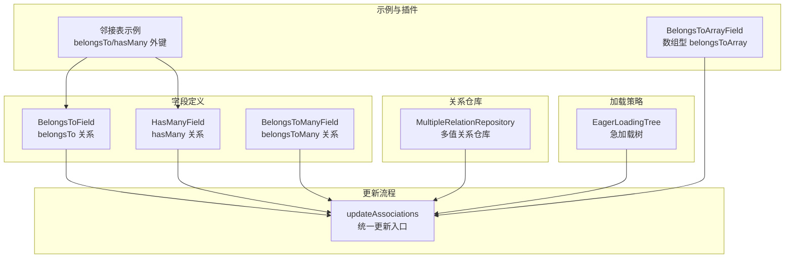

**图表来源**
- [belongs-to-field.ts](file://packages/core/database/src/fields/belongs-to-field.ts#L1-L177)
- [has-many-field.ts](file://packages/core/database/src/fields/has-many-field.ts#L1-L252)
- [belongs-to-many-field.ts](file://packages/core/database/src/fields/belongs-to-many-field.ts#L1-L247)
- [multiple-relation-repository.ts](file://packages/core/database/src/relation-repository/multiple-relation-repository.ts#L1-L215)
- [eager-loading-tree.ts](file://packages/core/database/src/eager-loading/eager-loading-tree.ts#L86-L579)
- [update-associations.ts](file://packages/core/database/src/update-associations.ts#L1-L200)
- [adjacency-list.ts](file://examples/database/collections/tree/adjacency-list.ts#L1-L55)
- [belongs-to-array-field.ts](file://packages/plugins/@nocobase/plugin-field-m2m-array/src/server/belongs-to-array-field.ts#L118-L151)

**章节来源**
- [belongs-to-field.ts](file://packages/core/database/src/fields/belongs-to-field.ts#L1-L177)
- [has-many-field.ts](file://packages/core/database/src/fields/has-many-field.ts#L1-L252)
- [belongs-to-many-field.ts](file://packages/core/database/src/fields/belongs-to-many-field.ts#L1-L247)
- [multiple-relation-repository.ts](file://packages/core/database/src/relation-repository/multiple-relation-repository.ts#L1-L215)
- [eager-loading-tree.ts](file://packages/core/database/src/eager-loading/eager-loading-tree.ts#L86-L579)
- [update-associations.ts](file://packages/core/database/src/update-associations.ts#L1-L200)
- [adjacency-list.ts](file://examples/database/collections/tree/adjacency-list.ts#L1-L55)
- [belongs-to-array-field.ts](file://packages/plugins/@nocobase/plugin-field-m2m-array/src/server/belongs-to-array-field.ts#L118-L151)

## 核心组件
- BelongsToField：定义 belongs-to 关系，校验外键与目标键类型匹配，绑定到源模型，生成引用约束
- HasManyField：定义 has-many 关系，校验外键与源键类型匹配，绑定到源模型，可选排序字段
- BelongsToManyField：定义 belongs-to-many 关系，自动生成/校验 through 表及双键（foreignKey/otherKey），绑定到源模型
- MultipleRelationRepository：多值关系仓库，提供 find/count 等查询与批量更新能力
- EagerLoadingTree：基于 include 的树形加载，按关联类型分别拉取并合并结果
- updateAssociations：统一关系更新入口，区分 HasOne/BelongsTo 与 HasMany/BelongsToMany 的处理路径

**章节来源**
- [belongs-to-field.ts](file://packages/core/database/src/fields/belongs-to-field.ts#L16-L137)
- [has-many-field.ts](file://packages/core/database/src/fields/has-many-field.ts#L85-L212)
- [belongs-to-many-field.ts](file://packages/core/database/src/fields/belongs-to-many-field.ts#L18-L216)
- [multiple-relation-repository.ts](file://packages/core/database/src/relation-repository/multiple-relation-repository.ts#L28-L215)
- [eager-loading-tree.ts](file://packages/core/database/src/eager-loading/eager-loading-tree.ts#L86-L579)
- [update-associations.ts](file://packages/core/database/src/update-associations.ts#L27-L181)

## 架构总览
下面以序列图展示“一对多”关系在读写过程中的关键交互，涵盖字段绑定、急加载合并、更新流程与事务控制。

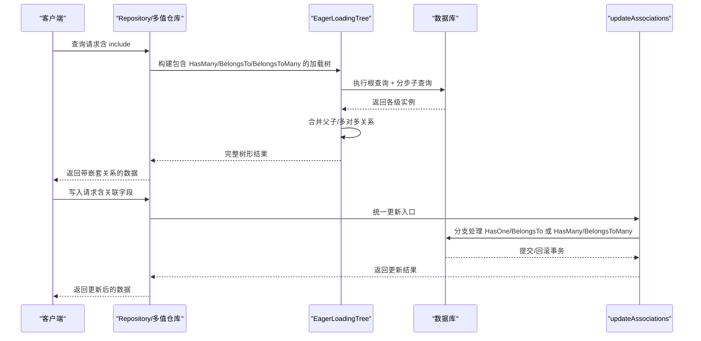

**图表来源**
- [eager-loading-tree.ts](file://packages/core/database/src/eager-loading/eager-loading-tree.ts#L102-L190)
- [multiple-relation-repository.ts](file://packages/core/database/src/relation-repository/multiple-relation-repository.ts#L44-L116)
- [update-associations.ts](file://packages/core/database/src/update-associations.ts#L222-L408)

## 详细组件分析

### BelongsToField（外键关系）
- 关系绑定：在源模型上创建 belongsTo 关系，自动推导 foreignKey 与 targetKey，默认禁用外键约束以提升灵活性
- 键类型校验：确保外键字段与目标键字段类型一致，否则抛出错误
- 引用约束：生成引用映射，支持 onDelete 等级的级联策略
- 索引管理：为外键字段添加索引，提升查询性能

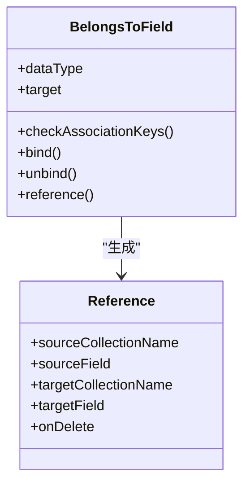

**图表来源**
- [belongs-to-field.ts](file://packages/core/database/src/fields/belongs-to-field.ts#L16-L137)

**章节来源**
- [belongs-to-field.ts](file://packages/core/database/src/fields/belongs-to-field.ts#L50-L137)

### HasManyField（一对多关系）
- 关系绑定：在源模型上创建 hasMany 关系，自动推导 foreignKey 与 sourceKey
- 键类型校验：确保外键字段与源键字段类型一致
- 排序支持：当启用 sortable 时，为目标集合动态添加排序字段
- 索引管理：为目标集合外键字段添加索引

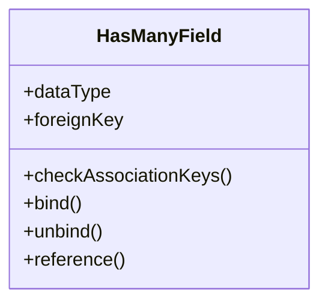

**图表来源**
- [has-many-field.ts](file://packages/core/database/src/fields/has-many-field.ts#L85-L212)

**章节来源**
- [has-many-field.ts](file://packages/core/database/src/fields/has-many-field.ts#L110-L212)

### BelongsToManyField（多对多关系）
- through 表：若未指定 through，将根据源/目标集合名自动生成中间表名
- 双键校验：校验 foreignKey 与 sourceKey 类型匹配，otherKey 与 targetKey 类型匹配
- 绑定策略：在源模型上创建 belongsToMany 关系，设置 through、scope、paranoid、unique 等选项
- 索引管理：为 through 表的两个键添加索引

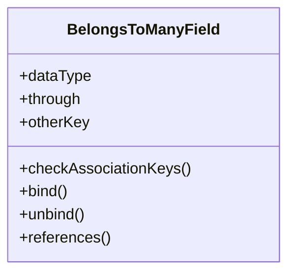

**图表来源**
- [belongs-to-many-field.ts](file://packages/core/database/src/fields/belongs-to-many-field.ts#L18-L216)

**章节来源**
- [belongs-to-many-field.ts](file://packages/core/database/src/fields/belongs-to-many-field.ts#L64-L216)

### 急加载树（EagerLoadingTree）
- include 解析：遍历 include 选项，识别 HasOne/HasMany/BelongsTo/BelongsToMany 并注入必要属性
- 分步加载：先加载根节点，再按层级加载子节点，避免 N+1 查询
- 合并策略：根据不同关联类型将子实例合并到父实例的 accessor 上
- 递归加载：支持 BelongsTo 的递归父链加载

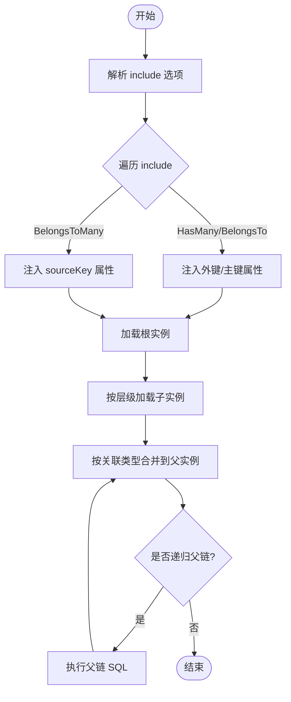

**图表来源**
- [eager-loading-tree.ts](file://packages/core/database/src/eager-loading/eager-loading-tree.ts#L102-L190)
- [eager-loading-tree.ts](file://packages/core/database/src/eager-loading/eager-loading-tree.ts#L360-L442)
- [eager-loading-tree.ts](file://packages/core/database/src/eager-loading/eager-loading-tree.ts#L478-L563)

**章节来源**
- [eager-loading-tree.ts](file://packages/core/database/src/eager-loading/eager-loading-tree.ts#L102-L579)

### 多值关系仓库（MultipleRelationRepository）
- 查询：支持 include 过滤器与分页，内部通过 HasOne 代理 pivot 表进行过滤
- 计数：使用 COUNT(DISTINCT targetKey) 聚合统计，避免重复计数
- 更新：批量更新目标实例，触发保存钩子与关联更新

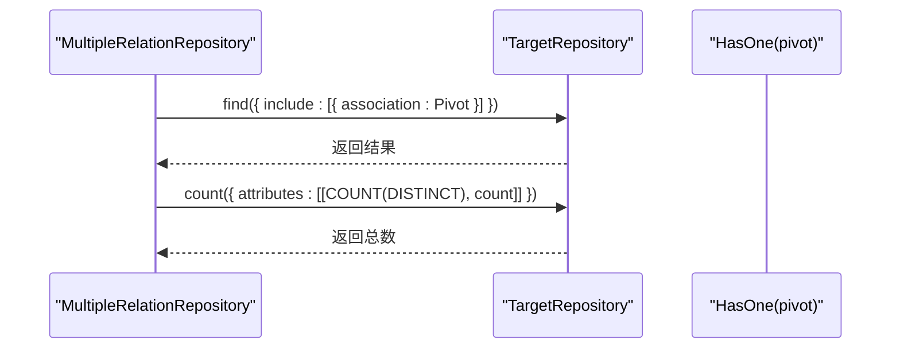

**图表来源**
- [multiple-relation-repository.ts](file://packages/core/database/src/relation-repository/multiple-relation-repository.ts#L44-L116)

**章节来源**
- [multiple-relation-repository.ts](file://packages/core/database/src/relation-repository/multiple-relation-repository.ts#L28-L215)

### 更新流程（updateAssociations）
- 入口：根据关联类型分支处理单值（HasOne/BelongsTo）与多值（HasMany/BelongsToMany）
- 事务：统一开启/提交/回滚事务，保证一致性
- through 表：支持 belongsToMany 的中间表字段更新

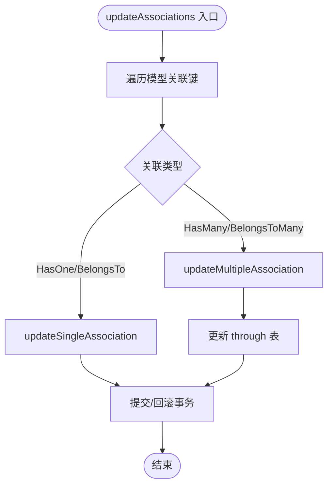

**图表来源**
- [update-associations.ts](file://packages/core/database/src/update-associations.ts#L222-L408)

**章节来源**
- [update-associations.ts](file://packages/core/database/src/update-associations.ts#L122-L181)

### 示例：邻接表树（一对多外键）
邻接表通过 parentId 外键实现树形结构，belongsTo 指向父节点，hasMany 指向子节点，形成典型的“一对多”关系。

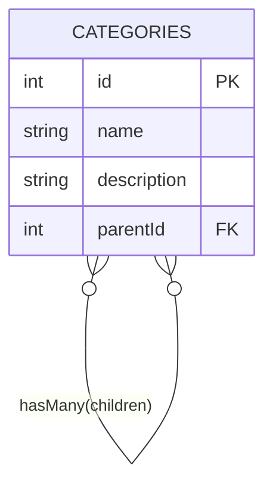

**图表来源**
- [adjacency-list.ts](file://examples/database/collections/tree/adjacency-list.ts#L22-L47)

**章节来源**
- [adjacency-list.ts](file://examples/database/collections/tree/adjacency-list.ts#L35-L45)

### 数组型 belongsToArray（扩展）
该插件提供数组型 belongsToArray 字段，用于将目标集合的主键值存储为数组，结合 BelongsToArrayAssociation 实现 JSON 数组到实体的关联查询。

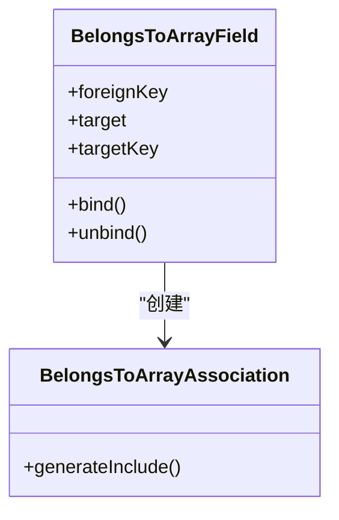

**图表来源**
- [belongs-to-array-field.ts](file://packages/plugins/@nocobase/plugin-field-m2m-array/src/server/belongs-to-array-field.ts#L125-L143)
- [belongs-to-array-repository.ts](file://packages/core/database/src/belongs-to-array/belongs-to-array-repository.ts#L23-L76)

**章节来源**
- [belongs-to-array-field.ts](file://packages/plugins/@nocobase/plugin-field-m2m-array/src/server/belongs-to-array-field.ts#L118-L151)
- [belongs-to-array-repository.ts](file://packages/core/database/src/belongs-to-array/belongs-to-array-repository.ts#L1-L76)

## 依赖分析
- 字段类依赖：BelongsToField/HasManyField/BelongsToManyField 依赖 Sequelize 的关联选项与类型系统
- 加载策略：EagerLoadingTree 依赖 include 语法与关联类型判断
- 更新流程：updateAssociations 依赖事务与关联类型分支
- 引用完整性：referential-integrity-check 提供 onDelete 级联策略（CASCADE/SET NULL/RESTRICT）

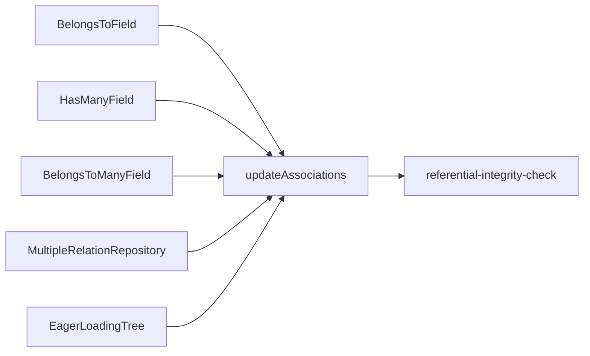

**图表来源**
- [belongs-to-field.ts](file://packages/core/database/src/fields/belongs-to-field.ts#L79-L137)
- [has-many-field.ts](file://packages/core/database/src/fields/has-many-field.ts#L138-L212)
- [belongs-to-many-field.ts](file://packages/core/database/src/fields/belongs-to-many-field.ts#L118-L216)
- [multiple-relation-repository.ts](file://packages/core/database/src/relation-repository/multiple-relation-repository.ts#L124-L176)
- [eager-loading-tree.ts](file://packages/core/database/src/eager-loading/eager-loading-tree.ts#L192-L579)
- [update-associations.ts](file://packages/core/database/src/update-associations.ts#L122-L181)
- [referential-integrity-check.ts](file://packages/core/database/src/features/referential-integrity-check.ts#L41-L79)

**章节来源**
- [referential-integrity-check.ts](file://packages/core/database/src/features/referential-integrity-check.ts#L41-L79)

## 性能考虑
- 分页查询
  - 传统分页：通过列表动作将 page/pageSize 转换为 offset/limit，适用于中小数据量
  - 游标分页：针对大表（百万级）推荐使用 cursorBuilder 的 chunkWithCursor，避免 deep pagination 的性能损耗
- 聚合统计
  - 多值关系仓库使用 COUNT(DISTINCT targetKey) 避免重复计数
- 急加载优化
  - EagerLoadingTree 按关联类型注入必要属性，减少额外查询
  - BelongsToMany 通过 pivot 关联精确过滤，避免全表扫描
- 索引与键类型
  - 字段绑定阶段自动为外键/through 键添加索引，确保查询效率
  - 键类型严格校验，避免隐式转换导致的性能问题

**章节来源**
- [repository.ts](file://packages/core/database/src/repository.ts#L492-L527)
- [repository.ts](file://packages/core/database/src/repository.ts#L500-L512)
- [multiple-relation-repository.ts](file://packages/core/database/src/relation-repository/multiple-relation-repository.ts#L85-L116)
- [eager-loading-tree.ts](file://packages/core/database/src/eager-loading/eager-loading-tree.ts#L157-L174)

## 故障排查指南
- 外键类型不匹配
  - 现象：绑定关系时报错，提示外键与目标键类型不一致
  - 处理：检查字段类型定义，确保 foreignKey 与 targetKey 类型一致
- 级联行为异常
  - 现象：删除父记录后子记录未按预期处理
  - 处理：确认 onDelete 策略（CASCADE/SET NULL/RESTRICT），参考引用完整性检查逻辑
- N+1 查询
  - 现象：加载子集合时出现大量额外查询
  - 处理：使用 include 急加载或 EagerLoadingTree，避免逐条访问 accessor
- 大数据集性能瓶颈
  - 现象：分页/查询缓慢
  - 处理：启用游标分页，确保相关字段有索引；避免不必要的 include 层级
- 内存泄漏
  - 现象：长时间运行后内存占用持续增长
  - 处理：避免在循环中累积大型对象；及时释放临时查询结果；合理使用分页/游标

**章节来源**
- [belongs-to-field.ts](file://packages/core/database/src/fields/belongs-to-field.ts#L64-L76)
- [has-many-field.ts](file://packages/core/database/src/fields/has-many-field.ts#L124-L136)
- [belongs-to-many-field.ts](file://packages/core/database/src/fields/belongs-to-many-field.ts#L96-L116)
- [referential-integrity-check.ts](file://packages/core/database/src/features/referential-integrity-check.ts#L57-L77)
- [eager-loading-tree.ts](file://packages/core/database/src/eager-loading/eager-loading-tree.ts#L360-L442)

## 结论
NocoBase 的一对多关系建模以字段类为核心，结合关系仓库、急加载树与统一更新流程，提供了从定义、查询到更新的完整闭环。通过严格的键类型校验、索引管理与级联策略，配合分页与游标分页等优化手段，能够在复杂业务场景下保持高性能与高可靠性。建议在设计阶段明确外键与 through 键配置，在查询阶段优先使用 include 与急加载树，并在大规模数据场景下采用游标分页与聚合统计策略。

## 附录
- 关系字段配置要点
  - belongsTo：target、foreignKey、targetKey、onDelete
  - hasMany：target、foreignKey、sourceKey、onDelete、constraints、sortable
  - belongsToMany：target、through、foreignKey、otherKey、targetKey、sourceKey、throughScope、throughParanoid、throughUnique
- 查询优化建议
  - 使用 include 与 EagerLoadingTree 减少 N+1
  - 对外键字段建立索引
  - 大数据量采用游标分页
  - 使用 COUNT(DISTINCT) 聚合统计