# 关系建模

<cite>
**本文档中引用的文件**   
- [belongs-to-field.ts](file://packages/core/database/src/fields/belongs-to-field.ts)
- [has-one-field.ts](file://packages/core/database/src/fields/has-one-field.ts)
- [has-many-field.ts](file://packages/core/database/src/fields/has-many-field.ts)
- [belongs-to-many-field.ts](file://packages/core/database/src/fields/belongs-to-many-field.ts)
- [relation-field.ts](file://packages/core/database/src/fields/relation-field.ts)
- [relation-repository.ts](file://packages/core/database/src/relation-repository/relation-repository.ts)
- [eager-loading-tree.ts](file://packages/core/database/src/eager-loading/eager-loading-tree.ts)
- [collection.ts](file://packages/plugins/@nocobase/plugin-data-source-main/src/server/collections/collections.ts)
- [fields.ts](file://packages/plugins/@nocobase/plugin-data-source-main/src/server/collections/fields.ts)
</cite>

## 目录
1. [简介](#简介)
2. [关系类型实现机制](#关系类型实现机制)
3. [关系字段配置参数](#关系字段配置参数)
4. [关系查询优化与性能考虑](#关系查询优化与性能考虑)
5. [多对多关系中间表配置](#多对多关系中间表配置)
6. [复杂关系模型设计模式](#复杂关系模型设计模式)
7. [最佳实践与常见问题解决方案](#最佳实践与常见问题解决方案)

## 简介

NocoBase提供了一套完整的数据关系建模系统，支持多种关系类型，包括一对一、一对多、多对一和多对多关系。该系统基于Sequelize ORM构建，提供了丰富的配置选项和优化策略，使开发者能够灵活地定义和管理数据模型之间的关系。

关系建模在NocoBase中通过字段类型实现，每种关系类型都有对应的字段接口，如"一对一"、"一对多"、"多对一"和"多对多"。这些关系字段不仅定义了数据表之间的关联方式，还提供了级联操作、懒加载/急加载等高级功能。

**Section sources**
- [belongs-to-field.ts](file://packages/core/database/src/fields/belongs-to-field.ts#L1-L177)
- [has-one-field.ts](file://packages/core/database/src/fields/has-one-field.ts#L1-L243)

## 关系类型实现机制

NocoBase实现了四种基本的关系类型：belongs-to（多对一）、has-one（一对一）、has-many（一对多）和belongs-to-many（多对多）。每种关系类型都有其特定的实现机制和使用场景。

### 多对一关系 (belongs-to)

belongs-to关系表示一个模型属于另一个模型。在数据库层面，这通常通过在外键表中添加一个指向主表主键的外键来实现。

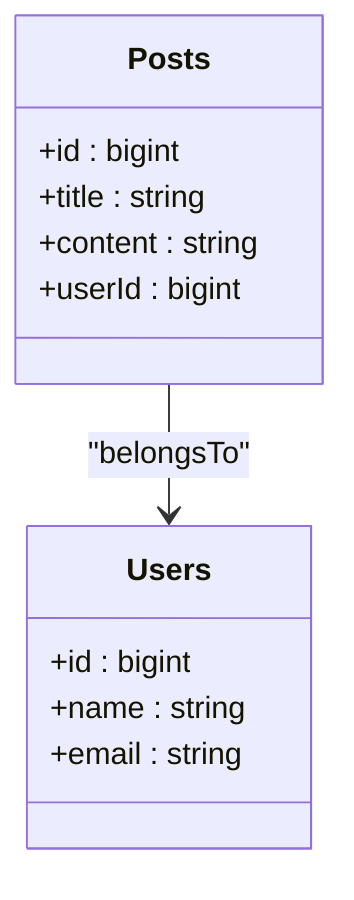

**Diagram sources**
- [belongs-to-field.ts](file://packages/core/database/src/fields/belongs-to-field.ts#L1-L177)

### 一对一关系 (has-one)

has-one关系表示一个模型有一个关联的模型实例。这种关系通常用于将一个大表拆分为多个小表，以提高查询性能或实现数据隔离。

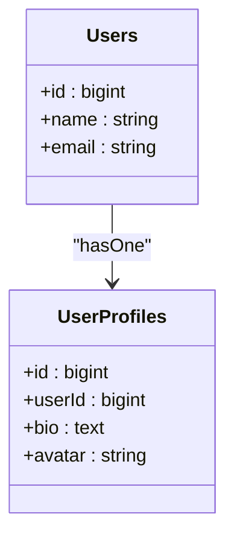

**Diagram sources**
- [has-one-field.ts](file://packages/core/database/src/fields/has-one-field.ts#L1-L243)

### 一对多关系 (has-many)

has-many关系表示一个模型可以有多个关联的模型实例。这是最常见的一种关系类型，用于表示主从关系。

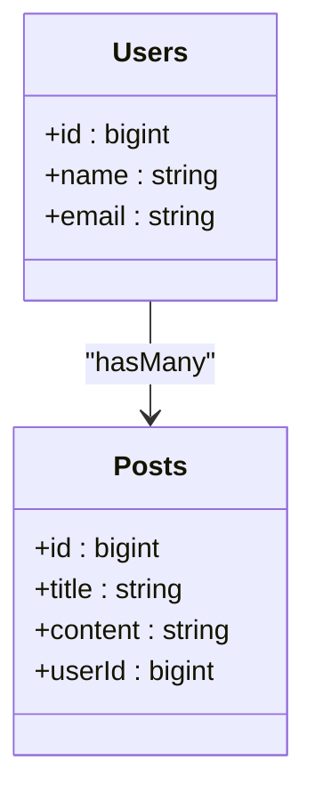

**Diagram sources**
- [has-many-field.ts](file://packages/core/database/src/fields/has-many-field.ts#L1-L252)

### 多对多关系 (belongs-to-many)

belongs-to-many关系表示两个模型之间存在多对多的关联。这种关系需要通过一个中间表（也称为连接表或关联表）来实现。

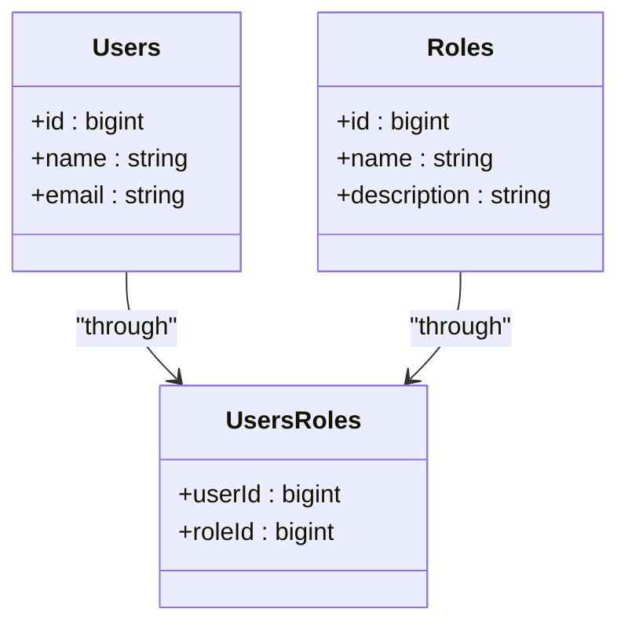

**Diagram sources**
- [belongs-to-many-field.ts](file://packages/core/database/src/fields/belongs-to-many-field.ts#L1-L247)

## 关系字段配置参数

NocoBase的关系字段提供了丰富的配置选项，允许开发者精确控制关系的行为和特性。

### 基础配置参数

所有关系字段都继承自`RelationField`基类，共享一些基础配置参数：

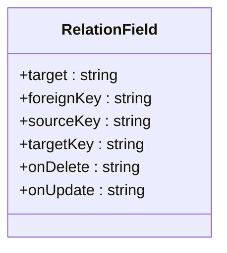

**Diagram sources**
- [relation-field.ts](file://packages/core/database/src/fields/relation-field.ts#L1-L90)

#### target
目标集合名称，指定关系关联到哪个数据表。如果未指定，则默认使用字段名称。

#### foreignKey
外键字段名称，用于存储关联记录的主键值。系统会根据命名约定自动生成默认值。

#### sourceKey
源键字段名称，通常是源模型的主键。默认值为模型的主键属性。

#### targetKey
目标键字段名称，通常是目标模型的主键。默认值为模型的主键属性。

### 级联操作配置

级联操作定义了当主记录被删除或更新时，关联记录应该如何处理。

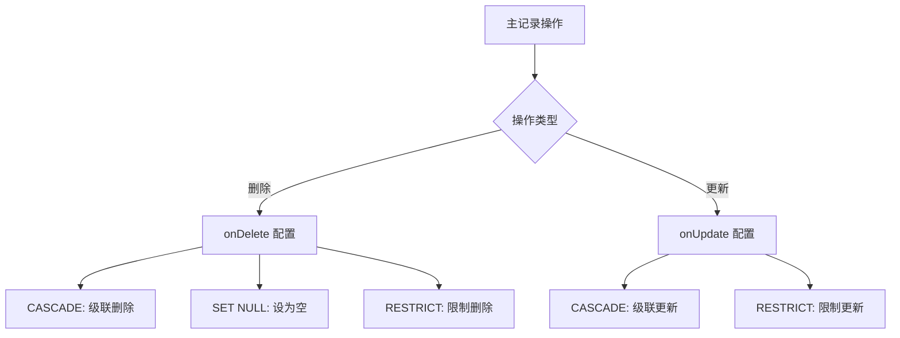

**Diagram sources**
- [belongs-to-field.ts](file://packages/core/database/src/fields/belongs-to-field.ts#L42-L48)
- [has-many-field.ts](file://packages/core/database/src/fields/has-many-field.ts#L61-L68)

### 懒加载与急加载策略

NocoBase支持灵活的加载策略，允许开发者根据性能需求选择合适的加载方式。

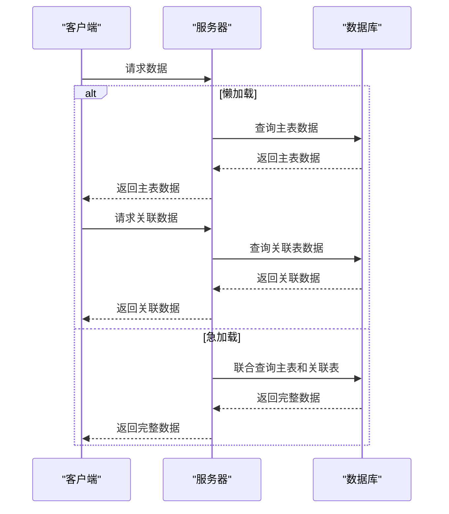

**Diagram sources**
- [eager-loading-tree.ts](file://packages/core/database/src/eager-loading/eager-loading-tree.ts#L1-L387)

## 关系查询优化与性能考虑

为了确保关系查询的高性能，NocoBase提供了一系列优化策略和技术。

### 查询优化器

NocoBase的查询优化器会自动分析查询语句，并选择最优的执行计划。

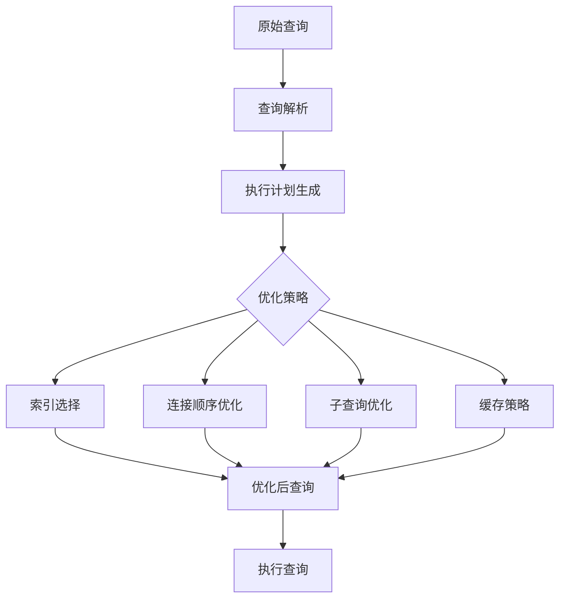

**Diagram sources**
- [eager-loading-tree.ts](file://packages/core/database/src/eager-loading/eager-loading-tree.ts#L100-L189)

### 索引优化

合理使用索引是提高查询性能的关键。NocoBase会自动为外键字段创建索引。

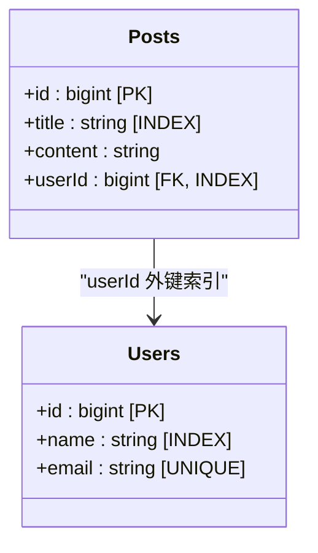

**Diagram sources**
- [has-many-field.ts](file://packages/core/database/src/fields/has-many-field.ts#L192-L193)
- [belongs-to-many-field.ts](file://packages/core/database/src/fields/belongs-to-many-field.ts#L211-L212)

### 缓存策略

NocoBase实现了多级缓存机制，包括查询结果缓存和关系元数据缓存。

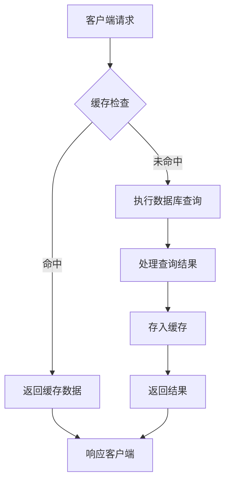

**Diagram sources**
- [relation-repository.ts](file://packages/core/database/src/relation-repository/relation-repository.ts#L145-L179)

## 多对多关系中间表配置

多对多关系需要通过中间表来实现，NocoBase提供了灵活的中间表配置选项。

### 中间表自动生成

当定义belongs-to-many关系时，如果指定的中间表不存在，系统会自动创建。

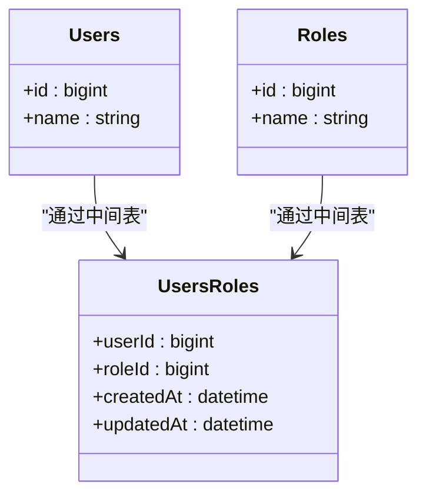

**Diagram sources**
- [belongs-to-many-field.ts](file://packages/core/database/src/fields/belongs-to-many-field.ts#L142-L164)

### 中间表手动配置

开发者也可以手动创建和配置中间表，以满足特定的业务需求。

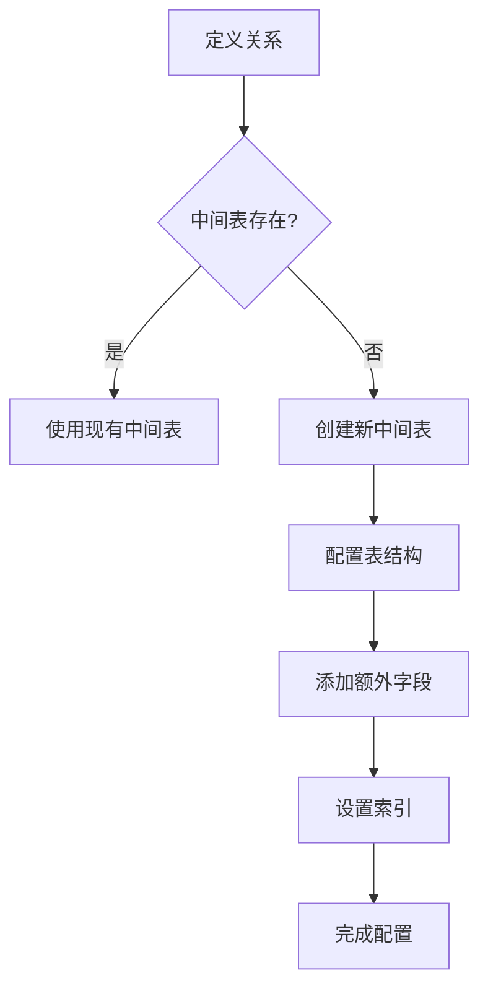

**Diagram sources**
- [belongs-to-many-field.ts](file://packages/core/database/src/fields/belongs-to-many-field.ts#L142-L164)

## 复杂关系模型设计模式

NocoBase支持多种复杂的关系模型设计模式，满足不同的业务场景需求。

### 递归关系

递归关系用于表示树形结构或层级关系，如组织架构、分类目录等。

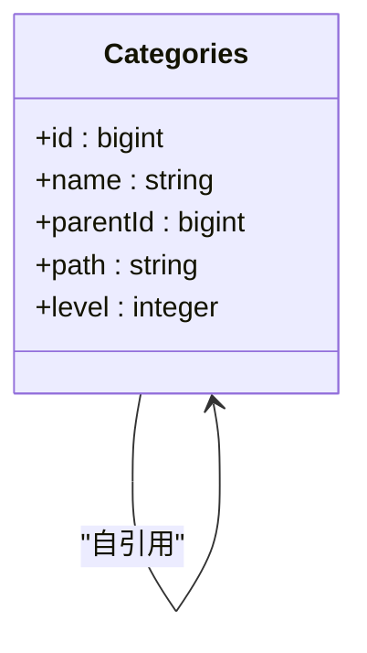

**Diagram sources**
- [tree-collection.ts](file://packages/plugins/@nocobase/plugin-collection-tree/src/server/tree-collection.ts#L1-L21)
- [adjacency-list-repository.ts](file://packages/plugins/@nocobase/plugin-collection-tree/src/server/adjacency-list-repository.ts#L1-L126)

### 多态关联

多态关联允许一个模型与多个不同类型的模型建立关系。

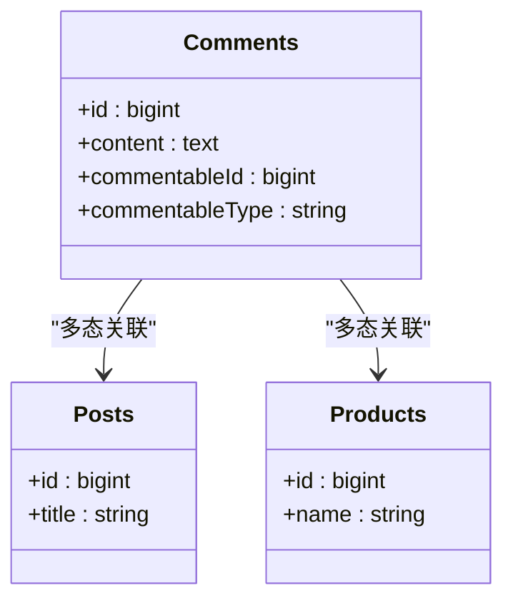

**Diagram sources**
- [relation-field.ts](file://packages/core/database/src/fields/relation-field.ts#L55-L72)

## 最佳实践与常见问题解决方案

### 关系字段命名规范

遵循一致的命名规范有助于提高代码的可读性和可维护性。

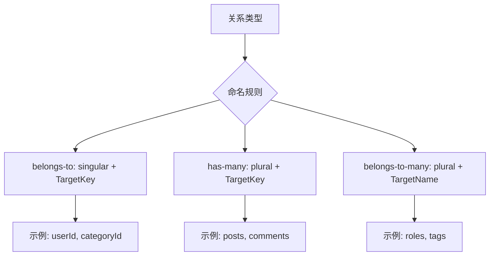

**Diagram sources**
- [belongs-to-field.ts](file://packages/core/database/src/fields/belongs-to-field.ts#L58-L59)
- [has-many-field.ts](file://packages/core/database/src/fields/has-many-field.ts#L95-L96)

### 性能优化建议

针对常见的性能问题，提供以下优化建议：

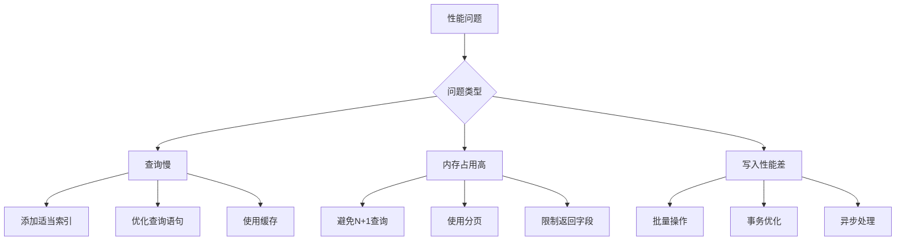

**Diagram sources**
- [eager-loading-tree.ts](file://packages/core/database/src/eager-loading/eager-loading-tree.ts#L192-L204)
- [relation-repository.ts](file://packages/core/database/src/relation-repository/relation-repository.ts#L84-L118)

### 常见问题排查

针对关系建模中的常见问题，提供排查指南：

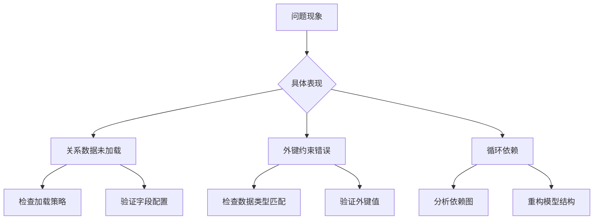

**Diagram sources**
- [relation-field.ts](file://packages/core/database/src/fields/relation-field.ts#L55-L72)
- [belongs-to-many-field.ts](file://packages/core/database/src/fields/belongs-to-many-field.ts#L105-L115)