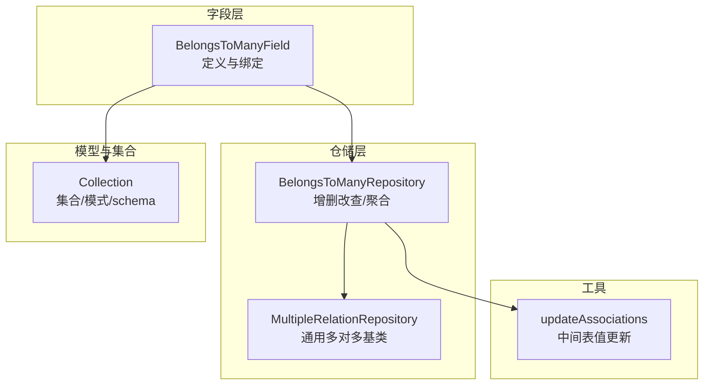
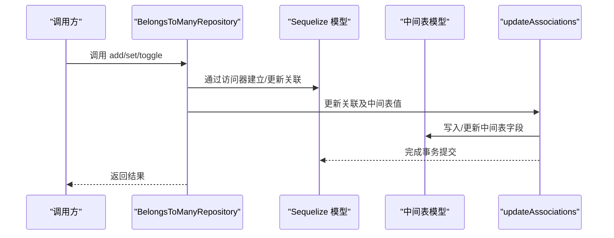
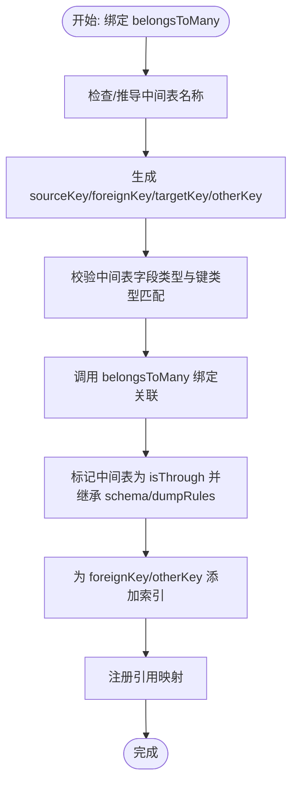
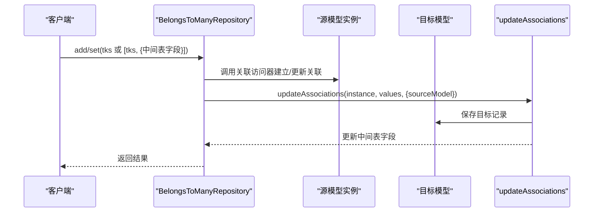
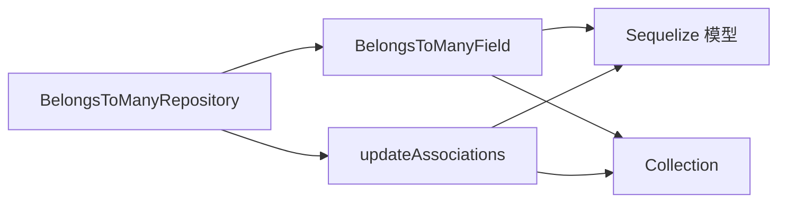

# 多对多关系

<cite>
**本文引用的文件列表**
- [belongs-to-many-field.ts](file://packages/core/database/src/fields/belongs-to-many-field.ts)
- [belongs-to-many-repository.ts](file://packages/core/database/src/relation-repository/belongs-to-many-repository.ts)
- [update-associations.ts](file://packages/core/database/src/update-associations.ts)
- [multiple-relation-repository.ts](file://packages/core/database/src/relation-repository/multiple-relation-repository.ts)
- [collection.ts](file://packages/core/database/src/collection.ts)
- [add-action.test.ts](file://packages/core/actions/src/__tests__/add-action.test.ts)
- [set-action.test.ts](file://packages/core/actions/src/__tests__/set-action.test.ts)
</cite>

## 目录
1. [简介](#简介)
2. [项目结构与定位](#项目结构与定位)
3. [核心组件](#核心组件)
4. [架构总览](#架构总览)
5. [详细组件解析](#详细组件解析)
6. [依赖关系分析](#依赖关系分析)
7. [性能与最佳实践](#性能与最佳实践)
8. [故障排查指南](#故障排查指南)
9. [结论](#结论)
10. [附录：常见配置与示例路径](#附录常见配置与示例路径)

## 简介
本篇文档系统化阐述 NocoBase 中“多对多（belongs-to-many）”关系的建模与实现，覆盖以下主题：
- 中间表（through）的自动/手动配置与外键映射
- 外键（foreignKey）、源键（sourceKey）、目标键（targetKey）、其他键（otherKey）的生成与校验
- 级联与约束策略（constraints、onDelete）
- 中间表字段的自定义与更新
- 关系字段的生命周期绑定与索引建立
- 实际使用示例与常见问题（一致性维护、复杂查询性能）

## 项目结构与定位
- 多对多关系由“字段层”和“仓储层”共同实现：
  - 字段层负责关系声明、中间表推导与校验、Sequelize 关联绑定
  - 仓储层负责 CRUD、聚合、批量设置/切换等业务操作
- 测试用例展示了通过资源动作（add/set）为多对多关系写入中间表值，并验证中间表字段的一致性

**图表来源**
- [belongs-to-many-field.ts](file://packages/core/database/src/fields/belongs-to-many-field.ts#L118-L216)
- [belongs-to-many-repository.ts](file://packages/core/database/src/relation-repository/belongs-to-many-repository.ts#L21-L252)
- [multiple-relation-repository.ts](file://packages/core/database/src/relation-repository/multiple-relation-repository.ts#L28-L215)
- [update-associations.ts](file://packages/core/database/src/update-associations.ts#L122-L181)
- [collection.ts](file://packages/core/database/src/collection.ts#L1007-L1021)

**章节来源**
- [belongs-to-many-field.ts](file://packages/core/database/src/fields/belongs-to-many-field.ts#L118-L216)
- [belongs-to-many-repository.ts](file://packages/core/database/src/relation-repository/belongs-to-many-repository.ts#L21-L252)
- [multiple-relation-repository.ts](file://packages/core/database/src/relation-repository/multiple-relation-repository.ts#L28-L215)
- [update-associations.ts](file://packages/core/database/src/update-associations.ts#L122-L181)
- [collection.ts](file://packages/core/database/src/collection.ts#L1007-L1021)

## 核心组件
- BelongsToManyField：负责多对多字段的定义、中间表推导、键类型匹配校验、Sequelize 关联绑定、索引建立与引用映射
- BelongsToManyRepository：提供 add/set/toggle/remove/destroy 等多对多关系操作；支持通过中间表名传入中间表字段值
- MultipleRelationRepository：多对多关系的通用基类，封装 find/count 等基础能力
- updateAssociations：统一处理模型与关联的更新，包括中间表值更新
- Collection：集合层，提供 schema、dumpRules 等属性，用于中间表集合的创建与命名空间控制

**章节来源**
- [belongs-to-many-field.ts](file://packages/core/database/src/fields/belongs-to-many-field.ts#L18-L216)
- [belongs-to-many-repository.ts](file://packages/core/database/src/relation-repository/belongs-to-many-repository.ts#L21-L252)
- [multiple-relation-repository.ts](file://packages/core/database/src/relation-repository/multiple-relation-repository.ts#L28-L215)
- [update-associations.ts](file://packages/core/database/src/update-associations.ts#L122-L181)
- [collection.ts](file://packages/core/database/src/collection.ts#L1007-L1021)

## 架构总览
下图展示 belongs-to-many 关系从字段定义到仓储操作的关键交互流程。

**图表来源**
- [belongs-to-many-repository.ts](file://packages/core/database/src/relation-repository/belongs-to-many-repository.ts#L46-L73)
- [update-associations.ts](file://packages/core/database/src/update-associations.ts#L122-L181)

## 详细组件解析

### BelongsToManyField：字段定义与绑定
- 中间表推导
  - 若未显式指定 through，则按“源集合名 + 目标集合名”的字母序拼接并转为驼峰命名
- 键生成与校验
  - sourceKey 默认使用源模型主键
  - foreignKey 默认基于源模型名与 sourceKey 组合生成
  - targetKey 默认使用目标模型主键
  - otherKey 默认基于目标模型名与 targetKey 组合生成
  - 校验中间表字段类型与对应键类型一致，否则抛出错误
- 关联绑定
  - 通过 Sequelize 的 belongsToMany 创建关联
  - 将中间表集合标记为 isThrough，并继承源/目标集合的 dumpRules 与 schema
  - 自动为中间表添加 foreignKey 与其他键的索引
  - 记录引用映射，便于后续迁移/导出
- 生命周期
  - 绑定成功后从待处理字段列表移除
  - unbind 时清理引用与模型关联

**图表来源**
- [belongs-to-many-field.ts](file://packages/core/database/src/fields/belongs-to-many-field.ts#L64-L116)
- [belongs-to-many-field.ts](file://packages/core/database/src/fields/belongs-to-many-field.ts#L118-L216)

**章节来源**
- [belongs-to-many-field.ts](file://packages/core/database/src/fields/belongs-to-many-field.ts#L23-L37)
- [belongs-to-many-field.ts](file://packages/core/database/src/fields/belongs-to-many-field.ts#L64-L116)
- [belongs-to-many-field.ts](file://packages/core/database/src/fields/belongs-to-many-field.ts#L118-L216)

### BelongsToManyRepository：关系操作与中间表值更新
- 聚合（aggregate）
  - 通过 include + where 将中间表作为过滤条件，统计目标记录数
- 新增（create/add/set）
  - 支持传入中间表字段值（通过中间表名作为键），在建立关联后更新中间表
- 切换（toggle）
  - 先判断是否存在，存在则 remove，否则 add
- 删除（destroy）
  - 同时删除中间表与目标表记录（可结合 filter/filterByTk 精确控制）

**图表来源**
- [belongs-to-many-repository.ts](file://packages/core/database/src/relation-repository/belongs-to-many-repository.ts#L46-L73)
- [update-associations.ts](file://packages/core/database/src/update-associations.ts#L122-L181)

**章节来源**
- [belongs-to-many-repository.ts](file://packages/core/database/src/relation-repository/belongs-to-many-repository.ts#L22-L146)
- [update-associations.ts](file://packages/core/database/src/update-associations.ts#L89-L181)

### MultipleRelationRepository：通用多对多基类
- 提供 find/count 等通用能力
- 通过 HasOne 构造一个“透视”关联，将中间表作为过滤条件注入 include，从而实现多对多查询

**章节来源**
- [multiple-relation-repository.ts](file://packages/core/database/src/relation-repository/multiple-relation-repository.ts#L44-L116)

### updateAssociations：中间表值更新
- 支持在一次更新中同时处理多个关联与中间表字段
- 对 belongsToMany 关联，根据 foreignKey 与 otherKey 组合定位中间表记录并更新

**章节来源**
- [update-associations.ts](file://packages/core/database/src/update-associations.ts#L122-L181)

### Collection：集合与中间表
- 提供 collectionSchema 与 dumpRules，用于中间表集合的命名空间与迁移规则控制
- 在 belongsToMany 绑定时，中间表集合会继承这些属性

**章节来源**
- [collection.ts](file://packages/core/database/src/collection.ts#L1007-L1021)
- [belongs-to-many-field.ts](file://packages/core/database/src/fields/belongs-to-many-field.ts#L145-L164)

## 依赖关系分析
- 字段层依赖 Sequelize 的 belongsToMany 与模型 rawAttributes 类型信息进行键类型匹配
- 仓储层依赖字段层提供的 association（包含 foreignKey/otherKey/sourceKey/targetKey）
- updateAssociations 依赖 belongsToManyAssociations 获取中间表模型并执行更新
- Collection 层提供 schema/dumpRules，影响中间表集合的创建与迁移行为

**图表来源**
- [belongs-to-many-field.ts](file://packages/core/database/src/fields/belongs-to-many-field.ts#L118-L216)
- [belongs-to-many-repository.ts](file://packages/core/database/src/relation-repository/belongs-to-many-repository.ts#L21-L252)
- [update-associations.ts](file://packages/core/database/src/update-associations.ts#L122-L181)
- [collection.ts](file://packages/core/database/src/collection.ts#L1007-L1021)

**章节来源**
- [belongs-to-many-field.ts](file://packages/core/database/src/fields/belongs-to-many-field.ts#L118-L216)
- [belongs-to-many-repository.ts](file://packages/core/database/src/relation-repository/belongs-to-many-repository.ts#L21-L252)
- [update-associations.ts](file://packages/core/database/src/update-associations.ts#L122-L181)
- [collection.ts](file://packages/core/database/src/collection.ts#L1007-L1021)

## 性能与最佳实践
- 索引优化
  - 中间表自动为 foreignKey 与其他键添加索引，建议在高并发场景下确保这些列具备合适索引
- 查询优化
  - 使用 include + where 将中间表作为过滤条件，避免 N+1 查询
  - count 时使用 DISTINCT 目标键，避免重复计数
- 中间表字段更新
  - 通过中间表名传入对象一次性更新中间表字段，减少多次往返
- 级联与约束
  - 默认关闭外键约束以提升灵活性，若需强一致性，可在数据库层面开启约束或在应用层加强校验
- 复杂查询
  - 对于复杂过滤，优先在目标集合侧构造 include，利用中间表字段参与 where 条件

[本节为通用指导，无需特定文件引用]

## 故障排查指南
- 键类型不匹配
  - 现象：绑定时抛出“foreign key 与 source key 类型不匹配”或“other key 与 target key 类型不匹配”
  - 排查：确认中间表字段类型与对应键类型一致
- 主键缺失
  - 现象：源模型或目标模型无主键属性时报错
  - 排查：为目标模型设置唯一且稳定的主键
- 中间表不存在
  - 现象：未显式声明 through 时，中间表集合未创建
  - 排查：确保数据库已同步，或显式声明 through 并在集合中定义中间表字段
- 中间表数据不一致
  - 现象：中间表字段值未更新
  - 排查：确认通过中间表名传入了中间表字段值；或在创建/更新后调用 updateAssociations

**章节来源**
- [belongs-to-many-field.ts](file://packages/core/database/src/fields/belongs-to-many-field.ts#L64-L116)
- [belongs-to-many-field.ts](file://packages/core/database/src/fields/belongs-to-many-field.ts#L128-L134)
- [belongs-to-many-repository.ts](file://packages/core/database/src/relation-repository/belongs-to-many-repository.ts#L46-L73)
- [update-associations.ts](file://packages/core/database/src/update-associations.ts#L122-L181)

## 结论
NocoBase 的多对多关系通过“字段层 + 仓储层 + 工具层”的协作，实现了灵活而强大的中间表管理与中间表字段更新能力。其核心优势在于：
- 自动推导中间表与键，降低配置成本
- 强类型校验与索引建立保障一致性与性能
- 通过资源动作与统一更新工具，简化中间表字段的写入与维护

## 附录：常见配置与示例路径
- 中间表名称推导与显式声明
  - 参考：[中间表推导逻辑](file://packages/core/database/src/fields/belongs-to-many-field.ts#L23-L33)
- 外键/源键/目标键/其他键生成与校验
  - 参考：[键生成与类型校验](file://packages/core/database/src/fields/belongs-to-many-field.ts#L64-L116)
- 关联绑定与索引建立
  - 参考：[绑定与索引](file://packages/core/database/src/fields/belongs-to-many-field.ts#L118-L216)
- 通过中间表名传入中间表字段值
  - 参考：[add/set 示例](file://packages/core/actions/src/__tests__/add-action.test.ts#L146-L164)
  - 参考：[set 示例](file://packages/core/actions/src/__tests__/set-action.test.ts#L102-L120)
- 中间表值更新工具
  - 参考：[updateAssociations](file://packages/core/database/src/update-associations.ts#L122-L181)
- 集合 schema 与 dumpRules 对中间表的影响
  - 参考：[集合 schema](file://packages/core/database/src/collection.ts#L1007-L1021)
  - 参考：[中间表集合继承属性](file://packages/core/database/src/fields/belongs-to-many-field.ts#L145-L164)