# 高级关系

<cite>
**本文档中引用的文件**  
- [belongs-to-field.ts](file://packages/core/database/src/fields/belongs-to-field.ts)
- [has-one-field.ts](file://packages/core/database/src/fields/has-one-field.ts)
- [has-many-field.ts](file://packages/core/database/src/fields/has-many-field.ts)
- [belongs-to-many-field.ts](file://packages/core/database/src/fields/belongs-to-many-field.ts)
- [update-associations.ts](file://packages/core/database/src/update-associations.ts)
- [options-parser.ts](file://packages/core/database/src/options-parser.ts)
- [adjacency-list-repository.ts](file://packages/plugins/@nocobase/plugin-collection-tree/src/server/adjacency-list-repository.ts)
- [tree-collection.ts](file://packages/plugins/@nocobase/plugin-collection-tree/src/server/tree-collection.ts)
- [plugin.ts](file://packages/plugins/@nocobase/plugin-collection-tree/src/server/plugin.ts)
- [VariablesProvider.tsx](file://packages/core/client/src/variables/VariablesProvider.tsx)
- [query.ts](file://packages/plugins/@nocobase/plugin-data-visualization/src/server/actions/query.ts)
</cite>

## 目录
1. [简介](#简介)
2. [递归关系实现](#递归关系实现)
3. [多态关联与复合关系](#多态关联与复合关系)
4. [高级关系字段配置](#高级关系字段配置)
5. [性能优化策略](#性能优化策略)
6. [复杂查询调试与监控](#复杂查询调试与监控)
7. [结论](#结论)

## 简介

NocoBase 提供了强大的高级关系建模功能，支持递归关系、多态关联和复合关系等多种复杂数据模型。系统通过灵活的字段类型和关系配置，实现了对各种业务场景的全面支持。核心关系类型包括一对一（hasOne/belongsTo）、一对多（hasMany）和多对多（belongsToMany），这些关系类型构成了复杂数据模型的基础。

**Section sources**
- [belongs-to-field.ts](file://packages/core/database/src/fields/belongs-to-field.ts#L1-L177)
- [has-one-field.ts](file://packages/core/database/src/fields/has-one-field.ts#L1-L243)

## 递归关系实现

NocoBase 通过邻接表模式实现了递归关系，允许在同一个集合中建立父子关系。这种模式在组织结构、分类目录等场景中非常有用。

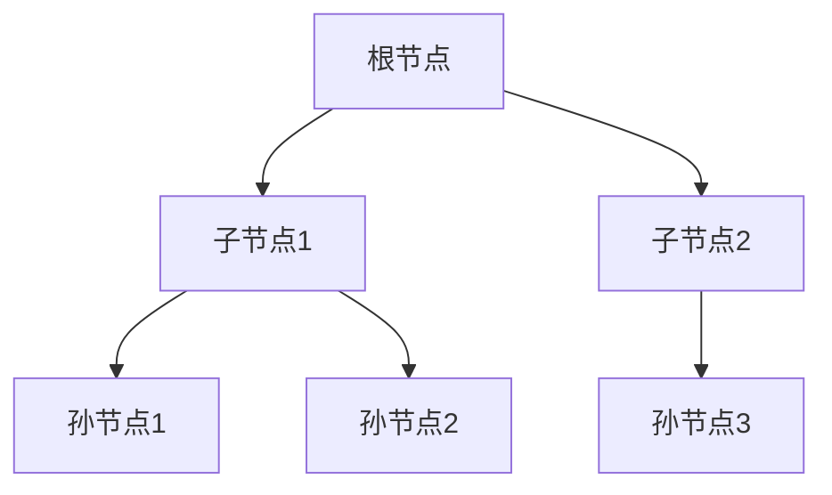

**Diagram sources**
- [tree-collection.ts](file://packages/plugins/@nocobase/plugin-collection-tree/src/server/tree-collection.ts#L1-L21)
- [adjacency-list-repository.ts](file://packages/plugins/@nocobase/plugin-collection-tree/src/server/adjacency-list-repository.ts#L1-L317)

递归关系的核心实现位于 `TreeCollection` 类和 `AdjacencyListRepository` 类中。`TreeCollection` 继承自 `Collection`，并重写了 `setRepository` 方法，将默认的仓库设置为 `AdjacencyListRepository`。这种设计模式实现了关注点分离，将树形结构的业务逻辑与数据访问逻辑分离。

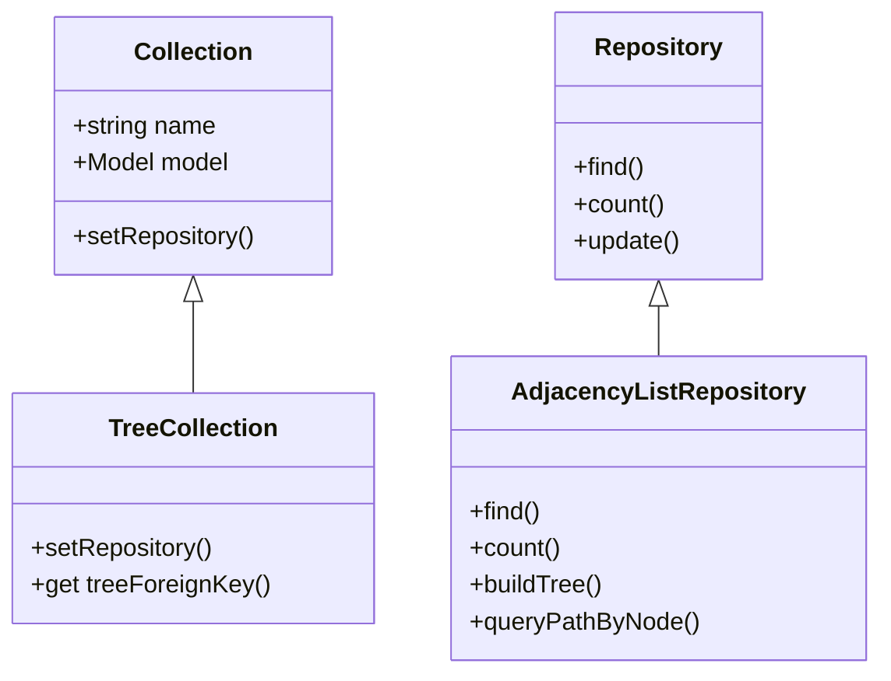

**Diagram sources**
- [tree-collection.ts](file://packages/plugins/@nocobase/plugin-collection-tree/src/server/tree-collection.ts#L1-L21)
- [adjacency-list-repository.ts](file://packages/plugins/@nocobase/plugin-collection-tree/src/server/adjacency-list-repository.ts#L1-L317)

**Section sources**
- [tree-collection.ts](file://packages/plugins/@nocobase/plugin-collection-tree/src/server/tree-collection.ts#L1-L21)
- [adjacency-list-repository.ts](file://packages/plugins/@nocobase/plugin-collection-tree/src/server/adjacency-list-repository.ts#L1-L317)

## 多态关联与复合关系

NocoBase 支持多态关联和复合关系，允许一个模型与多个其他模型建立关系。这种灵活性在实现通用功能（如评论、附件等）时非常有用。

### 多态关联实现

多态关联通过 `belongsToArray` 字段类型实现，允许一个字段关联到多个不同类型的集合。这种设计模式在处理通用关系时提供了极大的灵活性。

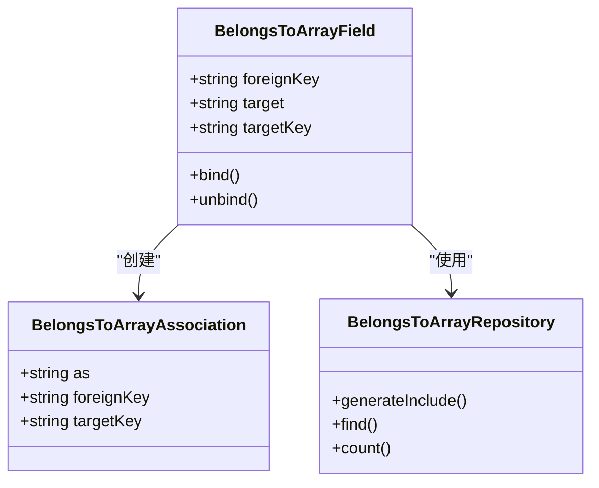

**Diagram sources**
- [belongs-to-array-field.ts](file://packages/plugins/@nocobase/plugin-field-m2m-array/src/server/belongs-to-array-field.ts#L1-L151)
- [belongs-to-array-repository.ts](file://packages/core/database/src/belongs-to-array/belongs-to-array-repository.ts#L1-L76)

### 复合关系实现

复合关系通过 `belongsToMany` 关系类型实现，使用中间表（through collection）来管理多对多关系。中间表自动创建并管理外键约束，确保数据完整性。

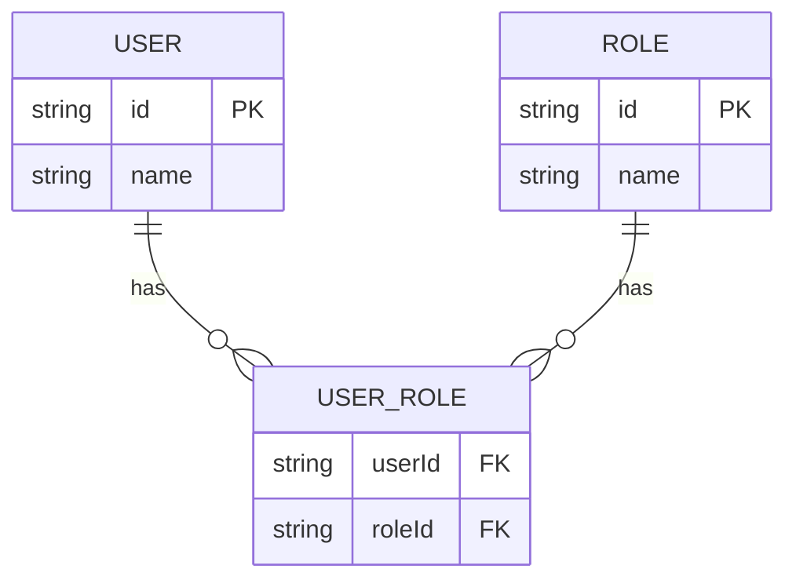

**Diagram sources**
- [belongs-to-many-field.ts](file://packages/core/database/src/fields/belongs-to-many-field.ts#L1-L247)

**Section sources**
- [belongs-to-array-field.ts](file://packages/plugins/@nocobase/plugin-field-m2m-array/src/server/belongs-to-array-field.ts#L1-L151)
- [belongs-to-array-repository.ts](file://packages/core/database/src/belongs-to-array/belongs-to-array-repository.ts#L1-L76)
- [belongs-to-many-field.ts](file://packages/core/database/src/fields/belongs-to-many-field.ts#L1-L247)

## 高级关系字段配置

NocoBase 提供了丰富的高级关系字段配置选项，包括动态关系类型、条件关联和嵌套关系查询。

### 动态关系类型

动态关系类型允许根据运行时条件确定关系目标。这种灵活性在实现复杂业务逻辑时非常有用。

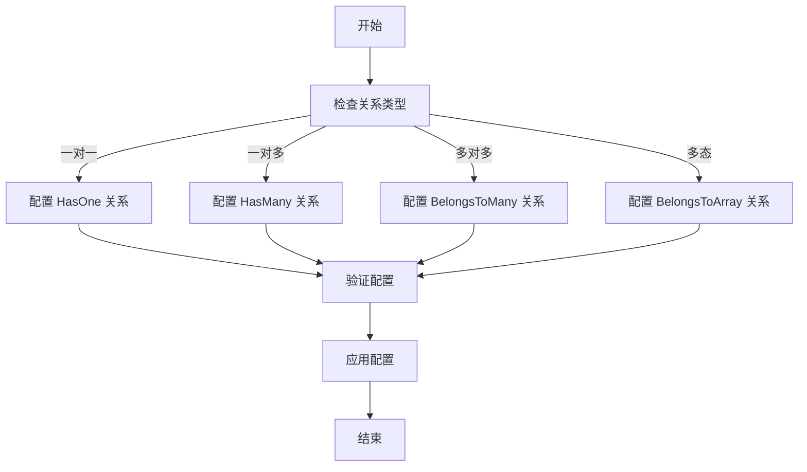

**Diagram sources**
- [belongs-to-field.ts](file://packages/core/database/src/fields/belongs-to-field.ts#L1-L177)
- [has-one-field.ts](file://packages/core/database/src/fields/has-one-field.ts#L1-L243)
- [has-many-field.ts](file://packages/core/database/src/fields/has-many-field.ts#L1-L252)
- [belongs-to-many-field.ts](file://packages/core/database/src/fields/belongs-to-many-field.ts#L1-L247)

### 条件关联

条件关联允许根据特定条件过滤关联数据。这种功能在实现复杂查询和数据过滤时非常有用。

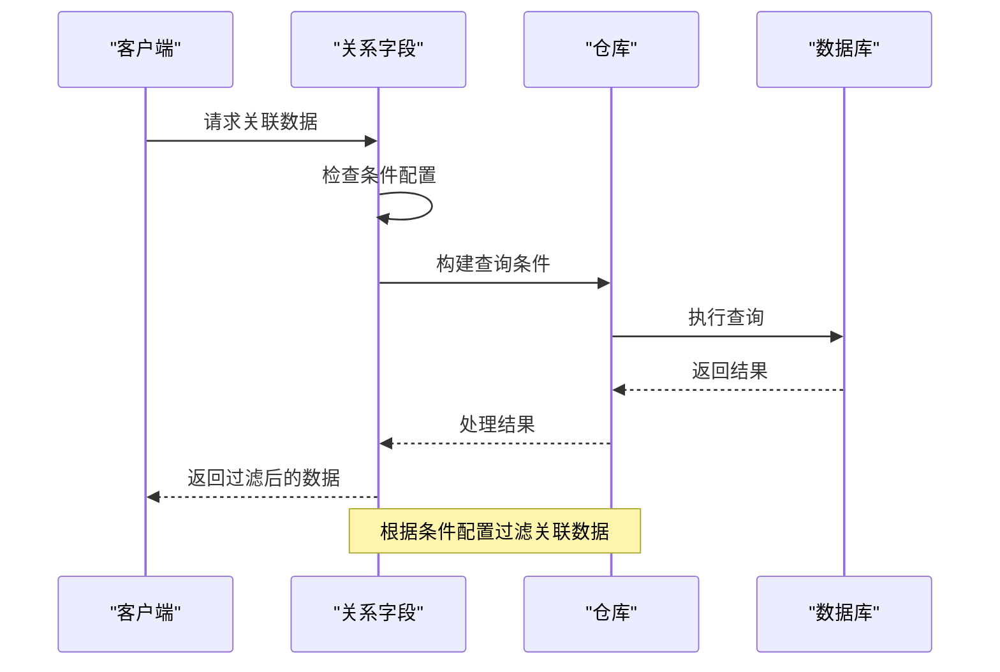

**Diagram sources**
- [options-parser.ts](file://packages/core/database/src/options-parser.ts#L378-L422)
- [update-associations.ts](file://packages/core/database/src/update-associations.ts#L217-L408)

### 嵌套关系查询

嵌套关系查询允许在单个请求中获取多层关联数据。这种功能在减少网络请求和提高性能方面非常有用。

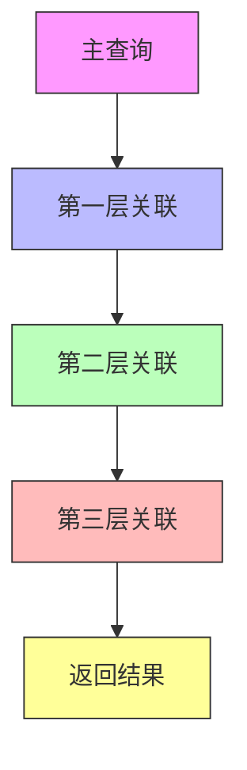

**Diagram sources**
- [VariablesProvider.tsx](file://packages/core/client/src/variables/VariablesProvider.tsx#L159-L198)
- [query.ts](file://packages/plugins/@nocobase/plugin-data-visualization/src/server/actions/query.ts#L156-L255)

**Section sources**
- [belongs-to-field.ts](file://packages/core/database/src/fields/belongs-to-field.ts#L1-L177)
- [has-one-field.ts](file://packages/core/database/src/fields/has-one-field.ts#L1-L243)
- [has-many-field.ts](file://packages/core/database/src/fields/has-many-field.ts#L1-L252)
- [belongs-to-many-field.ts](file://packages/core/database/src/fields/belongs-to-many-field.ts#L1-L247)
- [options-parser.ts](file://packages/core/database/src/options-parser.ts#L378-L422)
- [update-associations.ts](file://packages/core/database/src/update-associations.ts#L217-L408)
- [VariablesProvider.tsx](file://packages/core/client/src/variables/VariablesProvider.tsx#L159-L198)
- [query.ts](file://packages/plugins/@nocobase/plugin-data-visualization/src/server/actions/query.ts#L156-L255)

## 性能优化策略

NocoBase 实现了多种性能优化策略来处理复杂关系模型的查询性能问题。

### 查询分片

查询分片将大型查询分解为多个较小的查询，以提高查询效率和减少内存占用。

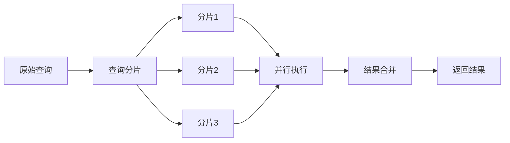

**Diagram sources**
- [adjacency-list-repository.ts](file://packages/plugins/@nocobase/plugin-collection-tree/src/server/adjacency-list-repository.ts#L63-L72)

### 缓存机制

缓存机制通过存储频繁访问的数据来减少数据库查询次数，提高系统响应速度。

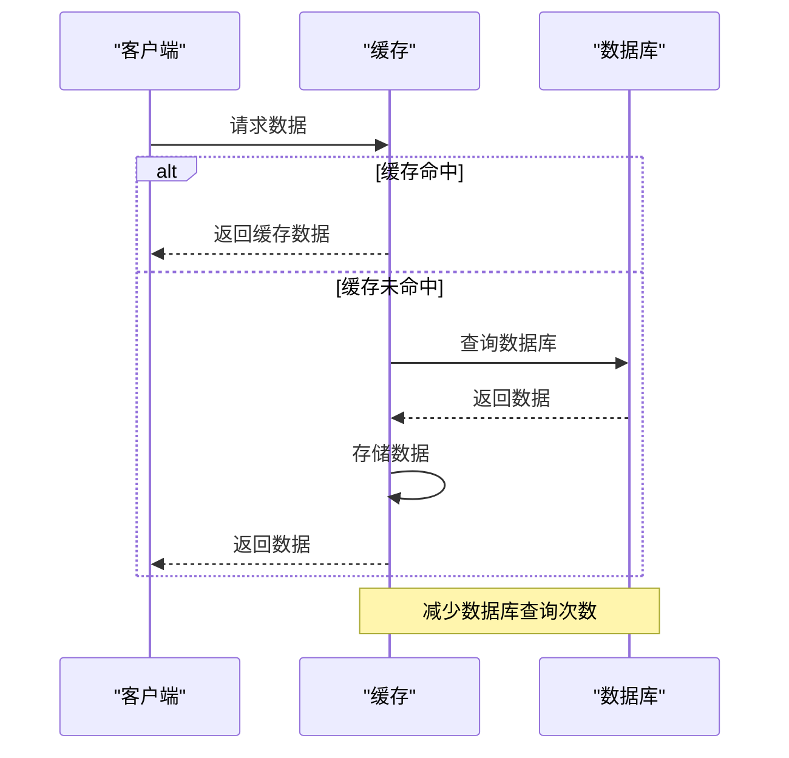

**Diagram sources**
- [query.ts](file://packages/plugins/@nocobase/plugin-data-visualization/src/server/actions/query.ts#L193-L236)

### 索引优化

索引优化通过在关键字段上创建索引来提高查询性能。系统自动为外键字段创建索引，确保关联查询的高效性。

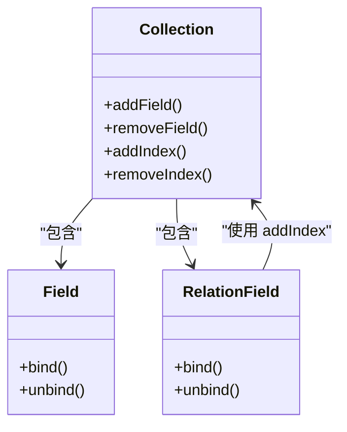

**Diagram sources**
- [belongs-to-field.ts](file://packages/core/database/src/fields/belongs-to-field.ts#L130-L131)
- [has-many-field.ts](file://packages/core/database/src/fields/has-many-field.ts#L192-L193)

**Section sources**
- [adjacency-list-repository.ts](file://packages/plugins/@nocobase/plugin-collection-tree/src/server/adjacency-list-repository.ts#L63-L72)
- [query.ts](file://packages/plugins/@nocobase/plugin-data-visualization/src/server/actions/query.ts#L193-L236)
- [belongs-to-field.ts](file://packages/core/database/src/fields/belongs-to-field.ts#L130-L131)
- [has-many-field.ts](file://packages/core/database/src/fields/has-many-field.ts#L192-L193)

## 复杂查询调试与监控

NocoBase 提供了完善的复杂查询调试和监控机制，帮助开发者识别和解决性能问题。

### 查询日志

系统记录所有查询操作的详细信息，包括执行时间、查询条件和结果数量。这些日志信息对于性能分析和问题排查非常有用。

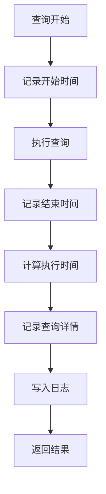

**Diagram sources**
- [adjacency-list-repository.ts](file://packages/plugins/@nocobase/plugin-collection-tree/src/server/adjacency-list-repository.ts#L60-L61)

### 性能监控

性能监控系统实时跟踪关键指标，如查询响应时间、数据库连接数和缓存命中率。这些指标帮助运维人员及时发现潜在问题。

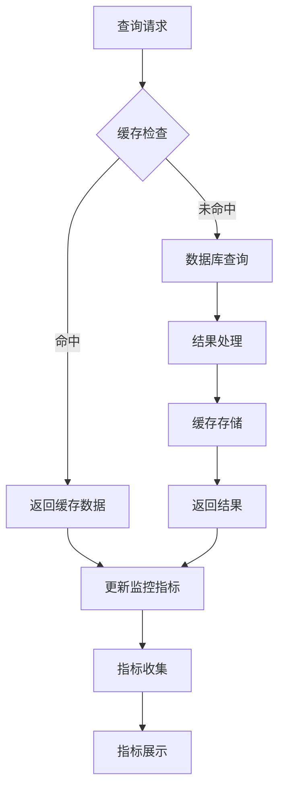

**Diagram sources**
- [query.ts](file://packages/plugins/@nocobase/plugin-data-visualization/src/server/actions/query.ts#L193-L236)

**Section sources**
- [adjacency-list-repository.ts](file://packages/plugins/@nocobase/plugin-collection-tree/src/server/adjacency-list-repository.ts#L60-L61)
- [query.ts](file://packages/plugins/@nocobase/plugin-data-visualization/src/server/actions/query.ts#L193-L236)

## 结论

NocoBase 的高级关系建模功能提供了强大而灵活的数据建模能力。通过递归关系、多态关联和复合关系的支持，系统能够满足各种复杂的业务需求。丰富的配置选项和性能优化策略确保了系统的可扩展性和高性能。开发者可以利用这些功能构建复杂的数据模型，同时通过完善的调试和监控工具确保系统的稳定运行。