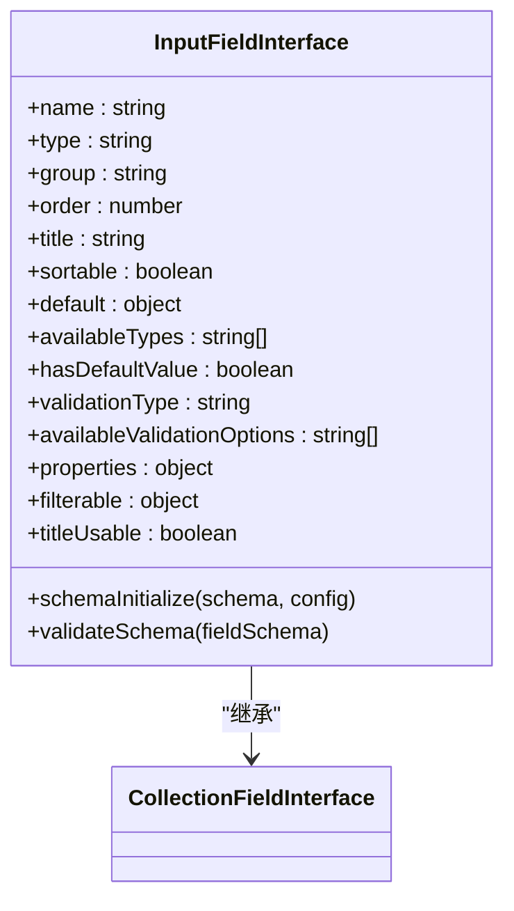
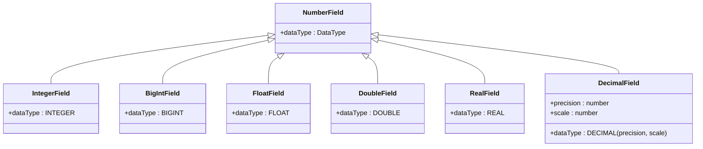
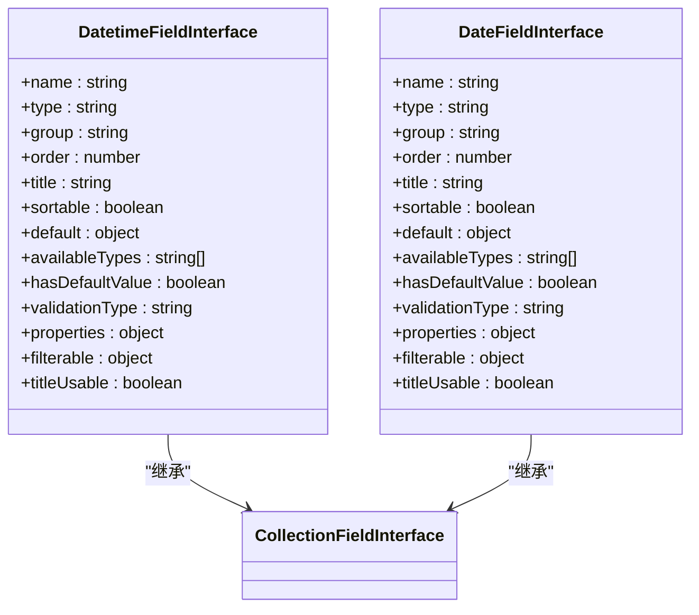

# 基本字段类型

<cite>
**本文档中引用的文件**  
- [input.ts](file://packages/core/client/src/collection-manager/interfaces/input.ts)
- [integer.ts](file://packages/core/client/src/collection-manager/interfaces/integer.ts)
- [datetime.ts](file://packages/core/client/src/collection-manager/interfaces/datetime.ts)
- [dateOnly.ts](file://packages/core/client/src/collection-manager/interfaces/dateOnly.ts)
- [checkbox.ts](file://packages/core/client/src/collection-manager/interfaces/checkbox.ts)
- [email.ts](file://packages/core/client/src/collection-manager/interfaces/email.ts)
- [id.ts](file://packages/core/client/src/collection-manager/interfaces/id.ts)
- [number-field.ts](file://packages/core/database/src/fields/number-field.ts)
- [constants.ts](file://packages/core/client/src/collection-manager/constants.ts)
</cite>

## 目录
1. [简介](#简介)
2. [字符串字段类型](#字符串字段类型)
3. [数字字段类型](#数字字段类型)
4. [布尔值字段类型](#布尔值字段类型)
5. [日期时间字段类型](#日期时间字段类型)
6. [数据库存储与索引策略](#数据库存储与索引策略)
7. [类型转换与边界情况处理](#类型转换与边界情况处理)
8. [性能优化建议](#性能优化建议)

## 简介
NocoBase 提供了一套完整的字段类型系统，用于定义数据模型中的基本数据结构。本文档详细介绍了字符串、数字、布尔值和日期时间等基本字段类型的实现机制、配置选项、数据验证规则、格式化参数、默认值设置以及在数据库层面的存储方式和索引策略。

**Section sources**
- [input.ts](file://packages/core/client/src/collection-manager/interfaces/input.ts#L46-L223)
- [integer.ts](file://packages/core/client/src/collection-manager/interfaces/integer.ts#L20-L134)
- [datetime.ts](file://packages/core/client/src/collection-manager/interfaces/datetime.ts#L13-L66)

## 字符串字段类型
字符串字段类型是 NocoBase 中最基础的字段类型之一，用于存储文本数据。该类型支持多种验证规则和格式化选项。

### 配置选项
字符串字段支持以下配置：
- **最大长度 (max)**：限制字符串的最大字符数
- **最小长度 (min)**：限制字符串的最小字符数
- **精确长度 (len)**：指定字符串的精确长度
- **正则表达式 (pattern)**：使用正则表达式进行内容验证
- **格式化 (format)**：预设的格式验证，包括 URL、邮箱、IP 地址等

### 数据验证规则
字符串字段实现了完整的验证机制，包括：
- 长度范围验证（最小值和最大值的相互约束）
- 内置格式验证（邮箱、URL、电话号码等）
- 自定义正则表达式匹配

### 默认值设置
字符串字段支持设置默认值，并可在 UI 界面中配置自动去除首尾空格的选项。

**Diagram sources**
- [input.ts](file://packages/core/client/src/collection-manager/interfaces/input.ts#L46-L223)

**Section sources**
- [input.ts](file://packages/core/client/src/collection-manager/interfaces/input.ts#L46-L223)
- [constants.ts](file://packages/core/client/src/collection-manager/constants.ts#L270-L304)

## 数字字段类型
数字字段类型用于存储数值数据，支持整数、浮点数和高精度小数等多种子类型。

### 类型分类
NocoBase 的数字字段支持以下具体类型：
- **整数类型**：包括 `integer` 和 `bigInt`
- **浮点类型**：包括 `float`、`double` 和 `real`
- **高精度类型**：`decimal` 支持指定精度和小数位数

### 配置选项
数字字段提供以下配置参数：
- **最大值 (maximum)**：数值上限
- **最小值 (minimum)**：数值下限
- **格式化 (format)**：奇偶数验证
- **自动递增 (autoIncrement)**：用于主键字段的自动增长

### 数据库映射
在数据库层面，数字字段类型映射到相应的 SQL 数据类型：
- `INTEGER` 对应整数类型
- `BIGINT` 对应大整数类型
- `FLOAT`、`DOUBLE`、`REAL` 对应浮点类型
- `DECIMAL(precision, scale)` 对应高精度小数类型

**Diagram sources**
- [number-field.ts](file://packages/core/database/src/fields/number-field.ts#L13-L88)

**Section sources**
- [integer.ts](file://packages/core/client/src/collection-manager/interfaces/integer.ts#L20-L134)
- [number-field.ts](file://packages/core/database/src/fields/number-field.ts#L13-L88)

## 布尔值字段类型
布尔值字段用于存储真/假值，在数据库中可以映射为多种底层类型。

### 实现机制
布尔值字段通过 `CheckboxFieldInterface` 类实现，支持以下底层数据类型：
- `boolean`：标准布尔类型
- `integer`：使用 0 和 1 表示
- `bigInt`：使用大整数表示
- `bit`：使用位类型表示

### 配置选项
布尔值字段的主要配置包括：
- 基本属性配置
- 过滤操作符配置
- 在表格和看板视图中的省略号显示配置

**Section sources**
- [checkbox.ts](file://packages/core/client/src/collection-manager/interfaces/checkbox.ts#L14-L41)

## 日期时间字段类型
日期时间字段类型用于处理时间相关的数据，支持多种格式和时区配置。

### 类型分类
NocoBase 提供了多种日期时间相关字段：
- **带时区的日期时间**：`datetime` 类型，存储时区信息
- **仅日期**：`dateOnly` 类型，只存储日期部分
- **创建时间**：`createdAt` 系统字段，自动记录创建时间

### 配置选项
日期时间字段支持以下配置：
- **默认值设置**：可设置为当前时间
- **更新时间戳**：更新记录时自动更新时间戳
- **时区处理**：支持 GMT 统一时区设置
- **显示格式**：可配置是否显示时间部分

### 数据验证
日期时间字段的验证类型为 `date`，支持与日期相关的验证规则。

**Diagram sources**
- [datetime.ts](file://packages/core/client/src/collection-manager/interfaces/datetime.ts#L13-L66)
- [dateOnly.ts](file://packages/core/client/src/collection-manager/interfaces/dateOnly.ts#L13-L48)

**Section sources**
- [datetime.ts](file://packages/core/client/src/collection-manager/interfaces/datetime.ts#L13-L66)
- [dateOnly.ts](file://packages/core/client/src/collection-manager/interfaces/dateOnly.ts#L13-L48)

## 数据库存储与索引策略
基本字段类型在数据库层面有明确的存储映射和索引策略。

### 存储映射
各字段类型与数据库类型的映射关系如下：
- 字符串 → `VARCHAR` 或 `TEXT`
- 整数 → `INTEGER` 或 `BIGINT`
- 浮点数 → `FLOAT`、`DOUBLE` 或 `REAL`
- 高精度小数 → `DECIMAL(precision, scale)`
- 布尔值 → `BOOLEAN` 或 `INTEGER`
- 日期时间 → `TIMESTAMP WITH TIME ZONE` 或 `DATE`

### 索引策略
- **主键字段**：自动创建唯一索引
- **唯一字段**：创建唯一约束
- **可排序字段**：支持创建普通索引以提高查询性能
- **过滤字段**：根据过滤操作符创建适当的索引

**Section sources**
- [id.ts](file://packages/core/client/src/collection-manager/interfaces/id.ts#L13-L61)
- [number-field.ts](file://packages/core/database/src/fields/number-field.ts#L13-L88)

## 类型转换与边界情况处理
NocoBase 在字段类型处理中实现了完善的类型转换和边界情况处理机制。

### 类型转换逻辑
- 字符串与数字之间的安全转换
- 日期字符串的标准化解析
- 布尔值的多形式识别（true/false, 1/0, yes/no）
- 空值和未定义值的统一处理

### 边界情况处理
- 数值溢出检测和处理
- 日期范围的有效性验证
- 字符串长度的精确控制
- 空字符串与 null 值的区别处理

**Section sources**
- [input.ts](file://packages/core/client/src/collection-manager/interfaces/input.ts#L17-L31)
- [integer.ts](file://packages/core/client/src/collection-manager/interfaces/integer.ts#L15-L18)

## 性能优化建议
为确保基本字段类型的高效使用，建议遵循以下最佳实践：

### 字段选择
- 根据数据范围选择合适的数值类型
- 对于固定长度的字符串，考虑使用 `CHAR` 类型
- 高频查询字段应合理设置索引

### 验证配置
- 避免过度复杂的正则表达式验证
- 合理设置长度限制，防止异常大数据
- 利用内置格式验证而非自定义正则表达式

### 存储优化
- 主键优先使用 `bigInt` 类型
- 大文本内容使用专用的文本字段类型
- 时间戳字段考虑时区需求选择合适类型

**Section sources**
- [input.ts](file://packages/core/client/src/collection-manager/interfaces/input.ts#L65-L87)
- [integer.ts](file://packages/core/client/src/collection-manager/interfaces/integer.ts#L43-L61)