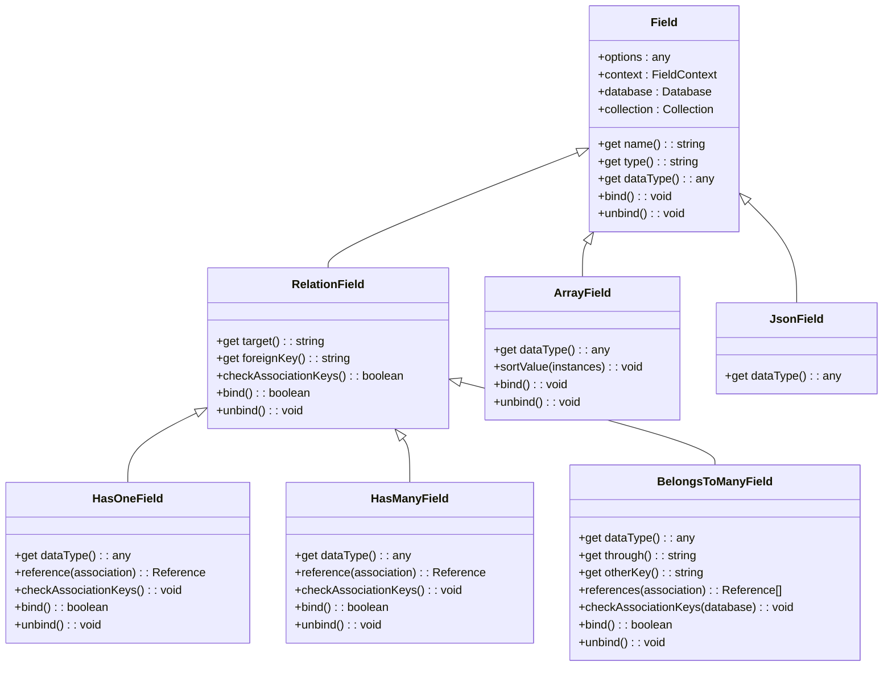
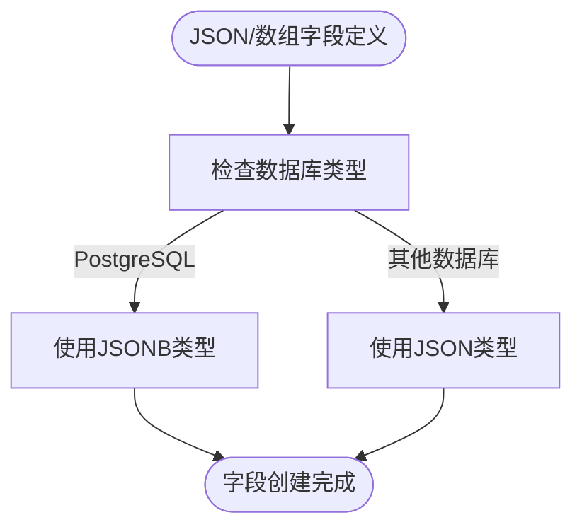
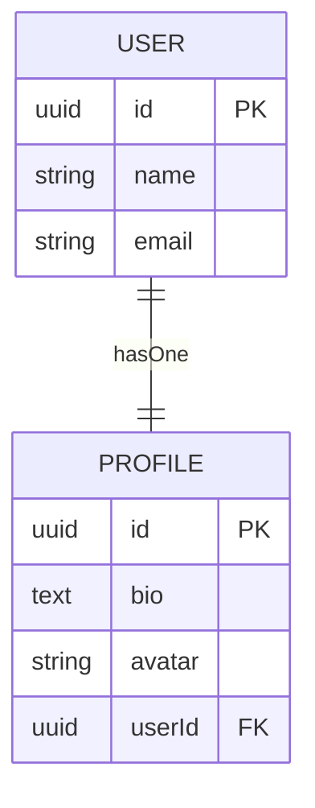
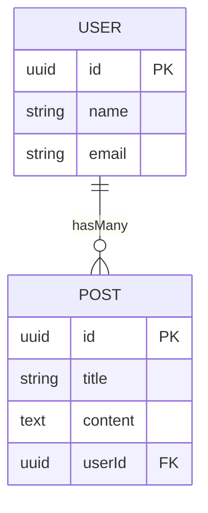
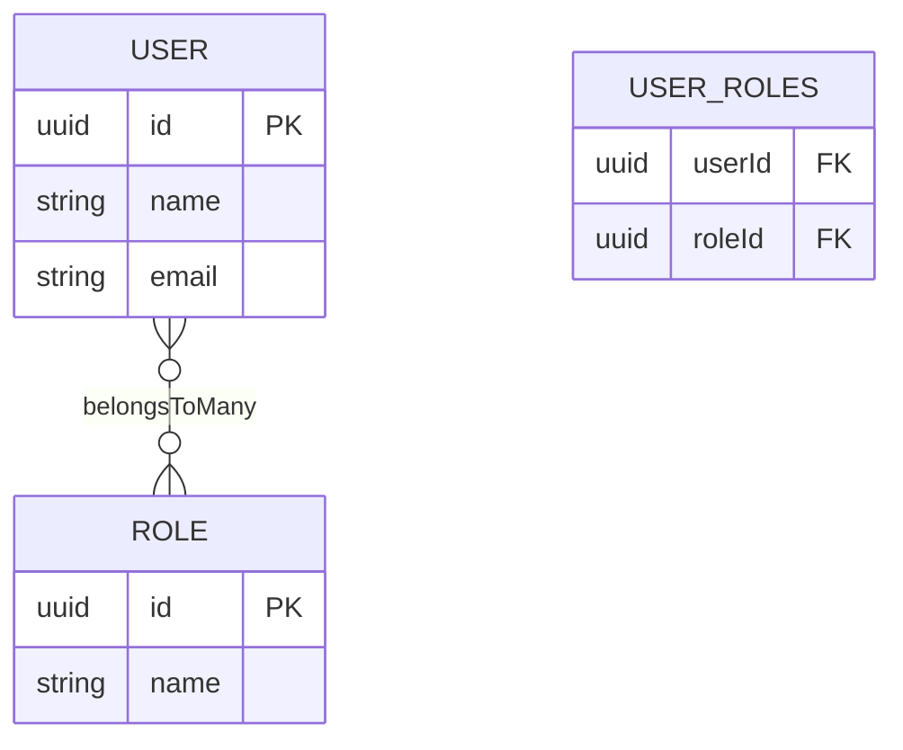
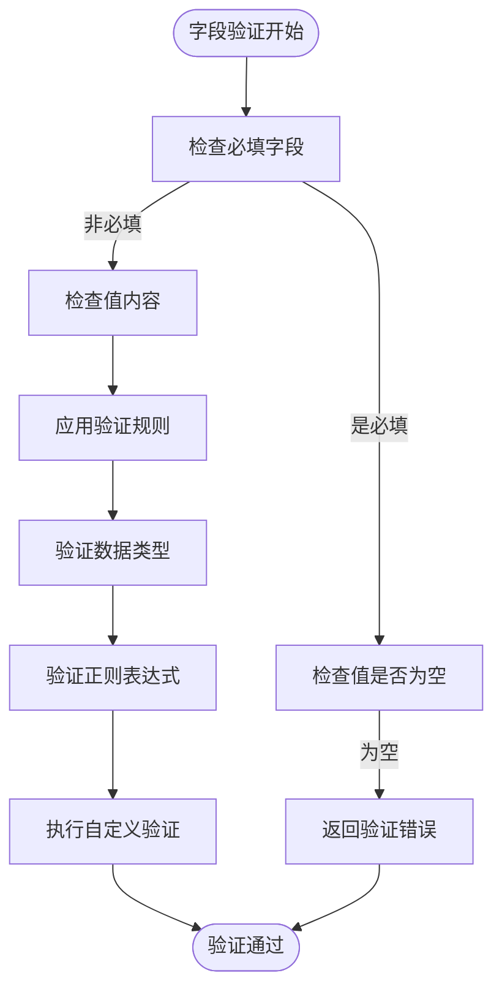
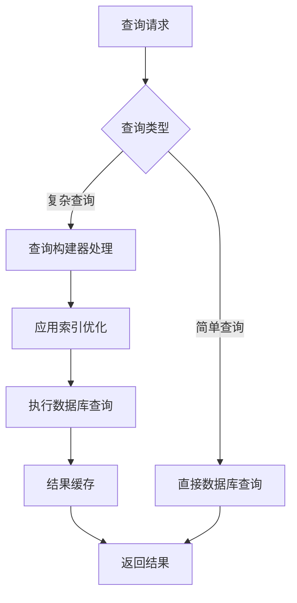
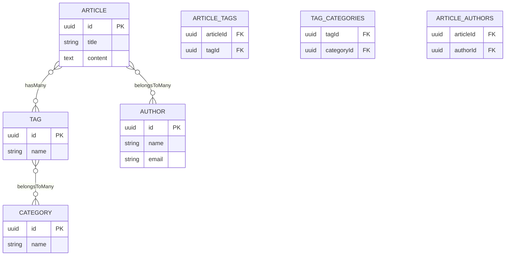

# 复合字段类型

<cite>
**本文档引用文件**   
- [array-field.ts](file://packages/core/database/src/fields/array-field.ts)
- [json-field.ts](file://packages/core/database/src/fields/json-field.ts)
- [has-one-field.ts](file://packages/core/database/src/fields/has-one-field.ts)
- [has-many-field.ts](file://packages/core/database/src/fields/has-many-field.ts)
- [belongs-to-many-field.ts](file://packages/core/database/src/fields/belongs-to-many-field.ts)
- [field.ts](file://packages/core/database/src/fields/field.ts)
- [to-one-interface.ts](file://packages/core/database/src/interfaces/to-one-interface.ts)
- [to-many-interface.ts](file://packages/core/database/src/interfaces/to-many-interface.ts)
- [field-validation.ts](file://packages/core/database/src/utils/field-validation.ts)
- [view-field-type-map.ts](file://packages/core/database/src/view/field-type-map.ts)
</cite>

## 目录
1. [简介](#简介)
2. [复合字段类型架构设计](#复合字段类型架构设计)
3. [JSON与数组字段实现](#json与数组字段实现)
4. [关系字段关联模式](#关系字段关联模式)
5. [数据结构定义与验证](#数据结构定义与验证)
6. [查询性能优化策略](#查询性能优化策略)
7. [复杂数据建模案例](#复杂数据建模案例)
8. [性能调优建议](#性能调优建议)
9. [常见反模式规避](#常见反模式规避)
10. [结论](#结论)

## 简介
NocoBase平台提供了丰富的复合字段类型支持，包括JSON、数组和多种关系字段类型。这些复合字段类型为复杂数据建模提供了强大的基础，使开发者能够构建灵活的数据结构来满足各种业务需求。本文档将深入探讨这些复合字段类型的架构设计、使用场景、数据结构定义、嵌套验证规则以及查询性能优化策略。

**Section sources**
- [array-field.ts](file://packages/core/database/src/fields/array-field.ts#L1-L59)
- [json-field.ts](file://packages/core/database/src/fields/json-field.ts#L1-L41)

## 复合字段类型架构设计
NocoBase的复合字段类型架构基于Sequelize ORM构建，通过字段接口和关系字段类实现不同类型的数据结构。核心设计原则包括类型安全、数据库兼容性和可扩展性。字段类型通过接口配置和数据库适配器实现跨数据库支持，确保在PostgreSQL、MySQL、MariaDB和SQLite等不同数据库系统中的一致行为。

**Diagram sources **
- [field.ts](file://packages/core/database/src/fields/field.ts#L64-L216)
- [has-one-field.ts](file://packages/core/database/src/fields/has-one-field.ts#L85-L243)
- [has-many-field.ts](file://packages/core/database/src/fields/has-many-field.ts#L85-L252)
- [belongs-to-many-field.ts](file://packages/core/database/src/fields/belongs-to-many-field.ts#L18-L247)
- [array-field.ts](file://packages/core/database/src/fields/array-field.ts#L13-L59)
- [json-field.ts](file://packages/core/database/src/fields/json-field.ts#L13-L41)

## JSON与数组字段实现
NocoBase中的JSON和数组字段实现了跨数据库兼容性，根据不同的数据库类型自动选择最优的数据类型。对于PostgreSQL，优先使用JSONB类型以获得更好的查询性能；对于其他数据库，则使用标准JSON类型。数组字段在PostgreSQL中支持原生数组类型，而在其他数据库中则使用JSON格式存储。

**Diagram sources **
- [json-field.ts](file://packages/core/database/src/fields/json-field.ts#L13-L41)
- [array-field.ts](file://packages/core/database/src/fields/array-field.ts#L13-L59)

**Section sources**
- [json-field.ts](file://packages/core/database/src/fields/json-field.ts#L13-L41)
- [array-field.ts](file://packages/core/database/src/fields/array-field.ts#L13-L59)

## 关系字段关联模式
NocoBase支持多种关系字段关联模式，包括一对一、一对多和多对多关系。每种关系模式都有其特定的数据库实现方式和使用场景。关系字段通过外键和关联表实现数据连接，确保数据完整性和查询效率。

### 一对一关系
一对一关系通过`hasOne`和`belongsTo`字段类型实现。源表包含指向目标表的外键，形成单向关联。这种模式适用于需要将大表拆分为多个小表以优化查询性能的场景。

**Diagram sources **
- [has-one-field.ts](file://packages/core/database/src/fields/has-one-field.ts#L85-L243)

### 一对多关系
一对多关系通过`hasMany`和`belongsTo`字段类型实现。目标表包含指向源表的外键，允许多个目标记录关联到单个源记录。这是最常见的关系模式，适用于订单与订单项、文章与评论等场景。

**Diagram sources **
- [has-many-field.ts](file://packages/core/database/src/fields/has-many-field.ts#L85-L252)

### 多对多关系
多对多关系通过`belongsToMany`字段类型实现，需要一个中间关联表来存储两个表之间的连接。中间表包含两个外键，分别指向两个主表的主键。这种模式适用于用户与角色、文章与标签等场景。

**Diagram sources **
- [belongs-to-many-field.ts](file://packages/core/database/src/fields/belongs-to-many-field.ts#L18-L247)

**Section sources**
- [has-one-field.ts](file://packages/core/database/src/fields/has-one-field.ts#L85-L243)
- [has-many-field.ts](file://packages/core/database/src/fields/has-many-field.ts#L85-L252)
- [belongs-to-many-field.ts](file://packages/core/database/src/fields/belongs-to-many-field.ts#L18-L247)

## 数据结构定义与验证
复合字段的数据结构定义和验证是确保数据完整性的关键。NocoBase使用Joi库实现字段验证，支持多种验证规则和自定义验证逻辑。验证规则可以在字段定义时配置，并在数据创建和更新时自动执行。

**Diagram sources **
- [field-validation.ts](file://packages/core/database/src/utils/field-validation.ts#L1-L39)
- [field.ts](file://packages/core/database/src/fields/field.ts#L29-L46)

**Section sources**
- [field-validation.ts](file://packages/core/database/src/utils/field-validation.ts#L1-L39)
- [field.ts](file://packages/core/database/src/fields/field.ts#L29-L46)

## 查询性能优化策略
为了优化复合字段的查询性能，NocoBase采用了多种策略，包括索引优化、查询缓存和分页处理。对于JSON字段，利用数据库的JSON查询功能实现高效的数据检索；对于关系字段，通过预加载和懒加载机制平衡查询性能和内存使用。

**Diagram sources **
- [cursor-builder.ts](file://packages/core/database/src/cursor-builder.ts#L85-L323)
- [array.ts](file://packages/core/database/src/operators/array.ts#L44-L96)

**Section sources**
- [cursor-builder.ts](file://packages/core/database/src/cursor-builder.ts#L85-L323)
- [array.ts](file://packages/core/database/src/operators/array.ts#L44-L96)

## 复杂数据建模案例
通过复合字段类型，可以实现复杂的高级数据关系建模。例如，构建一个内容管理系统，其中文章可以有多个标签，每个标签可以属于多个分类，同时文章还可以有多个作者。这种复杂的多对多关系网络可以通过NocoBase的复合字段类型轻松实现。

**Diagram sources **
- [belongs-to-many-field.ts](file://packages/core/database/src/fields/belongs-to-many-field.ts#L18-L247)
- [has-many-field.ts](file://packages/core/database/src/fields/has-many-field.ts#L85-L252)

**Section sources**
- [belongs-to-many-field.ts](file://packages/core/database/src/fields/belongs-to-many-field.ts#L18-L247)
- [has-many-field.ts](file://packages/core/database/src/fields/has-many-field.ts#L85-L252)

## 性能调优建议
为了获得最佳性能，建议遵循以下调优策略：为常用查询字段创建索引，合理使用预加载避免N+1查询问题，对于大型JSON字段考虑拆分到单独的表中，以及定期分析查询性能并优化慢查询。

**Section sources**
- [cursor-builder.ts](file://packages/core/database/src/cursor-builder.ts#L85-L323)
- [array.ts](file://packages/core/database/src/operators/array.ts#L44-L96)

## 常见反模式规避
在使用复合字段时，应避免一些常见的反模式，如过度嵌套JSON结构导致查询复杂化，滥用多对多关系导致数据库性能下降，以及在不需要关系查询的场景下使用关系字段增加系统复杂性。

**Section sources**
- [field.ts](file://packages/core/database/src/fields/field.ts#L64-L216)
- [view-field-type-map.ts](file://packages/core/database/src/view/field-type-map.ts#L48-L98)

## 结论
NocoBase的复合字段类型提供了强大而灵活的数据建模能力，通过合理的架构设计和性能优化策略，能够满足各种复杂的业务需求。理解这些复合字段类型的实现原理和最佳实践，有助于开发者构建高效、可维护的应用系统。