# 字段类型

<cite>
**本文档中引用的文件**  
- [string-field.ts](file://packages/core/database/src/fields/string-field.ts)
- [number-field.ts](file://packages/core/database/src/fields/number-field.ts)
- [date-field.ts](file://packages/core/database/src/fields/date-field.ts)
- [boolean-field.ts](file://packages/core/database/src/fields/boolean-field.ts)
- [json-field.ts](file://packages/core/database/src/fields/json-field.ts)
- [field-validation.ts](file://packages/core/database/src/utils/field-validation.ts)
- [CollectionFieldInterface.ts](file://packages/core/client/src/data-source/collection-field-interface/CollectionFieldInterface.ts)
- [constants.ts](file://packages/core/client/src/collection-manager/constants.ts)
- [field-type-map.ts](file://packages/core/database/src/view/field-type-map.ts)
</cite>

## 目录
1. [介绍](#介绍)
2. [核心字段类型](#核心字段类型)
3. [数据验证规则](#数据验证规则)
4. [默认值设置](#默认值设置)
5. [格式化选项](#格式化选项)
6. [字段接口与UI组件映射](#字段接口与ui组件映射)
7. [自定义字段渲染](#自定义字段渲染)
8. [最佳实践](#最佳实践)
9. [高级用法示例](#高级用法示例)

## 介绍
NocoBase提供了一套完整的字段类型系统，用于定义和管理数据模型中的各种数据类型。本文档详细介绍了NocoBase支持的各种字段类型，包括字符串、数字、日期、布尔值、JSON等，以及它们的配置参数、数据验证规则、默认值设置和格式化选项。

**Section sources**
- [string-field.ts](file://packages/core/database/src/fields/string-field.ts)
- [number-field.ts](file://packages/core/database/src/fields/number-field.ts)

## 核心字段类型
NocoBase支持多种核心字段类型，每种类型都有特定的用途和配置选项。

### 字符串类型
字符串类型用于存储文本数据，支持长度限制和自动修剪功能。

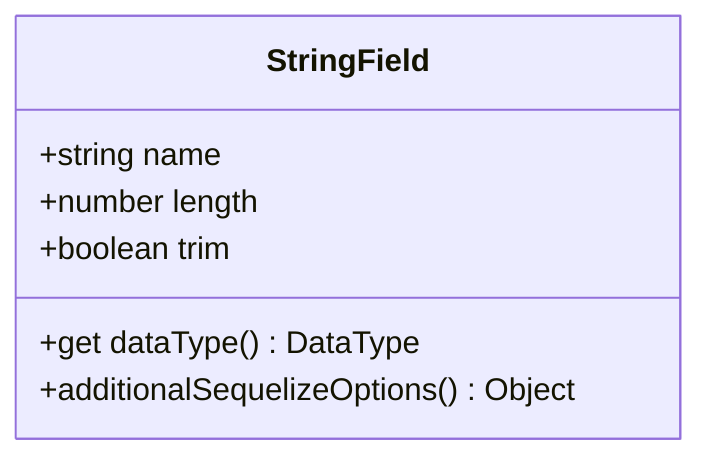

**Diagram sources**
- [string-field.ts](file://packages/core/database/src/fields/string-field.ts)

### 数字类型
数字类型包括整数、浮点数和高精度小数，支持不同的精度和范围设置。

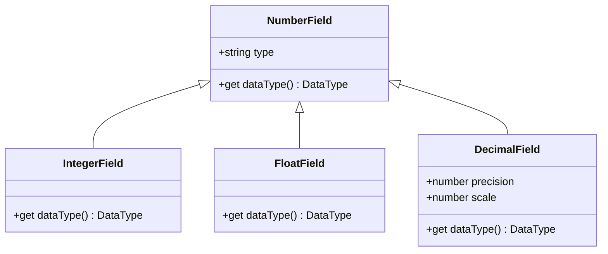

**Diagram sources**
- [number-field.ts](file://packages/core/database/src/fields/number-field.ts)

### 日期类型
日期类型支持多种日期格式和时区处理，包括创建时间和更新时间等特殊字段。

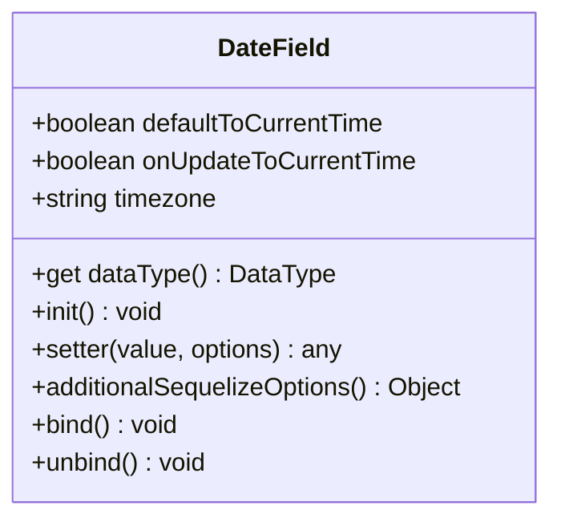

**Diagram sources**
- [date-field.ts](file://packages/core/database/src/fields/date-field.ts)

### 布尔类型
布尔类型用于存储真/假值，通常用于开关或状态标记。

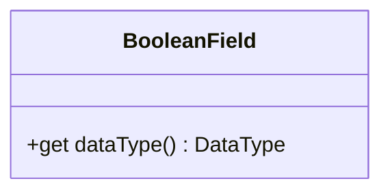

**Diagram sources**
- [boolean-field.ts](file://packages/core/database/src/fields/boolean-field.ts)

### JSON类型
JSON类型用于存储结构化数据，支持JSON和JSONB两种数据库类型。

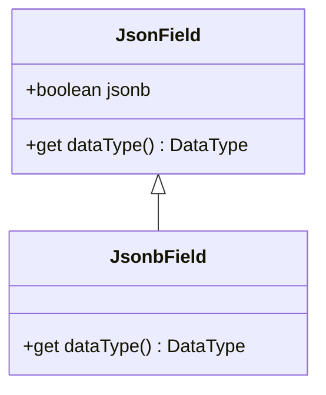

**Diagram sources**
- [json-field.ts](file://packages/core/database/src/fields/json-field.ts)

## 数据验证规则
NocoBase提供了丰富的数据验证规则，确保数据的完整性和一致性。

### 字符串验证规则
字符串字段支持多种验证规则，包括长度限制、正则表达式匹配、电子邮件格式等。

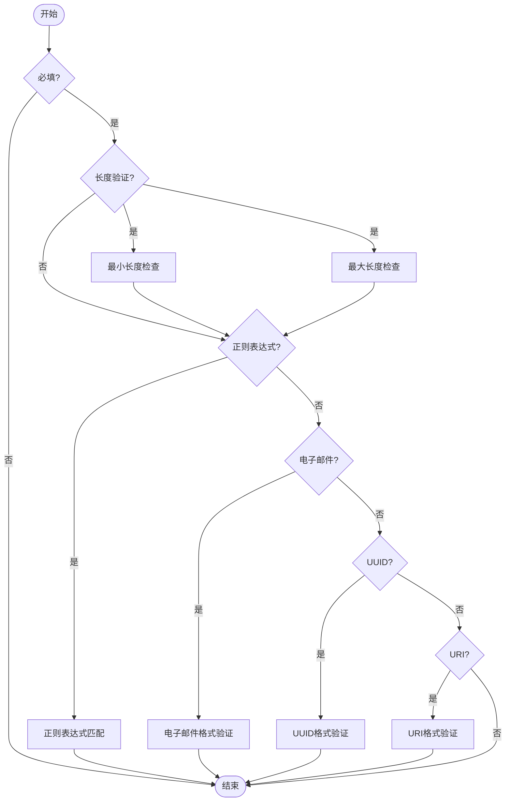

**Diagram sources**
- [constants.ts](file://packages/core/client/src/collection-manager/constants.ts)

### 数字验证规则
数字字段支持范围验证、精度控制和整数检查等规则。

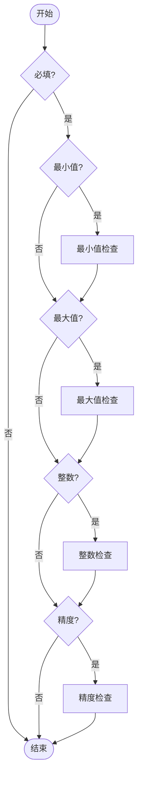

**Diagram sources**
- [constants.ts](file://packages/core/client/src/collection-manager/constants.ts)

### 日期验证规则
日期字段支持时间范围验证和时间戳格式检查。

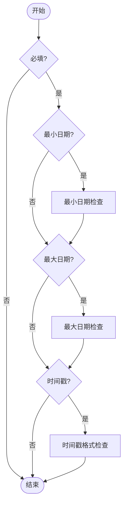

**Diagram sources**
- [constants.ts](file://packages/core/client/src/collection-manager/constants.ts)

## 默认值设置
字段的默认值设置允许在创建记录时自动填充特定值。

### 静态默认值
静态默认值是在字段定义时指定的固定值。

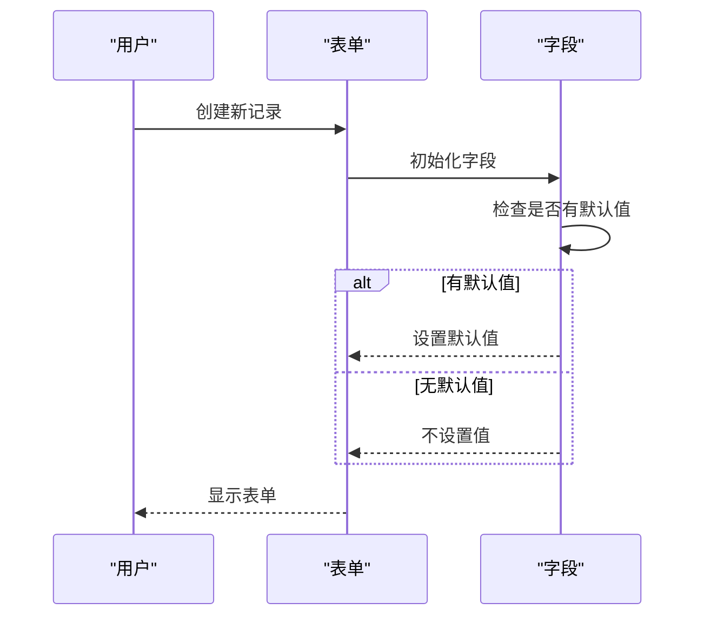

**Diagram sources**
- [CollectionFieldInterface.ts](file://packages/core/client/src/data-source/collection-field-interface/CollectionFieldInterface.ts)

### 动态默认值
动态默认值是通过表达式或函数计算得出的值。

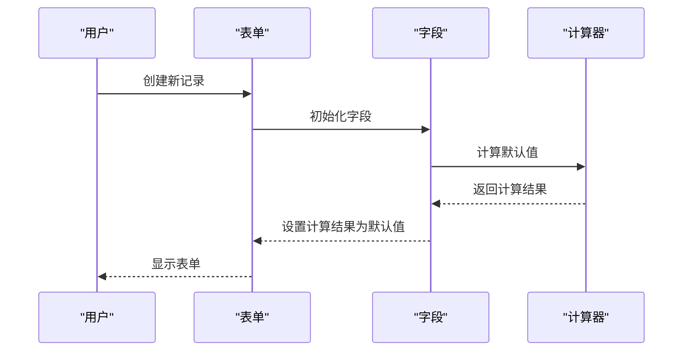

**Diagram sources**
- [CollectionFieldInterface.ts](file://packages/core/client/src/data-source/collection-field-interface/CollectionFieldInterface.ts)

## 格式化选项
格式化选项允许对字段值进行显示格式的控制。

### 数字格式化
数字字段支持多种格式化选项，包括小数位数、千位分隔符等。

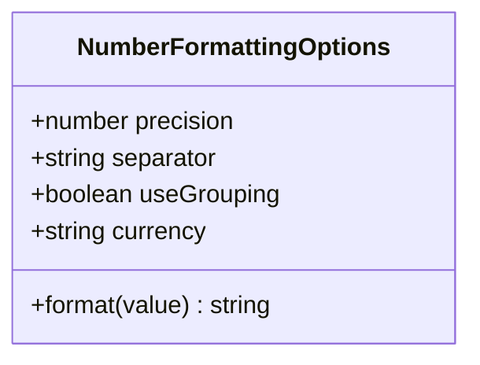

**Diagram sources**
- [number-field.ts](file://packages/core/database/src/fields/number-field.ts)

### 日期格式化
日期字段支持自定义日期和时间格式。

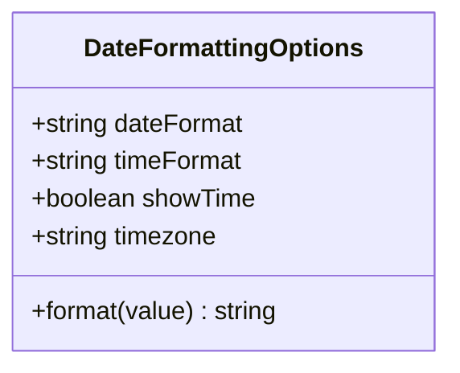

**Diagram sources**
- [date-field.ts](file://packages/core/database/src/fields/date-field.ts)

## 字段接口与UI组件映射
字段接口定义了字段在用户界面中的表现形式和交互方式。

### 字段接口配置
字段接口配置决定了字段在表单中的渲染方式。

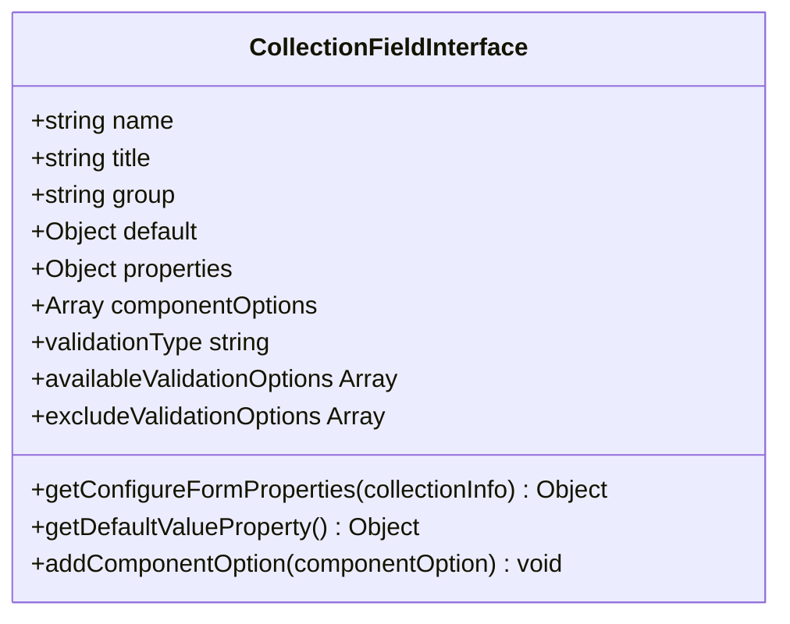

**Diagram sources**
- [CollectionFieldInterface.ts](file://packages/core/client/src/data-source/collection-field-interface/CollectionFieldInterface.ts)

### UI组件映射
不同的字段类型映射到不同的UI组件，提供最佳的用户体验。

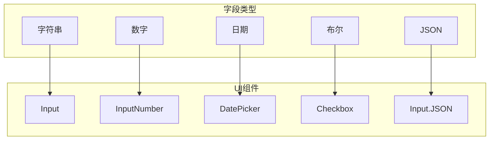

**Diagram sources**
- [field-type-map.ts](file://packages/core/database/src/view/field-type-map.ts)

## 自定义字段渲染
NocoBase支持自定义字段渲染，允许开发者创建独特的字段表现形式。

### 自定义组件选项
通过添加自定义组件选项，可以扩展字段的渲染能力。

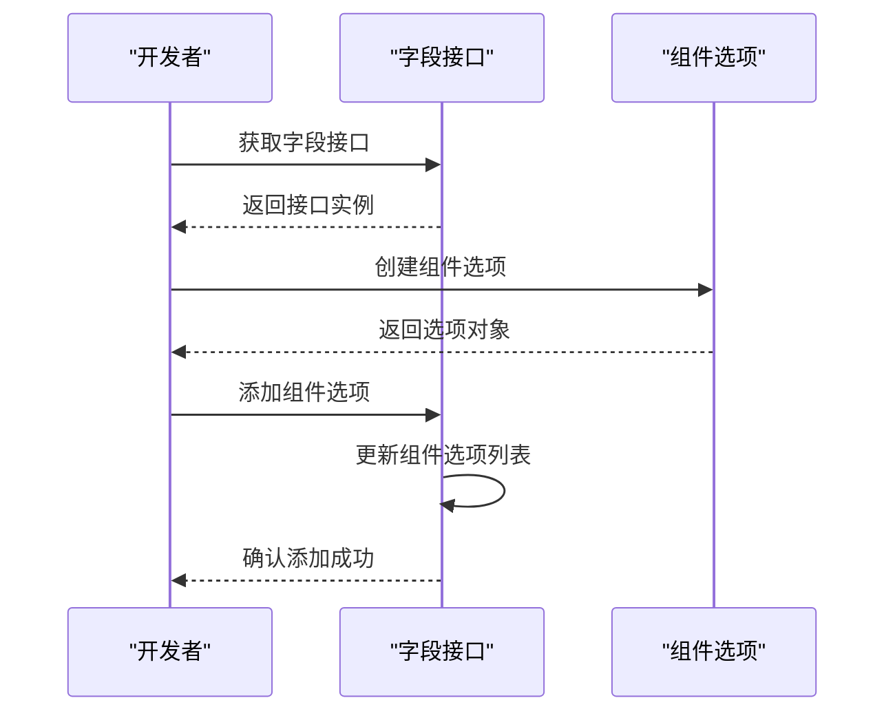

**Diagram sources**
- [CollectionFieldInterface.ts](file://packages/core/client/src/data-source/collection-field-interface/CollectionFieldInterface.ts)

## 最佳实践
遵循最佳实践可以提高数据质量和系统性能。

### 性能优化
合理的字段配置可以显著提升系统性能。

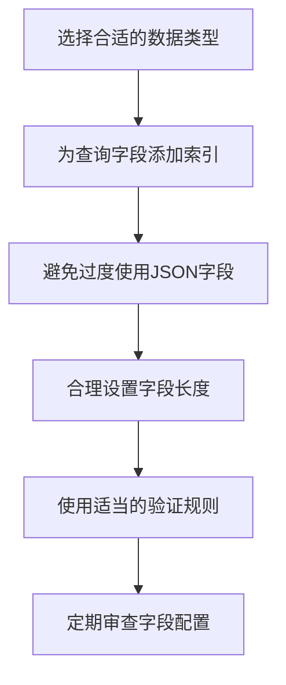

**Diagram sources**
- [field-type-map.ts](file://packages/core/database/src/view/field-type-map.ts)

### 数据完整性保障
确保数据的完整性和一致性是系统稳定运行的基础。

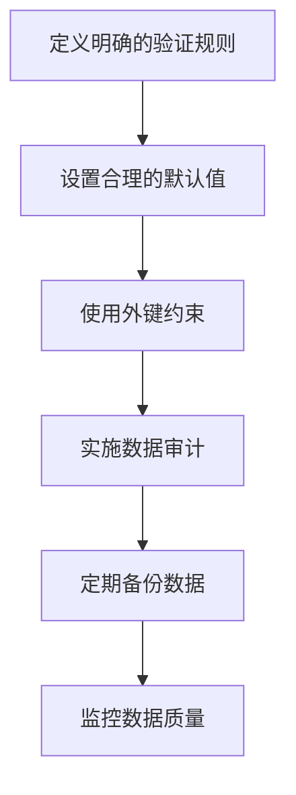

**Diagram sources**
- [field-validation.ts](file://packages/core/database/src/utils/field-validation.ts)

## 高级用法示例
以下是一些复杂字段配置的高级用法示例。

### 复合验证规则
组合多个验证规则以实现复杂的业务逻辑。

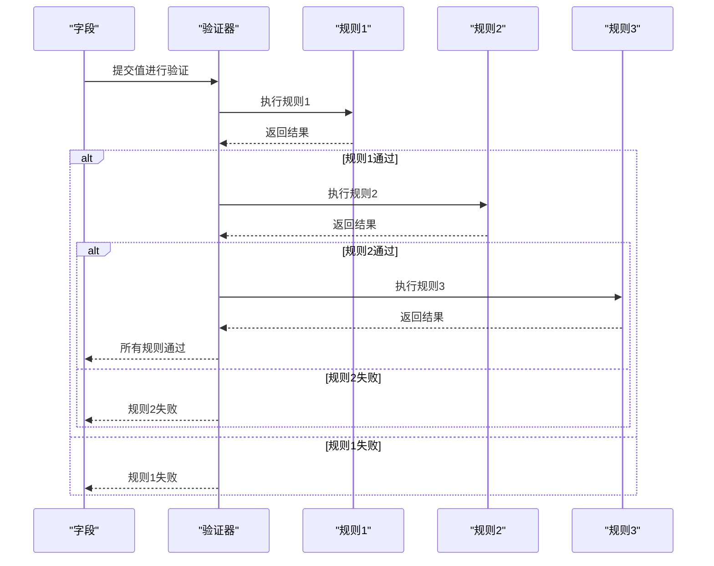

**Diagram sources**
- [field-validation.ts](file://packages/core/database/src/utils/field-validation.ts)

### 动态字段配置
根据上下文动态调整字段配置。

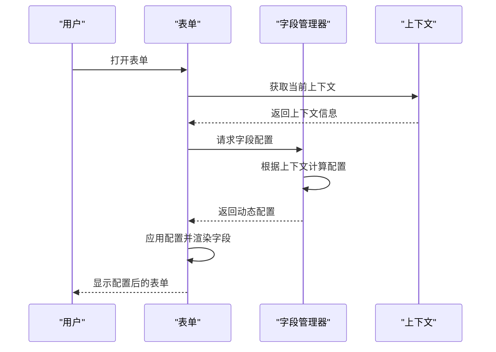

**Diagram sources**
- [CollectionFieldInterface.ts](file://packages/core/client/src/data-source/collection-field-interface/CollectionFieldInterface.ts)