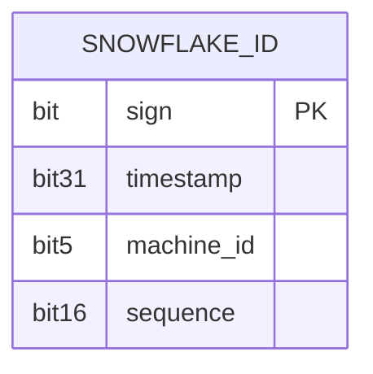
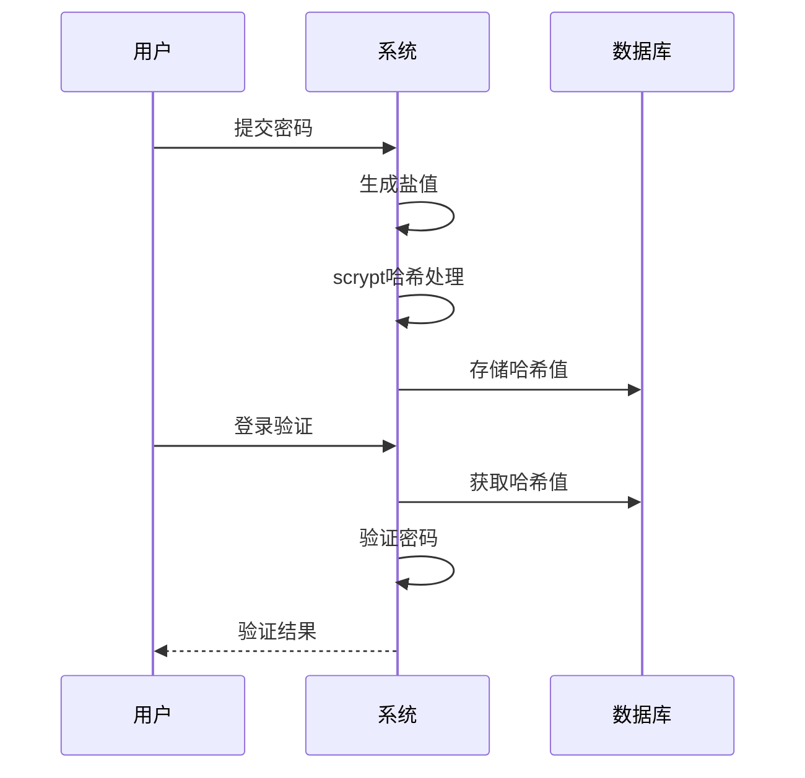
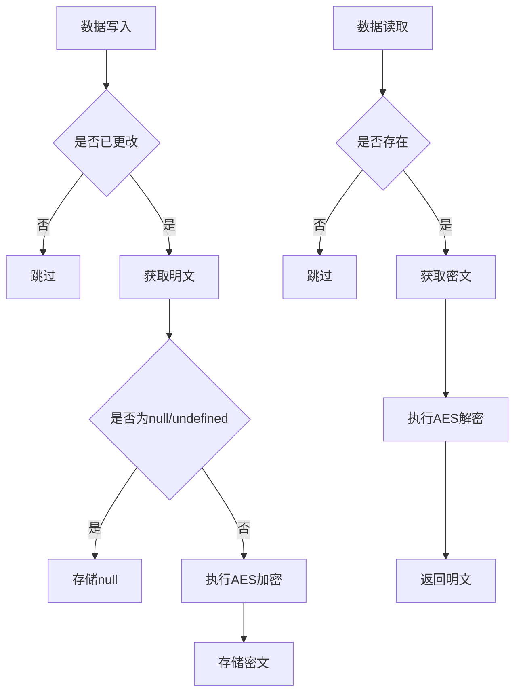

# 特殊字段类型

<cite>
**本文档引用的文件**
- [uid-field.ts](file://packages\core\database\src\fields\uid-field.ts)
- [password-field.ts](file://packages\core\database\src\fields\password-field.ts)
- [encryption-field.ts](file://packages\core\database\src\fields\encryption-field\encryption-field.ts)
- [snowflake-id.ts](file://packages\core\snowflake-id\src\snowflake-id.ts)
- [utils.ts](file://packages\core\database\src\fields\encryption-field\utils.ts)
- [README.md](file://packages\core\snowflake-id\README.md)
- [password.ts](file://packages\core\client\src\collection-manager\interfaces\password.ts)
- [uuid.ts](file://packages\core\client\src\collection-manager\interfaces\uuid.ts)
- [encryption-field.test.ts](file://packages\core\database\src\__tests__\fields\encryption-field.test.ts)
- [password-field.test.ts](file://packages\core\database\src\__tests__\fields\password-field.test.ts)
</cite>

## 目录
1. [简介](#简介)
2. [UID字段](#uid字段)
3. [雪花ID字段](#雪花id字段)
4. [密码字段](#密码字段)
5. [加密字段](#加密字段)
6. [安全最佳实践](#安全最佳实践)
7. [配置示例](#配置示例)

## 简介
NocoBase提供了一系列特殊字段类型，用于满足安全敏感场景下的数据管理需求。这些特殊字段包括UID、雪花ID、密码和加密字段，它们在数据生成、存储和处理过程中提供了额外的安全保障。本文档将深入介绍这些特殊字段类型的实现原理、安全特性和最佳实践，帮助开发者在不同业务场景中正确使用这些字段类型，确保数据安全性和系统可靠性。

## UID字段

UID字段用于生成唯一的标识符，支持自定义前缀和模式。该字段类型在创建和更新记录时自动填充，确保每个记录都有一个唯一的标识符。UID字段的实现基于`@nocobase/utils`包中的`uid`函数，生成的标识符符合指定的模式要求。

**字段特性：**
- 数据类型：字符串
- 自动填充：在创建和更新时自动生成
- 自定义前缀：支持为生成的UID添加前缀
- 模式验证：支持自定义正则表达式验证

**Section sources**
- [uid-field.ts](file://packages\core\database\src\fields\uid-field.ts#L14-L58)

## 雪花ID字段

雪花ID字段基于改进的Snowflake算法生成53位的唯一标识符，确保在JavaScript环境中不会出现精度丢失问题。该算法将ID分为时间戳、机器ID和序列号三个部分，支持分布式环境下的唯一性保证。

**ID结构（53位）：**
- **符号位（1位）**：始终为0，确保正数
- **时间戳（31位）**：自定义纪元以来的秒数
- **机器ID（5位）**：支持最多32个节点
- **序列号（16位）**：自增计数器，每秒每机器可生成65,536个ID



**Diagram sources**
- [snowflake-id.ts](file://packages\core\snowflake-id\src\snowflake-id.ts#L10-L79)
- [README.md](file://packages\core\snowflake-id\README.md#L21-L34)

**Section sources**
- [snowflake-id.ts](file://packages\core\snowflake-id\src\snowflake-id.ts#L10-L79)
- [README.md](file://packages\core\snowflake-id\README.md#L21-L34)

## 密码字段

密码字段用于安全地存储用户密码，采用scrypt哈希算法进行加密。该字段在存储密码时自动生成盐值并进行哈希处理，确保即使数据库泄露，攻击者也无法轻易获取原始密码。

**安全特性：**
- 哈希算法：scrypt
- 盐值生成：随机生成8字节盐值
- 哈希长度：可配置，默认64字符
- 验证机制：支持密码验证，无需存储明文



**Diagram sources**
- [password-field.ts](file://packages\core\database\src\fields\password-field.ts#L27-L89)
- [password.ts](file://packages\core\client\src\collection-manager\interfaces\password.ts#L20-L26)

**Section sources**
- [password-field.ts](file://packages\core\database\src\fields\password-field.ts#L27-L89)
- [password.ts](file://packages\core\client\src\collection-manager\interfaces\password.ts#L20-L26)

## 加密字段

加密字段用于对敏感数据进行加密存储，采用AES-256-CBC算法进行加密。该字段在数据写入时自动加密，在读取时自动解密，确保敏感数据在存储过程中的安全性。

**加密机制：**
- 加密算法：AES-256-CBC
- 密钥管理：通过环境变量`ENCRYPTION_FIELD_KEY`配置
- 初始化向量：可配置，支持自定义IV
- 错误处理：详细的加密/解密错误信息



**Diagram sources**
- [encryption-field.ts](file://packages\core\database\src\fields\encryption-field\encryption-field.ts#L20-L91)
- [utils.ts](file://packages\core\database\src\fields\encryption-field\utils.ts#L19-L93)

**Section sources**
- [encryption-field.ts](file://packages\core\database\src\fields\encryption-field\encryption-field.ts#L20-L91)
- [utils.ts](file://packages\core\database\src\fields\encryption-field\utils.ts#L19-L93)

## 安全最佳实践

### 密钥管理
- **环境变量配置**：加密密钥必须通过环境变量`ENCRYPTION_FIELD_KEY`配置，长度必须为32字符
- **IV配置**：初始化向量可通过环境变量`ENCRYPTION_FIELD_IV`配置，长度必须为16字符
- **密钥轮换**：定期轮换加密密钥，并确保旧数据能够被新密钥解密

### 防碰撞策略
- **UID字段**：使用`uid`函数生成的标识符具有高熵值，碰撞概率极低
- **雪花ID**：通过时间戳、机器ID和序列号的组合确保全局唯一性
- **UUID字段**：使用标准UUID v4算法生成128位唯一标识符

### 性能考量
- **加密字段**：AES加密/解密操作对性能有一定影响，建议仅对真正敏感的数据使用
- **密码字段**：scrypt算法计算成本较高，可调整参数平衡安全性和性能
- **批量操作**：在批量创建或更新时，特殊字段的处理会增加额外开销

**Section sources**
- [utils.ts](file://packages\core\database\src\fields\encryption-field\utils.ts#L95-L126)
- [snowflake-id.ts](file://packages\core\snowflake-id\src\snowflake-id.ts#L10-L79)
- [password-field.ts](file://packages\core\database\src\fields\password-field.ts#L46-L55)

## 配置示例

### UID字段配置
```typescript
{
  type: 'uid',
  name: 'custom_id',
  prefix: 'CID-',
  pattern: '^[A-Za-z0-9_][A-Za-z0-9_-]*$'
}
```

### 雪花ID字段配置
```typescript
{
  type: 'bigInt',
  name: 'id',
  autoGenId: true
}
```

### 密码字段配置
```typescript
{
  type: 'password',
  name: 'password',
  length: 64,
  randomBytesSize: 8
}
```

### 加密字段配置
```typescript
{
  type: 'encryption',
  name: 'sensitive_data',
  iv: '1234567890123456'
}
```

**Section sources**
- [uid-field.ts](file://packages\core\database\src\fields\uid-field.ts#L54-L58)
- [password-field.ts](file://packages\core\database\src\fields\password-field.ts#L15-L25)
- [encryption-field.ts](file://packages\core\database\src\fields\encryption-field\encryption-field.ts#L15-L18)