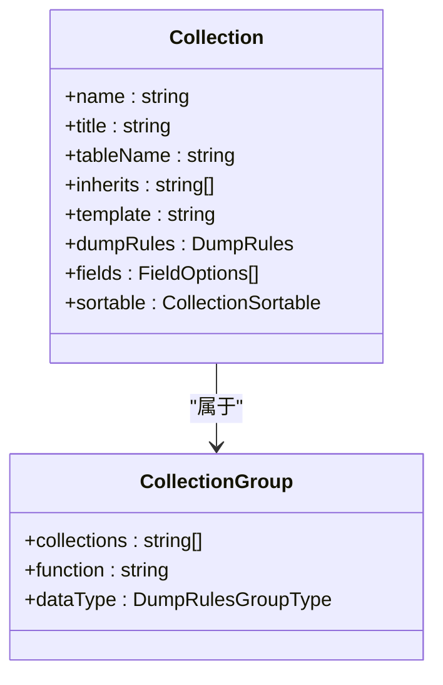
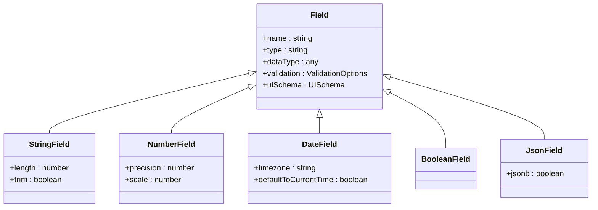
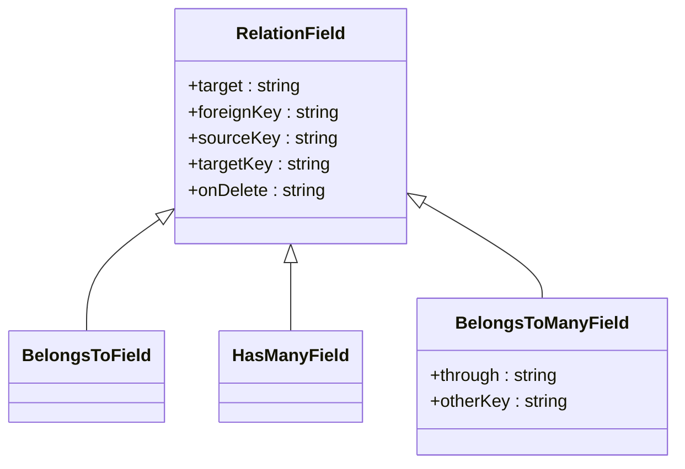
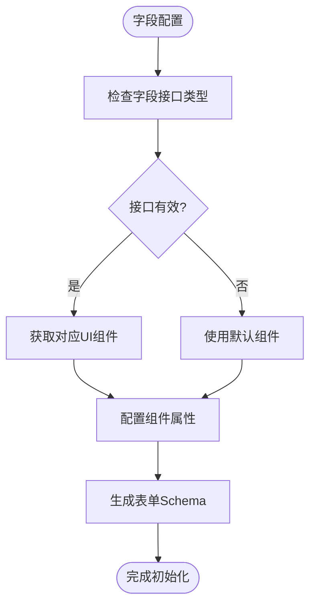
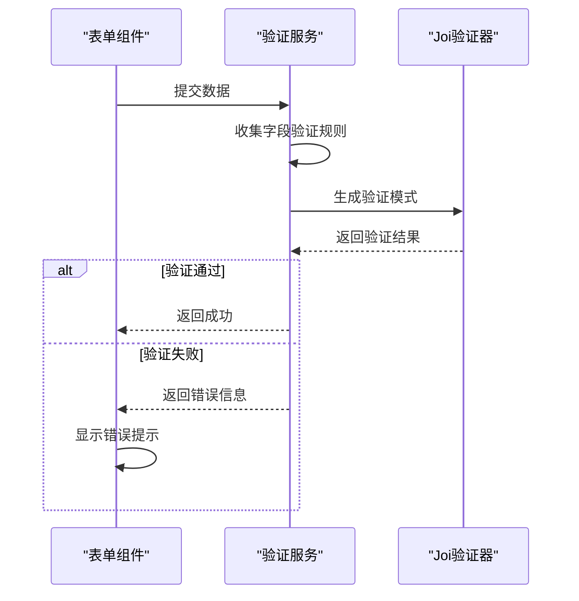
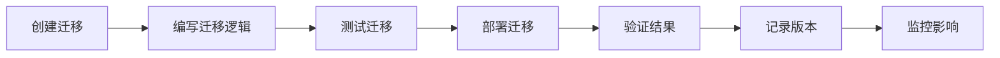

# 数据结构设计

<cite>
**本文档中引用的文件**  
- [collection.ts](file://packages/core/database/src/collection.ts)
- [field.ts](file://packages/core/database/src/fields/field.ts)
- [relation-field.ts](file://packages/core/database/src/fields/relation-field.ts)
- [string-field.ts](file://packages/core/database/src/fields/string-field.ts)
- [number-field.ts](file://packages/core/database/src/fields/number-field.ts)
- [date-field.ts](file://packages/core/database/src/fields/date-field.ts)
- [boolean-field.ts](file://packages/core/database/src/fields/boolean-field.ts)
- [json-field.ts](file://packages/core/database/src/fields/json-field.ts)
- [belongs-to-many-field.ts](file://packages/core/database/src/fields/belongs-to-many-field.ts)
- [field-type-map.ts](file://packages/core/database/src/view/field-type-map.ts)
- [collection-fields-to-initializer-items](file://packages/core/client/src/data-source/collection-fields-to-initializer-items/utils/getInitializerItemsByFields.ts)
- [FieldValidation.tsx](file://packages/core/client/src/collection-manager/Configuration/components/FieldValidation.tsx)
- [collection-group-manager.ts](file://packages/core/database/src/collection-group-manager.ts)
- [create-migration.ts](file://packages/core/server/src/commands/create-migration.ts)
</cite>

## 目录
1. [集合创建与配置](#集合创建与配置)
2. [字段类型定义](#字段类型定义)
3. [关系字段实现](#关系字段实现)
4. [字段接口与UI组件映射](#字段接口与ui组件映射)
5. [数据验证规则](#数据验证规则)
6. [数据迁移指南](#数据迁移指南)

## 集合创建与配置

NocoBase中的集合（Collection）是数据模型的核心单元，通过`CollectionOptions`接口定义其结构和行为。集合的创建支持继承机制和集合组管理，允许构建复杂的数据模型层次。

集合的基本配置包括名称、标题、数据库表名、继承关系等。`inherits`字段支持字符串或字符串数组，用于指定父集合，实现数据模型的继承。集合还可以通过`template`字段指定模板，用于快速创建预配置的集合。

集合组管理通过`CollectionGroupManager`实现，允许将多个集合分组进行管理。集合组可用于数据导出、导入和备份恢复等场景。`dumpRules`字段定义了集合在数据转储时的行为规则，支持`required`、`skipped`等内置分组。

**图源**
- [collection.ts](file://packages/core/database/src/collection.ts#L96-L139)
- [collection-group-manager.ts](file://packages/core/database/src/collection-group-manager.ts#L21-L26)

**本节源码**
- [collection.ts](file://packages/core/database/src/collection.ts#L96-L139)
- [collection-group-manager.ts](file://packages/core/database/src/collection-group-manager.ts#L21-L26)

## 字段类型定义

NocoBase支持多种字段类型，包括字符串、数字、日期、布尔值和JSON等。每种字段类型都有对应的选项接口，用于配置其行为。

字符串字段（StringField）支持长度限制和自动去除空白字符。数字字段包括整数（integer）、大整数（bigInt）、浮点数（float）和十进制数（decimal）等类型。日期字段（DateField）支持时区配置和自动填充创建/更新时间。布尔字段（BooleanField）存储真/假值。JSON字段（JsonField）支持存储复杂的数据结构。

字段类型与数据库类型的映射由`fieldTypeMap`管理，根据不同的数据库方言（MySQL、PostgreSQL、SQLite）进行适配。例如，PostgreSQL的`jsonb`类型在其他数据库中会映射为`json`类型。

**图源**
- [field.ts](file://packages/core/database/src/fields/field.ts#L48-L55)
- [string-field.ts](file://packages/core/database/src/fields/string-field.ts#L13-L47)
- [number-field.ts](file://packages/core/database/src/fields/number-field.ts#L13-L88)
- [date-field.ts](file://packages/core/database/src/fields/date-field.ts#L20-L162)
- [boolean-field.ts](file://packages/core/database/src/fields/boolean-field.ts#L13-L21)
- [json-field.ts](file://packages/core/database/src/fields/json-field.ts#L13-L40)
- [field-type-map.ts](file://packages/core/database/src/view/field-type-map.ts#L48-L97)

**本节源码**
- [field.ts](file://packages/core/database/src/fields/field.ts#L48-L55)
- [string-field.ts](file://packages/core/database/src/fields/string-field.ts#L13-L47)
- [number-field.ts](file://packages/core/database/src/fields/number-field.ts#L13-L88)
- [date-field.ts](file://packages/core/database/src/fields/date-field.ts#L20-L162)
- [boolean-field.ts](file://packages/core/database/src/fields/boolean-field.ts#L13-L21)
- [json-field.ts](file://packages/core/database/src/fields/json-field.ts#L13-L40)

## 关系字段实现

NocoBase支持多种关系字段类型，包括一对一（belongs-to）、一对多（has-many）和多对多（belongs-to-many）。关系字段通过`RelationField`基类实现，提供了统一的接口和行为。

多对多关系（belongs-to-many）通过中间表（through table）实现。配置选项包括`through`（中间表名）、`foreignKey`（外键）、`otherKey`（对方外键）等。系统会自动验证外键类型匹配，确保数据一致性。

关系字段的实现考虑了性能优化，通过`generateInclude`方法生成高效的数据库查询包含条件。对于数组形式的多对一关系（belongs-to-array），系统使用JSON数组存储外键，避免创建额外的中间表。

**图源**
- [relation-field.ts](file://packages/core/database/src/fields/relation-field.ts#L18-L89)
- [belongs-to-many-field.ts](file://packages/core/database/src/fields/belongs-to-many-field.ts#L18-L111)

**本节源码**
- [relation-field.ts](file://packages/core/database/src/fields/relation-field.ts#L18-L89)
- [belongs-to-many-field.ts](file://packages/core/database/src/fields/belongs-to-many-field.ts#L18-L111)

## 字段接口与UI组件映射

字段接口（Field Interface）定义了字段在用户界面中的表现形式和交互行为。每个字段类型对应一个或多个UI组件，通过`uiSchema`配置项进行映射。

系统通过`collectionFieldInterfaceManager`管理字段接口与UI组件的映射关系。例如，字符串字段可以映射为输入框（Input）、密码框（Password）或选择器（Select）等不同组件。映射配置包括组件名称（`x-component`）、组件属性（`x-component-props`）和验证规则（`x-validator`）等。

在表单初始化过程中，系统会根据字段的接口类型动态生成相应的UI组件。`getInitializerItemsByFields`工具函数负责将字段配置转换为表单初始化项，确保正确的组件映射和布局。

**图源**
- [getInitializerItemsByFields.ts](file://packages/core/client/src/data-source/collection-fields-to-initializer-items/utils/getInitializerItemsByFields.ts#L36-L75)
- [field-type-map.ts](file://packages/core/database/src/view/field-type-map.ts#L48-L97)

**本节源码**
- [getInitializerItemsByFields.ts](file://packages/core/client/src/data-source/collection-fields-to-initializer-items/utils/getInitializerItemsByFields.ts#L36-L75)

## 数据验证规则

NocoBase提供灵活的数据验证机制，支持内置验证器和自定义验证逻辑。验证规则通过`validation`字段配置，包含规则名称和参数。

系统使用Joi库实现数据验证，`buildJoiSchema`函数负责将验证选项转换为Joi验证模式。支持的验证规则包括`required`（必填）、`min`/`max`（数值范围）、`pattern`（正则表达式）等。对于关系字段，系统会自动验证关联数据的存在性。

前端通过`FieldValidation`组件提供可视化验证配置界面，支持添加、编辑和删除验证规则。验证错误信息会实时显示在表单中，提升用户体验。

**图源**
- [field.ts](file://packages/core/database/src/fields/field.ts#L42-L45)
- [collection.ts](file://packages/core/database/src/collection.ts#L236-L287)
- [FieldValidation.tsx](file://packages/core/client/src/collection-manager/Configuration/components/FieldValidation.tsx#L168-L251)

**本节源码**
- [field.ts](file://packages/core/database/src/fields/field.ts#L42-L45)
- [collection.ts](file://packages/core/database/src/collection.ts#L236-L287)
- [FieldValidation.tsx](file://packages/core/client/src/collection-manager/Configuration/components/FieldValidation.tsx#L168-L251)

## 数据迁移指南

NocoBase提供完整的数据迁移解决方案，支持模式变更、数据转换和版本控制。迁移脚本通过`Migration`类实现，支持在`beforeLoad`或`afterLoad`阶段执行。

迁移命令`create-migration`用于生成新的迁移文件，包含时间戳前缀以确保执行顺序。迁移脚本可以包含数据库模式变更（如添加/删除字段）和数据转换逻辑。系统通过`Migrations`类管理迁移项的注册和执行。

版本控制策略基于迁移文件的时间戳命名，确保按顺序执行。`appVersion`字段用于指定迁移适用的应用版本范围，支持条件性迁移执行。对于复杂的模式变更，建议使用事务确保数据一致性。

**图源**
- [create-migration.ts](file://packages/core/server/src/commands/create-migration.ts#L36-L55)
- [migration.ts](file://packages/core/database/src/migration.ts#L58-L103)

**本节源码**
- [create-migration.ts](file://packages/core/server/src/commands/create-migration.ts#L36-L55)
- [migration.ts](file://packages/core/database/src/migration.ts#L58-L103)