# 继承机制

<cite>
**本文档引用的文件**  
- [inherited-collection.ts](file://packages/core/database/src/inherited-collection.ts)
- [inherited-sync-runner.ts](file://packages/core/database/src/inherited-sync-runner.ts)
- [inherited-map.ts](file://packages/core/database/src/inherited-map.ts)
- [InheritanceCollectionMixin.ts](file://packages/core/client/src/collection-manager/mixins/InheritanceCollectionMixin.ts)
- [collection.ts](file://packages/core/database/src/collection.ts)
- [database.ts](file://packages/core/database/src/database.ts)
- [collectionPlugin.ts](file://packages/core/client/src/collection-manager/collectionPlugin.ts)
- [InheritanceCollectionMixin.test.ts](file://packages/core/client/src/collection-manager/mixins/__tests__/InheritanceCollectionMixin.test.ts)
</cite>

## 目录
1. [简介](#简介)
2. [继承机制概述](#继承机制概述)
3. [核心组件分析](#核心组件分析)
4. [继承关系的建立](#继承关系的建立)
5. [字段与配置的继承与覆盖](#字段与配置的继承与覆盖)
6. [InheritedCollection类实现细节](#inheritedcollection类实现细节)
7. [继承链管理](#继承链管理)
8. [使用场景](#使用场景)
9. [最佳实践与注意事项](#最佳实践与注意事项)
10. [结论](#结论)

## 简介
NocoBase的集合继承机制是一种强大的数据模型复用功能，允许子集合继承父集合的字段和配置。该机制基于PostgreSQL的表继承特性实现，支持多级继承和多重继承，为构建复杂的数据结构提供了灵活的基础。本文档深入分析了继承机制的工作原理、实现细节和使用方法。

## 继承机制概述

NocoBase的集合继承机制通过`InheritedCollection`类和`InheritanceCollectionMixin`混合类实现，支持在数据库层和应用层的完整继承功能。继承机制主要特点包括：

- **PostgreSQL表继承**：基于PostgreSQL的INHERITS特性实现物理表继承
- **多级继承支持**：支持深度继承链，子集合可以继承多个层级的父集合
- **多重继承**：一个子集合可以同时继承多个父集合
- **字段继承与覆盖**：子集合自动继承父集合的所有字段，并可定义自己的字段或覆盖继承的字段
- **继承链管理**：提供完整的继承关系查询和管理功能

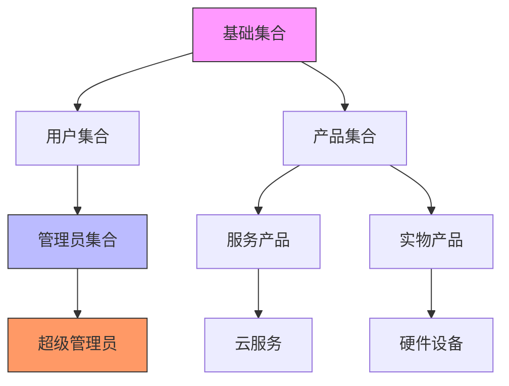

**图示来源**  
- [inherited-collection.ts](file://packages/core/database/src/inherited-collection.ts#L14-L148)
- [InheritanceCollectionMixin.ts](file://packages/core/client/src/collection-manager/mixins/InheritanceCollectionMixin.ts#L14-L298)

## 核心组件分析

NocoBase的继承机制由多个核心组件协同工作，包括服务端的`InheritedCollection`类和客户端的`InheritanceCollectionMixin`混合类。

### 服务端核心组件

服务端继承机制的核心是`InheritedCollection`类，它扩展了基础的`Collection`类，添加了继承相关的功能。

```mermaid
classDiagram
class Collection {
+options : CollectionOptions
+context : CollectionContext
+fields : Map<string, any>
+model : ModelStatic<Model>
+repository : Repository
+isInherited() : boolean
}
class InheritedCollection {
+parents? : Collection[]
+getParents() : Collection[]
+getFlatParents() : Collection[]
+parentFields() : Map<string, Field>
+parentAttributes() : object
+isInherited() : true
+bindParents() : void
+setParents(inherits : string | string[]) : void
+setParentFields() : void
}
Collection <|-- InheritedCollection
note right of InheritedCollection
继承自Collection类，添加了
父集合管理、字段继承等
特性
end note
```

**图示来源**  
- [inherited-collection.ts](file://packages/core/database/src/inherited-collection.ts#L14-L148)
- [collection.ts](file://packages/core/database/src/collection.ts#L145-L200)

### 客户端核心组件

客户端通过`InheritanceCollectionMixin`混合类提供继承功能，扩展了集合管理器的功能。

```mermaid
classDiagram
class Collection {
+name : string
+fields : CollectionFieldOptions[]
+getFields(predicate? : GetCollectionFieldPredicate) : CollectionFieldOptions[]
}
class InheritanceCollectionMixin {
+getParentCollectionsName() : string[]
+getParentCollections() : Collection[]
+getChildrenCollectionsName(isSupportView? : boolean) : string[]
+getChildrenCollections(isSupportView? : boolean) : Collection[]
+getInheritedFields() : CollectionFieldOptions[]
+getAllFields(predicate? : GetCollectionFieldPredicate) : CollectionFieldOptions[]
+getInheritChain() : string[]
+getInheritCollectionsChain() : string[]
+getAllCollectionsInheritChain() : string[]
}
Collection <|-- InheritanceCollectionMixin
note right of InheritanceCollectionMixin
提供继承相关的查询方法，
包括获取父集合、子集合、
继承字段和继承链等
end note
```

**图示来源**  
- [InheritanceCollectionMixin.ts](file://packages/core/client/src/collection-manager/mixins/InheritanceCollectionMixin.ts#L14-L298)

## 继承关系的建立

继承关系的建立是通过在集合定义中指定`inherits`选项来实现的。系统会自动处理继承关系的解析和绑定。

### 继承关系建立流程

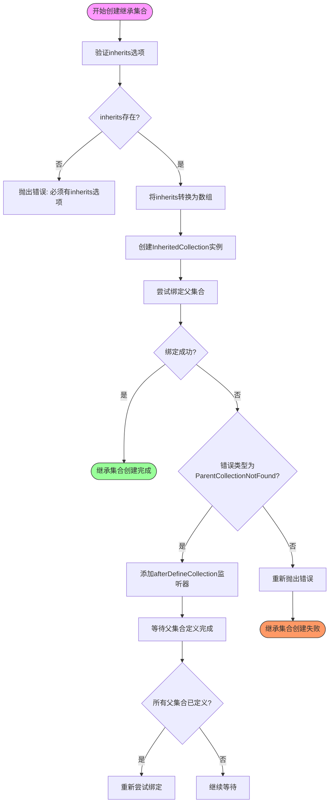

**图示来源**  
- [inherited-collection.ts](file://packages/core/database/src/inherited-collection.ts#L17-L45)
- [inherited-map.ts](file://packages/core/database/src/inherited-map.ts#L53-L62)

### 继承映射管理

系统使用`InheritanceMap`类来管理所有集合的继承关系，维护一个继承关系图。

```mermaid
classDiagram
class TableNode {
+name : string
+parents : Set<TableNode>
+children : Set<TableNode>
}
class InheritanceMap {
+nodes : Map<string, TableNode>
+removeNode(name : string) : void
+getOrCreateNode(name : string) : TableNode
+getNode(name : string) : TableNode
+setInheritance(name : string, inherits : string | string[]) : void
+isParentNode(name : string) : boolean
+getChildren(name : string, options : {deep : boolean}) : Set<string>
+getParents(name : string, options : {deep : boolean}) : Set<string>
}
note right of InheritanceMap
维护所有集合的继承关系图，
支持快速查询父集合和子集合
end note
```

**图示来源**  
- [inherited-map.ts](file://packages/core/database/src/inherited-map.ts#L13-L107)

## 字段与配置的继承与覆盖

继承机制的核心功能之一是字段和配置的继承与覆盖，这使得子集合可以复用父集合的结构，同时保持灵活性。

### 字段继承机制

```mermaid
sequenceDiagram
participant 子集合 as InheritedCollection
participant 父集合 as ParentCollection
participant 字段管理 as FieldManager
子集合->>子集合 : bindParents()
子集合->>子集合 : setParents(inherits)
子集合->>子集合 : setParentFields()
子集合->>字段管理 : parentFields()
字段管理->>父集合 : 获取父集合字段
父集合-->>字段管理 : 返回字段Map
字段管理->>子集合 : 遍历所有父集合字段
子集合->>子集合 : 检查字段类型
子集合->>子集合 : isRelationField()?
alt 是关系字段
子集合->>子集合 : 添加到delayFields
else 不是关系字段
子集合->>子集合 : setField(继承字段)
end
子集合->>子集合 : 处理延迟字段
子集合->>子集合 : setField(关系字段)
子集合->>子集合 : setFields(自身字段)
子集合-->> : 继承完成
```

**图示来源**  
- [inherited-collection.ts](file://packages/core/database/src/inherited-collection.ts#L108-L147)
- [collection.ts](file://packages/core/database/src/collection.ts#L174-L176)

### 字段覆盖规则

当子集合定义了与父集合同名的字段时，子集合的字段会覆盖父集合的字段。系统通过以下规则处理字段覆盖：

1. **字段定义优先级**：子集合的字段定义优先于继承的字段
2. **字段类型一致性**：覆盖字段应与被覆盖字段保持类型一致
3. **配置继承标记**：继承的字段会被标记为`inherit: true`

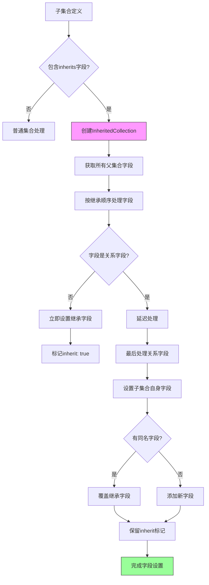

**图示来源**  
- [inherited-collection.ts](file://packages/core/database/src/inherited-collection.ts#L111-L112)
- [InheritanceCollectionMixin.ts](file://packages/core/client/src/collection-manager/mixins/InheritanceCollectionMixin.ts#L274-L285)

## InheritedCollection类实现细节

`InheritedCollection`类是服务端继承机制的核心实现，它扩展了基础的`Collection`类，添加了继承相关的功能。

### 构造函数与初始化

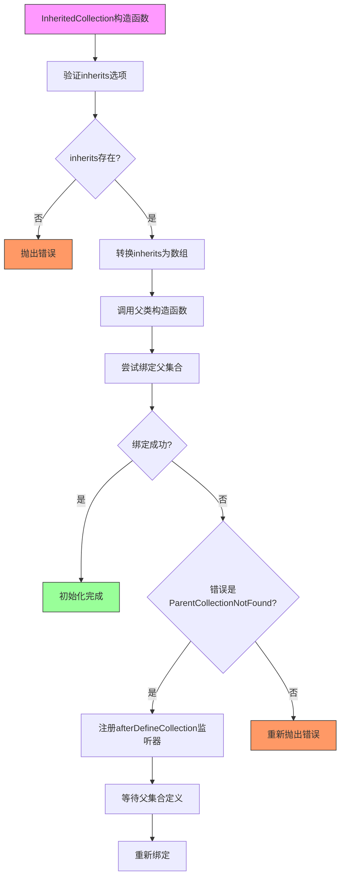

**图示来源**  
- [inherited-collection.ts](file://packages/core/database/src/inherited-collection.ts#L17-L45)

### 核心方法分析

`InheritedCollection`类提供了多个核心方法来管理继承关系：

```mermaid
classDiagram
class InheritedCollection {
+getParents() : Collection[]
+getFlatParents() : Collection[]
+parentFields() : Map<string, Field>
+parentAttributes() : object
+isInherited() : true
+bindParents() : void
+setParents(inherits : string | string[]) : void
+setParentFields() : void
}
note right of InheritedCollection
getParents() : 获取直接父集合
getFlatParents() : 获取扁平化的所有父集合
parentFields() : 获取所有继承的字段
parentAttributes() : 获取所有继承的属性
bindParents() : 绑定父集合关系
setParents() : 设置父集合引用
setParentFields() : 设置继承的字段
end note
```

**图示来源**  
- [inherited-collection.ts](file://packages/core/database/src/inherited-collection.ts#L47-L147)

### 继承同步机制

对于PostgreSQL数据库，系统使用`InheritedSyncRunner`来同步继承模型的变更。

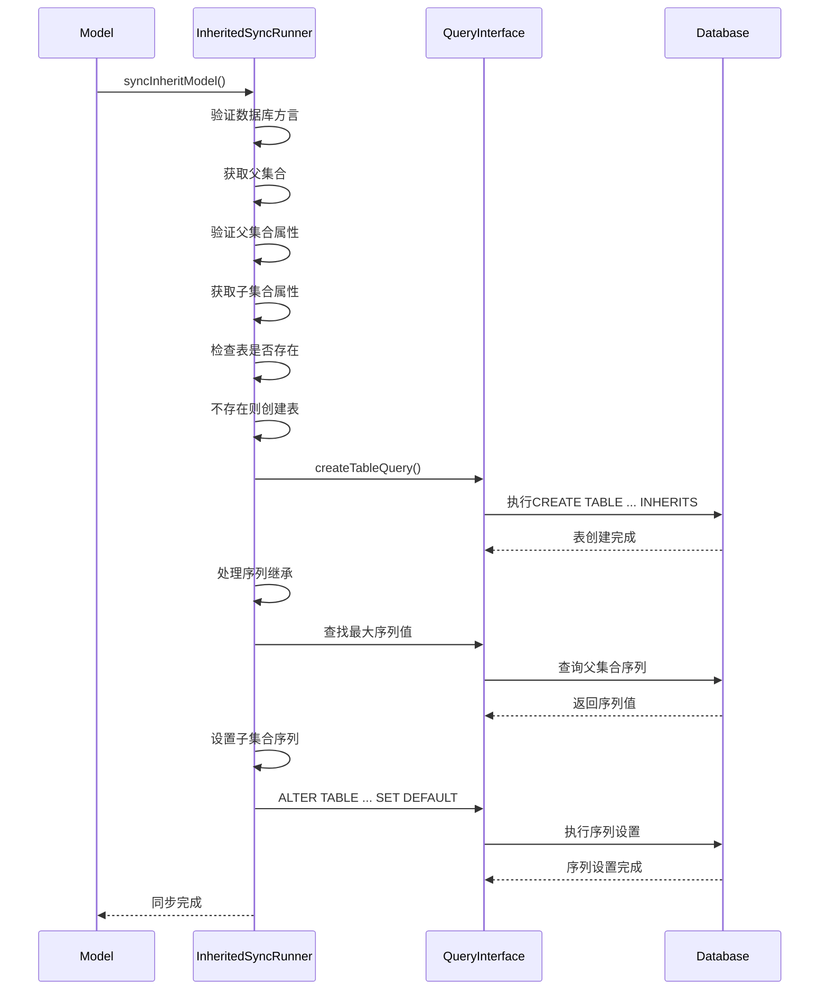

**图示来源**  
- [inherited-sync-runner.ts](file://packages/core/database/src/inherited-sync-runner.ts#L13-L207)

## 继承链管理

继承链管理是继承机制的重要组成部分，它提供了查询和管理继承关系的功能。

### 继承链查询方法

```mermaid
classDiagram
class InheritanceCollectionMixin {
+getInheritChain() : string[]
+getInheritCollectionsChain() : string[]
+getAllCollectionsInheritChain() : string[]
+getParentCollectionsName() : string[]
+getChildrenCollectionsName() : string[]
}
note right of InheritanceCollectionMixin
getInheritChain() : 获取包含自身、
所有祖先和后代的完整继承链
getInheritCollectionsChain() :
获取包含自身的祖先链
getAllCollectionsInheritChain() :
获取包含自身、祖先和后代的
完整继承链包括兄弟表
getParentCollectionsName() :
获取所有父集合名称
getChildrenCollectionsName() :
获取所有子集合名称
end note
```

**图示来源**  
- [InheritanceCollectionMixin.ts](file://packages/core/client/src/collection-manager/mixins/InheritanceCollectionMixin.ts#L241-L272)

### 继承链示例

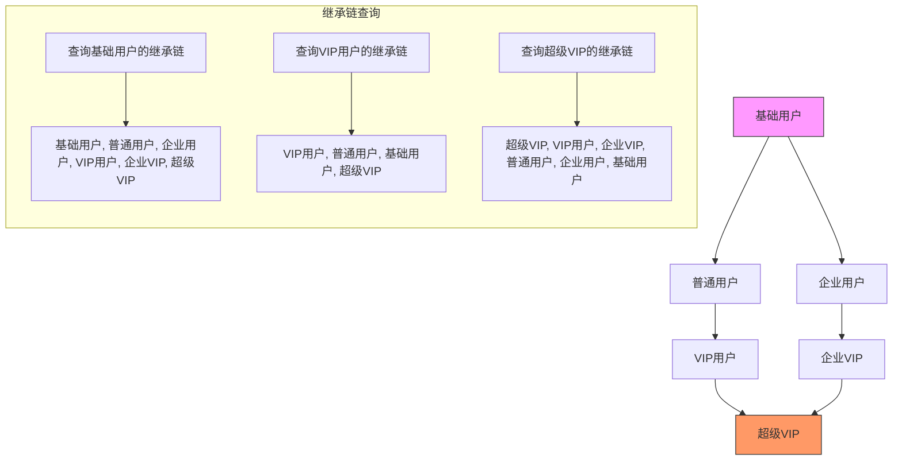

**图示来源**  
- [InheritanceCollectionMixin.test.ts](file://packages/core/client/src/collection-manager/mixins/__tests__/InheritanceCollectionMixin.test.ts#L18-L189)

## 使用场景

NocoBase的继承机制适用于多种实际应用场景，为数据模型设计提供了极大的灵活性。

### 基础数据模型复用

继承机制最直接的应用是基础数据模型的复用。通过创建一个包含通用字段的基础集合，其他集合可以继承它来复用这些字段。

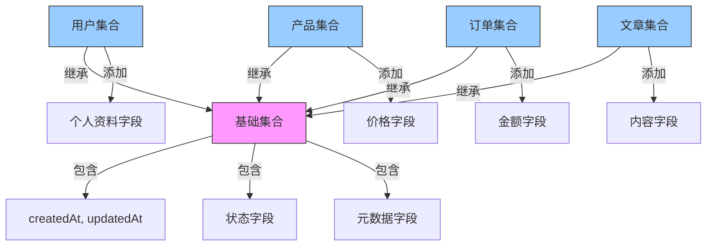

**图示来源**  
- [InheritanceCollectionMixin.ts](file://packages/core/client/src/collection-manager/mixins/InheritanceCollectionMixin.ts#L108-L120)

### 多租户架构中的数据结构共享

在多租户系统中，不同租户可能需要相似但略有不同的数据结构。继承机制可以很好地支持这种需求。

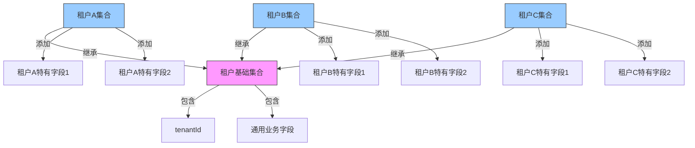

**图示来源**  
- [inherited-collection.ts](file://packages/core/database/src/inherited-collection.ts#L65-L86)

### 多重继承的应用

NocoBase支持多重继承，一个子集合可以同时继承多个父集合，这为复杂的数据模型设计提供了可能。

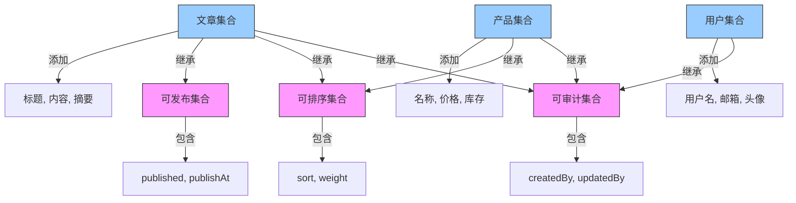

**图示来源**  
- [InheritanceCollectionMixin.test.ts](file://packages/core/client/src/collection-manager/mixins/__tests__/InheritanceCollectionMixin.test.ts#L127-L187)

## 最佳实践与注意事项

### 性能影响

继承机制虽然强大，但也可能带来性能影响，需要注意以下几点：

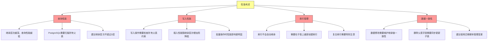

**图示来源**  
- [inherited-sync-runner.ts](file://packages/core/database/src/inherited-sync-runner.ts#L15-L27)
- [inherited-collection.ts](file://packages/core/database/src/inherited-collection.ts#L39-L44)

### 数据一致性维护

维护继承链的数据一致性是使用继承机制的关键：

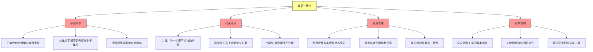

**图示来源**  
- [inherited-map.ts](file://packages/core/database/src/inherited-map.ts#L27-L40)
- [database.ts](file://packages/core/database/src/database.ts#L1016-L1021)

### 设计建议

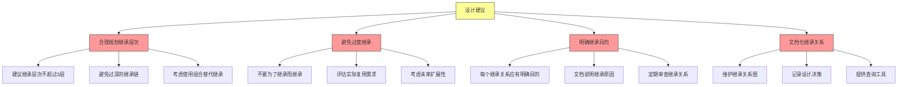

**图示来源**  
- [collectionPlugin.ts](file://packages/core/client/src/collection-manager/collectionPlugin.ts#L82)
- [InheritanceCollectionMixin.ts](file://packages/core/client/src/collection-manager/mixins/InheritanceCollectionMixin.ts#L28-L51)

## 结论

NocoBase的集合继承机制是一个强大而灵活的数据模型复用工具，它基于PostgreSQL的表继承特性，提供了完整的继承功能。通过`InheritedCollection`类和`InheritanceCollectionMixin`混合类，系统实现了服务端和客户端的完整继承支持。

继承机制的核心优势包括：
- **高效的代码复用**：通过继承基础集合，避免重复定义通用字段
- **灵活的数据模型**：支持多级继承和多重继承，适应复杂业务需求
- **完整的继承链管理**：提供丰富的API查询和管理继承关系
- **良好的扩展性**：子集合可以自由添加自己的字段和配置

在使用继承机制时，需要注意性能影响和数据一致性维护，合理规划继承层次，避免过度继承。通过遵循最佳实践，可以充分发挥继承机制的优势，构建高效、可维护的数据模型。

继承机制特别适用于基础数据模型复用、多租户架构和需要共享部分结构的复杂系统。随着业务的发展，继承机制可以帮助团队快速迭代和扩展数据模型，提高开发效率。