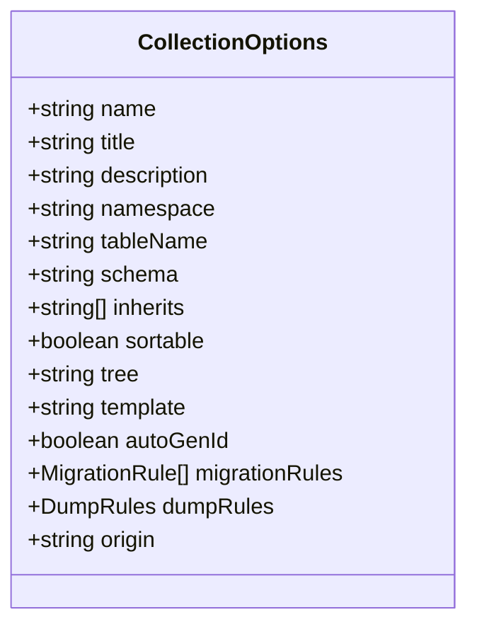
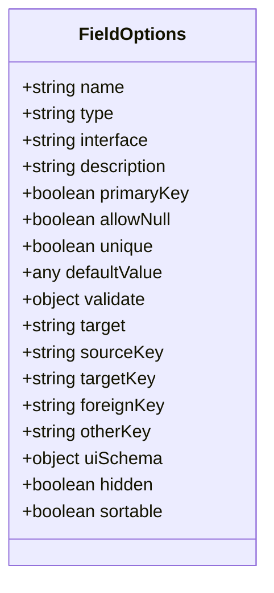
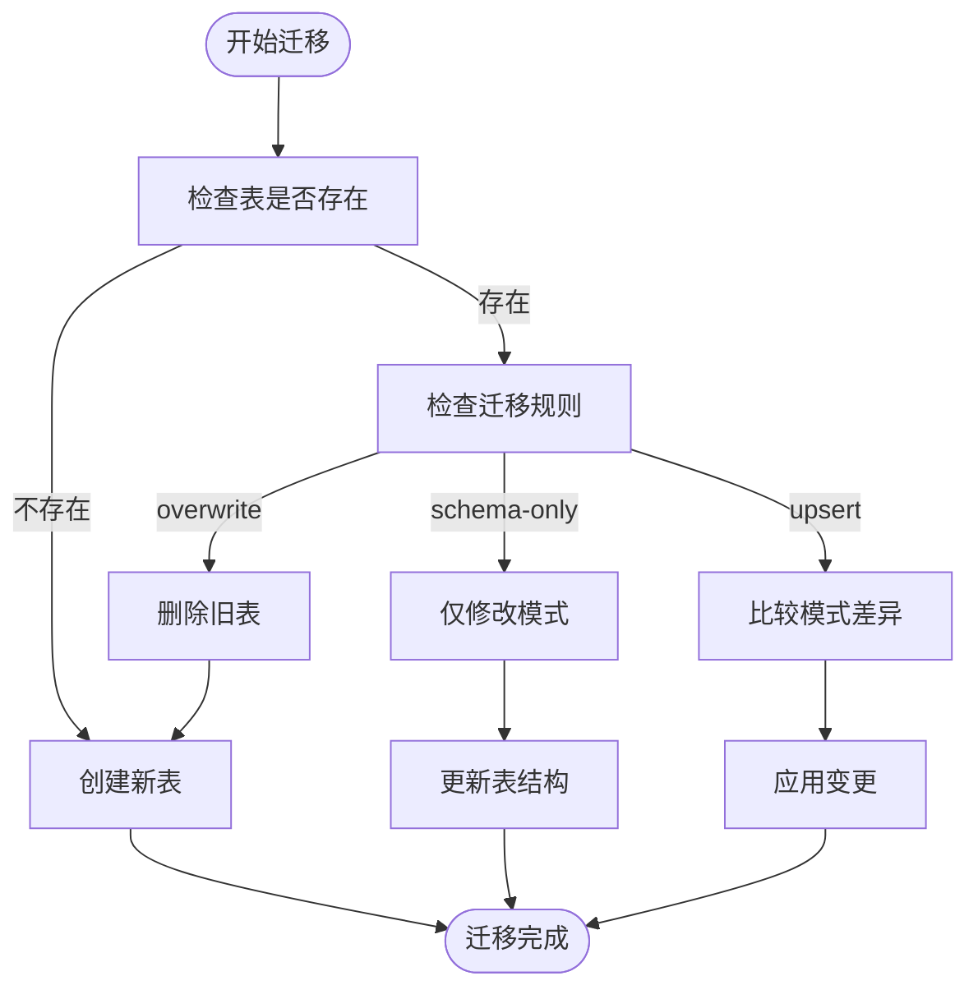
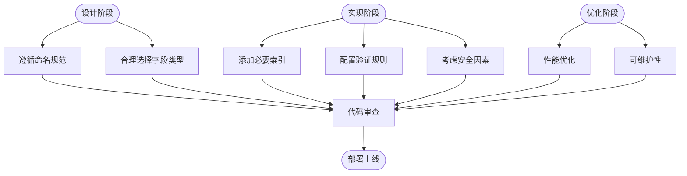

# 集合定义

<cite>
**本文档中引用的文件**  
- [collection.ts](file://packages/core/database/src/collection.ts)
- [Collection.ts](file://packages/core/client/src/data-source/collection/Collection.ts)
- [fields.ts](file://packages/plugins/@nocobase/plugin-data-source-main/src/server/collections/fields.ts)
- [collections.ts](file://packages/plugins/@nocobase/plugin-data-source-main/src/server/collections/collections.ts)
- [types.ts](file://packages/core/client/src/collection-manager/templates/types.ts)
</cite>

## 目录
1. [简介](#简介)
2. [集合基础概念](#集合基础概念)
3. [核心属性详解](#核心属性详解)
4. [字段定义机制](#字段定义机制)
5. [存储配置](#存储配置)
6. [高级配置示例](#高级配置示例)
7. [最佳实践](#最佳实践)

## 简介
NocoBase中的集合（Collection）是数据模型的核心抽象，用于定义数据库中的数据表结构及其行为。集合不仅定义了数据的存储方式，还包含了字段配置、验证规则、索引设置等元数据信息。本文档将深入解析NocoBase集合定义的各个方面，包括基本概念、核心属性、字段类型、存储配置以及最佳实践。

**Section sources**
- [collection.ts](file://packages/core/database/src/collection.ts#L1-L100)
- [Collection.ts](file://packages/core/client/src/data-source/collection/Collection.ts#L1-L50)

## 集合基础概念
在NocoBase中，集合是数据模型的基本单位，对应于数据库中的一个数据表。每个集合都有一个唯一的名称，并包含一组字段定义，这些字段定义了数据表的列结构。集合通过`Collection`类进行定义和管理，支持继承、关联、验证等多种高级特性。

集合的主要作用包括：
- 定义数据表结构（字段、类型、约束等）
- 管理字段的元数据（UI配置、验证规则等）
- 提供数据操作的抽象层（CRUD操作）
- 支持数据表的迁移和版本控制

集合可以来源于不同的地方，通过`origin`属性标识其来源：
- `plugin`：来自插件
- `core`：来自核心系统
- `user`：来自用户自定义

**Section sources**
- [collection.ts](file://packages/core/database/src/collection.ts#L135-L140)
- [Collection.ts](file://packages/core/client/src/data-source/collection/Collection.ts#L28-L80)

## 核心属性详解
集合的配置通过`CollectionOptions`接口定义，包含多个核心属性：

### 基本属性
- **name**: 集合的唯一标识符，必须符合标识符命名规范
- **title**: 集合的显示名称，用于用户界面展示
- **description**: 集合的描述信息
- **namespace**: 命名空间，用于组织集合

### 存储属性
- **tableName**: 数据表名称，如果不指定则使用集合名称
- **schema**: 数据库模式（Schema），在PostgreSQL中默认为"public"
- **inherits**: 继承的集合列表，支持单继承或多继承

### 行为属性
- **sortable**: 排序配置，可设置为布尔值、字符串或对象
- **tree**: 树形结构类型，支持多种树形算法
- **template**: 集合模板，用于快速创建预配置的集合
- **autoGenId**: 是否自动生成ID字段，默认为true

### 系统属性
- **migrationRules**: 迁移规则，控制数据表的创建和更新行为
- **dumpRules**: 导出规则，决定集合在数据导出时的行为
- **origin**: 集合来源标识



**Diagram sources**
- [collection.ts](file://packages/core/database/src/collection.ts#L96-L139)
- [Collection.ts](file://packages/core/client/src/data-source/collection/Collection.ts#L28-L80)

**Section sources**
- [collection.ts](file://packages/core/database/src/collection.ts#L96-L139)
- [Collection.ts](file://packages/core/client/src/data-source/collection/Collection.ts#L28-L80)

## 字段定义机制
集合的字段通过`fields`属性定义，每个字段都有详细的配置选项。字段定义机制支持多种字段类型和丰富的配置参数。

### 字段类型
NocoBase支持多种字段类型，主要分为以下几类：

#### 基本类型
- **string**: 字符串类型
- **integer/number**: 数字类型
- **boolean**: 布尔类型
- **date/datetime**: 日期时间类型
- **json**: JSON类型
- **text**: 长文本类型

#### 关系类型
- **belongsTo**: 一对一关系
- **hasMany**: 一对多关系
- **belongsToMany**: 多对多关系
- **hasOne**: 一对一关系（反向）

#### 特殊类型
- **uid**: 唯一标识符
- **uuid**: UUID类型
- **password**: 密码类型（自动加密）
- **sort**: 排序字段
- **virtual**: 虚拟字段

### 字段配置参数
每个字段可以配置以下参数：

#### 基础配置
- **name**: 字段名称
- **type**: 字段类型
- **interface**: 字段接口类型（用于UI展示）
- **description**: 字段描述

#### 约束配置
- **primaryKey**: 是否为主键
- **allowNull**: 是否允许为空
- **unique**: 是否唯一
- **defaultValue**: 默认值
- **validate**: 验证规则

#### 关系配置
- **target**: 目标集合名称
- **sourceKey**: 源键
- **targetKey**: 目标键
- **foreignKey**: 外键
- **otherKey**: 另一个键（多对多关系）

#### UI配置
- **uiSchema**: UI模式定义
- **hidden**: 是否在UI中隐藏
- **sortable**: 是否可排序



**Diagram sources**
- [fields.ts](file://packages/plugins/@nocobase/plugin-data-source-main/src/server/collections/fields.ts#L30-L84)
- [collection.ts](file://packages/core/database/src/fields/field.ts#L1-L50)

**Section sources**
- [fields.ts](file://packages/plugins/@nocobase/plugin-data-source-main/src/server/collections/fields.ts#L30-L84)
- [collection.ts](file://packages/core/database/src/fields/field.ts#L1-L50)

## 存储配置
集合的存储配置决定了数据在数据库中的物理存储方式。

### 数据表名配置
通过`tableName`属性指定数据表名称。如果不指定，则使用集合名称作为表名。当`underscored`选项为true时，名称会自动转换为蛇形命名法（snake_case）。

### 分片策略
NocoBase通过以下机制支持数据分片：
- **schema**: 在PostgreSQL中使用模式（Schema）进行逻辑分片
- **table prefix**: 通过表名前缀实现分片
- **database instance**: 支持多数据库实例，可将不同集合存储在不同数据库中

### 索引配置
集合支持多种索引配置：
- **indexes**: 显式定义索引
- **unique constraints**: 唯一约束
- **foreign key constraints**: 外键约束

通过`addIndex`方法可以动态添加索引：
```typescript
collection.addIndex({
  fields: ['field1', 'field2'],
  unique: true
});
```

### 迁移配置
`migrationRules`属性控制数据表的迁移行为：
- **overwrite**: 覆盖现有表结构
- **skip**: 跳过迁移
- **upsert**: 更新或插入
- **schema-only**: 仅更新模式，不修改数据
- **insert-ignore**: 插入时忽略已存在的记录



**Diagram sources**
- [collection.ts](file://packages/core/database/src/collection.ts#L791-L800)
- [collections.ts](file://packages/plugins/@nocobase/plugin-data-source-main/src/server/collections/collections.ts#L57-L82)

**Section sources**
- [collection.ts](file://packages/core/database/src/collection.ts#L791-L800)
- [collections.ts](file://packages/plugins/@nocobase/plugin-data-source-main/src/server/collections/collections.ts#L57-L82)

## 高级配置示例
以下是集合定义的高级配置示例，展示了如何使用`Collection`类进行复杂配置。

### 验证规则配置
```typescript
const collection = new Collection({
  name: 'users',
  fields: [
    {
      name: 'email',
      type: 'string',
      validation: {
        rules: [
          { name: 'required', message: '邮箱不能为空' },
          { name: 'email', message: '请输入有效的邮箱地址' },
          { name: 'unique', message: '邮箱已存在' }
        ]
      }
    },
    {
      name: 'age',
      type: 'integer',
      validation: {
        rules: [
          { name: 'min', value: 18, message: '年龄必须大于18岁' },
          { name: 'max', value: 100, message: '年龄不能超过100岁' }
        ]
      }
    }
  ]
});
```

### 默认值配置
```typescript
const collection = new Collection({
  name: 'posts',
  fields: [
    {
      name: 'status',
      type: 'string',
      defaultValue: 'draft',
      uiSchema: {
        type: 'string',
        'x-component': 'Select',
        enum: [
          { value: 'draft', label: '草稿' },
          { value: 'published', label: '已发布' },
          { value: 'archived', label: '归档' }
        ]
      }
    },
    {
      name: 'createdAt',
      type: 'date',
      defaultValue: '$now',
      hidden: true
    }
  ]
});
```

### 索引设置
```typescript
// 添加复合索引
collection.addIndex({
  fields: ['userId', 'status'],
  name: 'idx_user_status'
});

// 添加唯一索引
collection.addIndex({
  fields: ['email'],
  unique: true,
  name: 'uidx_email'
});
```

### 关系字段配置
```typescript
const collection = new Collection({
  name: 'posts',
  fields: [
    {
      name: 'author',
      type: 'belongsTo',
      target: 'users',
      foreignKey: 'userId',
      onDelete: 'CASCADE'
    },
    {
      name: 'tags',
      type: 'belongsToMany',
      target: 'tags',
      through: 'post_tags',
      foreignKey: 'postId',
      otherKey: 'tagId'
    }
  ]
});
```

**Section sources**
- [collection.ts](file://packages/core/database/src/collection.ts#L236-L287)
- [Collection.ts](file://packages/core/client/src/data-source/collection/Collection.ts#L252-L300)

## 最佳实践
### 命名规范
- **集合名称**: 使用小写字母和下划线，如`user_profiles`
- **字段名称**: 使用小写字母和下划线，如`first_name`
- **关系字段**: 使用目标集合的单数形式，如`author`（对应`users`集合）
- **外键字段**: 使用`{target}Id`格式，如`userId`

### 字段类型选择
- **ID字段**: 优先使用`uid`或`uuid`类型，避免使用自增ID
- **文本字段**: 根据长度选择`string`（短文本）或`text`（长文本）
- **数值字段**: 根据精度需求选择`integer`或`number`
- **日期字段**: 使用`datetime`类型存储时间戳

### 性能优化建议
- **索引策略**: 为常用查询字段添加索引，避免全表扫描
- **字段精简**: 只定义必要的字段，避免过度设计
- **关系优化**: 合理使用关系字段，避免过多的关联查询
- **分页设置**: 对大数据集启用`simplePaginate`以提高查询性能

### 安全考虑
- **敏感字段**: 使用`password`类型存储密码，自动加密
- **权限控制**: 通过`hidden`属性控制字段的可见性
- **数据验证**: 为所有输入字段添加适当的验证规则
- **审计日志**: 启用`createdBy`和`updatedBy`字段追踪数据变更



**Diagram sources**
- [types.ts](file://packages/core/client/src/collection-manager/templates/types.ts#L48-L73)
- [collection.ts](file://packages/core/database/src/collection.ts#L117-L123)

**Section sources**
- [types.ts](file://packages/core/client/src/collection-manager/templates/types.ts#L48-L73)
- [collection.ts](file://packages/core/database/src/collection.ts#L117-L123)