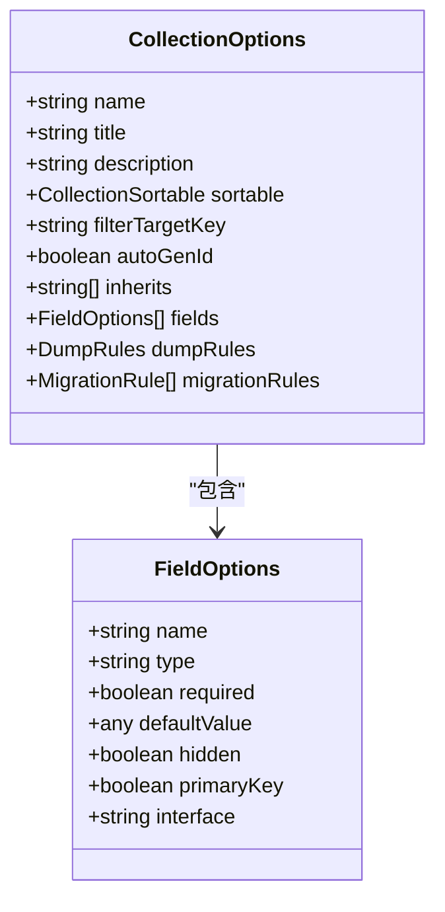
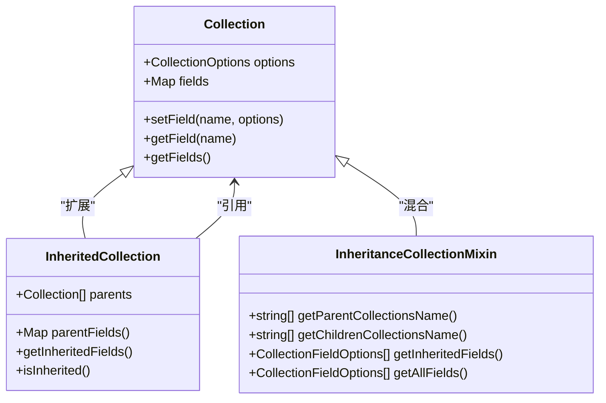
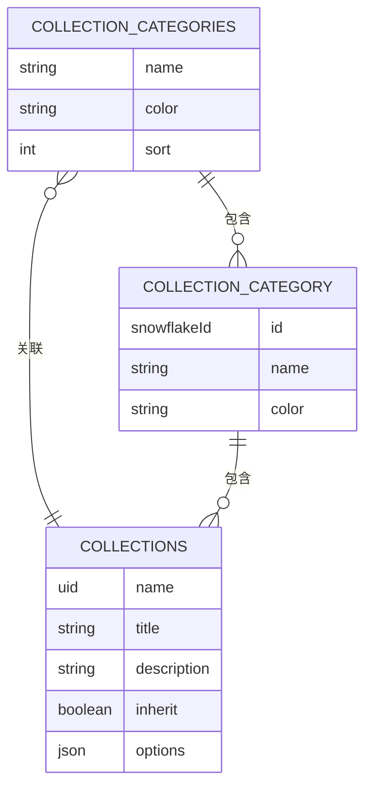
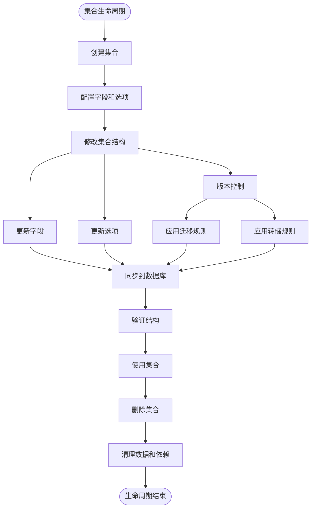
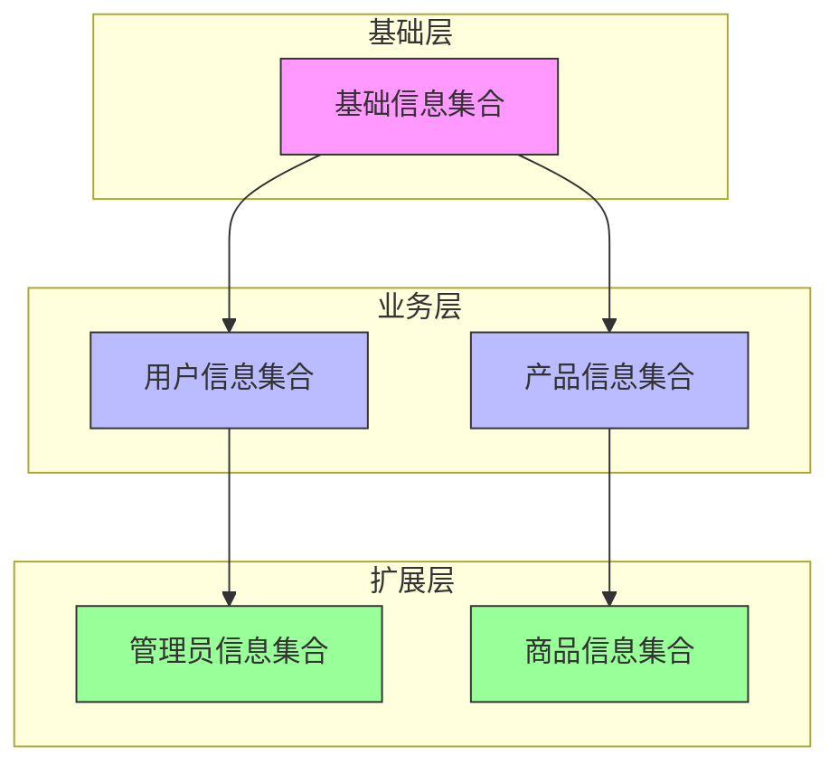
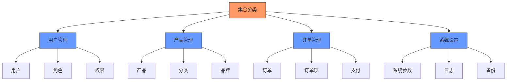

# 集合管理

<cite>
**本文档中引用的文件**  
- [collections.ts](file://packages/plugins/@nocobase/plugin-data-source-main/src/server/collections/collections.ts)
- [collectionCategories.ts](file://packages/plugins/@nocobase/plugin-data-source-main/src/server/collections/collectionCategories.ts)
- [collection.ts](file://packages/core/database/src/collection.ts)
- [inherited-collection.ts](file://packages/core/database/src/inherited-collection.ts)
- [InheritanceCollectionMixin.ts](file://packages/core/client/src/collection-manager/mixins/InheritanceCollectionMixin.ts)
- [general.tsx](file://packages/core/client/src/collection-manager/templates/general.tsx)
- [view.tsx](file://packages/core/client/src/collection-manager/templates/view.tsx)
- [sql.tsx](file://packages/core/client/src/collection-manager/templates/sql.tsx)
- [CollectionManager.ts](file://packages/core/client/src/data-source/collection/CollectionManager.ts)
- [collectionPlugin.ts](file://packages/core/client/src/collection-manager/collectionPlugin.ts)
- [CollectionMainProvider.tsx](file://packages/plugins/@nocobase/plugin-data-source-manager/src/client/component/MainDataSourceManager/CollectionMainProvider.tsx)
- [CollectionCategory.tsx](file://packages/core/client/src/collection-manager/Configuration/components/CollectionCategory.tsx)
- [context.ts](file://packages/core/client/src/collection-manager/context.ts)
- [collections.ts](file://packages/plugins/@nocobase/plugin-data-source-manager/src/client/component/MainDataSourceManager/Configuration/schemas/collections.ts)
- [data-sources-collections.ts](file://packages/plugins/@nocobase/plugin-data-source-manager/src/server/resourcers/data-sources-collections.ts)
- [collection-manager.ts](file://packages/core/data-source-manager/src/collection-manager.ts)
</cite>

## 目录
1. [介绍](#介绍)
2. [集合创建与配置](#集合创建与配置)
3. [集合继承机制](#集合继承机制)
4. [集合组管理](#集合组管理)
5. [集合生命周期管理](#集合生命周期管理)
6. [集合模板与设计模式](#集合模板与设计模式)
7. [结论](#结论)

## 介绍

NocoBase的集合管理系统提供了一套完整的数据模型管理解决方案，支持集合的创建、配置、继承和组织管理。该系统允许用户通过灵活的配置选项定义数据结构，利用继承机制复用字段定义，并通过集合组对相关集合进行分类管理。本文档将深入探讨这些功能的实现机制和使用方法。

## 集合创建与配置

在NocoBase中，集合是数据模型的基本单位，用于定义数据表的结构和行为。集合的创建和配置通过`CollectionOptions`接口进行，该接口定义了集合的各种属性。

集合的核心配置选项包括：
- **名称(name)**：集合的唯一标识符，必须是唯一的
- **标题(title)**：集合的显示名称，支持多语言翻译
- **描述(description)**：集合的描述信息
- **排序字段(sortable)**：指定用于排序的字段，可自动创建排序字段
- **过滤目标键(filterTargetKey)**：用于记录唯一标识的字段
- **自动生ID(autoGenId)**：是否自动生成ID字段

**图源**
- [collection.ts](file://packages/core/database/src/collection.ts#L96-L139)

**本节源**
- [collection.ts](file://packages/core/database/src/collection.ts#L96-L139)

## 集合继承机制

NocoBase的集合继承机制允许一个集合继承另一个或多个集合的字段定义，实现数据结构的复用。这种机制通过`inherits`属性实现，支持单继承和多继承。

继承机制的工作原理如下：
1. 当一个集合定义了`inherits`属性时，系统会创建一个`InheritedCollection`实例
2. 父集合的字段会被复制到子集合中，并标记为继承字段
3. 子集合可以覆盖继承的字段或添加新的字段
4. 继承关系形成一个有向无环图，支持复杂的继承链

**图源**
- [inherited-collection.ts](file://packages/core/database/src/inherited-collection.ts#L14-L148)
- [InheritanceCollectionMixin.ts](file://packages/core/client/src/collection-manager/mixins/InheritanceCollectionMixin.ts#L14-L298)

**本节源**
- [inherited-collection.ts](file://packages/core/database/src/inherited-collection.ts#L14-L148)
- [InheritanceCollectionMixin.ts](file://packages/core/client/src/collection-manager/mixins/InheritanceCollectionMixin.ts#L14-L298)

## 集合组管理

集合组管理功能允许用户将相关的集合组织在一起，便于分类和管理。系统通过`collectionCategories`集合实现这一功能，每个集合可以属于一个或多个类别。

集合组管理的关键特性包括：
- **分类管理**：通过`collectionCategories`集合定义类别
- **多对多关系**：集合和类别之间是多对多关系
- **颜色标识**：每个类别可以设置颜色，便于视觉区分
- **排序支持**：类别和集合在类别中的顺序都支持排序

**图源**
- [collectionCategories.ts](file://packages/plugins/@nocobase/plugin-data-source-main/src/server/collections/collectionCategories.ts#L12-L47)
- [collections.ts](file://packages/plugins/@nocobase/plugin-data-source-main/src/server/collections/collections.ts#L12-L82)

**本节源**
- [collectionCategories.ts](file://packages/plugins/@nocobase/plugin-data-source-main/src/server/collections/collectionCategories.ts#L12-L47)
- [collections.ts](file://packages/plugins/@nocobase/plugin-data-source-main/src/server/collections/collections.ts#L12-L82)

## 集合生命周期管理

集合的生命周期管理涵盖了从创建到删除的完整过程，包括版本控制和数据迁移。NocoBase提供了完整的API来管理集合的生命周期。

### 创建与修改

集合的创建和修改通过`CollectionManager`进行管理，支持以下操作：
- **defineCollection**：定义新集合
- **extendCollection**：扩展现有集合
- **updateOptions**：更新集合选项
- **setField**：设置字段
- **removeField**：移除字段

### 删除与同步

集合的删除操作需要考虑数据完整性和依赖关系：
- **removeFromDb**：从数据库中删除集合表
- **removeFieldFromDb**：从数据库中删除字段
- **sync**：同步集合结构到数据库

### 版本控制

系统通过迁移规则(migrationRules)和转储规则(dumpRules)实现版本控制：
- **迁移规则**：定义结构变更时的行为（覆盖、跳过、上插等）
- **转储规则**：定义数据导出时的分组和处理方式

**图源**
- [collection-manager.ts](file://packages/core/data-source-manager/src/collection-manager.ts#L90-L128)
- [collection.ts](file://packages/core/database/src/collection.ts#L572-L799)

**本节源**
- [collection-manager.ts](file://packages/core/data-source-manager/src/collection-manager.ts#L90-L128)
- [collection.ts](file://packages/core/database/src/collection.ts#L572-L799)

## 集合模板与设计模式

NocoBase提供了多种集合模板，用于快速创建特定类型的集合。这些模板定义了预设的配置选项和字段，简化了集合的创建过程。

### 核心模板类型

1. **通用集合模板(GeneralCollectionTemplate)**
   - 基础数据表结构
   - 支持继承和分类
   - 包含基本字段配置

2. **视图集合模板(ViewCollectionTemplate)**
   - 连接数据库视图
   - 支持只读或可写视图
   - 自动映射视图字段

3. **SQL集合模板(SqlCollectionTemplate)**
   - 基于自定义SQL查询
   - 支持复杂数据聚合
   - 可配置数据源依赖

### 设计模式与最佳实践

#### 继承模式

#### 分类组织模式

**图源**
- [general.tsx](file://packages/core/client/src/collection-manager/templates/general.tsx#L13-L31)
- [view.tsx](file://packages/core/client/src/collection-manager/templates/view.tsx#L15-L166)
- [sql.tsx](file://packages/core/client/src/collection-manager/templates/sql.tsx#L16-L100)

**本节源**
- [general.tsx](file://packages/core/client/src/collection-manager/templates/general.tsx#L13-L31)
- [view.tsx](file://packages/core/client/src/collection-manager/templates/view.tsx#L15-L166)
- [sql.tsx](file://packages/core/client/src/collection-manager/templates/sql.tsx#L16-L100)

## 结论

NocoBase的集合管理系统提供了一套强大而灵活的数据模型管理解决方案。通过深入理解集合的创建、配置、继承和组织管理机制，用户可以构建复杂而高效的数据架构。系统的设计充分考虑了可扩展性、复用性和易用性，支持从简单应用到复杂企业系统的各种需求。

关键优势包括：
- **灵活的配置选项**：丰富的集合和字段配置满足各种业务需求
- **强大的继承机制**：支持多层继承，实现数据结构的高效复用
- **完善的分类管理**：通过集合组实现逻辑分组和可视化组织
- **完整的生命周期管理**：从创建到删除的全流程控制，包含版本管理
- **多样化的模板支持**：预设模板加速开发，支持自定义扩展

这些特性共同构成了NocoBase作为低代码平台核心的数据管理能力，为构建复杂应用提供了坚实的基础。