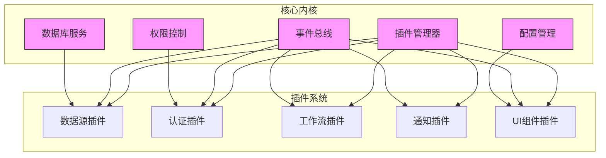
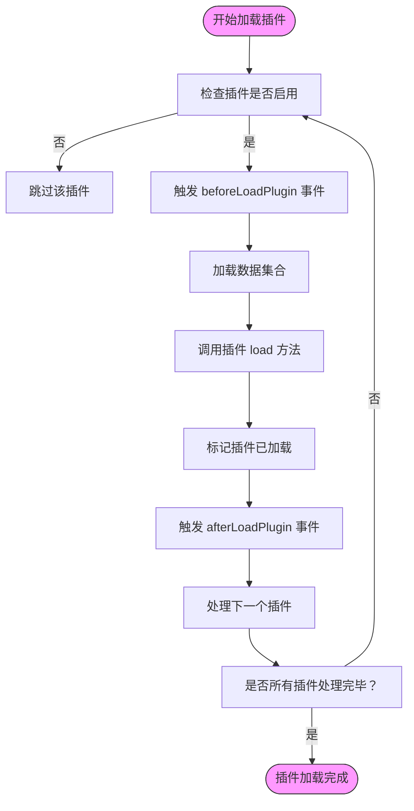
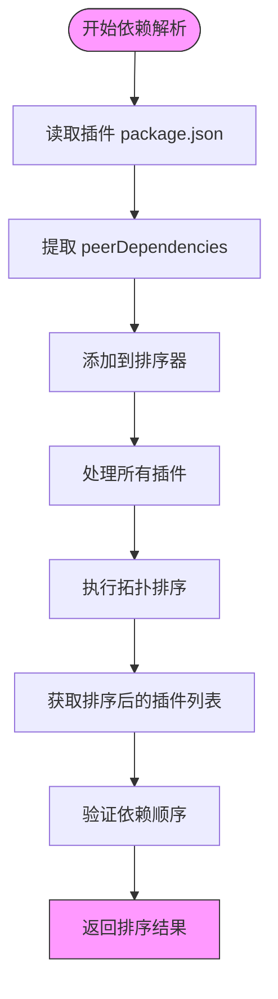
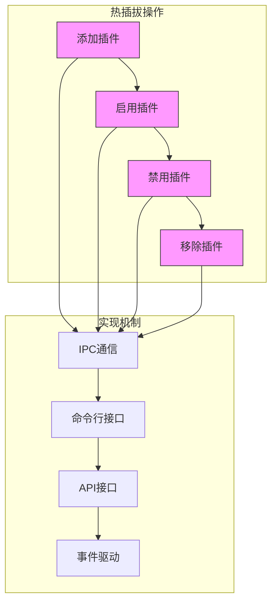
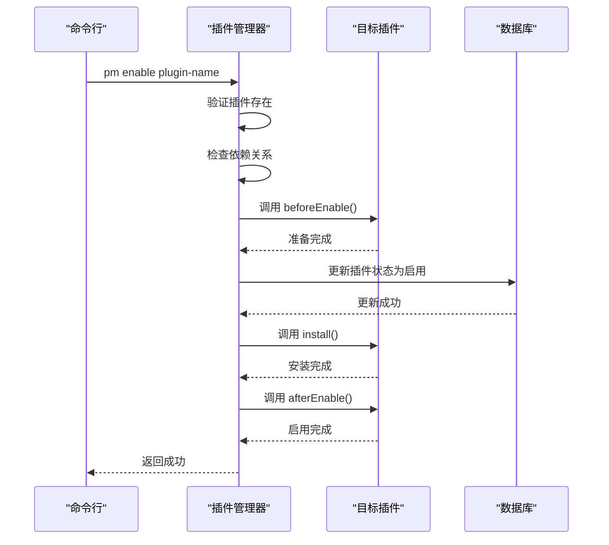
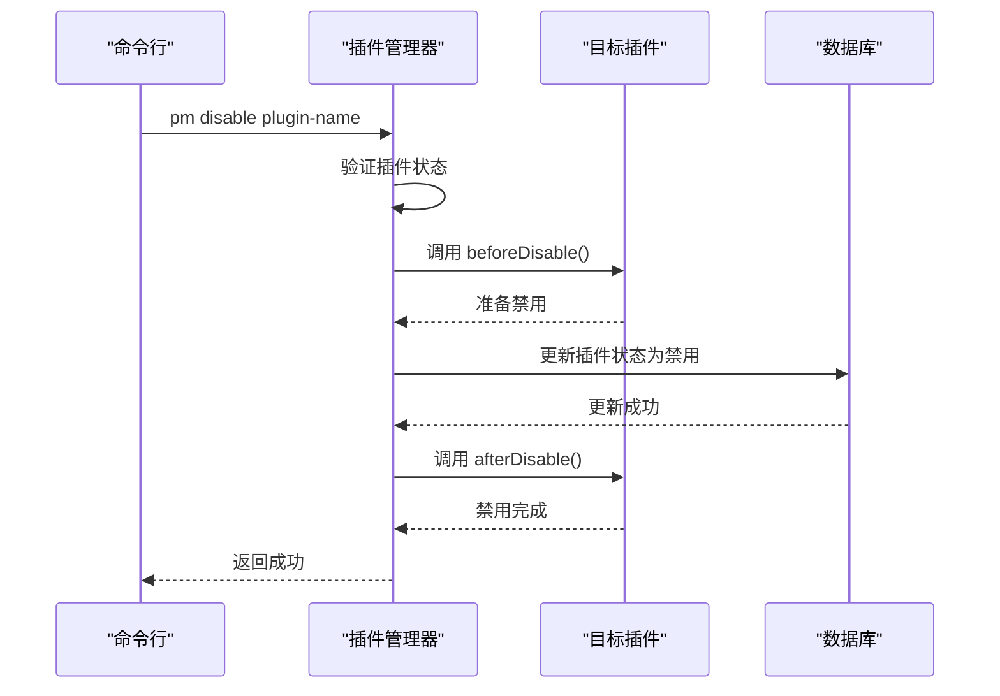
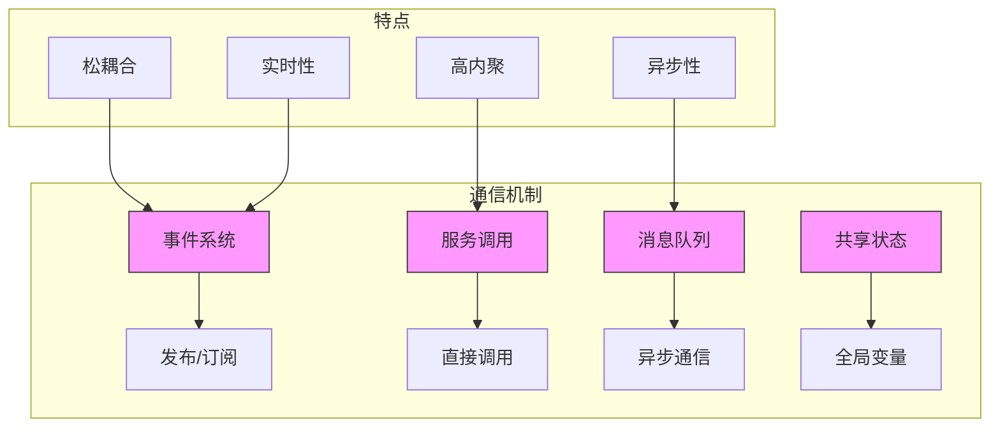
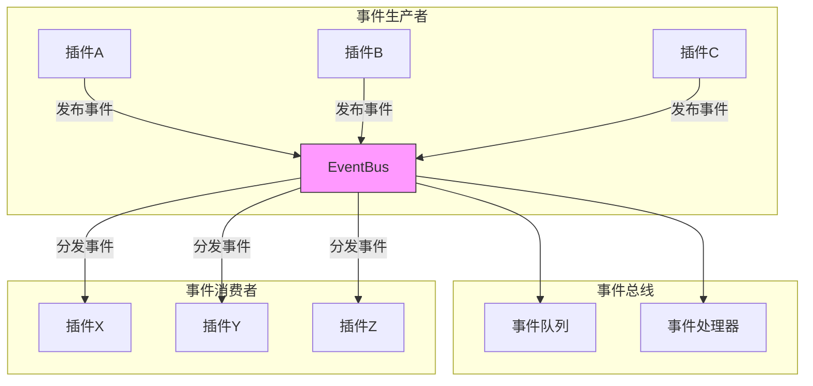
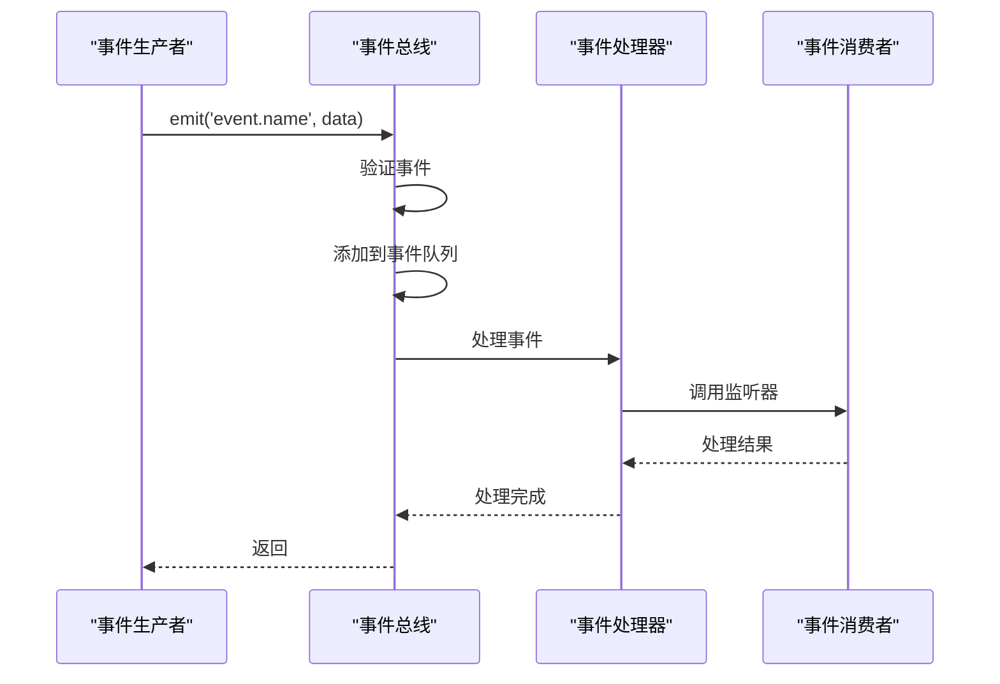

# 插件架构

<cite>
**本文档中引用的文件**  
- [plugin-manager.ts](file://packages/core/server/src/plugin-manager/plugin-manager.ts)
- [plugin.ts](file://packages/core/server/src/plugin.ts)
- [PluginManager.ts](file://packages/core/client/src/application/PluginManager.ts)
- [plugin-manager-repository.ts](file://packages/core/server/src/plugin-manager/plugin-manager-repository.ts)
- [plugin-settings-manager.md](file://packages/core/client/docs/zh-CN/core/application/plugin-settings-manager.md)
- [plugin.md](file://packages/core/client/docs/zh-CN/core/application/plugin.md)
- [index.ts](file://packages/core/app/src/index.ts)
- [pub-sub-manager](file://packages/core/server/src/pub-sub-manager)
</cite>

## 目录
1. [微内核架构设计](#微内核架构设计)
2. [核心系统与插件关系](#核心系统与插件关系)
3. [插件生命周期管理](#插件生命周期管理)
4. [插件依赖关系处理](#插件依赖关系处理)
5. [插件热插拔机制](#插件热插拔机制)
6. [插件配置系统](#插件配置系统)
7. [插件开发示例](#插件开发示例)
8. [插件间通信机制](#插件间通信机制)
9. [事件系统实现松耦合](#事件系统实现松耦合)

## 微内核架构设计

NocoBase采用微内核架构设计，将核心系统功能最小化，通过插件机制扩展系统能力。核心系统提供基础服务和插件管理能力，所有业务功能通过插件实现。这种设计实现了高内聚、低耦合的系统架构，使得系统具有良好的可扩展性和可维护性。

微内核架构的核心思想是将系统分为核心内核和外围插件两部分。核心内核负责插件的加载、管理和调度，提供基础服务如数据库访问、权限控制、事件总线等。插件则实现具体的业务功能，通过标准接口与核心系统交互。



**图示来源**  
- [plugin-manager.ts](file://packages/core/server/src/plugin-manager/plugin-manager.ts#L57-L200)
- [plugin.ts](file://packages/core/server/src/plugin.ts#L43-L254)

## 核心系统与插件关系

核心系统与插件之间通过明确定义的接口进行交互。核心系统提供PluginManager服务，负责插件的全生命周期管理。每个插件都是一个独立的模块，通过继承Plugin基类来实现特定功能。

核心系统与插件的关系具有以下特点：
- **依赖倒置**：插件依赖于核心系统提供的抽象接口，而不是具体实现
- **松耦合**：插件之间不直接依赖，通过核心系统进行协调
- **可替换性**：相同功能的插件可以相互替换，不影响系统其他部分
- **可组合性**：多个插件可以组合使用，实现复杂功能

插件通过以下方式与核心系统交互：
1. 访问核心服务（如数据库、日志、权限等）
2. 注册路由和API端点
3. 监听和发布事件
4. 扩展数据模型和业务逻辑

```mermaid
classDiagram
class Application {
+pm : PluginManager
+db : Database
+acl : ACLManager
+eventBus : EventBus
+logger : Logger
}
class PluginManager {
+add(plugin : typeof Plugin, options : PluginOptions)
+get(pluginName : string) : Plugin
+load()
+install()
+enable()
+disable()
}
class Plugin {
<<abstract>>
+app : Application
+options : PluginOptions
+load()
+install()
+beforeEnable()
+afterDisable()
}
class MyPlugin {
+load()
+install()
}
Application --> PluginManager : "包含"
PluginManager --> Plugin : "管理"
Plugin <|-- MyPlugin : "实现"
MyPlugin --> Application : "使用"
note right of Plugin
插件基类定义了标准生命周期方法
和核心系统交互的接口
end
note left of PluginManager
插件管理器负责插件的
加载、初始化、依赖解析
和生命周期管理
end
```

**图示来源**  
- [plugin-manager.ts](file://packages/core/server/src/plugin-manager/plugin-manager.ts#L57-L200)
- [plugin.ts](file://packages/core/server/src/plugin.ts#L43-L254)

**本节来源**  
- [plugin-manager.ts](file://packages/core/server/src/plugin-manager/plugin-manager.ts#L57-L200)
- [plugin.ts](file://packages/core/server/src/plugin.ts#L43-L254)

## 插件生命周期管理

NocoBase插件具有完整的生命周期，包括加载、初始化、依赖解析和卸载等阶段。插件生命周期由PluginManager统一管理，确保插件按正确顺序加载和初始化。

### 插件生命周期阶段

插件的完整生命周期包含以下阶段：

```mermaid
stateDiagram-v2
[*] --> Created
Created --> AfterAdd : "插件添加后"
AfterAdd --> BeforeLoad : "准备加载"
BeforeLoad --> Loading : "加载中"
Loading --> Loaded : "已加载"
Loaded --> BeforeEnable : "准备启用"
BeforeEnable --> Enabled : "已启用"
Enabled --> BeforeDisable : "准备禁用"
BeforeDisable --> Disabled : "已禁用"
Disabled --> BeforeRemove : "准备移除"
BeforeRemove --> Removed : "已移除"
state Created {
[*] --> Constructor
Constructor --> setOptions
}
state AfterAdd {
[*] --> afterAdd
}
state BeforeLoad {
[*] --> beforeLoad
}
state Loading {
[*] --> loadCollections
--> loadMigrations
--> load
}
state Loaded {
[*] --> emitLoadedEvent
}
state BeforeEnable {
[*] --> beforeEnable
}
state Enabled {
[*] --> install
}
state BeforeDisable {
[*] --> beforeDisable
}
state Disabled {
[*] --> afterDisable
}
state BeforeRemove {
[*] --> beforeRemove
}
state Removed {
[*] --> afterRemove
}
```

### 生命周期方法

插件基类定义了以下生命周期方法：

| 方法 | 触发时机 | 说明 |
|------|--------|------|
| `constructor` | 插件实例化时 | 初始化插件实例，设置选项 |
| `afterAdd` | 插件添加到管理器后 | 插件已注册，可以进行初步设置 |
| `beforeLoad` | 加载前 | 在load方法执行前调用 |
| `load` | 加载时 | 加载插件资源，如路由、模型等 |
| `beforeEnable` | 启用前 | 在插件启用前执行准备工作 |
| `afterEnable` | 启用后 | 插件已启用，可以执行后续操作 |
| `beforeDisable` | 禁用前 | 在插件禁用前执行清理工作 |
| `afterDisable` | 禁用后 | 插件已禁用，执行最终清理 |
| `beforeRemove` | 移除前 | 在插件移除前执行最后的清理 |
| `afterRemove` | 移除后 | 插件已从系统中移除 |

### 生命周期管理流程

插件管理器的加载流程如下：



**图示来源**  
- [plugin-manager.ts](file://packages/core/server/src/plugin-manager/plugin-manager.ts#L426-L463)
- [plugin.ts](file://packages/core/server/src/plugin.ts#L114-L134)

**本节来源**  
- [plugin-manager.ts](file://packages/core/server/src/plugin-manager/plugin-manager.ts#L426-L508)
- [plugin.ts](file://packages/core/server/src/plugin.ts#L114-L134)

## 插件依赖关系处理

NocoBase通过peerDependencies机制处理插件间的依赖关系，确保插件按正确的顺序加载和初始化。依赖关系处理是插件系统的重要组成部分，保证了系统稳定性和功能完整性。

### 依赖解析机制

插件管理器使用Topo.Sorter进行依赖排序，确保插件按照依赖关系的拓扑顺序加载：



### 依赖关系处理流程

```typescript
async sort(names: string[]) {
  const pluginNames = _.castArray(names);
  if (pluginNames.length === 1) {
    return pluginNames;
  }
  const sorter = new Topo.Sorter<string>();
  for (const pluginName of pluginNames) {
    let packageJson: any = {};
    try {
      packageJson = await PluginManager.getPackageJson(pluginName);
    } catch (error) {
      packageJson = {};
    }
    const peerDependencies = Object.keys(packageJson?.peerDependencies || {});
    sorter.add(pluginName, { after: peerDependencies, group: packageJson?.packageName || pluginName });
  }
  return sorter.nodes;
}
```

### 依赖声明示例

在插件的package.json中声明依赖关系：

```json
{
  "name": "@nocobase/plugin-my-feature",
  "peerDependencies": {
    "@nocobase/plugin-database": "^0.8.0",
    "@nocobase/plugin-auth": "^0.8.0"
  }
}
```

这样可以确保：
1. `plugin-my-feature`在`plugin-database`和`plugin-auth`之后加载
2. 系统会检查依赖插件的版本兼容性
3. 依赖插件必须存在且启用

**图示来源**  
- [plugin-manager-repository.ts](file://packages/core/server/src/plugin-manager/plugin-manager-repository.ts#L124-L141)

**本节来源**  
- [plugin-manager-repository.ts](file://packages/core/server/src/plugin-manager/plugin-manager-repository.ts#L124-L141)
- [plugin-manager.ts](file://packages/core/server/src/plugin-manager/plugin-manager.ts#L131-L138)

## 插件热插拔机制

NocoBase支持插件的热插拔功能，允许在运行时动态添加、启用、禁用和移除插件，而无需重启服务。这一机制提高了系统的灵活性和可用性。

### 热插拔操作

插件管理器提供了以下热插拔操作：



### 热插拔流程

#### 启用插件流程



#### 禁用插件流程



### 热插拔实现

热插拔功能通过以下方式实现：

1. **命令行接口**：提供pm命令进行插件管理
2. **API接口**：提供REST API进行远程管理
3. **事件驱动**：通过事件总线通知相关组件
4. **状态持久化**：将插件状态保存到数据库

```typescript
pm.command('disable')
  .ipc()
  .preload()
  .arguments('<plugins...>')
  .action(async (plugins) => {
    try {
      await app.pm.disable(plugins);
    } catch (error) {
      throw new PluginCommandError(`Failed to disable plugin`, { cause: error });
    }
  });
```

**图示来源**  
- [pm.ts](file://packages/core/server/src/commands/pm.ts#L88-L97)
- [plugin-manager.ts](file://packages/core/server/src/plugin-manager/plugin-manager.ts#L498-L504)

**本节来源**  
- [pm.ts](file://packages/core/server/src/commands/pm.ts#L88-L97)
- [plugin-manager.ts](file://packages/core/server/src/plugin-manager/plugin-manager.ts#L498-L504)

## 插件配置系统

NocoBase提供了完善的插件配置系统，支持插件的配置定义、读取和管理。插件配置系统使得插件可以灵活地适应不同的使用场景和需求。

### 配置管理器

插件设置管理器（PluginSettingsManager）负责管理插件的配置界面和配置数据：

```mermaid
classDiagram
class PluginSettingsManager {
+settings : Record<string, PluginSettingOptions>
+add(name : string, options : PluginSettingOptions)
+get(name : string, filterAuth : boolean)
+getList(filterAuth : boolean)
+has(name : string)
+remove(name : string)
+getRouteName(name : string)
+getRoutePath(name : string)
}
class PluginSettingOptions {
+title : string
+icon : any
+path : string
+sort : number
+Component : React.ComponentType
+aclSnippet : string
}
PluginSettingsManager --> PluginSettingOptions : "包含"
note right of PluginSettingsManager
管理所有插件的配置页面
提供配置的增删改查接口
end
```

### 配置定义

插件可以通过以下方式定义配置：

```typescript
class MyPlugin extends Plugin {
  async load() {
    this.app.pluginSettingsManager.add('hello', {
      title: 'HelloWorld',
      icon: 'icon-name',
      Component: Outlet
    });

    this.app.pluginSettingsManager.add('hello.demo1', {
      title: 'Demo1 Page',
      Component: () => <div>Demo1 Page Content</div>
    });

    this.app.pluginSettingsManager.add('hello.demo2', {
      title: 'Demo2 Page',
      Component: () => <div>Demo2 Page Content</div>
    });
  }
}
```

### 配置读取

插件可以通过以下方式读取配置：

```typescript
// 获取单个配置
const helloSettingPage = this.app.pluginSettingsManager.get('hello');

// 获取配置列表
const settings = this.app.pluginSettingsManager.getList();

// 检查配置是否存在
const exists = this.app.pluginSettingsManager.has('hello');

// 获取路由名称
const routeName = this.app.pluginSettingsManager.getRouteName('hello');
```

### 配置系统特点

1. **层级结构**：支持多级配置页面
2. **权限控制**：集成ACL系统进行权限管理
3. **动态加载**：支持运行时添加和移除配置
4. **国际化**：支持多语言配置界面
5. **持久化**：配置数据持久化存储

**图示来源**  
- [PluginSettingsManager.ts](file://packages/core/client/src/application/PluginSettingsManager.ts#L56-L182)
- [plugin-settings-manager.md](file://packages/core/client/docs/zh-CN/core/application/plugin-settings-manager.md#L89-L270)

**本节来源**  
- [PluginSettingsManager.ts](file://packages/core/client/src/application/PluginSettingsManager.ts#L56-L182)
- [plugin-settings-manager.md](file://packages/core/client/docs/zh-CN/core/application/plugin-settings-manager.md#L89-L270)

## 插件开发示例

以下是一个完整的插件开发示例，展示如何创建包含前后端功能的NocoBase插件。

### 插件结构

```
my-plugin/
├── src/
│   ├── server/
│   │   └── plugin.ts
│   ├── client/
│   │   └── index.ts
│   └── index.ts
├── package.json
└── README.md
```

### 服务端插件实现

```typescript
import { Plugin } from '@nocobase/server';

export default class MyPlugin extends Plugin {
  async afterAdd() {
    // 插件添加后执行
    console.log('插件已添加');
  }

  async beforeLoad() {
    // 加载前执行
    console.log('准备加载插件');
  }

  async load() {
    // 加载插件资源
    console.log('加载插件');
    
    // 访问应用实例
    console.log(this.app);
    
    // 访问数据库
    await this.db.collection({
      name: 'my_collection',
      fields: [
        { type: 'string', name: 'name' },
        { type: 'text', name: 'description' }
      ]
    });
    
    // 注册路由
    this.app.router.post('/my-plugin/hello', async (ctx, next) => {
      ctx.body = { message: 'Hello from my plugin!' };
      await next();
    });
  }

  async install() {
    // 插件安装时执行
    console.log('安装插件');
  }

  async afterEnable() {
    // 插件启用后执行
    console.log('插件已启用');
  }

  async beforeDisable() {
    // 插件禁用前执行
    console.log('准备禁用插件');
  }
}
```

### 前端插件实现

```typescript
import { Plugin } from '@nocobase/client';

class MyClientPlugin extends Plugin {
  async load() {
    // 添加配置页面
    this.app.pluginSettingsManager.add('my-plugin', {
      title: '我的插件',
      icon: 'plugin',
      Component: () => <div>我的插件配置页面</div>
    });
    
    // 监听事件
    this.app.eventBus.on('my-event', (data) => {
      console.log('收到事件:', data);
    });
  }
}

export default MyClientPlugin;
```

### 插件入口文件

```typescript
// src/index.ts
export { default } from './server/plugin';
```

### package.json配置

```json
{
  "name": "my-plugin",
  "version": "0.1.0",
  "peerDependencies": {
    "@nocobase/server": "^0.8.0",
    "@nocobase/client": "^0.8.0"
  },
  "nocobase": {
    "type": "plugin"
  }
}
```

**本节来源**  
- [plugin.md](file://packages/core/client/docs/zh-CN/core/application/plugin.md#L68-L90)
- [plugin.ts](file://packages/core/server/src/plugin.ts#L43-L254)

## 插件间通信机制

NocoBase提供了多种插件间通信机制，支持插件之间的数据交换和功能调用。这些机制实现了插件间的松耦合交互，提高了系统的灵活性和可维护性。

### 通信方式



### 事件系统通信

事件系统是最常用的插件间通信方式：

```typescript
// 插件A：发布事件
class PluginA extends Plugin {
  async someAction() {
    // 执行某些操作后发布事件
    this.app.eventBus.emit('user.created', { userId: 123, name: 'John' });
  }
}

// 插件B：监听事件
class PluginB extends Plugin {
  async load() {
    // 监听用户创建事件
    this.app.eventBus.on('user.created', async (userData) => {
      console.log('收到用户创建事件:', userData);
      // 执行相关操作，如发送通知
      await this.sendWelcomeEmail(userData);
    });
  }
  
  async sendWelcomeEmail(userData) {
    // 发送欢迎邮件的逻辑
  }
}
```

### 服务调用通信

插件可以直接调用其他插件提供的服务：

```typescript
// 插件A：提供服务
class NotificationPlugin extends Plugin {
  async sendNotification(message) {
    // 发送通知的逻辑
    console.log('发送通知:', message);
  }
}

// 插件B：调用服务
class UserPlugin extends Plugin {
  async createUser(userData) {
    // 创建用户逻辑
    const user = await this.db.getRepository('users').create({ values: userData });
    
    // 调用通知插件的服务
    const notificationPlugin = this.app.pm.get('notification');
    if (notificationPlugin) {
      await notificationPlugin.sendNotification(`新用户 ${user.name} 已创建`);
    }
    
    return user;
  }
}
```

### 消息队列通信

对于异步通信，可以使用消息队列：

```typescript
// 发送消息
await this.app.messageQueue.publish('user.created', {
  userId: user.id,
  action: 'create',
  timestamp: Date.now()
});

// 消费消息
this.app.messageQueue.subscribe('user.created', async (message) => {
  // 处理用户创建消息
  await this.handleUserCreated(message.data);
});
```

**本节来源**  
- [plugin.md](file://packages/core/client/docs/zh-CN/core/application/plugin.md#L68-L90)
- [pub-sub-manager](file://packages/core/server/src/pub-sub-manager)

## 事件系统实现松耦合

NocoBase的事件系统是实现插件间松耦合交互的核心机制。通过事件驱动架构，插件可以以非直接依赖的方式进行通信和协作。

### 事件系统架构



### 事件处理流程



### 事件系统优势

1. **解耦**：生产者和消费者无需知道对方的存在
2. **扩展性**：可以轻松添加新的事件监听器
3. **灵活性**：支持同步和异步事件处理
4. **可靠性**：支持事件持久化和重试机制
5. **可观测性**：便于监控和调试事件流

### 事件系统API

```typescript
// 发布事件
this.app.eventBus.emit('user.created', userData, {
  async: true, // 异步处理
  retry: 3,    // 重试次数
  delay: 1000  // 延迟时间
});

// 监听事件
this.app.eventBus.on('user.created', async (userData) => {
  // 处理用户创建事件
}, {
  priority: 10, // 优先级
  once: false    // 是否只监听一次
});

// 监听一次事件
this.app.eventBus.once('app.ready', () => {
  console.log('应用已准备就绪');
});

// 移除监听器
this.app.eventBus.off('user.created', handlerFunction);

// 获取事件统计
const stats = this.app.eventBus.getStats();
```

### 事件模式

NocoBase支持多种事件模式：

| 模式 | 描述 | 适用场景 |
|------|------|----------|
| 发布/订阅 | 一对多通信 | 广播通知、日志记录 |
| 请求/响应 | 一对一通信 | 服务调用、数据查询 |
| 观察者 | 状态变化通知 | 数据变更、状态更新 |
| 命令 | 操作指令 | 执行特定任务 |

事件系统通过这些机制实现了插件间的松耦合交互，使得系统更加灵活和可维护。

**图示来源**  
- [pub-sub-manager](file://packages/core/server/src/pub-sub-manager)
- [plugin.md](file://packages/core/client/docs/zh-CN/core/application/plugin.md#L68-L90)

**本节来源**  
- [pub-sub-manager](file://packages/core/server/src/pub-sub-manager)
- [plugin.md](file://packages/core/client/docs/zh-CN/core/application/plugin.md#L68-L90)