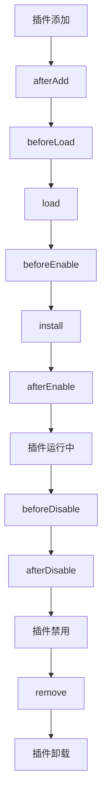
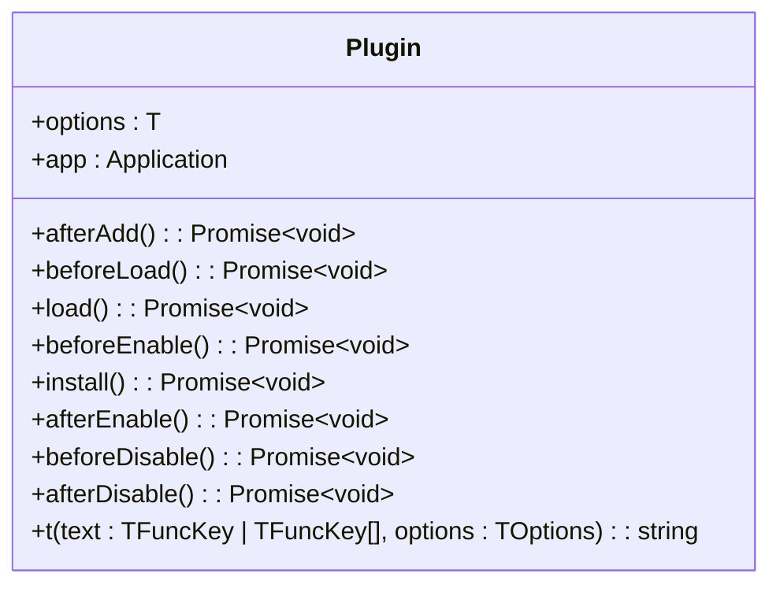
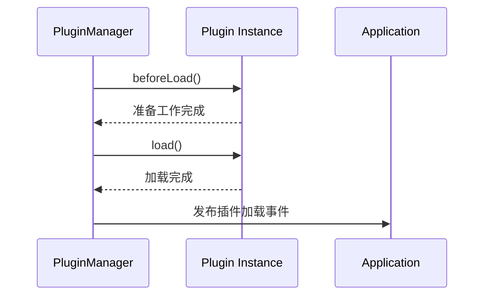
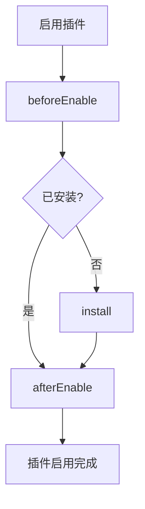
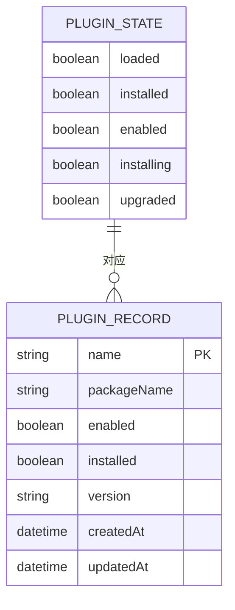
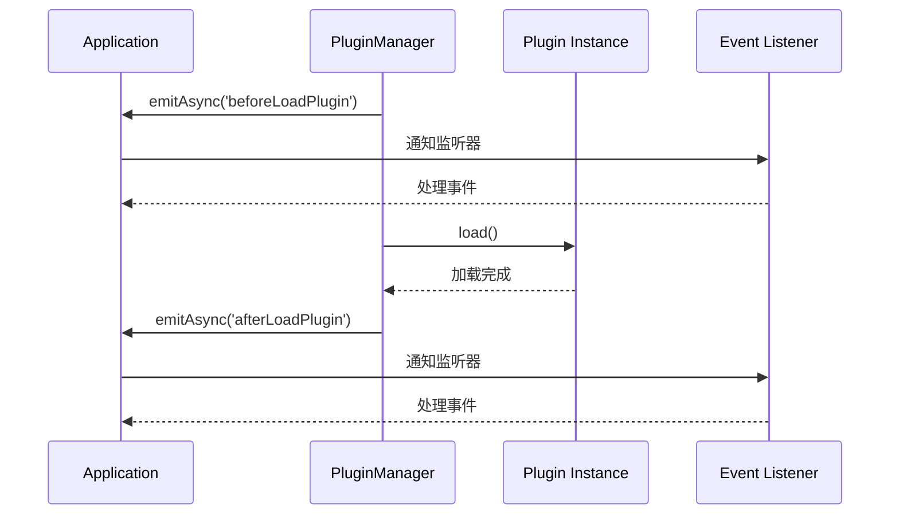
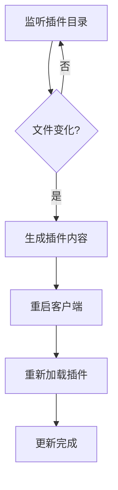

# 插件生命周期

<cite>
**本文档引用的文件**   
- [plugin-manager.ts](file://packages/core/server/src/plugin-manager/plugin-manager.ts)
- [Plugin.ts](file://packages/core/client/src/application/Plugin.ts)
- [application.ts](file://packages/core/server/src/application.ts)
- [plugin-manager-repository.ts](file://packages/core/server/src/plugin-manager/plugin-manager-repository.ts)
- [umiConfig.js](file://packages/core/devtools/umiConfig.js)
- [dev.js](file://packages/core/cli/src/commands/dev.js)
</cite>

## 目录
1. [介绍](#介绍)
2. [插件生命周期阶段](#插件生命周期阶段)
3. [生命周期钩子函数](#生命周期钩子函数)
4. [插件状态管理](#插件状态管理)
5. [事件系统与生命周期监听](#事件系统与生命周期监听)
6. [热重载机制](#热重载机制)
7. [最佳实践与常见问题](#最佳实践与常见问题)

## 介绍
NocoBase的插件系统提供了一套完整的生命周期管理机制，允许插件在不同阶段执行特定的初始化、配置和清理操作。插件生命周期涵盖了从加载、安装、初始化、启动到停止和卸载的完整过程。通过实现特定的钩子函数，插件可以在适当的时机执行业务逻辑，确保系统稳定性和功能完整性。

**Section sources**
- [plugin-manager.ts](file://packages/core/server/src/plugin-manager/plugin-manager.ts#L1-L1167)
- [Plugin.ts](file://packages/core/client/src/application/Plugin.ts#L1-L60)

## 插件生命周期阶段
NocoBase插件的生命周期包含多个关键阶段，每个阶段都有明确的执行顺序和目的：

1. **加载阶段 (load)**：插件被加载到应用中，执行基本的初始化操作
2. **安装阶段 (install)**：插件进行数据库同步和数据初始化
3. **启用阶段 (enable)**：激活插件功能，使其可以正常工作
4. **启动阶段 (start)**：插件完全启动，开始提供服务
5. **禁用阶段 (disable)**：停用插件功能，但保留数据
6. **卸载阶段 (remove)**：完全移除插件及其数据

**Diagram sources**
- [plugin-manager.ts](file://packages/core/server/src/plugin-manager/plugin-manager.ts#L426-L508)
- [Plugin.ts](file://packages/core/client/src/application/Plugin.ts#L50-L54)

**Section sources**
- [plugin-manager.ts](file://packages/core/server/src/plugin-manager/plugin-manager.ts#L426-L723)
- [application.ts](file://packages/core/server/src/application.ts#L672-L704)

## 生命周期钩子函数
插件通过实现特定的生命周期钩子函数来响应生命周期事件。这些钩子函数在插件类中定义，按特定顺序执行。

### 核心钩子函数

**Diagram sources**
- [Plugin.ts](file://packages/core/client/src/application/Plugin.ts#L13-L58)

#### afterAdd 钩子
`afterAdd` 钩子在插件被添加到插件管理器后立即执行。这是插件生命周期的第一个钩子，用于执行插件添加后的初始化操作。

**Section sources**
- [plugin-manager.ts](file://packages/core/server/src/plugin-manager/plugin-manager.ts#L367-L373)
- [Plugin.ts](file://packages/core/client/src/application/Plugin.ts#L50)

#### beforeLoad 和 load 钩子
`beforeLoad` 和 `load` 钩子在插件加载阶段执行。`beforeLoad` 用于执行加载前的准备工作，`load` 用于执行主要的加载逻辑。

**Diagram sources**
- [plugin-manager.ts](file://packages/core/server/src/plugin-manager/plugin-manager.ts#L446-L467)
- [Plugin.ts](file://packages/core/client/src/application/Plugin.ts#L51-L54)

**Section sources**
- [plugin-manager.ts](file://packages/core/server/src/plugin-manager/plugin-manager.ts#L426-L468)
- [Plugin.ts](file://packages/core/client/src/application/Plugin.ts#L51-L54)

#### 安装和启用钩子
安装和启用阶段涉及多个钩子函数，包括 `beforeEnable`、`install` 和 `afterEnable`，这些钩子确保插件正确地初始化数据库和配置。

**Diagram sources**
- [plugin-manager.ts](file://packages/core/server/src/plugin-manager/plugin-manager.ts#L628-L676)
- [plugin-manager-repository.ts](file://packages/core/server/src/plugin-manager/plugin-manager-repository.ts#L68-L80)

**Section sources**
- [plugin-manager.ts](file://packages/core/server/src/plugin-manager/plugin-manager.ts#L510-L683)
- [plugin-manager-repository.ts](file://packages/core/server/src/plugin-manager/plugin-manager-repository.ts#L56-L82)

## 插件状态管理
NocoBase通过状态对象和数据库记录来管理插件的生命周期状态。每个插件实例都有一个状态对象，用于跟踪其当前状态。

### 状态属性
- `loaded`: 插件是否已加载
- `installed`: 插件是否已安装
- `enabled`: 插件是否已启用
- `installing`: 插件是否正在安装
- `upgraded`: 插件是否已升级

**Diagram sources**
- [plugin-manager.ts](file://packages/core/server/src/plugin-manager/plugin-manager.ts#L73-L79)
- [plugin-manager-repository.ts](file://packages/core/server/src/plugin-manager/plugin-manager-repository.ts#L77-L79)

**Section sources**
- [plugin-manager.ts](file://packages/core/server/src/plugin-manager/plugin-manager.ts#L520-L521)
- [plugin-manager-repository.ts](file://packages/core/server/src/plugin-manager/plugin-manager-repository.ts#L77-L79)

## 事件系统与生命周期监听
NocoBase的事件系统允许监听插件生命周期的关键事件，实现跨插件的协作和通知。

### 核心生命周期事件
- `beforeLoadPlugin`: 插件加载前触发
- `afterLoadPlugin`: 插件加载后触发
- `beforeInstallPlugin`: 插件安装前触发
- `afterInstallPlugin`: 插件安装后触发
- `beforeEnablePlugin`: 插件启用前触发
- `afterEnablePlugin`: 插件启用后触发
- `beforeDisablePlugin`: 插件禁用前触发
- `afterDisablePlugin`: 插件禁用后触发

**Diagram sources**
- [plugin-manager.ts](file://packages/core/server/src/plugin-manager/plugin-manager.ts#L463-L468)
- [plugin-manager.ts](file://packages/core/server/src/plugin-manager/plugin-manager.ts#L671-L675)

**Section sources**
- [plugin-manager.ts](file://packages/core/server/src/plugin-manager/plugin-manager.ts#L463-L468)
- [plugin-manager.ts](file://packages/core/server/src/plugin-manager/plugin-manager.ts#L671-L675)

## 热重载机制
NocoBase支持插件的热重载机制，允许在开发过程中动态更新插件而无需重启整个应用。

### 开发模式热重载
在开发模式下，系统会监听插件目录的变化，当检测到插件文件修改时，自动触发重新加载。

**Diagram sources**
- [dev.js](file://packages/core/cli/src/commands/dev.js#L58-L102)
- [umiConfig.js](file://packages/core/devtools/umiConfig.js#L190-L201)

**Section sources**
- [dev.js](file://packages/core/cli/src/commands/dev.js#L58-L102)
- [umiConfig.js](file://packages/core/devtools/umiConfig.js#L190-L201)

### 热重载工作流程
1. 监听 `storage/plugins` 目录的文件变化
2. 检测到变化后，重新生成插件内容
3. 重启客户端进程
4. 重新加载所有插件
5. 触发相应的生命周期钩子

## 最佳实践与常见问题
### 最佳实践
1. **资源清理**：在 `beforeDisable` 钩子中清理所有资源，避免内存泄漏
2. **错误处理**：在每个钩子函数中实现适当的错误处理机制
3. **异步操作**：所有钩子函数都应返回 Promise，确保异步操作正确完成
4. **依赖管理**：合理管理插件间的依赖关系，避免循环依赖

### 常见问题
1. **插件加载失败**：检查插件是否正确导出，确保 `package.json` 配置正确
2. **数据库同步问题**：确保 `install` 钩子中正确处理数据库迁移
3. **状态不一致**：避免直接修改状态属性，应通过插件管理器的方法来改变状态
4. **事件监听冲突**：为自定义事件使用唯一的命名空间，避免事件名称冲突

**Section sources**
- [plugin-manager.ts](file://packages/core/server/src/plugin-manager/plugin-manager.ts#L677-L683)
- [plugin-manager.ts](file://packages/core/server/src/plugin-manager/plugin-manager.ts#L724-L730)