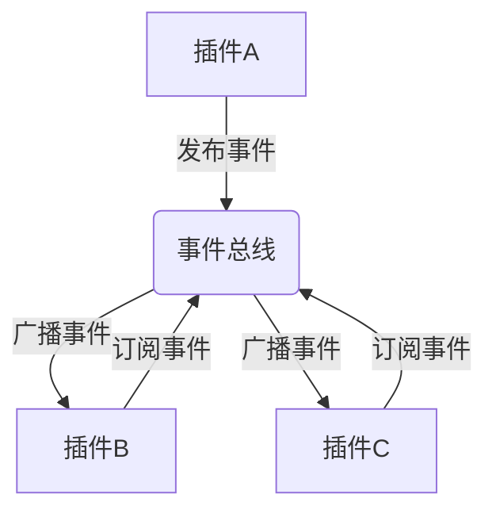
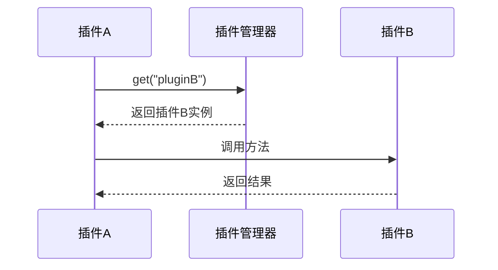
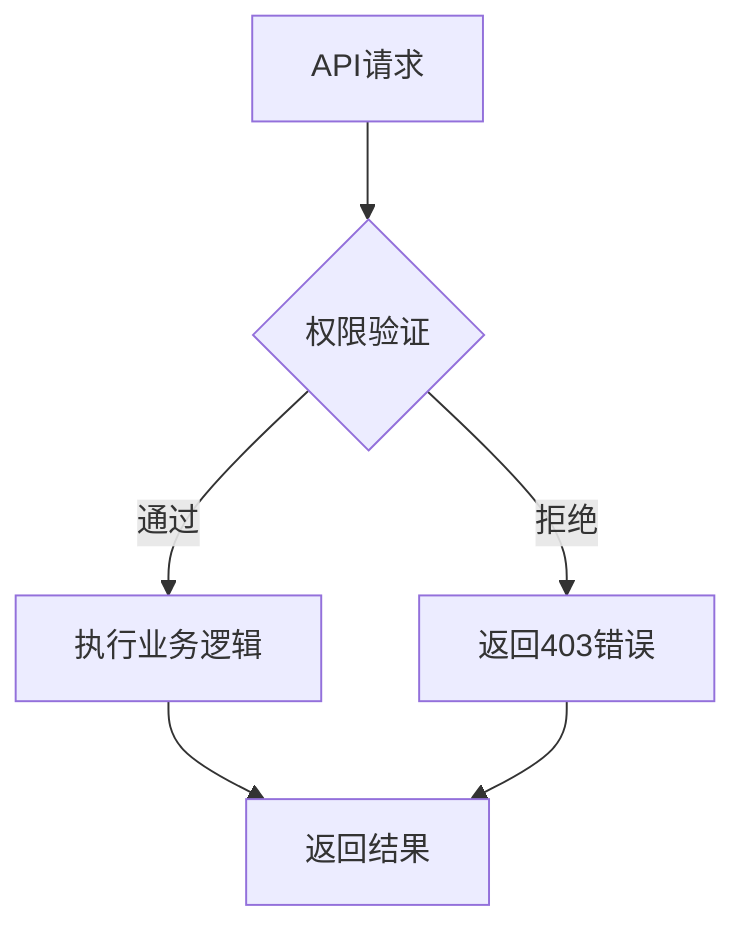
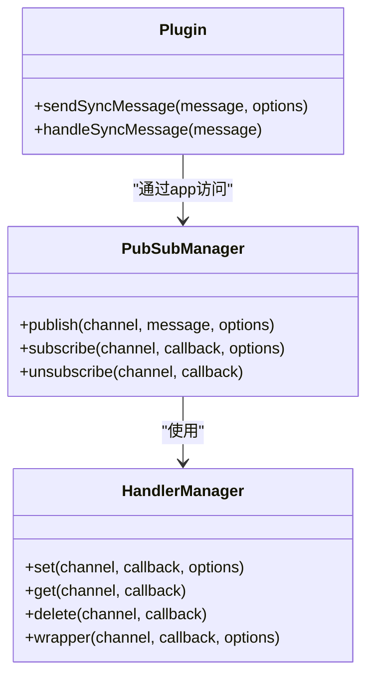
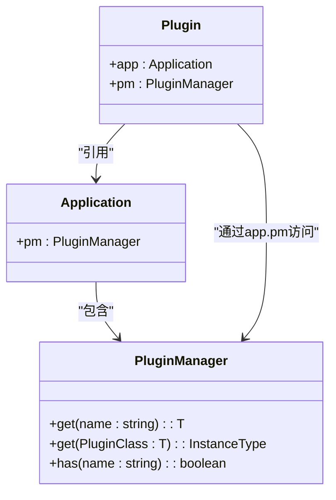

# 通信机制

<cite>
**本文档引用的文件**
- [pub-sub-manager.ts](file://packages\core\server\src\pub-sub-manager\pub-sub-manager.ts)
- [handler-manager.ts](file://packages\core\server\src\pub-sub-manager\handler-manager.ts)
- [plugin-manager.ts](file://packages\core\server\src\plugin-manager\plugin-manager.ts)
- [plugin.ts](file://packages\core\server\src\plugin.ts)
- [application.ts](file://packages\core\server\src\application.ts)
- [AsyncEmitter.ts](file://packages\core\utils\src\mixin\AsyncEmitter.ts)
- [types.ts](file://packages\core\server\src\pub-sub-manager\types.ts)
- [plugin-manager.md](file://packages\core\client\docs\zh-CN\core\application\plugin-manager.md)
</cite>

## 目录
1. [引言](#引言)
2. [事件驱动架构与发布-订阅模式](#事件驱动架构与发布-订阅模式)
3. [插件间服务调用机制](#插件间服务调用机制)
4. [跨插件API调用的安全控制](#跨插件api调用的安全控制)
5. [代码示例与应用场景](#代码示例与应用场景)
6. [性能特征与最佳实践](#性能特征与最佳实践)
7. [结论](#结论)

## 引言
NocoBase是一个基于插件架构的低代码开发平台，其核心特性之一是插件间的松耦合通信机制。本文档详细描述了NocoBase插件间的多种通信方式，包括事件驱动架构、发布-订阅模式和直接调用等交互方式。通过分析事件总线（Event Bus）的实现，解释如何实现插件间的松耦合通信，以及如何定义和监听自定义事件。同时，文档还说明了插件间服务调用的机制，包括如何获取其他插件的实例并调用其方法，并描述了跨插件API调用的安全控制和权限验证机制。

**本文档引用的文件**
- [pub-sub-manager.ts](file://packages\core\server\src\pub-sub-manager\pub-sub-manager.ts)
- [handler-manager.ts](file://packages\core\server\src\pub-sub-manager\handler-manager.ts)
- [plugin-manager.ts](file://packages\core\server\src\plugin-manager\plugin-manager.ts)
- [plugin.ts](file://packages\core\server\src\plugin.ts)

## 事件驱动架构与发布-订阅模式
NocoBase通过事件总线（Event Bus）实现插件间的松耦合通信。事件总线基于发布-订阅模式，允许插件在不直接依赖对方的情况下进行通信。核心实现位于`pub-sub-manager`模块中，其中`PubSubManager`类负责管理事件的发布和订阅。

事件总线的核心功能包括：
- **事件发布**：插件可以通过`publish`方法向指定频道发布消息
- **事件订阅**：插件可以通过`subscribe`方法监听特定频道的事件
- **消息去重**：通过`debounce`选项防止短时间内重复处理相同事件
- **消息过滤**：支持`skipSelf`和`onlySelf`选项控制消息的接收范围

事件总线的实现确保了插件间的松耦合性，插件只需关注自己感兴趣的事件，而不需要知道事件的发布者是谁。这种设计模式提高了系统的可扩展性和可维护性。

**图示来源**
- [pub-sub-manager.ts](file://packages\core\server\src\pub-sub-manager\pub-sub-manager.ts)
- [handler-manager.ts](file://packages\core\server\src\pub-sub-manager\handler-manager.ts)

**本文档引用的文件**
- [pub-sub-manager.ts](file://packages\core\server\src\pub-sub-manager\pub-sub-manager.ts)
- [handler-manager.ts](file://packages\core\server\src\pub-sub-manager\handler-manager.ts)

## 插件间服务调用机制
NocoBase提供了多种插件间服务调用的机制，其中最核心的是通过插件管理器（Plugin Manager）获取其他插件的实例并调用其方法。插件管理器作为插件系统的中枢，负责管理所有插件的生命周期和实例。

插件间服务调用的主要方式包括：
- **通过插件管理器获取实例**：使用`app.pm.get()`方法根据插件名称或类获取插件实例
- **直接方法调用**：获取插件实例后，可以直接调用其公开的方法
- **事件驱动调用**：通过发布自定义事件触发其他插件的处理逻辑

插件管理器提供了`get`方法，允许插件通过名称或类引用获取其他插件的实例。这种方法实现了插件间的直接通信，适用于需要同步响应的场景。同时，插件系统也支持通过事件总线进行异步通信，适用于松耦合的场景。

**图示来源**
- [plugin-manager.ts](file://packages\core\server\src\plugin-manager\plugin-manager.ts)
- [plugin.ts](file://packages\core\server\src\plugin.ts)

**本文档引用的文件**
- [plugin-manager.ts](file://packages\core\server\src\plugin-manager\plugin-manager.ts)
- [plugin.ts](file://packages\core\server\src\plugin.ts)

## 跨插件API调用的安全控制
NocoBase通过访问控制列表（ACL）系统实现跨插件API调用的安全控制和权限验证。ACL系统确保只有经过授权的用户和插件才能访问特定的API端点和功能。

安全控制机制包括：
- **权限定义**：通过`acl.allow`方法定义资源和操作的访问权限
- **权限验证**：在API调用时自动验证调用者的权限
- **权限片段**：通过`registerSnippet`方法注册权限片段，实现细粒度的权限控制
- **角色管理**：基于角色的访问控制，不同角色拥有不同的权限集合

插件在实现API时，需要明确声明哪些操作需要哪些权限。系统会在请求处理过程中自动验证权限，确保安全性。这种机制既保证了系统的安全性，又为插件开发者提供了灵活的权限控制能力。

**图示来源**
- [plugin-manager.ts](file://packages\core\server\src\plugin-manager\plugin-manager.ts)
- [acl.ts](file://packages\core\acl\src\acl.ts)

**本文档引用的文件**
- [plugin-manager.ts](file://packages\core\server\src\plugin-manager\plugin-manager.ts)
- [acl.ts](file://packages\core\acl\src\acl.ts)

## 代码示例与应用场景
以下代码示例展示了NocoBase插件间通信的不同模式和应用场景：

### 事件发布与订阅示例

**图示来源**
- [pub-sub-manager.ts](file://packages\core\server\src\pub-sub-manager\pub-sub-manager.ts)
- [handler-manager.ts](file://packages\core\server\src\pub-sub-manager\handler-manager.ts)
- [plugin.ts](file://packages\core\server\src\plugin.ts)

### 插件实例获取示例

**图示来源**
- [plugin-manager.ts](file://packages\core\server\src\plugin-manager\plugin-manager.ts)
- [application.ts](file://packages\core\server\src\application.ts)
- [plugin.ts](file://packages\core\server\src\plugin.ts)

**本文档引用的文件**
- [pub-sub-manager.ts](file://packages\core\server\src\pub-sub-manager\pub-sub-manager.ts)
- [handler-manager.ts](file://packages\core\server\src\pub-sub-manager\handler-manager.ts)
- [plugin-manager.ts](file://packages\core\server\src\plugin-manager\plugin-manager.ts)
- [plugin.ts](file://packages\core\server\src\plugin.ts)
- [application.ts](file://packages\core\server\src\application.ts)

## 性能特征与最佳实践
NocoBase插件通信机制的性能特征和最佳实践包括：

### 性能特征
- **事件总线**：基于发布-订阅模式，适合异步、松耦合的通信场景，具有良好的可扩展性
- **直接调用**：同步调用，响应速度快，但会增加插件间的耦合度
- **批量处理**：支持事件的批量处理和去重，减少系统负载

### 最佳实践
- **优先使用事件驱动**：在可能的情况下，优先使用事件总线进行通信，保持插件间的松耦合
- **合理使用直接调用**：对于需要同步响应的场景，可以使用直接调用，但要注意避免循环依赖
- **权限最小化**：遵循最小权限原则，只授予插件完成其功能所需的最小权限
- **错误处理**：在通信过程中妥善处理各种异常情况，确保系统的稳定性

这些最佳实践有助于构建高效、稳定和安全的插件系统。

**本文档引用的文件**
- [pub-sub-manager.ts](file://packages\core\server\src\pub-sub-manager\pub-sub-manager.ts)
- [plugin-manager.ts](file://packages\core\server\src\plugin-manager\plugin-manager.ts)
- [plugin-manager.md](file://packages\core\client\docs\zh-CN\core\application\plugin-manager.md)

## 结论
NocoBase通过事件总线、插件管理器和访问控制列表等多种机制，实现了插件间的灵活通信。事件驱动架构和发布-订阅模式确保了插件间的松耦合性，而直接调用机制则提供了高效的同步通信能力。安全控制机制保证了系统的安全性，权限验证确保了只有授权的插件和用户才能访问特定功能。这些通信机制共同构成了NocoBase强大的插件生态系统，为开发者提供了丰富的扩展能力。

**本文档引用的文件**
- [pub-sub-manager.ts](file://packages\core\server\src\pub-sub-manager\pub-sub-manager.ts)
- [plugin-manager.ts](file://packages\core\server\src\plugin-manager\plugin-manager.ts)
- [plugin.ts](file://packages\core\server\src\plugin.ts)
- [application.ts](file://packages\core\server\src\application.ts)
- [AsyncEmitter.ts](file://packages\core\utils\src\mixin\AsyncEmitter.ts)
- [types.ts](file://packages\core\server\src\pub-sub-manager\types.ts)
- [plugin-manager.md](file://packages\core\client\docs\zh-CN\core\application\plugin-manager.md)