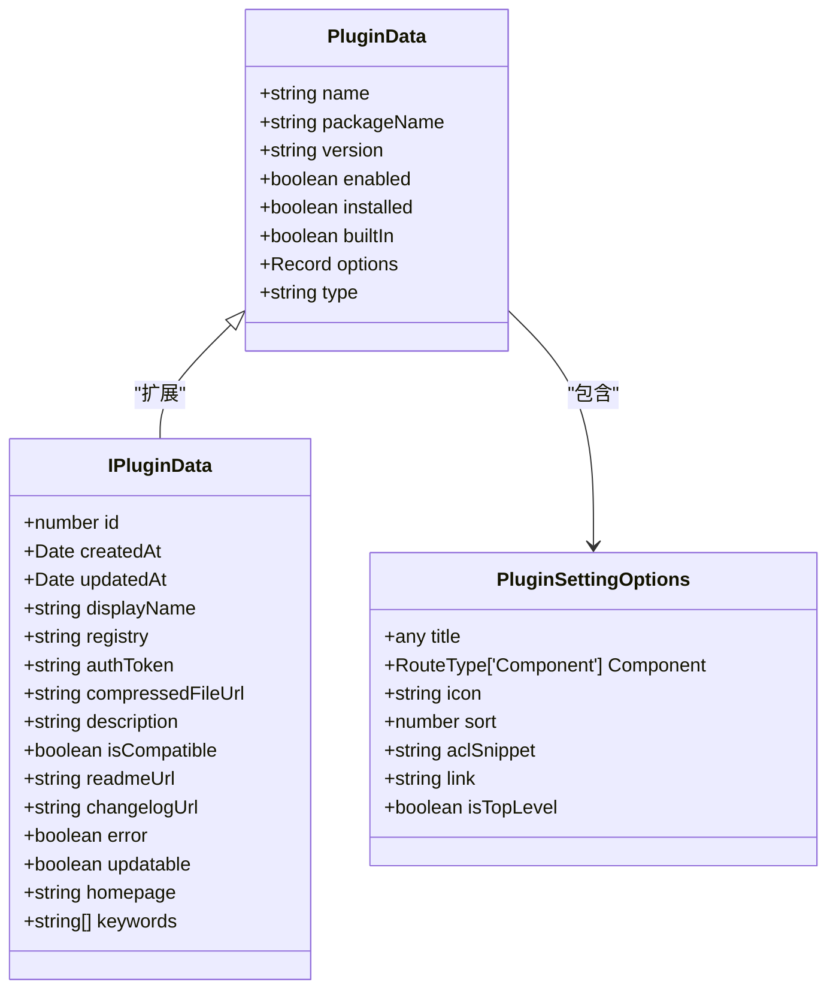
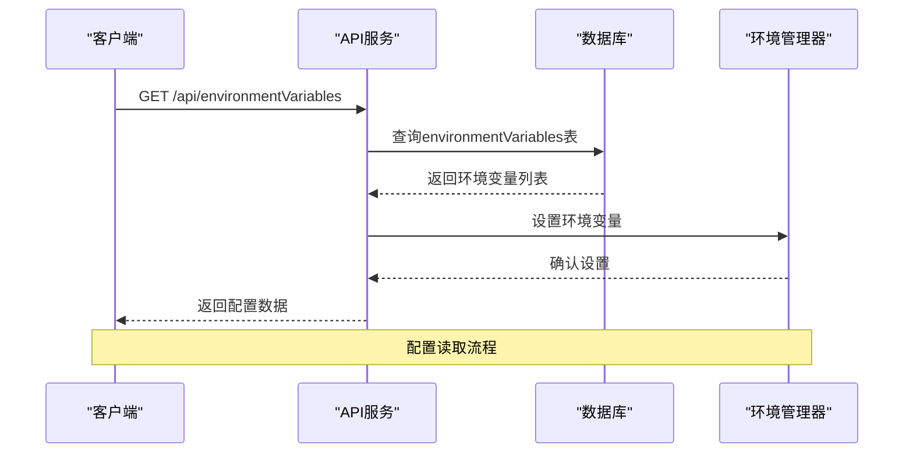
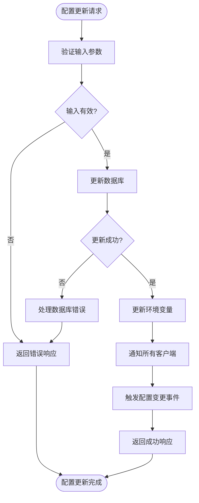
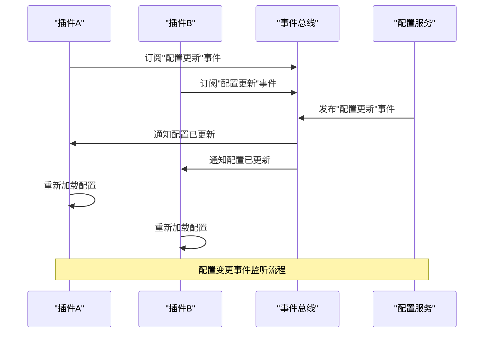
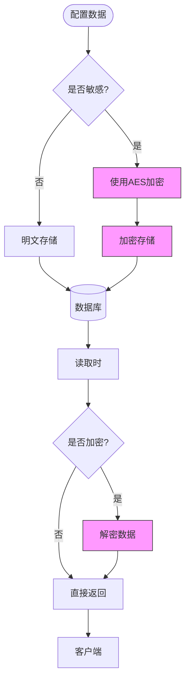
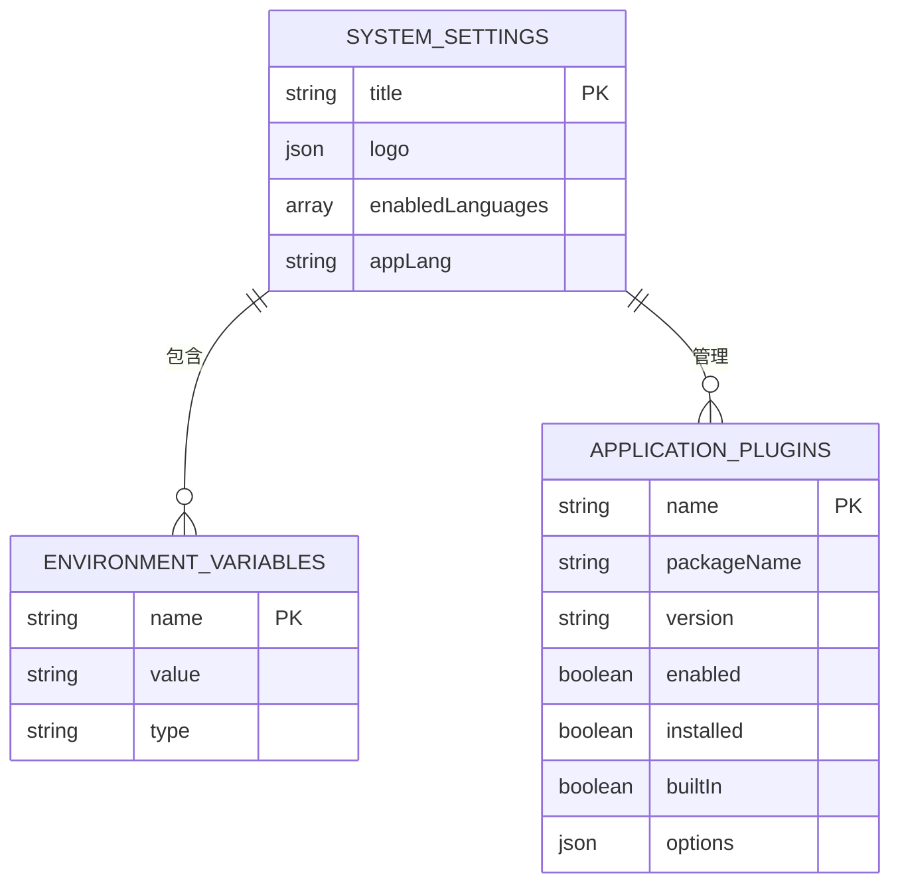

# 配置系统

<cite>
**本文档中引用的文件**  
- [PluginSettingsManager.ts](file://packages\core\client\src\application\PluginSettingsManager.ts)
- [plugin.ts](file://packages\plugins\@nocobase\plugin-environment-variables\src\server\plugin.ts)
- [server.ts](file://packages\plugins\@nocobase\plugin-system-settings\src\server\server.ts)
- [SystemSettingsShortcut.tsx](file://packages\core\client\src\system-settings\SystemSettingsShortcut.tsx)
- [types.ts](file://packages\core\server\src\plugin-manager\types.ts)
- [IPluginData.ts](file://packages\core\client\src\pm\types.ts)
</cite>

## 目录
1. [介绍](#介绍)
2. [配置定义与模式](#配置定义与模式)
3. [配置读取与验证](#配置读取与验证)
4. [配置更新与热更新机制](#配置更新与热更新机制)
5. [配置层级与继承机制](#配置层级与继承机制)
6. [配置变更事件监听](#配置变更事件监听)
7. [配置安全最佳实践](#配置安全最佳实践)
8. [实际示例](#实际示例)

## 介绍
NocoBase插件配置系统提供了一套完整的配置管理解决方案，支持通过多种方式定义、读取、验证和更新配置。该系统实现了全局配置、应用配置和插件实例配置的层级结构，支持配置的热更新和事件监听机制。

## 配置定义与模式
NocoBase插件配置系统通过插件设置管理器（PluginSettingsManager）来定义配置模式。每个插件可以定义自己的配置页面，这些配置页面通过Schema形式定义用户界面和数据结构。

插件配置的核心数据结构包括插件名称、显示名称、包名称、版本、启用状态、安装状态、内置状态、选项配置等。这些配置信息存储在数据库的applicationPlugins表中，并通过插件管理器进行管理。



**图源**
- [types.ts](file://packages\core\server\src\plugin-manager\types.ts#L10-L24)
- [IPluginData.ts](file://packages\core\client\src\pm\types.ts#L10-L35)
- [PluginSettingsManager.ts](file://packages\core\client\src\application\PluginSettingsManager.ts#L22-L38)

## 配置读取与验证
配置读取通过环境变量、配置文件和API调用等多种方式实现。系统提供了完整的配置验证机制，确保配置数据的完整性和正确性。

环境变量配置通过environmentVariables表进行管理，支持明文和加密两种存储方式。系统在启动时会自动加载这些环境变量，并将其注入到应用环境中。



**图源**
- [plugin.ts](file://packages\plugins\@nocobase\plugin-environment-variables\src\server\plugin.ts#L45-L52)
- [plugin.ts](file://packages\plugins\@nocobase\plugin-environment-variables\src\server\plugin.ts#L198-L215)

## 配置更新与热更新机制
配置更新支持通过API调用、管理界面和环境变量文件等多种方式实现。系统实现了配置的热更新机制，无需重启服务即可应用新的配置。

当配置发生变化时，系统会通过WebSocket通知所有连接的客户端，确保配置的实时同步。同时，系统会触发相应的事件，允许插件对配置变化做出响应。



**图源**
- [plugin.ts](file://packages\plugins\@nocobase\plugin-environment-variables\src\server\plugin.ts#L98-L146)
- [plugin.ts](file://packages\plugins\@nocobase\plugin-environment-variables\src\server\plugin.ts#L179-L194)

## 配置层级与继承机制
NocoBase配置系统实现了三层级的配置结构：全局配置、应用配置和插件实例配置。这种层级结构允许配置的继承和覆盖，提供了灵活的配置管理能力。

全局配置适用于整个NocoBase实例，应用配置适用于特定应用，插件实例配置则针对具体的插件实例。下层配置可以继承上层配置的值，并根据需要进行覆盖。

```mermaid
graph TB
subgraph "配置层级"
Global[全局配置]
Application[应用配置]
Plugin[插件实例配置]
end
Global --> Application : "继承"
Application --> Plugin : "继承"
subgraph "配置来源"
EnvVars[环境变量]
ConfigFiles[配置文件]
API[API调用]
UI[管理界面]
end
EnvVars --> Global
ConfigFiles --> Global
API --> Application
UI --> Plugin
```

**图源**
- [server.ts](file://packages\plugins\@nocobase\plugin-system-settings\src\server\server.ts#L78-L103)
- [plugin.ts](file://packages\plugins\@nocobase\plugin-environment-variables\src\server\plugin.ts#L31-L35)

## 配置变更事件监听
系统提供了完整的配置变更事件监听机制，允许插件订阅和响应配置变化。通过事件总线（eventBus），插件可以监听特定的配置变更事件，并执行相应的处理逻辑。

配置变更事件包括配置创建、更新、删除等操作。插件可以通过注册事件处理器来响应这些事件，实现配置的动态调整和重新初始化。



**图源**
- [plugin.ts](file://packages\plugins\@nocobase\plugin-environment-variables\src\server\plugin.ts#L148-L195)
- [PluginSettingsManager.ts](file://packages\core\client\src\application\PluginSettingsManager.ts#L103-L113)

## 配置安全最佳实践
配置安全是NocoBase配置系统的重要组成部分。系统提供了多种安全机制来保护敏感配置信息，包括敏感信息的加密存储、访问控制和权限管理。

敏感信息（如API密钥、数据库密码等）通过AES加密算法进行加密存储，确保即使数据库被泄露，敏感信息也不会暴露。同时，系统通过ACL（访问控制列表）机制限制对配置的访问权限，只有授权用户才能查看和修改配置。



**图源**
- [plugin.ts](file://packages\plugins\@nocobase\plugin-environment-variables\src\server\plugin.ts#L154-L157)
- [plugin.ts](file://packages\plugins\@nocobase\plugin-environment-variables\src\server\plugin.ts#L180-L183)

## 实际示例
以下是一个实际的插件配置示例，展示了如何为插件设计灵活的配置选项并实现动态调整：



**图源**
- [server.ts](file://packages\plugins\@nocobase\plugin-system-settings\src\server\server.ts#L10-L19)
- [plugin.ts](file://packages\plugins\@nocobase\plugin-environment-variables\src\server\plugin.ts#L9-L10)
- [types.ts](file://packages\core\server\src\plugin-manager\types.ts#L10-L24)

**配置源**
- [PluginSettingsManager.ts](file://packages\core\client\src\application\PluginSettingsManager.ts#L56-L183)
- [SystemSettingsShortcut.tsx](file://packages\core\client\src\system-settings\SystemSettingsShortcut.tsx#L79-L177)
- [server.ts](file://packages\plugins\@nocobase\plugin-system-settings\src\server\server.ts#L72-L103)