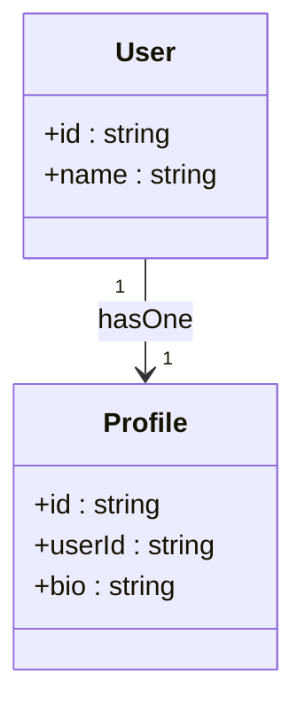
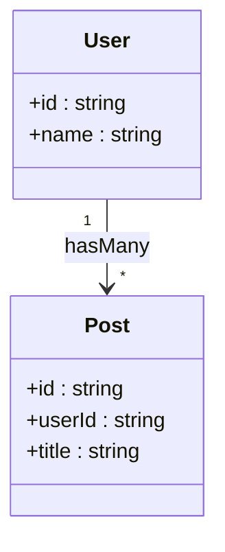
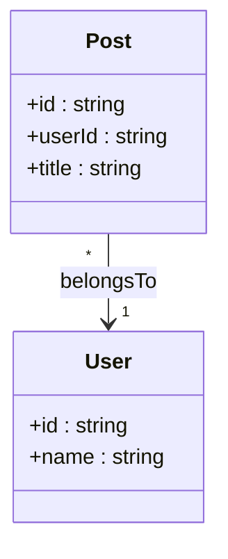
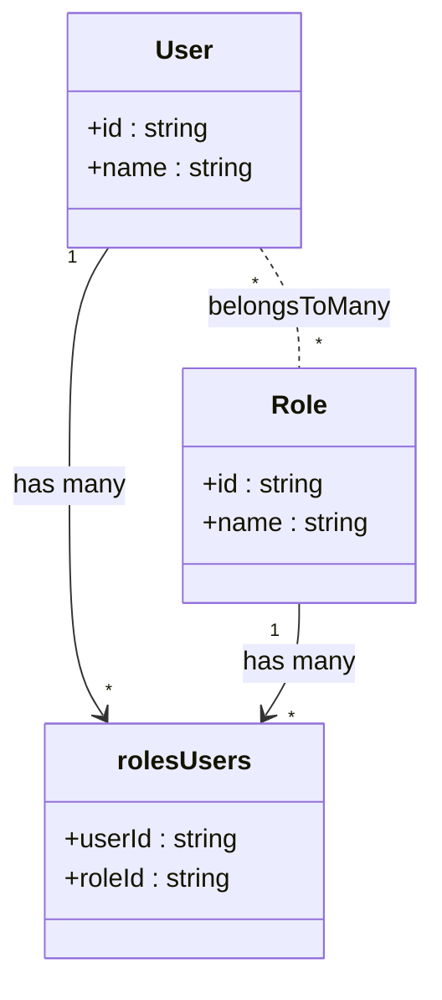
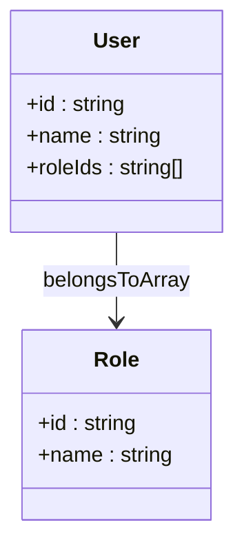
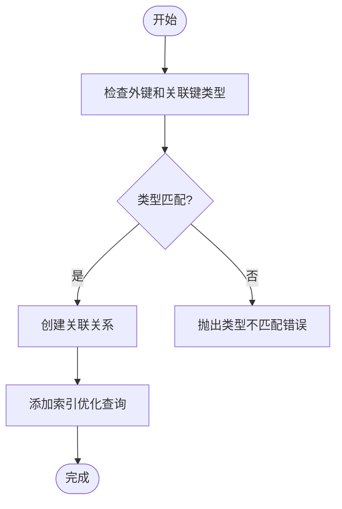
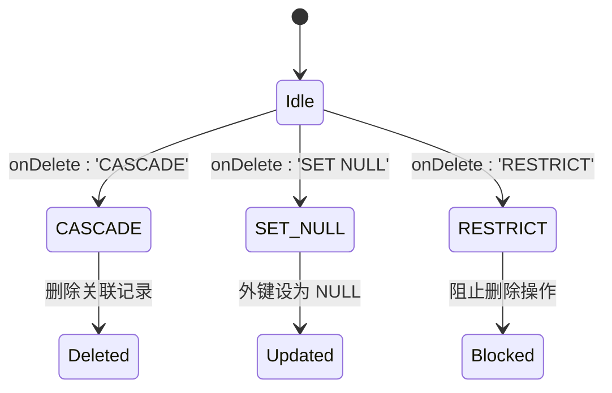
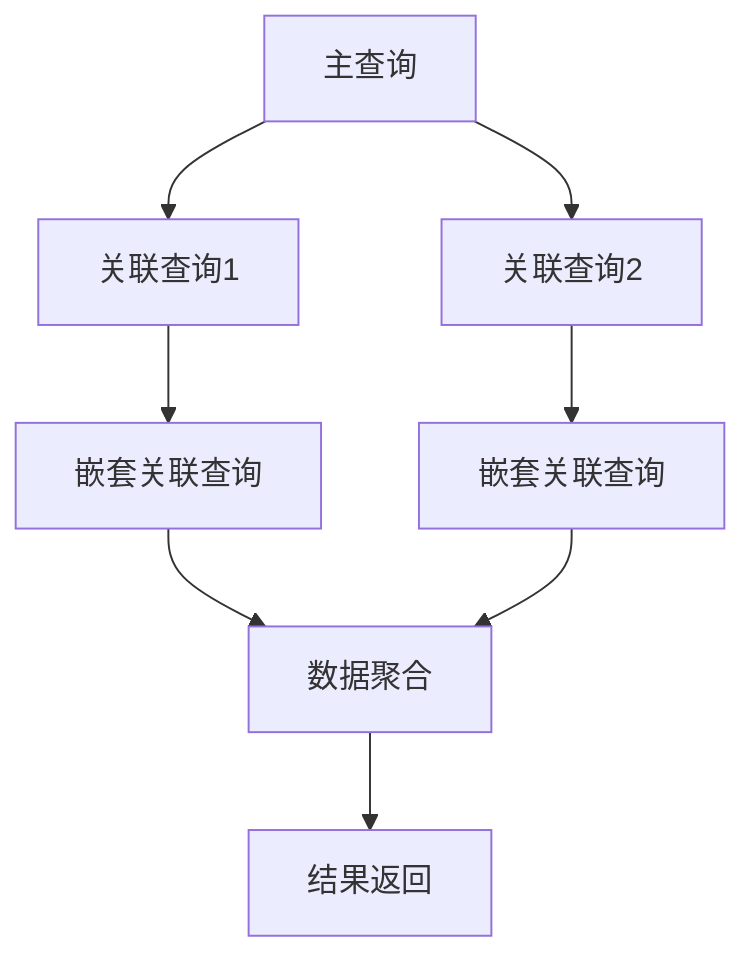
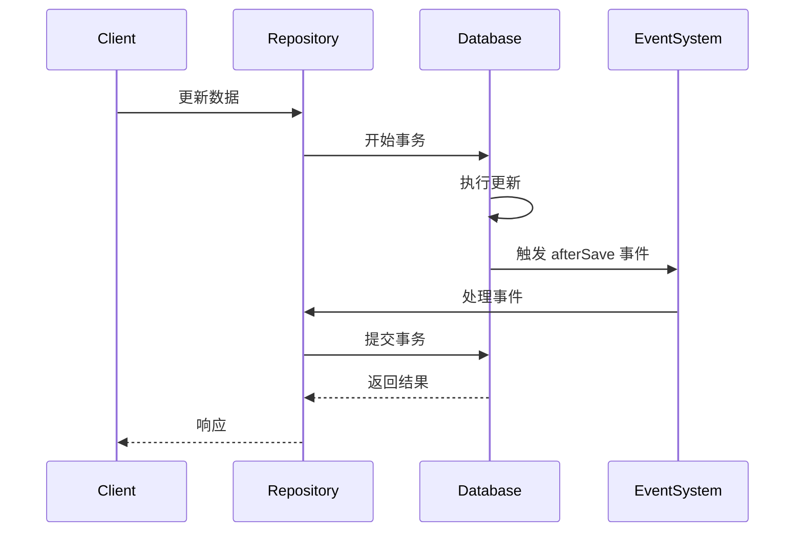
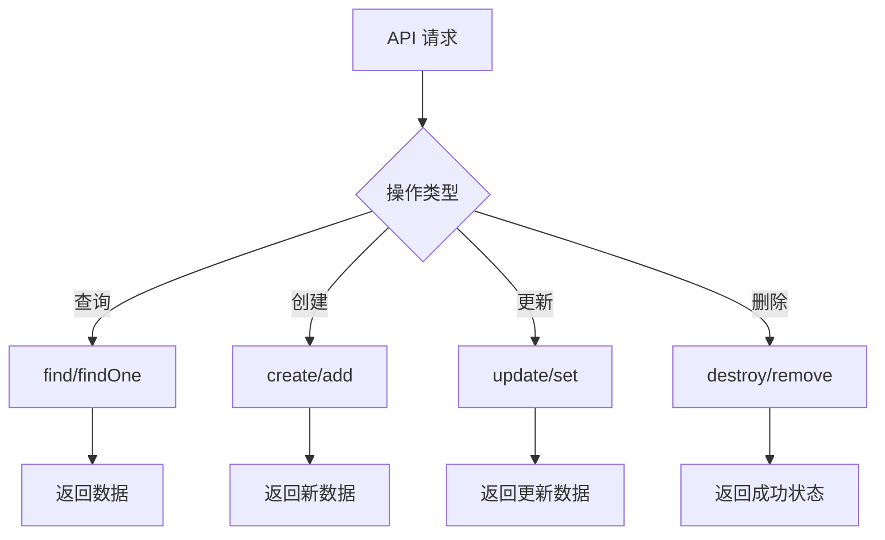

# 关联关系

<cite>
**本文档引用文件**  
- [belongs-to-field.ts](file://packages/core/database/src/fields/belongs-to-field.ts)
- [has-one-field.ts](file://packages/core/database/src/fields/has-one-field.ts)
- [has-many-field.ts](file://packages/core/database/src/fields/has-many-field.ts)
- [belongs-to-many-field.ts](file://packages/core/database/src/fields/belongs-to-many-field.ts)
- [belongs-to-array-field.ts](file://packages/plugins/@nocobase/plugin-field-m2m-array/src/server/belongs-to-array-field.ts)
- [relation-repository.ts](file://packages/core/database/src/relation-repository/relation-repository.ts)
- [single-relation-repository.ts](file://packages/core/database/src/relation-repository/single-relation-repository.ts)
- [hasmany-repository.ts](file://packages/core/database/src/relation-repository/hasmany-repository.ts)
- [belongs-to-many-repository.ts](file://packages/core/database/src/relation-repository/belongs-to-many-repository.ts)
- [relation-field.ts](file://packages/core/database/src/fields/relation-field.ts)
- [eager-loading-tree.ts](file://packages/core/database/src/eager-loading/eager-loading-tree.ts)
- [references-map.ts](file://packages/core/database/src/features/references-map.ts)
</cite>

## 目录
1. [简介](#简介)
2. [关联关系类型](#关联关系类型)
   - [一对一 (hasOne)](#一对一-hasone)
   - [一对多 (hasMany)](#一对多-hasmany)
   - [多对一 (belongsTo)](#多对一-belongsto)
   - [多对多 (belongsToMany)](#多对多-belongstomany)
   - [数组关联 (belongsToArray)](#数组关联-belongstoarray)
3. [关联字段配置](#关联字段配置)
   - [目标集合](#目标集合)
   - [外键配置](#外键配置)
   - [级联操作](#级联操作)
   - [反向关联](#反向关联)
4. [查询机制与性能优化](#查询机制与性能优化)
5. [数据同步与一致性](#数据同步与一致性)
6. [API 操作](#api-操作)
7. [代码示例](#代码示例)

## 简介

NocoBase 提供了完整的关联关系系统，支持多种数据库关系类型，包括一对一、一对多、多对一、多对多以及特殊的数组关联。这些关联关系通过字段定义实现，底层基于 Sequelize ORM 框架构建，提供了强大的数据查询、操作和同步能力。

关联关系在 NocoBase 中通过特定的字段类型实现，这些字段类型继承自 `RelationField` 基类，每个具体的关联类型都有对应的实现类。系统通过 `relation-repository` 模块提供统一的 API 接口来操作关联数据，确保数据的一致性和完整性。

**Section sources**
- [relation-field.ts](file://packages/core/database/src/fields/relation-field.ts)

## 关联关系类型

### 一对一 (hasOne)

一对一关系表示一个模型的实例与另一个模型的单个实例相关联。在 NocoBase 中，这种关系通过 `hasOne` 字段类型实现。

`HasOneField` 类实现了这种关系，它在源模型上定义一个外键，指向目标模型的主键。当创建一对一关系时，系统会自动在目标模型上创建相应的索引以优化查询性能。



**Diagram sources**
- [has-one-field.ts](file://packages/core/database/src/fields/has-one-field.ts)

### 一对多 (hasMany)

一对多关系表示一个模型的实例可以与多个另一个模型的实例相关联。这是最常见的关联类型之一，在 NocoBase 中通过 `hasMany` 字段类型实现。

`HasManyField` 类处理这种关系，它在目标模型上定义一个外键，指向源模型的主键。系统支持排序功能，可以通过设置 `sortable` 选项来启用，这会在目标模型上自动创建一个排序字段。



**Diagram sources**
- [has-many-field.ts](file://packages/core/database/src/fields/has-many-field.ts)

### 多对一 (belongsTo)

多对一关系是 `hasMany` 的反向关系，表示多个模型实例可以关联到同一个目标模型实例。在 NocoBase 中通过 `belongsTo` 字段类型实现。

`BelongsToField` 类实现了这种关系，它在源模型上定义一个外键字段，该字段引用目标模型的主键。系统通过 `references-map` 功能管理外键约束，确保数据完整性。



**Diagram sources**
- [belongs-to-field.ts](file://packages/core/database/src/fields/belongs-to-field.ts)

### 多对多 (belongsToMany)

多对多关系表示两个模型的实例可以相互关联多个对方的实例。在 NocoBase 中通过 `belongsToMany` 字段类型实现。

`BelongsToManyField` 类处理这种关系，它会自动创建一个中间表（through collection）来存储两个模型之间的关联。中间表包含两个外键，分别指向两个相关模型的主键。



**Diagram sources**
- [belongs-to-many-field.ts](file://packages/core/database/src/fields/belongs-to-many-field.ts)

### 数组关联 (belongsToArray)

数组关联是一种特殊的多对多关系实现，它将多个关联 ID 存储在一个数组字段中，而不是使用中间表。在 NocoBase 中通过 `belongsToArray` 字段类型实现。

`BelongsToArrayField` 类处理这种关系，它在源模型上定义一个数组类型的字段，存储目标模型实例的主键值。这种实现方式适用于关联数量较少且查询模式简单的情况。



**Diagram sources**
- [belongs-to-array-field.ts](file://packages/plugins/@nocobase/plugin-field-m2m-array/src/server/belongs-to-array-field.ts)

## 关联字段配置

### 目标集合

目标集合（target）是关联关系中被引用的模型或数据表。在定义关联字段时，必须指定目标集合名称。如果未显式指定，系统会根据字段名称自动生成目标集合名称。

```typescript
{
  type: 'hasMany',
  name: 'posts',
  target: 'posts' // 显式指定目标集合
}
```

系统通过 `target` 属性获取目标模型，并验证其存在性。如果目标模型不存在，字段会被添加到待处理列表中，等待目标模型创建后再建立关联。

**Section sources**
- [relation-field.ts](file://packages/core/database/src/fields/relation-field.ts)

### 外键配置

外键（foreignKey）是关联关系中用于连接两个模型的字段。NocoBase 提供了灵活的外键配置选项：

- **foreignKey**: 指定外键字段名称
- **sourceKey**: 指定源模型的关联键（默认为主键）
- **targetKey**: 指定目标模型的关联键（默认为主键）

系统会自动验证外键和关联键的类型匹配性，确保数据一致性。类型匹配规则包括：
- 数值类型组：integer、bigint、decimal、float 等相互兼容
- 字符串类型组：string、char、text 相互兼容
- 其他类型必须完全匹配



**Diagram sources**
- [relation-field.ts](file://packages/core/database/src/fields/relation-field.ts)

### 级联操作

级联操作（onDelete）定义了当关联的记录被删除时的行为。NocoBase 支持以下级联操作类型：

- **CASCADE**: 级联删除，删除主记录时同时删除关联记录
- **SET NULL**: 设置为空，删除主记录时将外键设置为 NULL
- **RESTRICT**: 限制删除，如果存在关联记录则阻止删除操作

系统通过 `references-map` 功能管理级联操作优先级，用户定义的级联操作优先级高于默认设置。当出现冲突时，系统会进行优先级比较并记录警告信息。



**Diagram sources**
- [references-map.ts](file://packages/core/database/src/features/references-map.ts)

### 反向关联

反向关联是自动创建的对应关系，确保双向关联的一致性。当定义一个关联关系时，系统会自动处理反向关联的创建和维护。

对于 `hasMany` 和 `belongsTo` 关系，它们互为反向关联。系统通过 `bind()` 和 `unbind()` 方法管理关联的生命周期，在建立或删除关联时同步处理反向关系。

```typescript
// 当创建 hasMany 关联时
User.hasMany(Post, { as: 'posts' })
// 系统会自动处理反向的 belongsTo 关联
Post.belongsTo(User, { as: 'user' })
```

**Section sources**
- [has-many-field.ts](file://packages/core/database/src/fields/has-many-field.ts)
- [belongs-to-field.ts](file://packages/core/database/src/fields/belongs-to-field.ts)

## 查询机制与性能优化

NocoBase 使用 `eager-loading-tree` 模块实现高效的关联查询，支持嵌套关联的预加载。系统通过构建查询树来优化多层关联查询的性能。

查询机制的主要特点包括：

- **预加载优化**: 通过 `include` 选项一次性加载关联数据，避免 N+1 查询问题
- **查询树构建**: 将嵌套的关联查询转换为树形结构，优化执行计划
- **属性选择**: 支持指定需要查询的字段，减少数据传输量
- **过滤支持**: 可以在关联查询中应用过滤条件



系统还实现了查询包含（include）的合并和优化功能，通过 `mergeIncludes` 函数去重和合并重复的关联查询，提高查询效率。

**Section sources**
- [eager-loading-tree.ts](file://packages/core/database/src/eager-loading/eager-loading-tree.ts)
- [filter-include.ts](file://packages/core/database/src/utils/filter-include.ts)

## 数据同步与一致性

NocoBase 通过事务和事件机制确保关联数据的一致性。系统在数据操作的关键点触发事件，允许插件和自定义逻辑介入数据处理过程。

数据一致性保障机制包括：

- **事务管理**: 所有关联操作都在事务中执行，确保原子性
- **事件系统**: 提供 `afterSaveWithAssociations` 等事件，用于处理数据同步
- **引用映射**: 通过 `references-map` 管理外键约束，防止冲突
- **类型验证**: 在建立关联时验证字段类型匹配性

当更新带有关联的数据时，系统会触发相应的事件，通知所有监听器进行必要的数据同步操作。



**Diagram sources**
- [repository.ts](file://packages/core/database/src/repository.ts)
- [references-map.ts](file://packages/core/database/src/features/references-map.ts)

## API 操作

NocoBase 为关联关系提供了丰富的 API 操作接口，通过 `relation-repository` 模块实现。主要操作包括：

- **查询**: `find()`, `findOne()`
- **创建**: `create()`, `add()`
- **更新**: `update()`, `set()`
- **删除**: `destroy()`, `remove()`
- **特殊操作**: `toggle()`, `move()`

对于多对多关系，系统提供了 `set`、`add` 和 `remove` 方法来管理关联集合。`set` 方法用于完全替换关联集合，`add` 用于添加新的关联，`remove` 用于移除指定的关联。



系统还提供了 `toggle` 操作，用于切换关联状态，如果已关联则移除，如果未关联则添加。

**Section sources**
- [relation-repository.ts](file://packages/core/database/src/relation-repository/relation-repository.ts)
- [belongs-to-many-repository.ts](file://packages/core/database/src/relation-repository/belongs-to-many-repository.ts)

## 代码示例

以下是各种关联关系的实际使用示例：

### 一对一关系示例

```typescript
// 定义用户和档案的一对一关系
const userField = {
  type: 'hasOne',
  name: 'profile',
  target: 'profiles',
  foreignKey: 'userId',
  sourceKey: 'id'
};

// 使用 API 操作
await userRepo.profile.set(profileId);
const profile = await userRepo.profile.findOne();
```

### 一对多关系示例

```typescript
// 定义用户和文章的一对多关系
const postsField = {
  type: 'hasMany',
  name: 'posts',
  target: 'posts',
  foreignKey: 'userId',
  sourceKey: 'id',
  sortable: true
};

// 使用 API 操作
await userRepo.posts.add([post1Id, post2Id]);
const posts = await userRepo.posts.find();
await userRepo.posts.destroy({ filterByTk: postId });
```

### 多对多关系示例

```typescript
// 定义用户和角色的多对多关系
const rolesField = {
  type: 'belongsToMany',
  name: 'roles',
  target: 'roles',
  through: 'users_roles',
  foreignKey: 'userId',
  otherKey: 'roleId',
  sourceKey: 'id',
  targetKey: 'id'
};

// 使用 API 操作
await userRepo.roles.set([roleId1, roleId2]);
await userRepo.roles.add(roleId3);
await userRepo.roles.remove(roleId1);
await userRepo.roles.toggle(roleId2); // 切换状态
```

### 数组关联示例

```typescript
// 定义用户和角色的数组关联
const rolesArrayField = {
  type: 'belongsToArray',
  name: 'roles',
  target: 'roles',
  foreignKey: 'roleIds',
  targetKey: 'id'
};

// 使用 API 操作
await userRepo.roles.set([roleId1, roleId2]);
const roles = await userRepo.roles.find();
```

这些示例展示了如何定义和使用各种关联关系，以及如何通过统一的 API 接口进行数据操作。

**Section sources**
- [has-one-field.ts](file://packages/core/database/src/fields/has-one-field.ts)
- [has-many-field.ts](file://packages/core/database/src/fields/has-many-field.ts)
- [belongs-to-many-field.ts](file://packages/core/database/src/fields/belongs-to-many-field.ts)
- [belongs-to-array-field.ts](file://packages/plugins/@nocobase/plugin-field-m2m-array/src/server/belongs-to-array-field.ts)