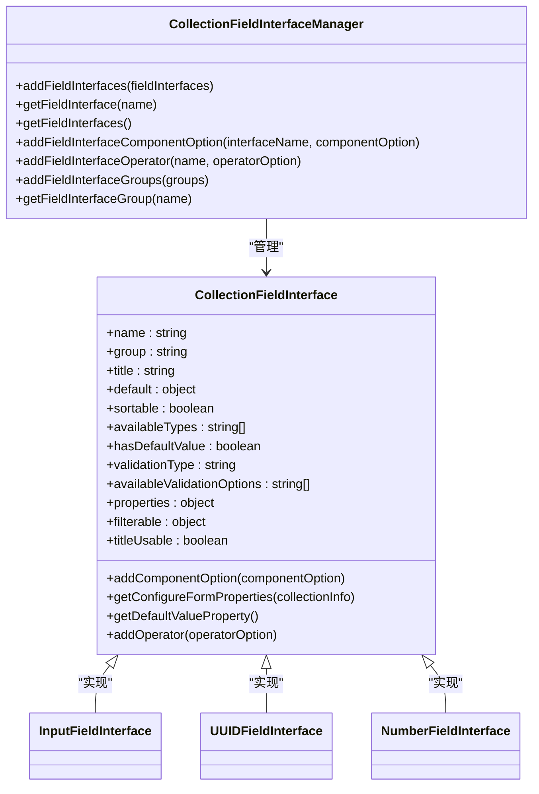
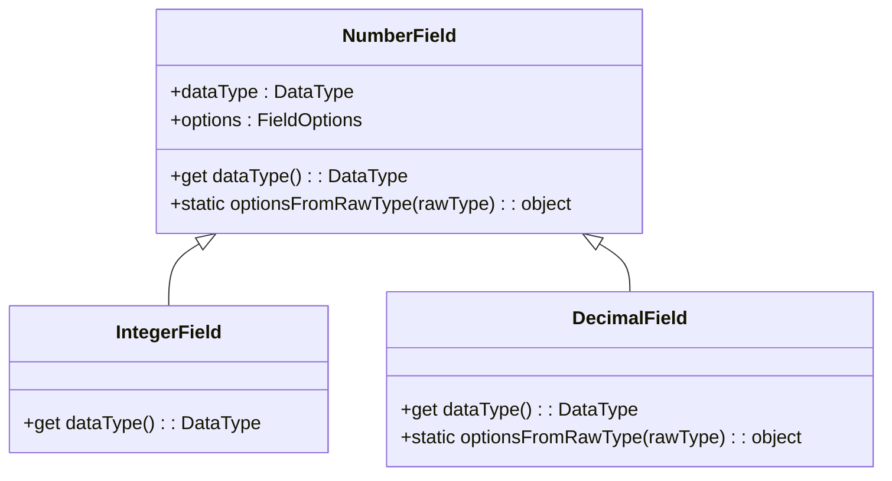
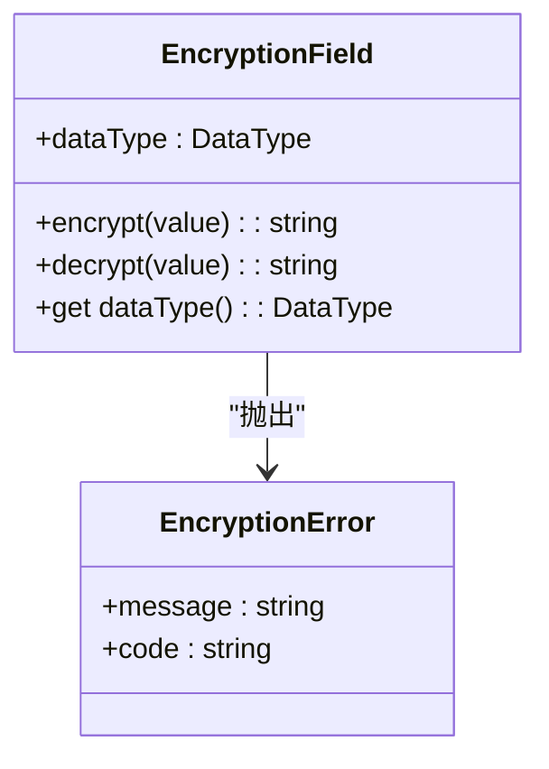
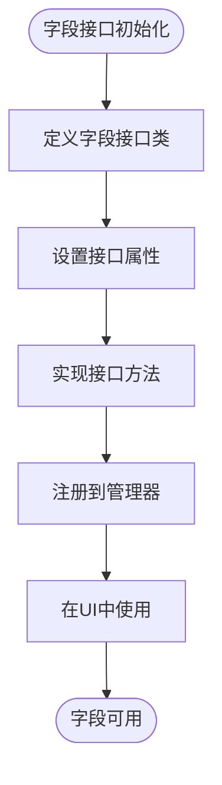
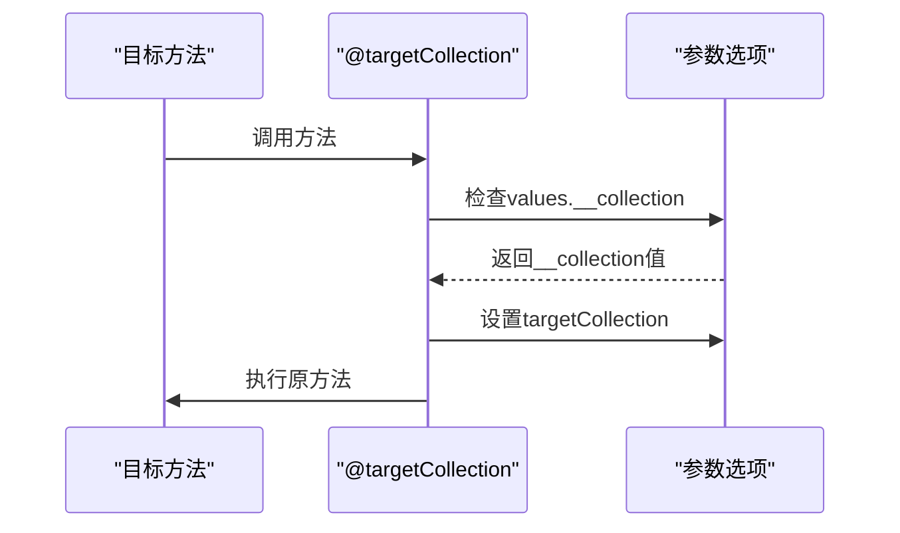
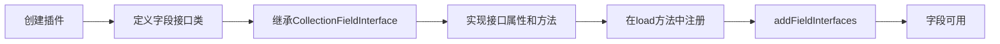
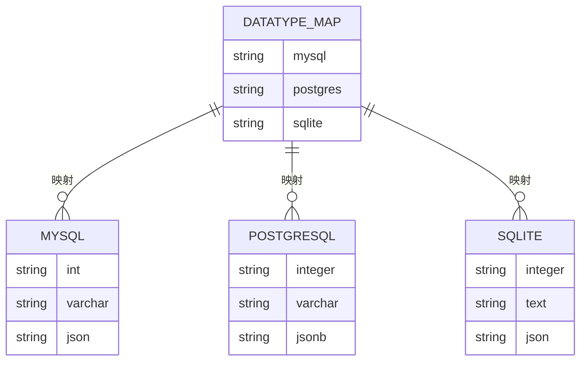

# 字段系统

<cite>
**本文档中引用的文件**  
- [CollectionFieldInterface.ts](file://packages/core/client/src/data-source/collection-field-interface/CollectionFieldInterface.ts)
- [CollectionFieldInterfaceManager.ts](file://packages/core/client/src/data-source/collection-field-interface/CollectionFieldInterfaceManager.ts)
- [input.ts](file://packages/core/client/src/collection-manager/interfaces/input.ts)
- [uuid.ts](file://packages/core/client/src/collection-manager/interfaces/uuid.ts)
- [number-field.ts](file://packages/core/database/src/fields/number-field.ts)
- [encryption-field](file://packages/core/database/src/fields/encryption-field)
- [snowflake-id-field.ts](file://packages/core/database/src/fields/snowflake-id-field.ts)
- [field-type-map.ts](file://packages/core/database/src/view/field-type-map.ts)
- [type-interface-map.ts](file://packages/plugins/@nocobase/plugin-data-source-manager/src/server/services/type-interface-map.ts)
- [target-collection-decorator.ts](file://packages/core/database/src/decorators/target-collection-decorator.ts)
- [transaction-decorator.ts](file://packages/core/database/src/decorators/transaction-decorator.ts)
</cite>

## 目录
1. [简介](#简介)
2. [字段类型系统架构](#字段类型系统架构)
3. [基础字段类型](#基础字段类型)
4. [特殊字段类型](#特殊字段类型)
5. [字段接口（Interface）](#字段接口interface)
6. [字段装饰器](#字段装饰器)
7. [自定义字段扩展](#自定义字段扩展)
8. [配置选项与使用场景](#配置选项与使用场景)
9. [数据类型映射](#数据类型映射)
10. [总结](#总结)

## 简介
NocoBase 的字段系统是一个高度可扩展的架构，用于定义和管理数据库字段的行为、验证规则和用户界面表现。该系统支持多种基础字段类型（如字符串、数字、布尔值、JSON等）和特殊字段类型（如UID、Snowflake ID、加密字段等）。通过字段接口（Interface）机制，可以统一定义字段的配置选项、验证规则和UI组件。系统还支持通过插件机制扩展自定义字段类型，并提供装饰器来增强字段行为。

**Section sources**
- [CollectionFieldInterface.ts](file://packages/core/client/src/data-source/collection-field-interface/CollectionFieldInterface.ts)
- [CollectionFieldInterfaceManager.ts](file://packages/core/client/src/data-source/collection-field-interface/CollectionFieldInterfaceManager.ts)

## 字段类型系统架构
NocoBase 的字段系统采用分层架构设计，核心组件包括字段接口管理器（CollectionFieldInterfaceManager）、字段接口定义（CollectionFieldInterface）和具体字段实现。字段接口管理器负责注册和管理所有字段接口，提供统一的访问接口。每个字段接口定义了该字段类型的行为特征，包括默认配置、验证规则、UI组件和过滤操作符。

系统通过 `CollectionFieldInterfaceManager` 类集中管理所有字段接口，支持动态添加和查询字段接口。字段接口通过继承 `CollectionFieldInterface` 抽象类来实现，定义了字段的名称、分组、默认值、验证类型等元数据。



**Diagram sources**
- [CollectionFieldInterfaceManager.ts](file://packages/core/client/src/data-source/collection-field-interface/CollectionFieldInterfaceManager.ts)
- [CollectionFieldInterface.ts](file://packages/core/client/src/data-source/collection-field-interface/CollectionFieldInterface.ts)

**Section sources**
- [CollectionFieldInterfaceManager.ts](file://packages/core/client/src/data-source/collection-field-interface/CollectionFieldInterfaceManager.ts)
- [CollectionFieldInterface.ts](file://packages/core/client/src/data-source/collection-field-interface/CollectionFieldInterface.ts)

## 基础字段类型
NocoBase 提供了多种基础字段类型，涵盖了常见的数据存储需求。这些字段类型包括字符串、数字、布尔值、JSON等，每种类型都有相应的配置选项和验证规则。

### 字符串字段
字符串字段是最常用的基础字段类型，支持单行文本和多行文本。通过 `input` 字段接口实现，支持长度验证、格式验证（如URL、邮箱、电话等）和正则表达式匹配。

### 数字字段
数字字段支持整数和浮点数类型，通过 `number` 字段接口实现。系统提供了 `integer`、`float`、`double` 和 `decimal` 等具体实现，其中 `decimal` 类型支持精度和小数位数配置。



**Diagram sources**
- [number-field.ts](file://packages/core/database/src/fields/number-field.ts)

**Section sources**
- [number-field.ts](file://packages/core/database/src/fields/number-field.ts)
- [input.ts](file://packages/core/client/src/collection-manager/interfaces/input.ts)

### 布尔值字段
布尔值字段用于存储真/假值，通过 `checkbox` 字段接口实现。支持在表格视图中直接切换状态。

### JSON字段
JSON字段用于存储结构化数据，支持JSON和JSONB类型。通过 `json` 字段接口实现，提供专门的JSON编辑器UI组件。

## 特殊字段类型
除了基础字段类型，NocoBase 还提供了多种特殊字段类型，用于满足特定的业务需求。

### UID字段
UID字段用于生成唯一标识符，支持自定义生成规则。通过 `uid` 字段接口实现，可以配置自动填充和唯一性约束。

### Snowflake ID字段
Snowflake ID字段基于Twitter的Snowflake算法生成分布式唯一ID。ID由53位组成，包含时间戳、机器ID和序列号，确保全局唯一性和时间有序性。

```text
| 0 (1 bit) |----------- 31 bits -----------|-- 5 bits --|------ 16 bits ------|
|   Sign    |        Timestamp (sec)        | Machine ID |       Sequence      |
```

### 加密字段
加密字段用于安全存储敏感数据，如密码、密钥等。通过 `encryption` 字段接口实现，数据在存储时自动加密，读取时自动解密。



**Diagram sources**
- [encryption-field](file://packages/core/database/src/fields/encryption-field)
- [snowflake-id-field.ts](file://packages/core/database/src/fields/snowflake-id-field.ts)

**Section sources**
- [encryption-field](file://packages/core/database/src/fields/encryption-field)
- [snowflake-id-field.ts](file://packages/core/database/src/fields/snowflake-id-field.ts)
- [README.md](file://packages/core/snowflake-id/README.md)

## 字段接口（Interface）
字段接口是NocoBase字段系统的核心概念，用于定义字段的行为和验证规则。每个字段接口是一个继承自 `CollectionFieldInterface` 的类，定义了字段的元数据和行为特征。

### 接口属性
字段接口包含以下关键属性：
- **name**: 字段接口的唯一标识符
- **group**: 字段所属的分组，用于UI分类
- **title**: 字段的显示名称
- **default**: 默认配置，包括数据类型和UI Schema
- **validationType**: 验证类型，用于表单验证
- **properties**: 字段配置表单的属性定义
- **filterable**: 过滤器配置，定义支持的操作符

### 接口方法
字段接口提供了多个可重写的方法来定制行为：
- **getConfigureFormProperties()**: 获取字段配置表单的属性
- **getDefaultValueProperty()**: 获取默认值配置属性
- **schemaInitialize()**: 初始化字段Schema
- **validateSchema()**: 验证字段Schema



**Diagram sources**
- [CollectionFieldInterface.ts](file://packages/core/client/src/data-source/collection-field-interface/CollectionFieldInterface.ts)
- [input.ts](file://packages/core/client/src/collection-manager/interfaces/input.ts)

**Section sources**
- [CollectionFieldInterface.ts](file://packages/core/client/src/data-source/collection-field-interface/CollectionFieldInterface.ts)
- [input.ts](file://packages/core/client/src/collection-manager/interfaces/input.ts)
- [uuid.ts](file://packages/core/client/src/collection-manager/interfaces/uuid.ts)

## 字段装饰器
NocoBase 使用装饰器模式来增强字段和方法的行为。装饰器可以自动处理事务、注入依赖等横切关注点。

### @targetCollection装饰器
`@targetCollection` 装饰器用于在方法执行前注入目标集合信息。当方法参数中包含 `__collection` 属性时，装饰器会将其提取并设置为 `targetCollection` 选项。



### @transaction装饰器
`@transaction` 装饰器用于确保数据库操作的原子性。它会自动创建事务，并在方法执行完成后提交或回滚。

**Diagram sources**
- [target-collection-decorator.ts](file://packages/core/database/src/decorators/target-collection-decorator.ts)
- [transaction-decorator.ts](file://packages/core/database/src/decorators/transaction-decorator.ts)

**Section sources**
- [target-collection-decorator.ts](file://packages/core/database/src/decorators/target-collection-decorator.ts)
- [transaction-decorator.ts](file://packages/core/database/src/decorators/transaction-decorator.ts)
- [single-relation-repository.ts](file://packages/core/database/src/relation-repository/single-relation-repository.ts)

## 自定义字段扩展
NocoBase 提供了灵活的插件机制，允许开发者创建自定义字段类型。通过实现 `CollectionFieldInterface` 类并注册到字段接口管理器，可以添加新的字段类型。

### 扩展步骤
1. 创建新的字段接口类，继承 `CollectionFieldInterface`
2. 实现必要的属性和方法
3. 在插件加载时注册到 `CollectionFieldInterfaceManager`



**Section sources**
- [CollectionFieldInterfaceManager.ts](file://packages/core/client/src/data-source/collection-field-interface/CollectionFieldInterfaceManager.ts)
- [CollectionFieldInterface.ts](file://packages/core/client/src/data-source/collection-field-interface/CollectionFieldInterface.ts)

## 配置选项与使用场景
不同字段类型适用于不同的使用场景，具有特定的配置选项。

### 字符串字段配置
- **trim**: 自动去除首尾空格
- **layout**: 布局选项，包括主键和唯一性约束
- **validation**: 验证规则，包括最小/最大长度、正则表达式等

### 数字字段配置
- **precision**: 精度（仅decimal类型）
- **scale**: 小数位数（仅decimal类型）
- **step**: 步长（UI组件）

### 日期时间字段配置
- **showTime**: 是否显示时间
- **format**: 显示格式
- **gmt**: 时区设置

**Section sources**
- [input.ts](file://packages/core/client/src/collection-manager/interfaces/input.ts)
- [number-field.ts](file://packages/core/database/src/fields/number-field.ts)
- [datetime-field.ts](file://packages/core/database/src/fields/datetime-field.ts)

## 数据类型映射
NocoBase 支持多种数据库，因此需要处理不同数据库之间的数据类型映射。系统通过 `fieldTypeMap` 配置对象定义了不同数据库的数据类型映射关系。

### 数据库类型映射
- **MySQL**: int映射到integer，varchar映射到string
- **PostgreSQL**: jsonb映射到json，timestamp映射到datetimeTz
- **SQLite**: integer映射到integer，text映射到text



**Diagram sources**
- [field-type-map.ts](file://packages/core/database/src/view/field-type-map.ts)
- [type-interface-map.ts](file://packages/plugins/@nocobase/plugin-data-source-manager/src/server/services/type-interface-map.ts)

**Section sources**
- [field-type-map.ts](file://packages/core/database/src/view/field-type-map.ts)
- [type-interface-map.ts](file://packages/plugins/@nocobase/plugin-data-source-manager/src/server/services/type-interface-map.ts)

## 总结
NocoBase 的字段系统设计精巧，具有高度的可扩展性和灵活性。通过字段接口机制，实现了字段行为的统一管理和配置。系统支持丰富的基础字段类型和特殊字段类型，满足各种业务需求。装饰器模式的使用使得事务管理和依赖注入更加简洁。插件机制为自定义字段扩展提供了便利，开发者可以轻松创建新的字段类型。整体架构清晰，组件职责分明，为构建复杂的数据管理系统提供了坚实的基础。