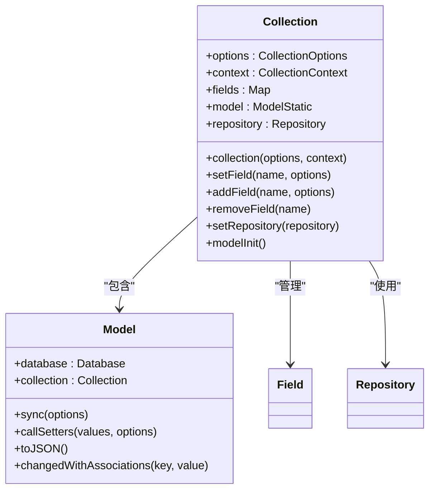
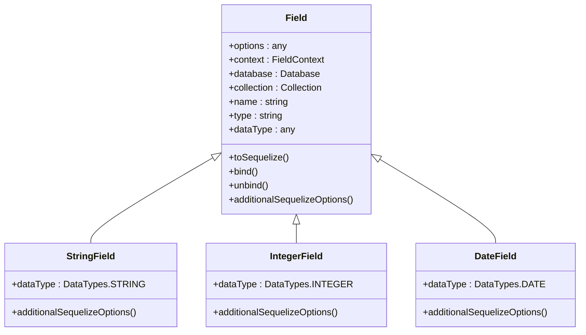
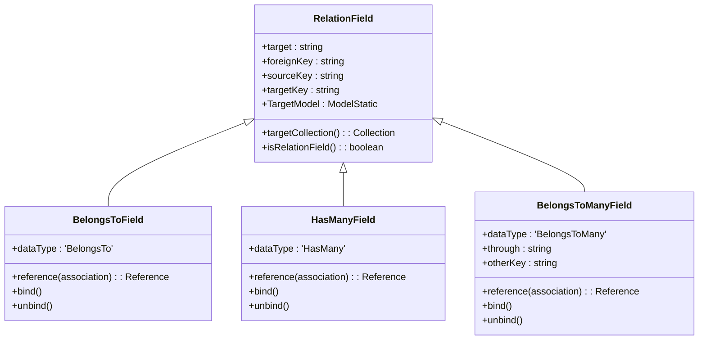

# 数据模型定义

<cite>
**本文档引用的文件**
- [collection.ts](file://packages/core/database/src/collection.ts)
- [database.ts](file://packages/core/database/src/database.ts)
- [field.ts](file://packages/core/database/src/fields/field.ts)
- [string-field.ts](file://packages/core/database/src/fields/string-field.ts)
- [belongs-to-field.ts](file://packages/core/database/src/fields/belongs-to-field.ts)
- [has-many-field.ts](file://packages/core/database/src/fields/has-many-field.ts)
- [relation-field.ts](file://packages/core/database/src/fields/relation-field.ts)
- [fields.ts](file://packages/plugins/@nocobase/plugin-data-source-main/src/server/collections/fields.ts)
- [collections.ts](file://packages/plugins/@nocobase/plugin-data-source-main/src/server/collections/collections.ts)
- [interface-manager.ts](file://packages/core/database/src/interface-manager.ts)
- [plugin.ts](file://packages/plugins/@nocobase/plugin-field-formula/src/server/plugin.ts)
</cite>

## 目录
1. [引言](#引言)
2. [核心概念](#核心概念)
3. [Collection与Model](#collection与model)
4. [字段系统](#字段系统)
5. [关联关系](#关联关系)
6. [元数据管理](#元数据管理)
7. [插件扩展](#插件扩展)
8. [实际应用示例](#实际应用示例)
9. [结论](#结论)

## 引言
NocoBase的数据模型定义系统提供了一套完整的机制来定义和管理应用程序的数据结构。该系统基于Collection、Model和字段三个核心概念，通过代码定义数据模型的结构，支持丰富的字段类型和复杂的关联关系。本文档将深入解析这一系统的实现机制，包括如何定义数据模型、各种字段类型的配置选项、关联关系的实现原理以及如何通过插件扩展系统功能。

## 核心概念
NocoBase的数据模型系统围绕三个核心概念构建：Collection、Model和字段。Collection是数据模型的容器，代表一个数据表或视图；Model是Sequelize模型的扩展，提供数据访问和操作的接口；字段则定义了数据模型的具体属性和行为。这三个概念共同构成了NocoBase数据模型的基础架构。

**Section sources**
- [collection.ts](file://packages/core/database/src/collection.ts)
- [database.ts](file://packages/core/database/src/database.ts)

## Collection与Model
Collection是NocoBase中数据模型的核心容器，它封装了Sequelize模型并提供了额外的功能。Collection类通过`collection()`方法创建，接受一个包含模型配置的选项对象。每个Collection都关联一个Model，该Model继承自Sequelize的Model类，并添加了NocoBase特有的功能。

Collection的实现中，`options`属性存储了模型的配置信息，包括名称、字段定义、关联关系等。`modelInit()`方法负责初始化Sequelize模型，`setField()`方法用于添加字段，而`setRepository()`方法则设置数据访问仓库。Collection还提供了`addField()`、`removeField()`等方法来动态管理字段。

Model类扩展了Sequelize的Model，添加了`toJSON()`方法来处理数据序列化，`callSetters()`方法来调用字段的setter函数，以及`sync()`方法来同步数据库结构。Model的`database`和`collection`静态属性分别指向数据库实例和Collection实例，实现了模型与数据源的紧密耦合。



**Diagram sources**
- [collection.ts](file://packages/core/database/src/collection.ts)
- [model.ts](file://packages/core/database/src/model.ts)

## 字段系统
NocoBase的字段系统是其数据模型的核心组成部分，提供了丰富的字段类型和灵活的配置选项。字段系统基于`Field`基类实现，所有具体的字段类型都继承自这个基类。`Field`类定义了字段的基本属性和方法，如`name`、`type`、`dataType`等。

字段系统通过`interfaceManager`进行管理，该管理器注册了所有可用的字段接口类型。每个字段类型都有对应的接口配置，定义了其在用户界面中的表现形式。例如，字符串字段对应`input`接口，日期字段对应`DatePicker`组件。

字段的实现中，`toSequelize()`方法将字段配置转换为Sequelize兼容的格式，`bind()`方法将字段绑定到模型，`unbind()`方法则解除绑定。字段还支持验证规则、默认值、索引等高级功能。`additionalSequelizeOptions()`方法允许字段类型添加特定的Sequelize选项。



**Diagram sources**
- [field.ts](file://packages/core/database/src/fields/field.ts)
- [string-field.ts](file://packages/core/database/src/fields/string-field.ts)

## 关联关系
NocoBase支持多种关联关系类型，包括一对一、一对多和多对多。这些关系通过特定的字段类型实现，如`belongsTo`、`hasOne`、`hasMany`和`belongsToMany`。关联关系的定义在Collection的字段配置中完成，通过指定`type`、`target`、`foreignKey`等属性来建立关系。

一对一关系通过`hasOne`和`belongsTo`字段类型实现。`hasOne`表示一个模型拥有另一个模型的一个实例，而`belongsTo`表示一个模型属于另一个模型。一对多关系通过`hasMany`和`belongsTo`实现，`hasMany`表示一个模型拥有多个相关实例。

多对多关系通过`belongsToMany`字段类型实现，需要一个中间表来存储关联信息。`belongsToMany`字段的配置包括`through`属性，指定中间表的名称。关联关系还支持`onDelete`、`onUpdate`等约束选项，以及`scope`、`constraints`等高级配置。



**Diagram sources**
- [relation-field.ts](file://packages/core/database/src/fields/relation-field.ts)
- [belongs-to-field.ts](file://packages/core/database/src/fields/belongs-to-field.ts)
- [has-many-field.ts](file://packages/core/database/src/fields/has-many-field.ts)

## 元数据管理
NocoBase的元数据管理系统负责管理数据模型的定义和配置。元数据存储在`collections`表中，每个Collection的定义都作为一条记录存储。元数据管理通过`collection()`方法和`updateOptions()`方法实现，允许动态创建和修改数据模型。

字段的元数据包括`uiSchema`属性，定义了字段在用户界面中的表现形式，如组件类型、标题、只读状态等。`options`属性存储了字段的配置选项，如验证规则、默认值、索引等。元数据还支持`translation`属性，用于标记字段是否需要翻译。

元数据管理还涉及字段的排序和分组。`fieldSort`属性定义了字段的显示顺序，`collectionCategories`用于对Collection进行分类。元数据的变更会触发相应的事件，如`afterDefineCollection`、`afterUpdateCollection`等，允许插件和扩展进行响应。

**Section sources**
- [collections.ts](file://packages/plugins/@nocobase/plugin-data-source-main/src/server/collections/collections.ts)
- [fields.ts](file://packages/plugins/@nocobase/plugin-data-source-main/src/server/collections/fields.ts)

## 插件扩展
NocoBase的插件系统允许开发者扩展数据模型的功能。插件通过注册新的字段类型、接口和迁移来扩展系统。例如，`plugin-field-formula`插件注册了一个`formula`字段类型，允许在字段中使用公式计算。

插件的实现中，`afterAdd()`、`beforeLoad()`等生命周期方法用于在不同阶段执行初始化代码。`registerFieldTypes()`方法用于注册新的字段类型，`addMigrations()`方法用于添加数据库迁移。插件还可以通过`db.interfaceManager.registerInterfaceType()`方法注册新的接口类型。

字段接口的扩展包括`schemaInitialize()`方法，用于初始化字段的Schema配置，以及`useCollection()`、`useField()`等React Hook，用于在组件中访问字段信息。插件还可以通过`getInitializerItemsByFields()`等工具函数来生成字段初始化项。

```mermaid
classDiagram
class Plugin {
+afterAdd()
+beforeLoad()
+load()
+install(options)
+afterEnable()
+afterDisable()
+remove()
}
class PluginFieldFormulaServer {
+beforeLoad()
+load()
+install(options)
}
Plugin <|-- PluginFieldFormulaServer
class InterfaceManager {
+interfaceTypes : Map<string, new (options) => BaseInterface>
+registerInterfaceType(name, iface)
+getInterfaceType(name)
}
class Database {
+registerFieldTypes(fieldTypes)
+addMigrations(options)
+interfaceManager : InterfaceManager
}
PluginFieldFormulaServer --> Database : "使用"
Database --> InterfaceManager : "包含"
```

**Diagram sources**
- [plugin.ts](file://packages/plugins/@nocobase/plugin-field-formula/src/server/plugin.ts)
- [interface-manager.ts](file://packages/core/database/src/interface-manager.ts)

## 实际应用示例
在实际应用中，可以通过定义Collection和字段来创建复杂的业务模型。例如，一个订单管理系统可以定义`orders`、`customers`、`products`等Collection，并通过关联关系建立它们之间的联系。字段类型的选择应根据业务需求，如使用`string`字段存储名称，`integer`字段存储数量，`date`字段存储日期。

对于复杂的业务逻辑，可以使用自定义字段类型和公式字段。例如，订单总额可以通过公式字段自动计算，基于订单项的数量和单价。关联关系的配置应考虑数据完整性和查询性能，合理设置外键约束和索引。

在定义数据模型时，应遵循最佳实践，如使用有意义的字段名称，合理设置字段的验证规则，以及为经常查询的字段添加索引。元数据的配置应考虑用户体验，如设置合适的字段标题和组件类型。

**Section sources**
- [collections.ts](file://packages/plugins/@nocobase/plugin-data-source-main/src/server/collections/collections.ts)
- [fields.ts](file://packages/plugins/@nocobase/plugin-data-source-main/src/server/collections/fields.ts)

## 结论
NocoBase的数据模型定义系统提供了一套强大而灵活的机制来管理应用程序的数据结构。通过Collection、Model和字段的组合，开发者可以定义复杂的业务模型，并通过关联关系建立数据之间的联系。系统的元数据管理和插件扩展机制进一步增强了其灵活性和可扩展性。理解这些核心概念和实现机制，对于有效使用NocoBase构建应用程序至关重要。