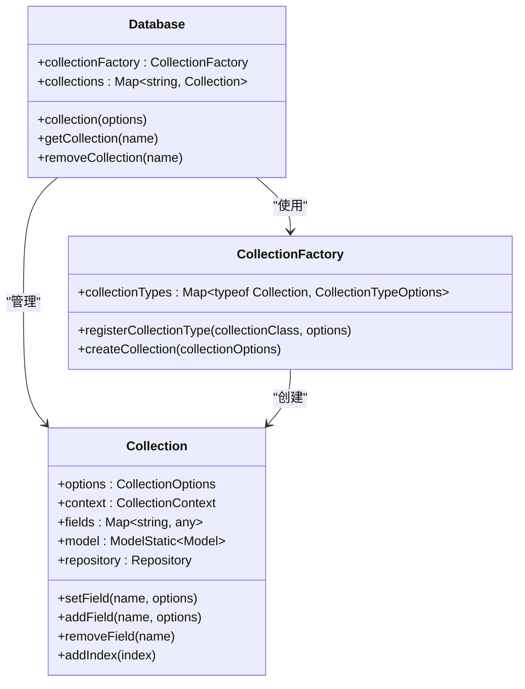
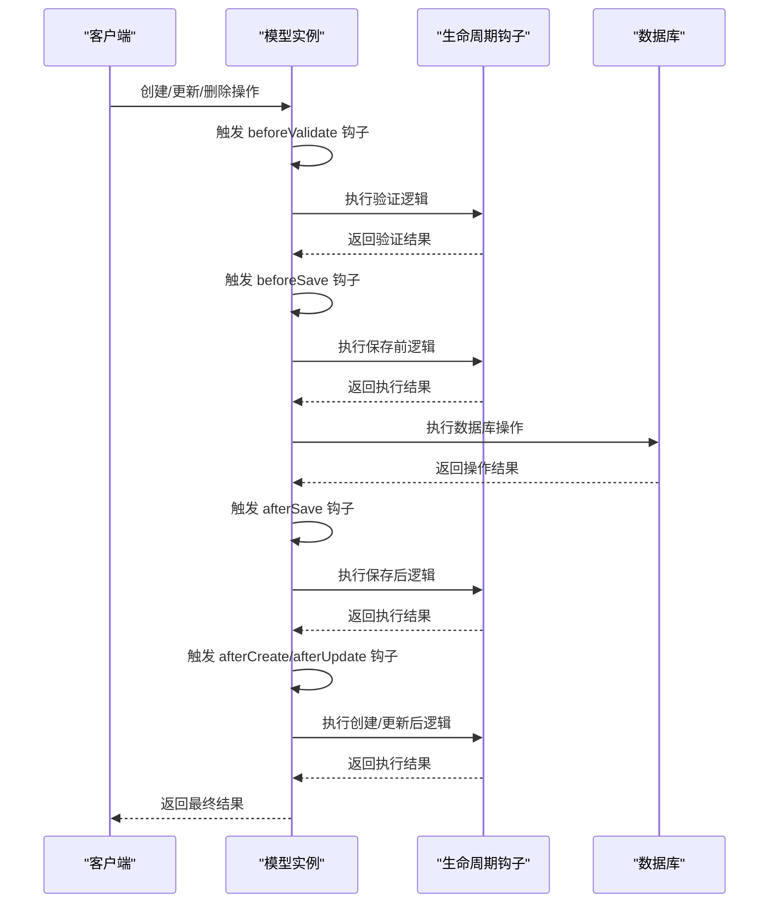
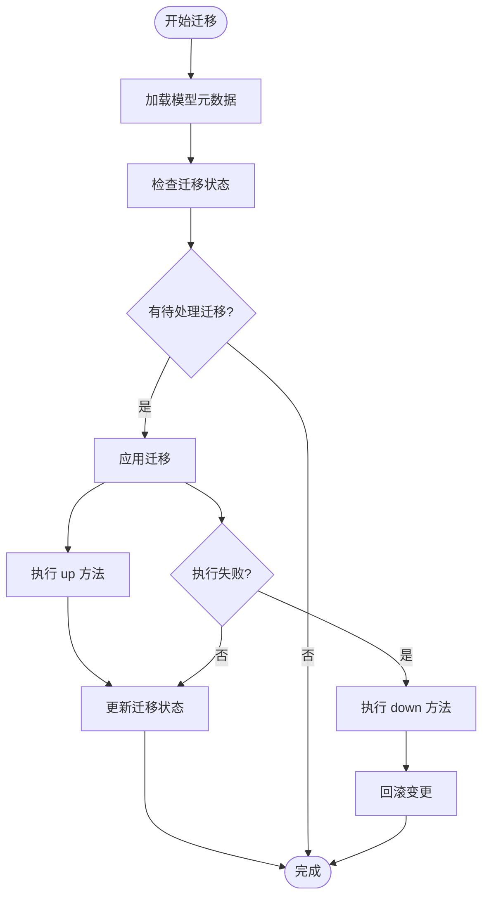
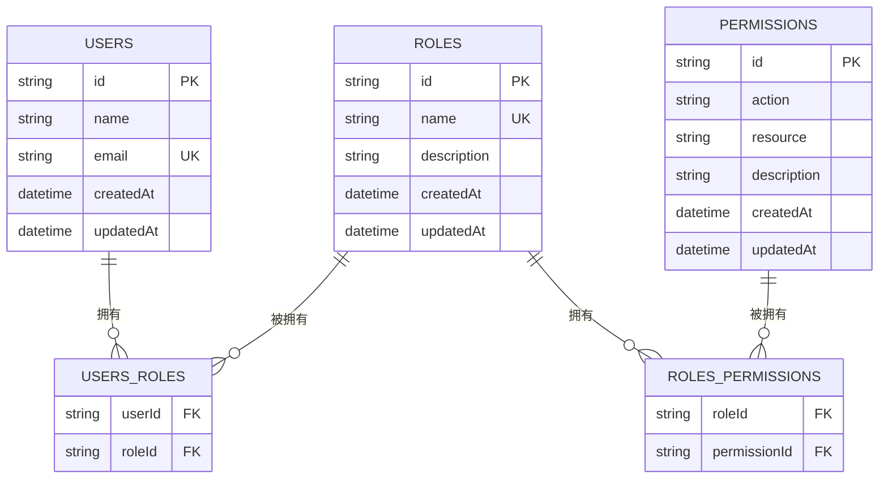

# 模型配置

<cite>
**本文档引用的文件**   
- [collection-factory.ts](file://packages/core/database/src/collection-factory.ts)
- [collection.ts](file://packages/core/database/src/collection.ts)
- [model.ts](file://packages/core/database/src/model.ts)
- [database.ts](file://packages/core/database/src/database.ts)
- [model-hook.ts](file://packages/core/database/src/model-hook.ts)
- [fields/index.ts](file://packages/core/database/src/fields/index.ts)
- [collections/collections.ts](file://packages/plugins/@nocobase/plugin-data-source-main/src/server/collections/collections.ts)
- [collections/fields.ts](file://packages/plugins/@nocobase/plugin-data-source-main/src/server/collections/fields.ts)
- [sequences.ts](file://packages/plugins/@nocobase/plugin-field-sequence/src/server/collections/sequences.ts)
</cite>

## 目录
1. [数据模型与实体模型配置](#数据模型与实体模型配置)
2. [模型工厂与模型选项解析](#模型工厂与模型选项解析)
3. [模型生命周期钩子](#模型生命周期钩子)
4. [模型元数据与迁移系统](#模型元数据与迁移系统)
5. [复杂数据模型配置示例](#复杂数据模型配置示例)

## 数据模型与实体模型配置

NocoBase中的数据模型（Collection）和实体模型（Model）是系统数据存储和操作的核心。数据模型定义了数据表的结构，包括模型名称、字段配置、索引定义和验证规则等。

数据模型通过`CollectionOptions`接口进行配置，主要配置项包括：
- **name**: 模型名称，唯一标识符
- **title**: 模型标题，用于界面显示
- **fields**: 字段配置数组，定义模型的各个字段
- **sortable**: 排序配置，支持布尔值或对象配置
- **autoGenId**: 是否自动生成ID字段
- **tableName**: 数据库表名，可自定义
- **inherits**: 继承关系，支持单个或多个继承
- **migrationRules**: 迁移规则，控制模型变更的处理方式

字段配置通过`FieldOptions`接口定义，支持多种字段类型，包括基础类型（string、integer、boolean等）和关系类型（belongsTo、hasMany、belongsToMany等）。每个字段可以配置验证规则、默认值、是否允许为空等属性。

**Section sources**
- [collection.ts](file://packages/core/database/src/collection.ts#L96-L138)
- [fields/index.ts](file://packages/core/database/src/fields/index.ts#L74-L106)

## 模型工厂与模型选项解析

模型工厂（CollectionFactory）是NocoBase中动态创建和管理数据模型的核心组件。它通过`CollectionFactory`类实现，负责根据配置选项创建相应的数据模型实例。

模型工厂的工作原理如下：
1. 通过`registerCollectionType`方法注册不同类型的集合及其创建条件
2. 在创建集合时，遍历注册的集合类型，根据`condition`函数匹配最合适的集合类
3. 使用匹配到的集合类创建集合实例

模型选项解析器负责处理模型配置选项的合并和验证。在创建模型时，系统会：
- 检查模型名称的合法性
- 验证表名的唯一性
- 处理继承关系，确保父模型的字段正确继承
- 根据配置自动添加排序字段等辅助字段

模型工厂还支持延迟绑定机制，在模型完全定义后才绑定相关字段的事件监听器，确保模型结构的完整性和一致性。

**Diagram sources **
- [collection-factory.ts](file://packages/core/database/src/collection-factory.ts#L20-L48)
- [collection.ts](file://packages/core/database/src/collection.ts#L145-L180)
- [database.ts](file://packages/core/database/src/database.ts#L162-L163)

**Section sources**
- [collection-factory.ts](file://packages/core/database/src/collection-factory.ts#L14-L32)
- [collection.ts](file://packages/core/database/src/collection.ts#L145-L180)

## 模型生命周期钩子

模型生命周期钩子（ModelHook）是NocoBase中用于在模型操作的不同阶段执行自定义逻辑的机制。系统通过事件驱动的方式，在模型的创建、更新、删除等操作前后触发相应的钩子函数。

模型生命周期钩子的主要应用场景包括：
- 数据验证和清洗
- 审计日志记录
- 缓存更新
- 业务逻辑处理
- 外部系统集成

NocoBase支持多种生命周期事件，包括：
- **beforeValidate/afterValidate**: 验证前后
- **beforeCreate/afterCreate**: 创建前后
- **beforeUpdate/afterUpdate**: 更新前后
- **beforeSave/afterSave**: 保存前后
- **beforeDestroy/afterDestroy**: 删除前后
- **afterCreateWithAssociations**: 关联创建后

钩子函数可以通过模型的`on`方法注册，支持异步操作。系统会确保所有注册的钩子按顺序执行，并在出现错误时进行适当的错误处理。

**Diagram sources **
- [model-hook.ts](file://packages/core/database/src/model-hook.ts#L18-L81)
- [model.ts](file://packages/core/database/src/model.ts#L48-L51)

**Section sources**
- [model-hook.ts](file://packages/core/database/src/model-hook.ts#L18-L81)
- [types.ts](file://packages/core/database/src/types.ts#L18-L28)

## 模型元数据与迁移系统

NocoBase通过迁移（Migration）系统管理模型的变更，确保数据库结构的版本控制和一致性。迁移系统基于Umzug库实现，支持数据库模式的增量更新。

模型元数据存储在`collections`和`fields`系统表中，记录了所有数据模型和字段的配置信息。这些元数据在应用启动时被读取，并用于动态构建数据库模型。

迁移系统的主要特性包括：
- **版本控制**: 每个迁移文件都有唯一的名称，通常包含时间戳
- **可逆操作**: 支持up（应用变更）和down（撤销变更）方法
- **事务支持**: 迁移操作在数据库事务中执行，确保原子性
- **依赖管理**: 支持迁移文件的依赖关系定义

迁移规则（migrationRules）控制模型变更的处理方式，支持以下几种策略：
- **overwrite**: 覆盖现有配置
- **skip**: 跳过变更
- **upsert**: 更新或插入
- **schema-only**: 仅更新模式，不处理数据
- **insert-ignore**: 插入时忽略已存在的记录

系统还支持通过`dumpRules`配置模型的导出规则，控制哪些模型在数据导出时需要包含。

**Diagram sources **
- [migration.ts](file://packages/core/database/src/migration.ts#L21-L48)
- [collections/collections.ts](file://packages/plugins/@nocobase/plugin-data-source-main/src/server/collections/collections.ts#L61-L81)

**Section sources**
- [migration.ts](file://packages/core/database/src/migration.ts#L51-L103)
- [database.ts](file://packages/core/database/src/database.ts#L138-L139)

## 复杂数据模型配置示例

以下是一个复杂的多对多关系数据模型配置示例，展示了如何通过代码配置包含继承、关联和验证规则的复杂数据模型：

该示例展示了用户-角色-权限的典型RBAC（基于角色的访问控制）模型，包含：
- 用户和角色之间的多对多关系
- 角色和权限之间的多对多关系
- 系统自动生成的关联表
- 唯一约束和外键约束
- 时间戳字段的自动管理

通过NocoBase的模型配置系统，可以轻松定义和管理这种复杂的业务模型，而无需直接编写SQL语句。

**Section sources**
- [collections/collections.ts](file://packages/plugins/@nocobase/plugin-data-source-main/src/server/collections/collections.ts#L57-L82)
- [collections/fields.ts](file://packages/plugins/@nocobase/plugin-data-source-main/src/server/collections/fields.ts#L59-L84)
- [sequences.ts](file://packages/plugins/@nocobase/plugin-field-sequence/src/server/collections/sequences.ts#L71-L92)