# 数据模型驱动

<cite>
**本文档引用的文件**
- [collection.ts](file://packages\core\database\src\collection.ts)
- [model.ts](file://packages\core\database\src\model.ts)
- [repository.ts](file://packages\core\database\src\repository.ts)
- [database.ts](file://packages\core\database\src\database.ts)
- [string-field.ts](file://packages\core\database\src\fields\string-field.ts)
- [has-many-field.ts](file://packages\core\database\src\fields\has-many-field.ts)
- [fields\index.ts](file://packages\core\database\src\fields\index.ts)
- [collection-factory.ts](file://packages\core\database\src\collection-factory.ts)
</cite>

## 目录
1. [引言](#引言)
2. [数据模型驱动范式](#数据模型驱动范式)
3. [三层架构设计](#三层架构设计)
4. [数据模型定义](#数据模型定义)
5. [数据迁移机制](#数据迁移机制)
6. [复杂数据模型示例](#复杂数据模型示例)
7. [数据模型与UI组件映射](#数据模型与ui组件映射)
8. [结论](#结论)

## 引言
NocoBase的数据模型驱动架构是一种先进的设计范式，它将数据结构与用户界面分离，实现了真正的数据驱动开发。这种架构通过Collection、Model和Repository三层结构，为应用程序提供了灵活、可扩展且易于维护的数据管理解决方案。本文档将深入探讨这一架构的设计理念、实现细节和最佳实践。

## 数据模型驱动范式

NocoBase采用数据模型驱动的架构范式，其核心理念是将数据结构与用户界面完全分离。这种分离带来了诸多优势：

1. **关注点分离**：数据逻辑与展示逻辑解耦，使系统更易于维护和扩展
2. **数据一致性**：所有数据操作都通过统一的模型层进行，确保了数据的完整性和一致性
3. **灵活性**：同一数据模型可以被多个不同的UI组件使用，支持多种展示方式
4. **可维护性**：数据结构的变更不会直接影响UI，降低了系统耦合度

在NocoBase中，数据模型驱动范式通过Collection、Model和Repository三个核心组件实现。Collection负责定义数据结构和元数据，Model提供数据持久化和业务逻辑，Repository则作为数据访问的统一入口。

**Section sources**
- [collection.ts](file://packages\core\database\src\collection.ts#L145-L180)
- [model.ts](file://packages\core\database\src\model.ts#L31-L38)
- [repository.ts](file://packages\core\database\src\repository.ts#L250-L262)

## 三层架构设计

NocoBase的数据模型驱动架构采用Collection、Model和Repository三层设计，每层都有明确的职责和边界。

### Collection层

Collection层是数据模型的定义层，负责描述数据结构的元数据。它包含以下主要职责：

- 定义数据表的名称、字段、索引等结构信息
- 配置数据验证规则和默认值
- 管理字段之间的关系（如一对多、多对多等）
- 处理数据迁移和版本控制

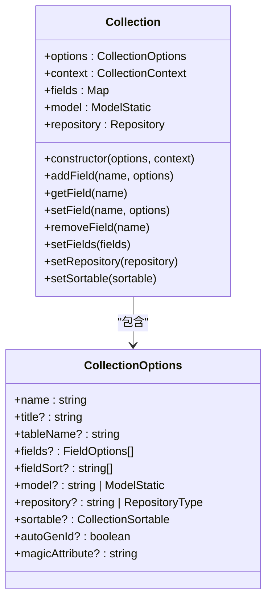

**Diagram sources**
- [collection.ts](file://packages\core\database\src\collection.ts#L145-L180)

### Model层

Model层是数据持久化层，基于Sequelize ORM实现，负责数据的存储和检索。它的主要职责包括：

- 定义数据表的物理结构
- 实现数据验证和业务逻辑
- 处理数据的创建、更新、删除和查询操作
- 管理数据表之间的关联关系

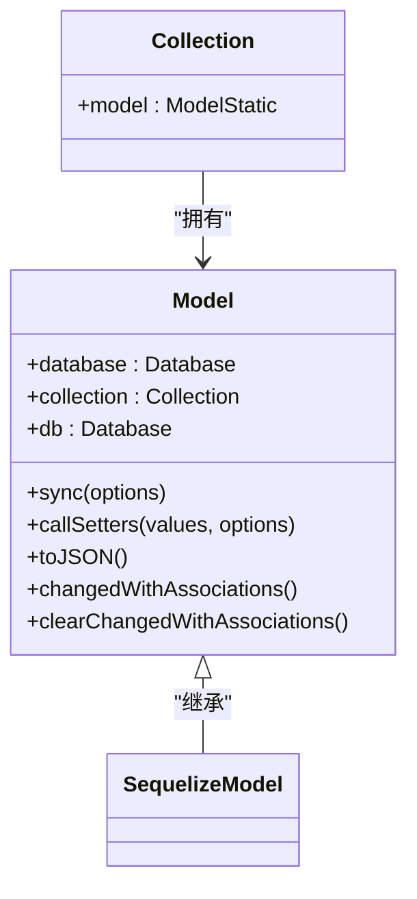

**Diagram sources**
- [model.ts](file://packages\core\database\src\model.ts#L31-L46)

### Repository层

Repository层是数据访问层，作为数据操作的统一入口。它的主要职责包括：

- 提供标准化的数据访问接口
- 封装复杂的查询逻辑
- 实现事务管理和批量操作
- 处理关联数据的加载和更新

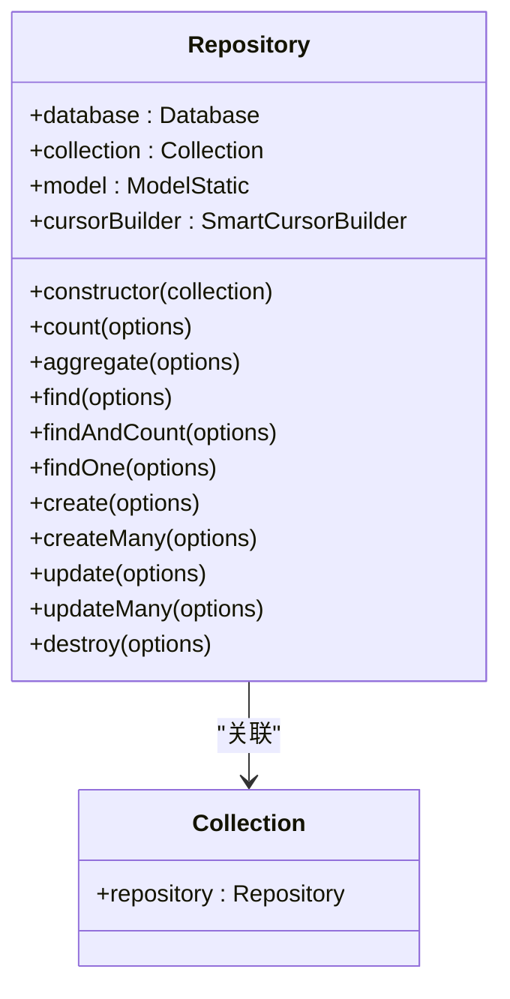

**Diagram sources**
- [repository.ts](file://packages\core\database\src\repository.ts#L250-L262)

### 三层关系

这三层架构之间的关系是紧密协作但职责分明的。Collection定义数据结构，Model实现数据持久化，Repository提供数据访问接口。它们共同构成了一个完整的数据管理解决方案。

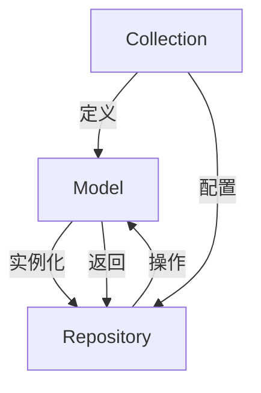

**Diagram sources**
- [collection.ts](file://packages\core\database\src\collection.ts#L145-L180)
- [model.ts](file://packages\core\database\src\model.ts#L31-L46)
- [repository.ts](file://packages\core\database\src\repository.ts#L250-L262)

**Section sources**
- [collection.ts](file://packages\core\database\src\collection.ts#L145-L180)
- [model.ts](file://packages\core\database\src\model.ts#L31-L46)
- [repository.ts](file://packages\core\database\src\repository.ts#L250-L262)

## 数据模型定义

在NocoBase中，数据模型的定义是通过Collection组件完成的，它提供了丰富的配置选项来描述数据结构。

### 字段类型

NocoBase支持多种字段类型，涵盖了常见的数据需求。这些字段类型通过字段系统进行注册和管理。

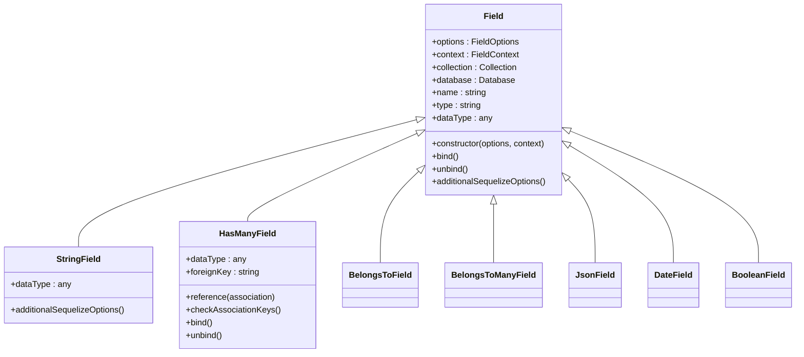

**Diagram sources**
- [fields\index.ts](file://packages\core\database\src\fields\index.ts#L74-L106)
- [string-field.ts](file://packages\core\database\src\fields\string-field.ts#L13-L47)
- [has-many-field.ts](file://packages\core\database\src\fields\has-many-field.ts#L85-L251)

### 字段配置

每个字段都可以通过丰富的选项进行配置，包括数据类型、验证规则、默认值等。

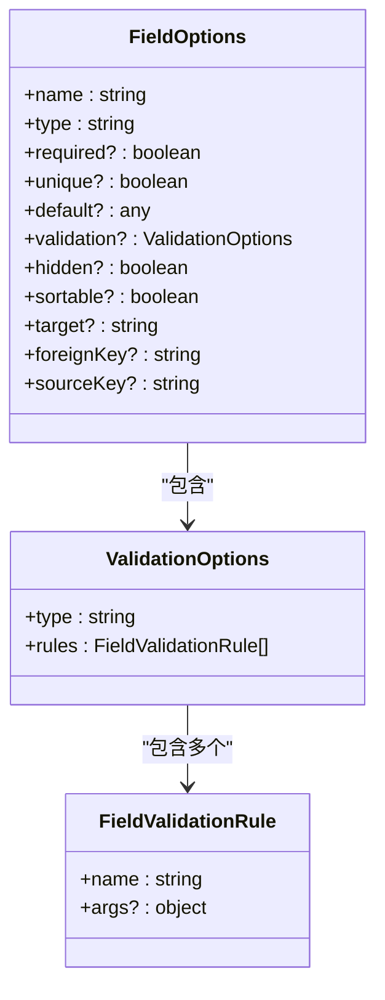

**Diagram sources**
- [fields\index.ts](file://packages\core\database\src\fields\index.ts#L74-L106)
- [fields\field.ts](file://packages\core\database\src\fields\field.ts#L42-L45)

### 关系配置

NocoBase支持多种数据关系配置，包括一对一、一对多、多对多等。

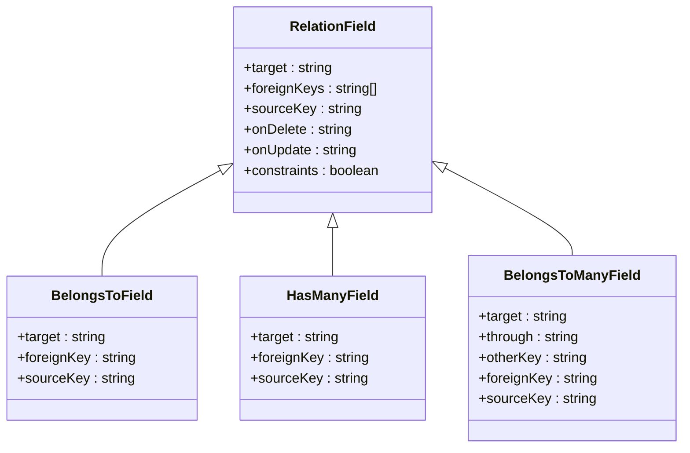

**Diagram sources**
- [has-many-field.ts](file://packages\core\database\src\fields\has-many-field.ts#L24-L83)
- [fields\relation-field.ts](file://packages\core\database\src\fields\relation-field.ts)

### 验证规则

数据验证是确保数据质量的关键环节。NocoBase通过Joi库实现了强大的验证功能。

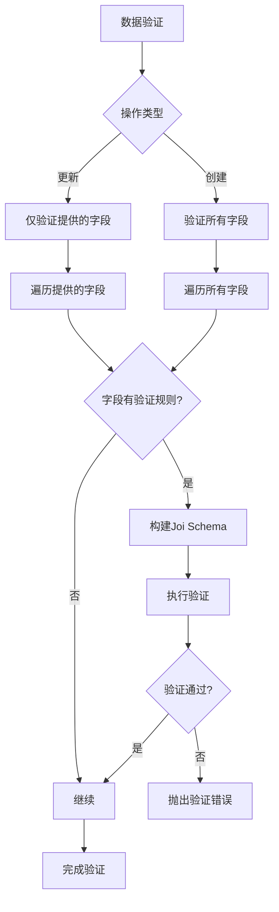

**Diagram sources**
- [collection.ts](file://packages\core\database\src\collection.ts#L236-L287)
- [utils\field-validation.ts](file://packages\core\database\src\utils\field-validation.ts#L14-L39)

**Section sources**
- [collection.ts](file://packages\core\database\src\collection.ts#L236-L287)
- [fields\index.ts](file://packages\core\database\src\fields\index.ts#L74-L106)
- [string-field.ts](file://packages\core\database\src\fields\string-field.ts#L13-L47)
- [has-many-field.ts](file://packages\core\database\src\fields\has-many-field.ts#L85-L251)

## 数据迁移机制

NocoBase提供了完善的数据迁移机制，支持通过代码或界面创建和修改数据模型。

### 迁移实现

数据迁移通过Umzug库实现，与Sequelize ORM紧密集成。迁移过程包括创建表、添加字段、修改字段类型等操作。

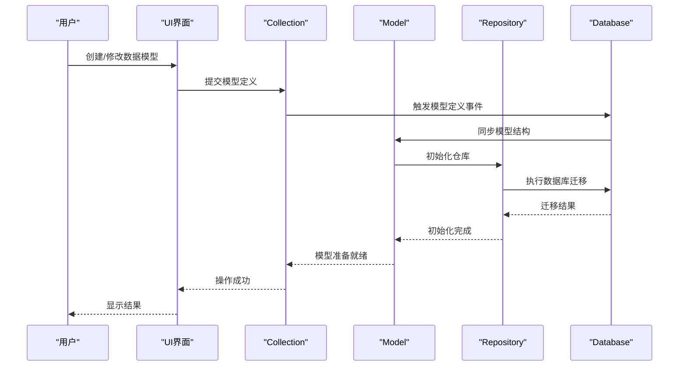

**Diagram sources**
- [database.ts](file://packages\core\database\src\database.ts#L557-L579)
- [collection.ts](file://packages\core\database\src\collection.ts#L156-L180)

### 迁移规则

NocoBase支持多种迁移规则，允许开发者控制迁移行为：

- **overwrite**：覆盖现有结构
- **skip**：跳过迁移
- **upsert**：插入或更新
- **schema-only**：仅迁移结构，不迁移数据
- **insert-ignore**：插入时忽略已存在的记录

这些规则可以在Collection定义中通过`migrationRules`选项进行配置。

**Section sources**
- [database.ts](file://packages\core\database\src\database.ts#L491-L512)
- [collection.ts](file://packages\core\database\src\collection.ts#L94-L104)

## 复杂数据模型示例

以下是一个包含多种字段类型和关联关系的复杂数据模型示例：

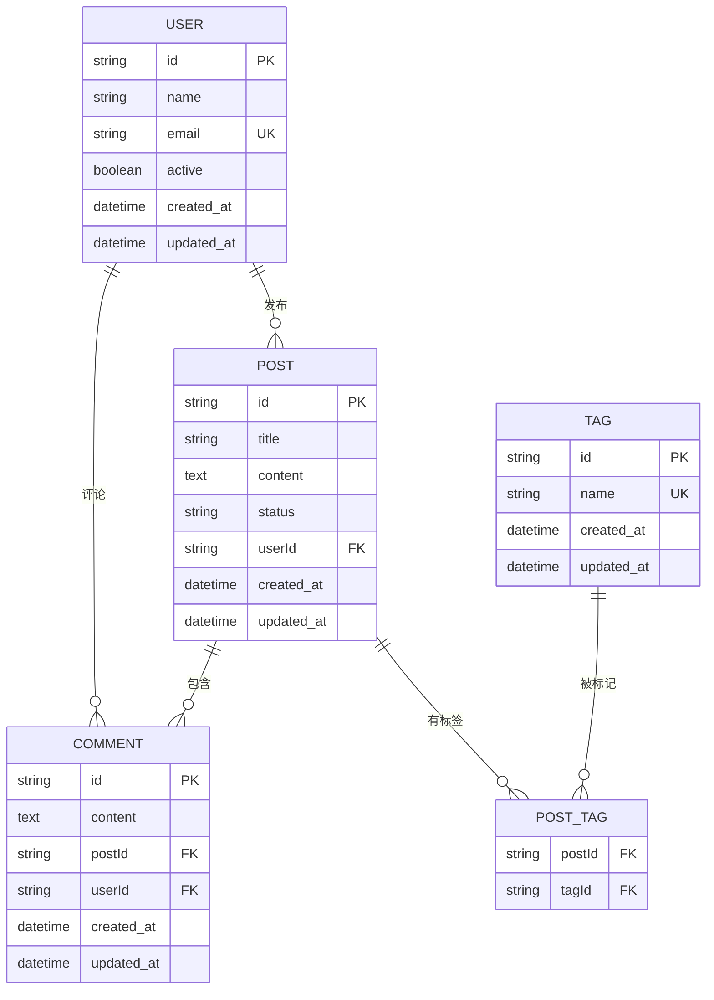

这个示例展示了：

1. **基本字段类型**：字符串、文本、布尔值、日期时间
2. **一对一关系**：用户与帖子（通过userId外键）
3. **一对多关系**：用户与评论、帖子与评论
4. **多对多关系**：帖子与标签（通过中间表POST_TAG）

在代码中，这样的数据模型可以通过以下方式定义：

```typescript
// 定义用户集合
db.collection({
  name: 'users',
  fields: [
    { type: 'string', name: 'name', required: true },
    { type: 'string', name: 'email', required: true, unique: true },
    { type: 'boolean', name: 'active', default: true },
    { type: 'createdAt', name: 'created_at' },
    { type: 'updatedAt', name: 'updated_at' }
  ]
});

// 定义帖子集合
db.collection({
  name: 'posts',
  fields: [
    { type: 'string', name: 'title', required: true },
    { type: 'text', name: 'content' },
    { type: 'string', name: 'status', default: 'draft' },
    { type: 'belongsTo', name: 'user', target: 'users', foreignKey: 'userId' },
    { type: 'hasMany', name: 'comments', target: 'comments', foreignKey: 'postId' },
    { type: 'belongsToMany', name: 'tags', target: 'tags', through: 'post_tags' }
  ]
});
```

**Diagram sources**
- [erDiagram](#复杂数据模型示例)

**Section sources**
- [collection.ts](file://packages\core\database\src\collection.ts#L145-L180)
- [fields\index.ts](file://packages\core\database\src\fields\index.ts#L74-L106)

## 数据模型与UI组件映射

NocoBase实现了数据模型与UI组件的自动映射，使开发者能够快速构建数据驱动的界面。

### 映射机制

数据模型与UI组件的映射通过字段类型与UI组件的对应关系实现。每个字段类型都有对应的UI组件，系统会根据字段类型自动选择合适的UI组件。

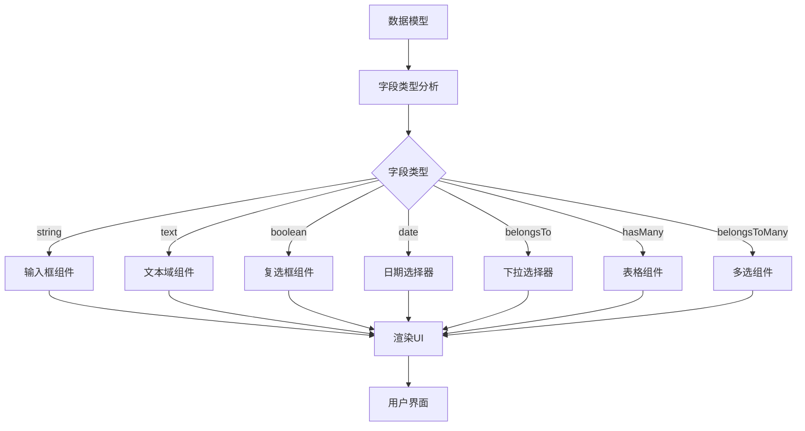

**Diagram sources**
- [data-source-manager\src\services\type-interface-map.ts](file://packages\plugins\@nocobase\plugin-data-source-manager\src\server\services\type-interface-map.ts#L182-L247)

### 数据驱动渲染

数据驱动的界面渲染流程如下：

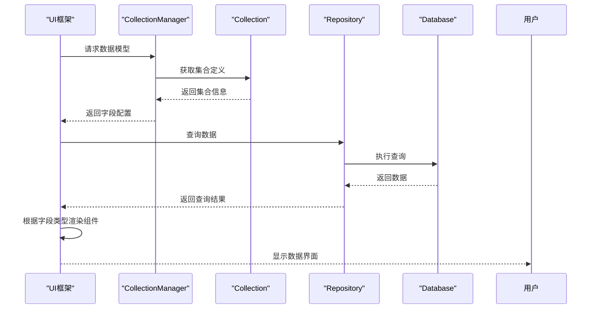

**Diagram sources**
- [client\src\data-source\collection\CollectionManager.ts](file://packages\core\client\src\data-source\collection\CollectionManager.ts#L40-L101)

**Section sources**
- [data-source-manager\src\services\type-interface-map.ts](file://packages\plugins\@nocobase\plugin-data-source-manager\src\server\services\type-interface-map.ts#L182-L247)
- [client\src\data-source\collection\CollectionManager.ts](file://packages\core\client\src\data-source\collection\CollectionManager.ts#L40-L101)

## 结论

NocoBase的数据模型驱动架构通过Collection、Model和Repository三层设计，实现了数据结构与用户界面的完全分离。这种架构范式具有以下优势：

1. **高内聚低耦合**：各层职责分明，降低了系统复杂度
2. **灵活性强**：支持多种数据类型和关系配置，适应不同业务需求
3. **可维护性好**：数据模型的变更不会直接影响UI，降低了维护成本
4. **扩展性佳**：通过插件机制，可以轻松扩展数据模型功能

通过这种数据模型驱动的设计，NocoBase为开发者提供了一个强大而灵活的数据管理平台，使构建复杂应用变得更加简单高效。