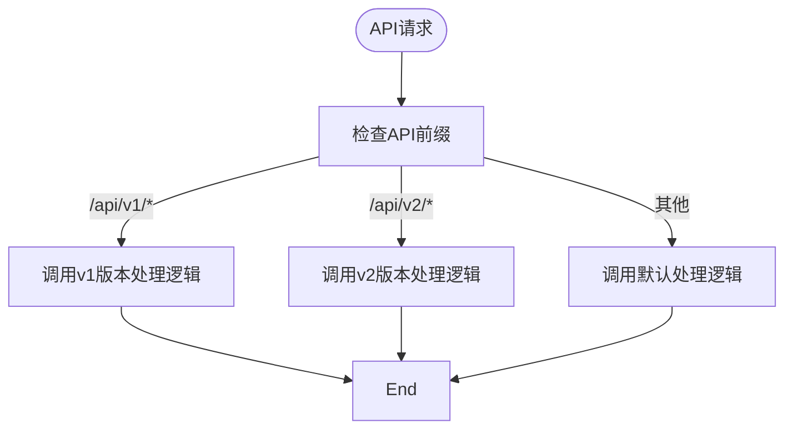

# API暴露

<cite>
**本文档中引用的文件**   
- [resourcer.ts](file://packages/core/resourcer/src/resourcer.ts)
- [resource.ts](file://packages/core/resourcer/src/resource.ts)
- [action.ts](file://packages/core/resourcer/src/action.ts)
- [middleware.ts](file://packages/core/resourcer/src/middleware.ts)
- [utils.ts](file://packages/core/resourcer/src/utils.ts)
- [simple.ts](file://examples/app/resource-actions/simple.ts)
- [global-action.ts](file://examples/app/resource-actions/global-action.ts)
- [action-with-default-options.ts](file://examples/app/resource-actions/action-with-default-options.ts)
- [action-merge-params.ts](file://examples/app/resource-actions/action-merge-params.ts)
</cite>

## 目录
1. [简介](#简介)
2. [核心组件](#核心组件)
3. [资源与操作概念](#资源与操作概念)
4. [API路由生成规则](#api路由生成规则)
5. [请求处理流程](#请求处理流程)
6. [自定义API行为](#自定义api行为)
7. [API版本控制与安全性](#api版本控制与安全性)

## 简介
NocoBase的Resourcer模块是一个强大的数据访问API暴露机制，它将数据模型自动转换为RESTful API端点。该模块通过资源（Resource）和操作（Action）的概念，实现了灵活的API定义和处理机制。Resourcer模块基于Koa框架构建，利用中间件机制实现了请求的解析、路由匹配和响应处理。

## 核心组件

Resourcer模块由几个核心组件构成：ResourceManager、Resource、Action和Middleware。这些组件协同工作，将数据模型转换为可用的API端点。

**本文档中引用的文件**   
- [resourcer.ts](file://packages/core/resourcer/src/resourcer.ts)
- [resource.ts](file://packages/core/resourcer/src/resource.ts)
- [action.ts](file://packages/core/resourcer/src/action.ts)
- [middleware.ts](file://packages/core/resourcer/src/middleware.ts)

## 资源与操作概念

### 资源（Resource）
资源是Resourcer模块中的核心概念之一，代表一个数据实体或数据集合。每个资源都有一个唯一的名称，并可以定义其类型（如'single'、'hasOne'、'hasMany'等）。资源可以包含多个操作，并可以配置中间件来处理特定的业务逻辑。


**图源**
- [resource.ts](file://packages/core/resourcer/src/resource.ts#L61-L126)
- [resourcer.ts](file://packages/core/resourcer/src/resourcer.ts#L161-L429)

### 操作（Action）
操作是资源上可执行的具体行为，如'list'（查看列表）、'create'（新增数据）、'get'（查看数据详情）、'update'（更新数据）和'delete'（删除数据）。每个操作可以定义默认参数、中间件和处理函数。


**图源**
- [action.ts](file://packages/core/resourcer/src/action.ts#L212-L409)

## API路由生成规则

Resourcer模块通过解析请求路径和方法来生成API路由。路由规则基于资源名称、操作名称和请求方法的组合。

### 路由匹配逻辑
路由匹配逻辑在`utils.ts`文件中的`parseRequest`函数中实现。该函数根据请求路径、方法和配置选项来解析出资源名称、操作名称和相关参数。


**图源**
- [utils.ts](file://packages/core/resourcer/src/utils.ts#L55-L213)

### 默认路由映射
Resourcer模块定义了不同资源类型（如'single'、'hasOne'、'hasMany'等）的默认路由映射规则。这些规则决定了特定路径和HTTP方法组合对应的操作。

```mermaid
erDiagram
RESOURCE_TYPE {
string type PK
string description
}
ROUTE_PATTERN {
string pattern PK
string description
}
HTTP_METHOD {
string method PK
string description
}
ACTION {
string action PK
string description
}
RESOURCE_TYPE ||--o{ ROUTE_PATTERN : "has"
ROUTE_PATTERN ||--o{ METHOD_ACTION_MAPPING : "has"
HTTP_METHOD ||--o{ METHOD_ACTION_MAPPING : "has"
METHOD_ACTION_MAPPING }|--|| ACTION : "maps to"
class METHOD_ACTION_MAPPING {
string resourceType
string routePattern
string httpMethod
string action
}
```

**图源**
- [utils.ts](file://packages/core/resourcer/src/utils.ts#L91-L168)

## 请求处理流程

Resourcer模块的请求处理流程是一个典型的中间件管道，从请求进入开始，经过多个处理阶段，最终返回响应。

### 处理流程概述
请求处理流程始于`resourcer.middleware`方法，该方法创建了一个Koa中间件，负责解析请求、查找对应的资源和操作，并执行相应的处理函数。


**图源**
- [resourcer.ts](file://packages/core/resourcer/src/resourcer.ts#L311-L391)

### 参数合并机制
Resourcer模块实现了复杂的参数合并机制，允许从多个来源（如全局配置、资源配置、中间件、请求参数等）合并操作参数。


**图源**
- [action.ts](file://packages/core/resourcer/src/action.ts#L289-L307)
- [action-merge-params.ts](file://examples/app/resource-actions/action-merge-params.ts)

## 自定义API行为

Resourcer模块提供了多种方式来自定义API行为，包括注册全局操作、定义资源特定操作和使用中间件。

### 全局操作注册
通过`registerActionHandlers`方法，可以注册全局可用的操作，这些操作可以在任何资源中使用。


**图源**
- [resourcer.ts](file://packages/core/resourcer/src/resourcer.ts#L252-L267)
- [global-action.ts](file://examples/app/resource-actions/global-action.ts)

### 资源特定操作
可以在定义资源时指定特定的操作，这些操作可以覆盖全局操作的默认行为。


**图源**
- [resource.ts](file://packages/core/resourcer/src/resource.ts#L100-L112)
- [action-with-default-options.ts](file://examples/app/resource-actions/action-with-default-options.ts)

### 中间件机制
Resourcer模块支持中间件机制，允许在请求处理过程中插入自定义逻辑。


**图源**
- [middleware.ts](file://packages/core/resourcer/src/middleware.ts#L33-L94)
- [resourcer.ts](file://packages/core/resourcer/src/resourcer.ts#L304-L310)

## API版本控制与安全性

### API版本控制
虽然Resourcer模块本身不直接提供版本控制功能，但可以通过前缀配置实现简单的版本控制。



**图源**
- [resourcer.ts](file://packages/core/resourcer/src/resourcer.ts#L79-L83)

### 安全性考虑
Resourcer模块通过与ACL（访问控制列表）模块集成来实现安全性控制。权限检查通常在中间件阶段完成。


**图源**
- [action-merge-params.ts](file://examples/app/resource-actions/action-merge-params.ts#L44-L61)