# 仓库模式

<cite>
**本文档引用的文件**
- [repository.ts](file://packages/core/database/src/repository.ts)
- [types.ts](file://packages/core/data-source-manager/src/types.ts)
- [transaction-decorator.ts](file://packages/core/database/src/decorators/transaction-decorator.ts)
- [update-associations.ts](file://packages/core/database/src/update-associations.ts)
- [belongs-to-repository.ts](file://packages/core/database/src/relation-repository/belongs-to-repository.ts)
- [hasone-repository.ts](file://packages/core/database/src/relation-repository/hasone-repository.ts)
- [hasmany-repository.ts](file://packages/core/database/src/relation-repository/hasmany-repository.ts)
- [belongs-to-many-repository.ts](file://packages/core/database/src/relation-repository/belongs-to-many-repository.ts)
- [create.ts](file://packages/core/actions/src/actions/create.ts)
- [destroy.ts](file://packages/core/actions/src/actions/destroy.ts)
</cite>

## 目录
1. [引言](#引言)
2. [仓库模式设计原理](#仓库模式设计原理)
3. [核心方法实现机制](#核心方法实现机制)
4. [关联数据处理](#关联数据处理)
5. [事务管理实现](#事务管理实现)
6. [实际使用示例](#实际使用示例)
7. [错误处理与性能优化](#错误处理与性能优化)
8. [结论](#结论)

## 引言

NocoBase的仓库模式（Repository Pattern）是一种数据访问层的设计模式，它为数据库操作提供了统一的接口。该模式封装了数据访问逻辑，使业务代码与数据库实现细节解耦，提高了代码的可维护性和可测试性。仓库模式在NocoBase中扮演着核心角色，负责处理所有数据的CRUD操作、关联关系管理以及事务控制。

**本文档引用的文件**
- [repository.ts](file://packages/core/database/src/repository.ts)
- [types.ts](file://packages/core/data-source-manager/src/types.ts)

## 仓库模式设计原理

NocoBase的仓库模式基于Sequelize ORM构建，通过Repository类为集合（Collection）提供数据访问接口。Repository类实现了IRepository接口，定义了标准的数据操作方法，如find、create、update和destroy等。

仓库模式的核心设计理念是将数据访问逻辑集中管理，通过抽象层隔离业务逻辑与数据库操作。每个集合都有一个对应的Repository实例，该实例负责处理该集合的所有数据操作。这种设计使得数据访问逻辑更加清晰，便于维护和扩展。

Repository类与Collection类紧密协作，Collection类定义了数据模型的结构和约束，而Repository类则负责执行具体的数据库操作。这种分离使得模型定义和数据访问逻辑可以独立演化。

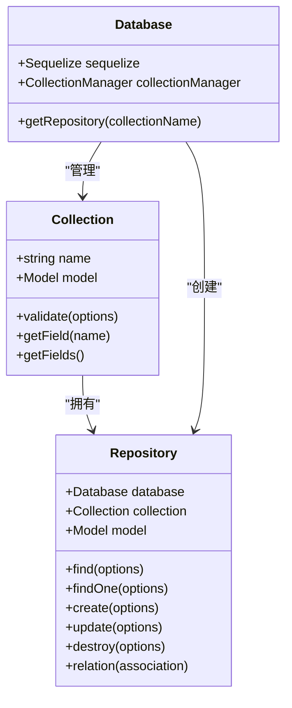

**图源**
- [repository.ts](file://packages/core/database/src/repository.ts)
- [types.ts](file://packages/core/data-source-manager/src/types.ts)

**本节源**
- [repository.ts](file://packages/core/database/src/repository.ts#L250-L981)
- [types.ts](file://packages/core/data-source-manager/src/types.ts#L84-L98)

## 核心方法实现机制

### 创建操作（create）

创建操作是仓库模式中最基本的操作之一。Repository类的create方法负责将新记录插入数据库。该方法支持单个记录和批量创建，通过@transaction装饰器确保操作的原子性。

创建过程包括参数验证、数据过滤、模型创建和关联关系处理。首先，方法会检查输入参数，然后通过UpdateGuard对数据进行过滤，确保只有允许的字段被更新。接着，调用Sequelize的create方法将数据插入数据库，最后处理相关的关联关系。

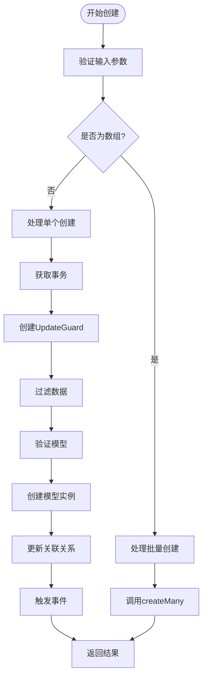

**图源**
- [repository.ts](file://packages/core/database/src/repository.ts#L655-L700)
- [update-associations.ts](file://packages/core/database/src/update-associations.ts#L71-L87)

**本节源**
- [repository.ts](file://packages/core/database/src/repository.ts#L655-L720)
- [create.ts](file://packages/core/actions/src/actions/create.ts#L13-L27)

### 更新操作（update）

更新操作通过update方法实现，支持单个记录和批量更新。与创建操作类似，更新操作也使用@transaction装饰器确保事务性，并通过mustHaveFilter装饰器确保更新操作必须有筛选条件，防止意外的全表更新。

更新过程首先构建查询选项，然后根据individualHooks参数决定更新策略。如果individualHooks为false，则采用批量更新策略，先查询符合条件的记录ID，然后执行批量更新。否则，逐个更新每个记录，并触发相应的钩子函数。

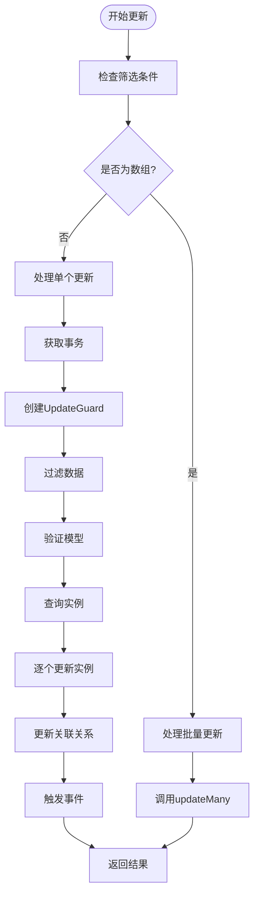

**图源**
- [repository.ts](file://packages/core/database/src/repository.ts#L728-L808)
- [update-associations.ts](file://packages/core/database/src/update-associations.ts#L71-L87)

**本节源**
- [repository.ts](file://packages/core/database/src/repository.ts#L728-L808)
- [update-associations.ts](file://packages/core/database/src/update-associations.ts#L71-L87)

### 删除操作（destroy）

删除操作通过destroy方法实现，支持通过主键、筛选条件或清空表的方式删除记录。该方法同样使用@transaction装饰器确保事务性，并根据不同的删除策略执行相应的操作。

删除过程首先处理filterByTk参数，将其转换为查询条件。然后根据是否有筛选条件、是否为清空操作等不同情况，执行相应的删除策略。对于有筛选条件的删除，会先查询符合条件的记录，然后执行删除操作。

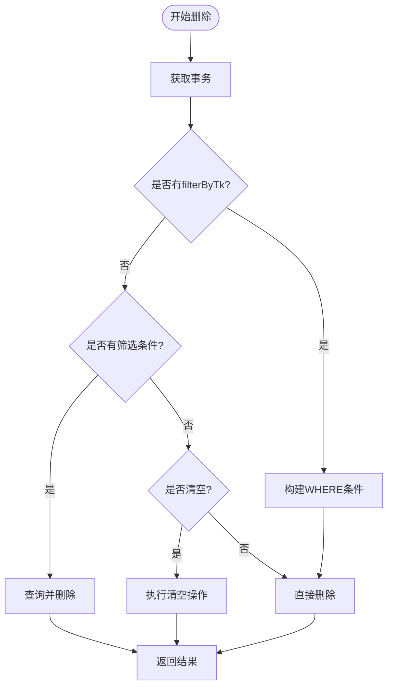

**图源**
- [repository.ts](file://packages/core/database/src/repository.ts#L829-L933)
- [destroy.ts](file://packages/core/actions/src/actions/destroy.ts#L13-L25)

**本节源**
- [repository.ts](file://packages/core/database/src/repository.ts#L829-L933)
- [destroy.ts](file://packages/core/actions/src/actions/destroy.ts#L13-L25)

## 关联数据处理

NocoBase的仓库模式支持多种关联关系的处理，包括belongsTo、hasMany、belongsToMany等。这些关联关系通过RelationRepositoryBuilder和相应的RelationRepository类实现。

### BelongsTo关系

BelongsTo关系表示"属于"关系，即一个模型属于另一个模型。在NocoBase中，BelongsToRepository类负责处理这种关系。当查询belongsTo关联的数据时，会根据外键值从目标集合中查找对应的记录。

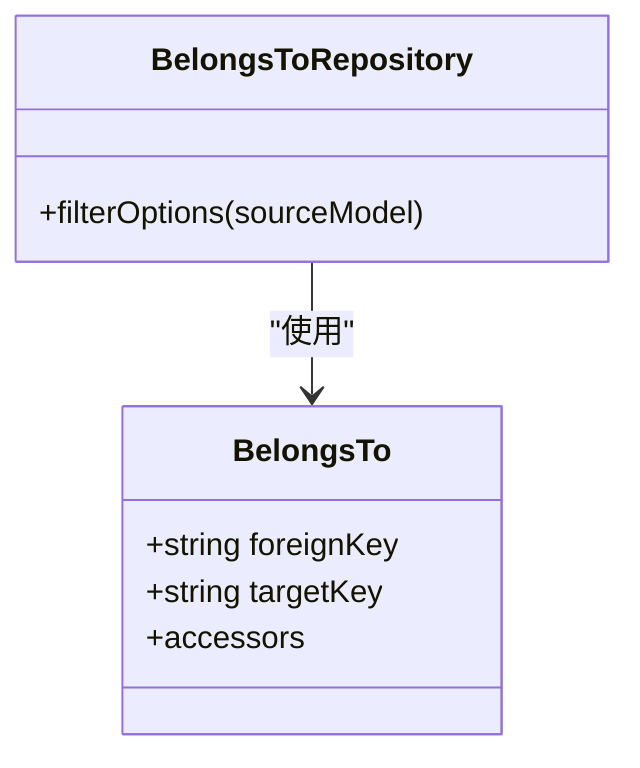

**图源**
- [belongs-to-repository.ts](file://packages/core/database/src/relation-repository/belongs-to-repository.ts#L13-L25)

**本节源**
- [belongs-to-repository.ts](file://packages/core/database/src/relation-repository/belongs-to-repository.ts#L13-L25)
- [update-associations.ts](file://packages/core/database/src/update-associations.ts#L255-L387)

### HasOne关系

HasOne关系表示"有一个"关系，即一个模型有一个关联的模型。HasOneRepository类负责处理这种关系。与BelongsTo类似，HasOne关系也通过外键关联，但语义上表示主体模型拥有一个附属模型。

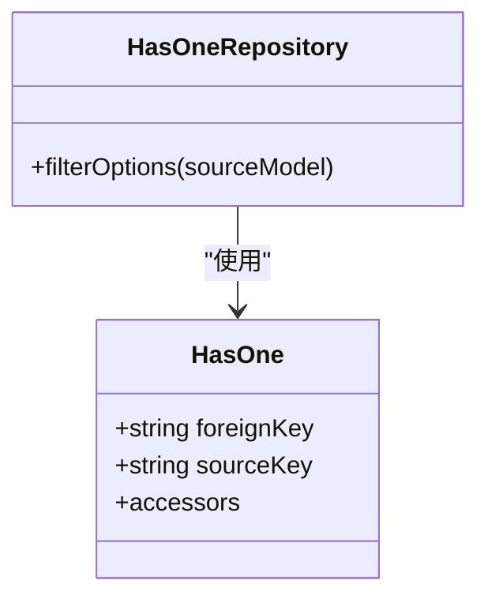

**图源**
- [hasone-repository.ts](file://packages/core/database/src/relation-repository/hasone-repository.ts#L13-L26)

**本节源**
- [hasone-repository.ts](file://packages/core/database/src/relation-repository/hasone-repository.ts#L13-L26)
- [update-associations.ts](file://packages/core/database/src/update-associations.ts#L255-L387)

### HasMany关系

HasMany关系表示"有多个"关系，即一个模型有多个关联的模型。HasManyRepository类负责处理这种关系。该类提供了find、aggregate、destroy、set和add等方法，用于查询、聚合、删除、设置和添加关联记录。

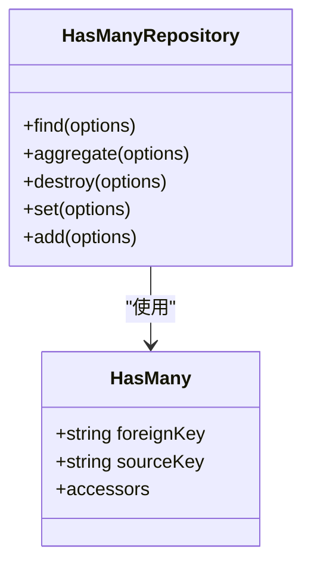

**图源**
- [hasmany-repository.ts](file://packages/core/database/src/relation-repository/hasmany-repository.ts#L17-L146)

**本节源**
- [hasmany-repository.ts](file://packages/core/database/src/relation-repository/hasmany-repository.ts#L17-L146)
- [update-associations.ts](file://packages/core/database/src/update-associations.ts#L396-L588)

### BelongsToMany关系

BelongsToMany关系表示"属于多个"关系，即一个多对多关系。这种关系通常通过一个中间表实现。BelongsToManyRepository类负责处理这种关系，提供了与HasManyRepository类似的方法，但需要处理中间表的数据。

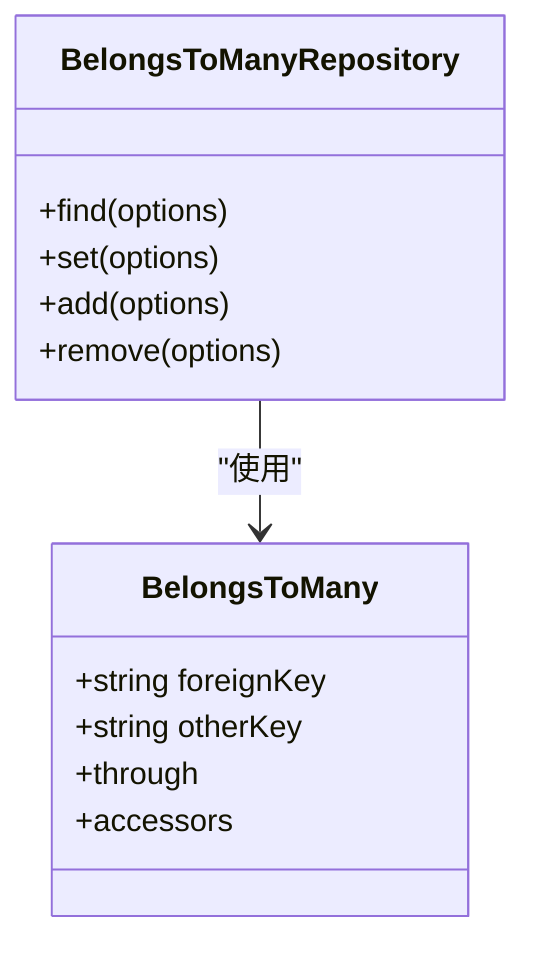

**图源**
- [belongs-to-many-repository.ts](file://packages/core/database/src/relation-repository/belongs-to-many-repository.ts)

**本节源**
- [belongs-to-many-repository.ts](file://packages/core/database/src/relation-repository/belongs-to-many-repository.ts)
- [update-associations.ts](file://packages/core/database/src/update-associations.ts#L396-L588)

## 事务管理实现

NocoBase的事务管理通过@transaction装饰器实现，该装饰器封装了Sequelize的事务处理逻辑，确保数据库操作的原子性。

### 事务装饰器

@transaction装饰器是一个高阶函数，它接收一个事务生成器函数作为参数，返回一个装饰器函数。当被装饰的方法被调用时，装饰器会检查是否已经存在事务，如果不存在则创建一个新的事务。

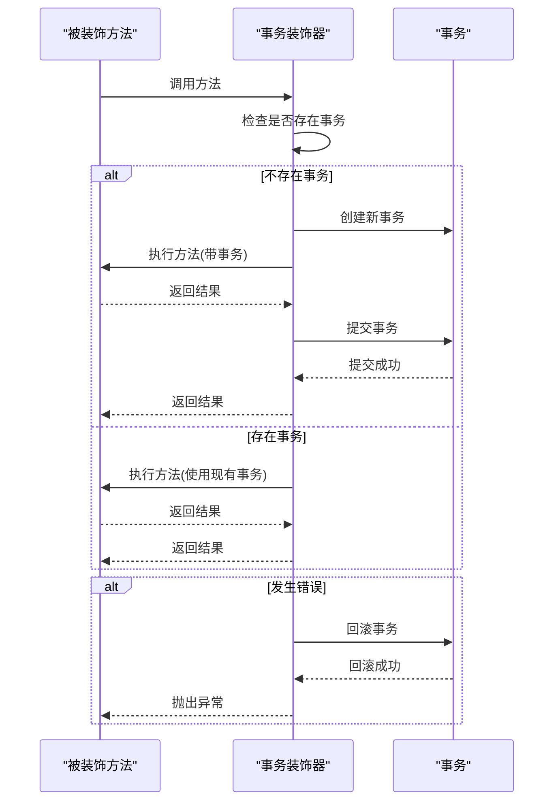

**图源**
- [transaction-decorator.ts](file://packages/core/database/src/decorators/transaction-decorator.ts#L12-L83)

**本节源**
- [transaction-decorator.ts](file://packages/core/database/src/decorators/transaction-decorator.ts#L12-L83)
- [repository.ts](file://packages/core/database/src/repository.ts#L185-L187)

### 事务传播

NocoBase的事务管理支持事务传播，即在一个事务中调用另一个事务性方法时，会使用现有的事务而不是创建新的事务。这种设计避免了嵌套事务的问题，确保所有操作都在同一个事务上下文中执行。

当一个事务性方法调用另一个事务性方法时，内层方法会检测到外层方法已经创建了事务，因此会直接使用该事务，而不是创建新的事务。这样，所有数据库操作都在同一个事务中执行，要么全部成功，要么全部失败。

## 实际使用示例

### 基本CRUD操作

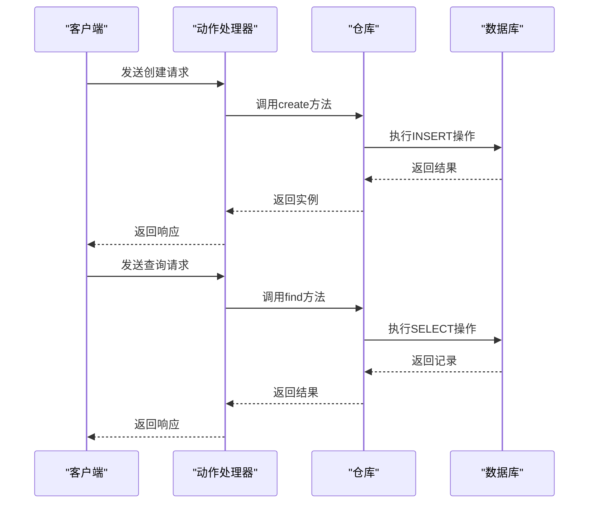

**图源**
- [create.ts](file://packages/core/actions/src/actions/create.ts#L13-L27)
- [repository.ts](file://packages/core/database/src/repository.ts#L518-L567)

**本节源**
- [create.ts](file://packages/core/actions/src/actions/create.ts#L13-L27)
- [repository.ts](file://packages/core/database/src/repository.ts#L518-L567)

### 复杂数据操作

在处理复杂数据操作时，可以结合使用多个仓库方法和事务管理。例如，在创建用户的同时创建其个人资料和权限设置：

```typescript
await repository.create({
  values: {
    username: 'john',
    email: 'john@example.com',
    profile: {
      firstName: 'John',
      lastName: 'Doe'
    },
    roles: [
      { name: 'user' },
      { name: 'editor' }
    ]
  },
  updateAssociationValues: ['profile', 'roles']
});
```

这个操作会在一个事务中完成，确保所有相关数据的一致性。

## 错误处理与性能优化

### 错误处理

NocoBase的仓库模式通过多种机制处理错误，包括参数验证、事务回滚和错误事件触发。当操作失败时，事务会被自动回滚，确保数据的一致性。

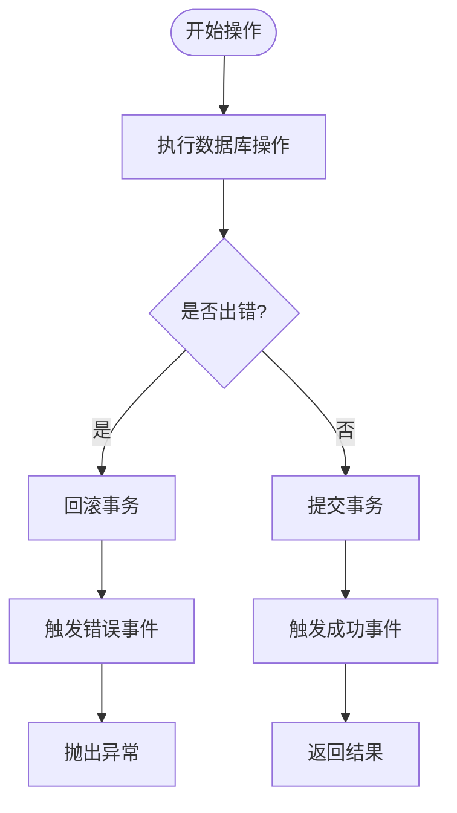

**图源**
- [transaction-decorator.ts](file://packages/core/database/src/decorators/transaction-decorator.ts#L12-L83)
- [repository.ts](file://packages/core/database/src/repository.ts#L655-L700)

**本节源**
- [transaction-decorator.ts](file://packages/core/database/src/decorators/transaction-decorator.ts#L12-L83)
- [repository.ts](file://packages/core/database/src/repository.ts#L655-L700)

### 性能优化

为了提高性能，NocoBase的仓库模式采用了多种优化策略：

1. **批量操作**：对于大量数据的创建和更新，使用批量操作而不是逐个操作，减少数据库往返次数。
2. **智能查询**：通过OptionsParser和FilterParser优化查询条件，生成高效的SQL语句。
3. **缓存机制**：对于频繁读取但不常更新的数据，使用缓存减少数据库查询。
4. **游标分页**：对于大数据集的查询，使用游标分页而不是偏移分页，避免性能下降。

## 结论

NocoBase的仓库模式是一个功能强大且设计精良的数据访问层实现。它通过统一的接口封装了复杂的数据库操作，提供了丰富的功能，包括CRUD操作、关联关系处理和事务管理。该模式的设计遵循了良好的软件工程原则，使得代码更加模块化、可维护和可测试。

通过深入理解仓库模式的设计原理和实现机制，开发者可以更有效地使用NocoBase进行应用开发，充分利用其提供的各种功能，同时遵循最佳实践来确保应用的性能和可靠性。