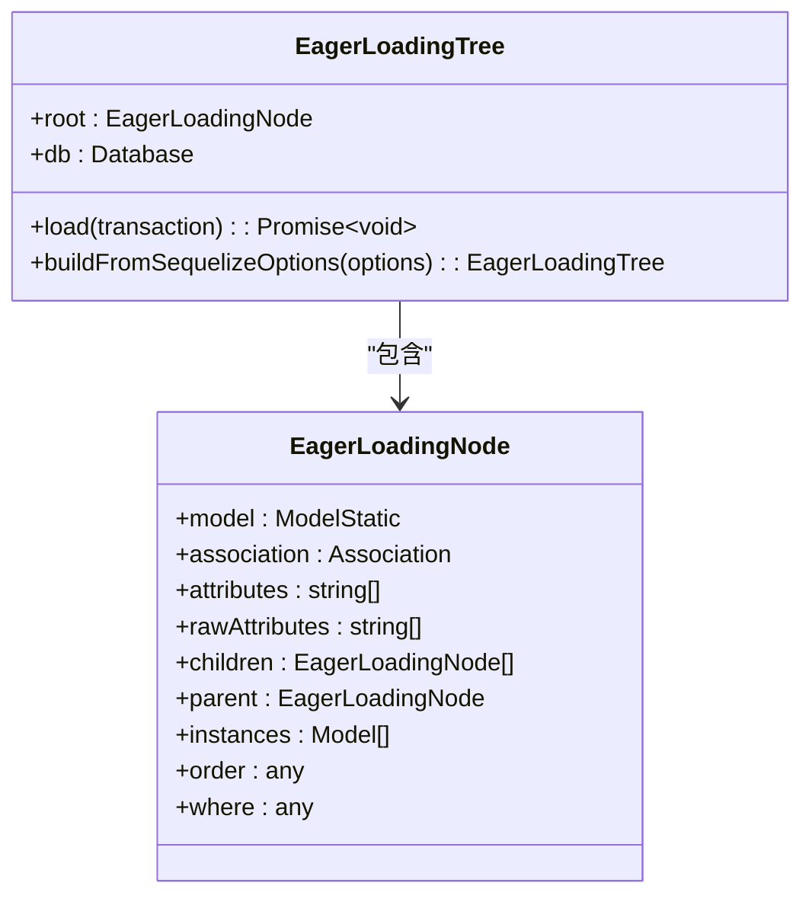
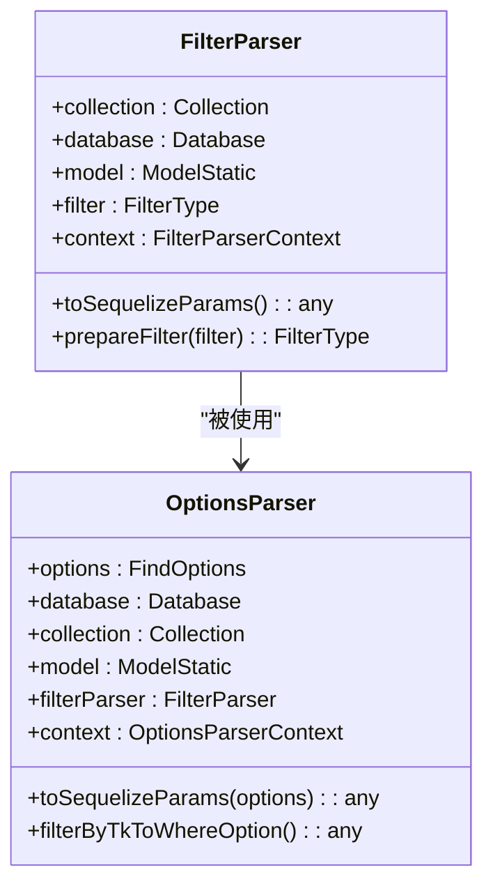
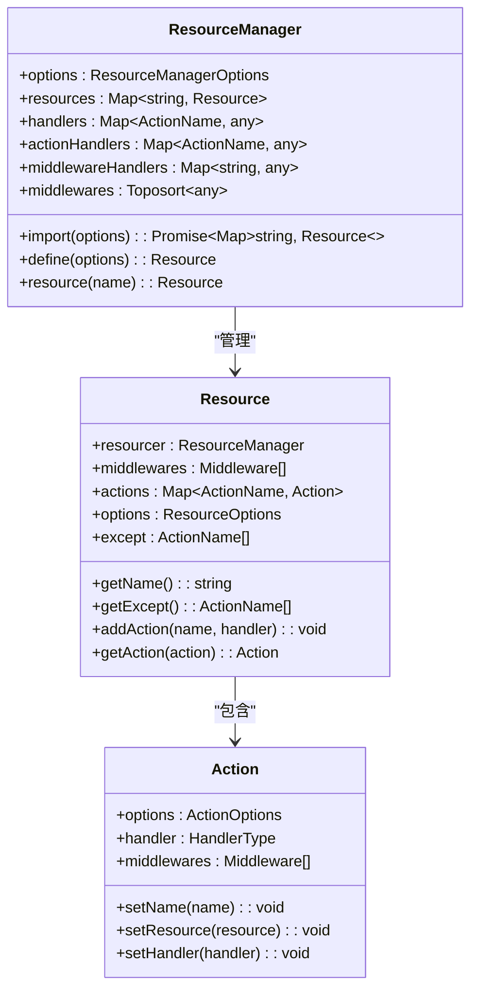
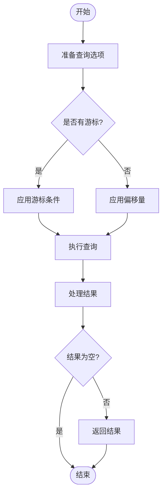

# 数据访问

<cite>
**本文档引用的文件**   
- [Repository.ts](file://packages/core/database/src/Repository.ts)
- [collection.ts](file://packages/core/database/src/collection.ts)
- [model.ts](file://packages/core/database/src/model.ts)
- [filter-parser.ts](file://packages/core/database/src/filter-parser.ts)
- [options-parser.ts](file://packages/core/database/src/options-parser.ts)
- [eager-loading-tree.ts](file://packages/core/database/src/eager-loading/eager-loading-tree.ts)
- [resourcer.ts](file://packages/core/resourcer/src/resourcer.ts)
- [action.ts](file://packages/core/resourcer/src/action.ts)
- [resource.ts](file://packages/core/resourcer/src/resource.ts)
</cite>

## 目录
1. [引言](#引言)
2. [Repository模式实现](#repository模式实现)
3. [关联数据加载策略](#关联数据加载策略)
4. [查询接口设计](#查询接口设计)
5. [Resourcer模块与RESTful API](#resourcer模块与restful-api)
6. [性能优化技巧](#性能优化技巧)
7. [代码示例](#代码示例)
8. [结论](#结论)

## 引言
NocoBase的数据访问层基于Sequelize ORM构建，提供了一套完整的Repository模式实现。该模式封装了数据库操作的复杂性，为上层应用提供了简洁、一致的数据访问接口。本文档深入探讨NocoBase数据访问层的核心机制，包括Repository模式的实现、关联数据加载策略、查询接口设计以及如何通过Resourcer模块将数据访问能力暴露为RESTful API。

## Repository模式实现

NocoBase的Repository模式是其数据访问层的核心，它提供了一套统一的接口来操作数据库中的数据。`Repository`类封装了所有CRUD操作，使得开发者无需直接与底层ORM交互。

Repository类的主要功能包括：
- **基本CRUD操作**：提供`create`、`update`、`destroy`等方法来管理数据
- **查询操作**：支持`find`、`findOne`、`findAndCount`等查询方法
- **事务管理**：通过装饰器自动处理事务
- **数据验证**：在创建和更新时进行数据验证

Repository模式通过`Collection`类与具体的数据库表关联，每个Collection实例都有一个对应的Repository实例来处理其数据操作。

**Section sources**
- [Repository.ts](file://packages/core/database/src/Repository.ts#L250-L800)
- [collection.ts](file://packages/core/database/src/collection.ts#L145-L200)

## 关联数据加载策略

NocoBase实现了复杂的关联数据加载机制，支持多种加载策略来优化性能和满足不同的业务需求。

### 嵌套加载
通过`EagerLoadingTree`类实现嵌套加载，它能够解析复杂的include选项并构建相应的查询。当查询包含关联数据时，系统会自动处理关联字段的加载。



**Diagram sources **
- [eager-loading-tree.ts](file://packages/core/database/src/eager-loading/eager-loading-tree.ts#L86-L200)

### 懒加载
对于某些场景，系统支持懒加载模式，即在需要时才加载关联数据。这种策略可以减少初始查询的复杂度和数据量。

### 关联类型支持
NocoBase支持多种关联类型，包括：
- BelongsTo (属于)
- HasOne (一对一)
- HasMany (一对多)
- BelongsToMany (多对多)
- ArrayField (数组字段)

每种关联类型都有对应的Repository实现，如`BelongsToRepository`、`HasManyRepository`等。

**Section sources**
- [eager-loading-tree.ts](file://packages/core/database/src/eager-loading/eager-loading-tree.ts#L1-L200)
- [belongs-to-repository.ts](file://packages/core/database/src/relation-repository/belongs-to-repository.ts#L1-L26)

## 查询接口设计

NocoBase提供了功能丰富的查询接口，支持复杂的过滤、排序、分页和聚合操作。

### 过滤操作
通过`FilterParser`类解析过滤条件，支持多种操作符和嵌套查询。过滤条件可以是简单的值匹配，也可以是复杂的逻辑表达式。



**Diagram sources **
- [filter-parser.ts](file://packages/core/database/src/filter-parser.ts#L27-L200)
- [options-parser.ts](file://packages/core/database/src/options-parser.ts#L25-L200)

### 排序和分页
支持多种排序方式，包括单字段排序、多字段排序以及关联字段排序。分页功能支持传统的limit-offset分页和基于游标的分页。

### 聚合操作
提供`aggregate`方法支持常见的聚合函数，如count、sum、avg、min、max等。聚合操作可以结合过滤条件，实现复杂的统计需求。

**Section sources**
- [Repository.ts](file://packages/core/database/src/Repository.ts#L235-L444)
- [filter-parser.ts](file://packages/core/database/src/filter-parser.ts#L27-L200)
- [options-parser.ts](file://packages/core/database/src/options-parser.ts#L25-L200)

## Resourcer模块与RESTful API

Resourcer模块是NocoBase将数据访问能力暴露为RESTful API的关键组件。它将Repository操作映射为标准的HTTP接口。

### 资源定义
通过`Resource`类定义API资源，每个资源对应一个数据集合。资源可以配置支持的操作、中间件和默认参数。



**Diagram sources **
- [resourcer.ts](file://packages/core/resourcer/src/resourcer.ts#L161-L200)
- [resource.ts](file://packages/core/resourcer/src/resource.ts#L61-L126)
- [action.ts](file://packages/core/resourcer/src/action.ts#L17-L200)

### 操作映射
Resourcer将标准的CRUD操作映射为HTTP方法：
- list: GET /resources (查询列表)
- create: POST /resources (创建记录)
- get: GET /resources/:id (获取单条记录)
- update: PUT /resources/:id (更新记录)
- destroy: DELETE /resources/:id (删除记录)

### 中间件机制
支持灵活的中间件机制，可以在操作执行前后插入自定义逻辑，如权限验证、数据转换、日志记录等。

**Section sources**
- [resourcer.ts](file://packages/core/resourcer/src/resourcer.ts#L1-L200)
- [resource.ts](file://packages/core/resourcer/src/resource.ts#L1-L126)
- [action.ts](file://packages/core/resourcer/src/action.ts#L1-L200)

## 性能优化技巧

NocoBase提供了多种性能优化策略来处理大规模数据和复杂查询。

### 批量操作
支持批量创建和更新操作，减少数据库交互次数，提高数据处理效率。

### 游标分页
对于大规模数据集，提供基于游标的分页方式，避免传统分页在深分页时的性能问题。



**Diagram sources **
- [Repository.ts](file://packages/core/database/src/Repository.ts#L490-L512)

### 查询优化
- **智能字段选择**：只查询需要的字段，减少数据传输量
- **关联查询优化**：合理使用include选项，避免N+1查询问题
- **索引利用**：确保查询条件中的字段有适当的索引

### 缓存机制
虽然本文档主要关注数据访问层，但NocoBase也支持缓存机制来进一步提升性能，特别是在读多写少的场景下。

**Section sources**
- [Repository.ts](file://packages/core/database/src/Repository.ts#L446-L512)

## 代码示例

以下是一些常见的使用示例，展示如何构建复杂的查询条件和处理关联数据。

### 基本查询
```typescript
// 查询用户列表
const users = await db.getRepository('users').find({
  filter: {
    name: 'John'
  },
  sort: ['createdAt']
});
```

### 复杂过滤
```typescript
// 复杂过滤条件
const records = await repository.find({
  filter: {
    $and: [
      { status: 'active' },
      { $or: [
        { priority: 'high' },
        { score: { $gte: 80 } }
      ]}
    ]
  }
});
```

### 关联数据操作
```typescript
// 处理关联数据
const user = await userRepository.findByTargetKey(1);
const posts = await user.posts.find({
  filter: { published: true }
});
```

**Section sources**
- [Repository.ts](file://packages/core/database/src/Repository.ts#L518-L607)
- [model.ts](file://packages/core/database/src/model.ts#L98-L164)

## 结论
NocoBase的数据访问层通过Repository模式提供了强大而灵活的数据操作能力。其设计充分考虑了性能、可扩展性和易用性，支持复杂的查询和关联操作。通过Resourcer模块，这些数据访问能力可以轻松地暴露为RESTful API，为构建现代化的应用程序提供了坚实的基础。开发者可以利用这些特性快速构建高效、可靠的数据驱动应用。