# 查询构建

<cite>
**本文档中引用的文件**   
- [filter-match.ts](file://packages/core/database/src/filter-match.ts)
- [filter-parser.ts](file://packages/core/database/src/filter-parser.ts)
- [operators/index.ts](file://packages/core/database/src/operators/index.ts)
- [operators/eq.ts](file://packages/core/database/src/operators/eq.ts)
- [operators/in.ts](file://packages/core/database/src/operators/in.ts)
- [operators/notIn.ts](file://packages/core/database/src/operators/notIn.ts)
- [operators/string.ts](file://packages/core/database/src/operators/string.ts)
- [operators/empty.ts](file://packages/core/database/src/operators/empty.ts)
- [options-parser.ts](file://packages/core/database/src/options-parser.ts)
- [repository.ts](file://packages/core/database/src/repository.ts)
- [cursor-builder.ts](file://packages/core/database/src/cursor-builder.ts)
- [list.ts](file://packages/core/actions/src/actions/list.ts)
- [data-sources-collections.ts](file://packages/plugins/@nocobase/plugin-data-source-manager/src/server/resourcers/data-sources-collections.ts)
- [default-actions/list.ts](file://packages/core/data-source-manager/src/default-actions/list.ts)
</cite>

## 目录
1. [介绍](#介绍)
2. [查询接口设计](#查询接口设计)
3. [过滤条件解析与匹配机制](#过滤条件解析与匹配机制)
4. [支持的查询操作符](#支持的查询操作符)
5. [复杂查询条件组合](#复杂查询条件组合)
6. [排序与分页实现](#排序与分页实现)
7. [聚合查询](#聚合查询)
8. [关联数据查询](#关联数据查询)
9. [查询性能优化](#查询性能优化)

## 介绍
NocoBase提供了一套强大的查询构建系统，允许用户通过灵活的API接口执行各种数据查询操作。本文档将深入解析查询系统的内部机制，包括过滤条件的解析、支持的操作符、复杂查询的组合方式，以及排序、分页和聚合查询的实现。

## 查询接口设计
NocoBase的查询接口设计基于Sequelize ORM框架，提供了丰富的查询选项来满足各种业务需求。查询接口主要通过Repository类的find方法实现，该方法接受一个包含各种查询选项的参数对象。

查询接口支持多种查询参数，包括过滤条件(filter)、字段选择(fields)、关联数据加载(appends)、排除字段(except)、排序(sort)和分页等。这些参数共同构成了一个完整的查询请求，系统会根据这些参数生成相应的SQL查询语句。

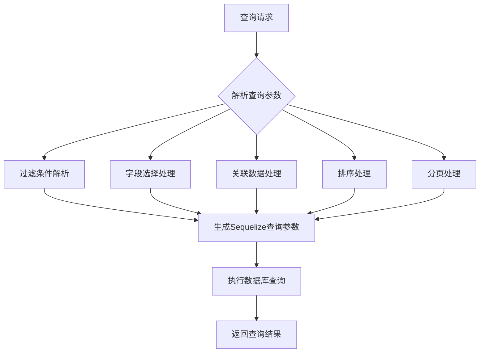

**Diagram sources**
- [repository.ts](file://packages/core/database/src/repository.ts#L518-L527)
- [options-parser.ts](file://packages/core/database/src/options-parser.ts#L108-L260)

**Section sources**
- [repository.ts](file://packages/core/database/src/repository.ts#L518-L527)
- [options-parser.ts](file://packages/core/database/src/options-parser.ts#L108-L260)

## 过滤条件解析与匹配机制
NocoBase的过滤条件解析机制通过FilterParser类实现，该类负责将用户提供的过滤条件转换为Sequelize兼容的查询参数。过滤条件解析过程包括对嵌套关联、操作符处理和属性映射的解析。

过滤匹配机制通过filterMatch函数实现，该函数支持多种操作符的匹配逻辑。当执行过滤匹配时，系统会遍历过滤条件中的每个键值对，根据操作符类型调用相应的匹配函数。

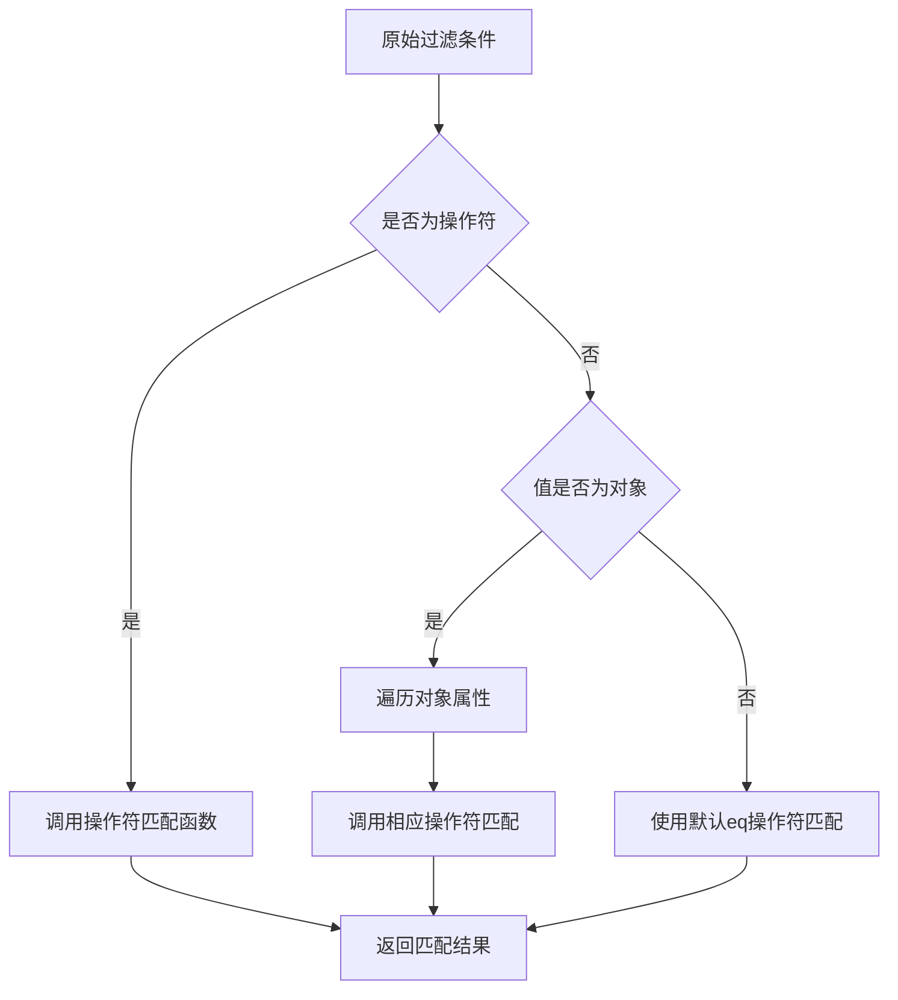

**Diagram sources**
- [filter-parser.ts](file://packages/core/database/src/filter-parser.ts#L69-L277)
- [filter-match.ts](file://packages/core/database/src/filter-match.ts#L12-L79)

**Section sources**
- [filter-parser.ts](file://packages/core/database/src/filter-parser.ts#L69-L277)
- [filter-match.ts](file://packages/core/database/src/filter-match.ts#L12-L79)

## 支持的查询操作符
NocoBase支持丰富的查询操作符，这些操作符通过operators目录下的各个文件实现。每个操作符文件导出一个包含特定操作符函数的对象，这些函数负责将操作符条件转换为Sequelize查询参数。

### 基本比较操作符
基本比较操作符用于数值和字符串的比较，包括等于、不等于、大于、小于等。

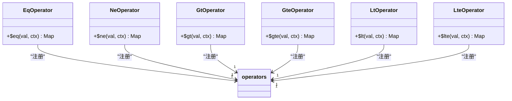

**Diagram sources**
- [operators/eq.ts](file://packages/core/database/src/operators/eq.ts#L12-L36)
- [operators/index.ts](file://packages/core/database/src/operators/index.ts#L22-L34)

**Section sources**
- [operators/eq.ts](file://packages/core/database/src/operators/eq.ts#L12-L36)
- [operators/index.ts](file://packages/core/database/src/operators/index.ts#L22-L34)

### 集合操作符
集合操作符用于处理数组或集合类型的查询，支持包含、不包含、任意匹配等操作。

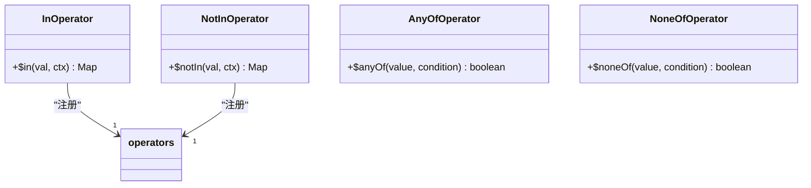

**Diagram sources**
- [operators/in.ts](file://packages/core/database/src/operators/in.ts#L13-L19)
- [operators/notIn.ts](file://packages/core/database/src/operators/notIn.ts#L13-L19)
- [filter-match.ts](file://packages/core/database/src/filter-match.ts#L28-L29)

**Section sources**
- [operators/in.ts](file://packages/core/database/src/operators/in.ts#L13-L19)
- [operators/notIn.ts](file://packages/core/database/src/operators/notIn.ts#L13-L19)
- [filter-match.ts](file://packages/core/database/src/filter-match.ts#L28-L29)

### 字符串操作符
字符串操作符提供对字符串类型的特殊查询功能，如包含、不包含、以...开头、以...结尾等。

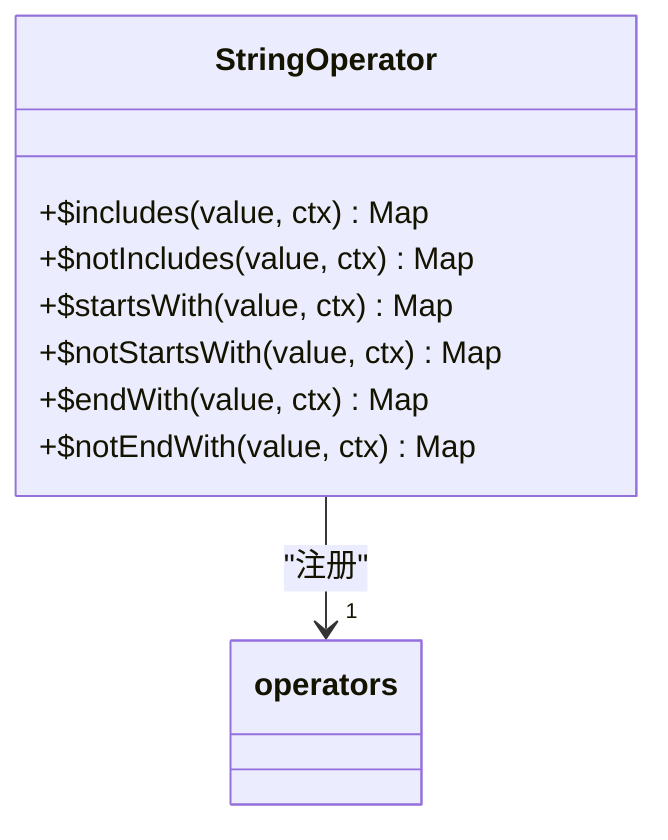

**Diagram sources**
- [operators/string.ts](file://packages/core/database/src/operators/string.ts#L79-L173)

**Section sources**
- [operators/string.ts](file://packages/core/database/src/operators/string.ts#L79-L173)

### 空值操作符
空值操作符用于检查字段是否为空或非空，支持不同数据类型的空值判断。

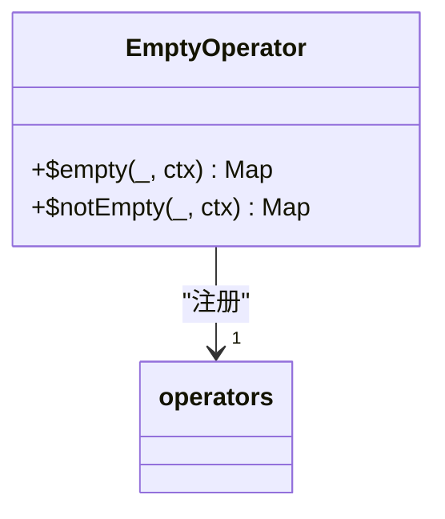

**Diagram sources**
- [operators/empty.ts](file://packages/core/database/src/operators/empty.ts#L49-L87)

**Section sources**
- [operators/empty.ts](file://packages/core/database/src/operators/empty.ts#L49-L87)

## 复杂查询条件组合
NocoBase支持复杂的查询条件组合，允许用户通过逻辑操作符合并多个查询条件。系统支持$and和$or操作符，可以构建任意复杂的查询逻辑。

### 逻辑操作符
逻辑操作符允许将多个条件组合在一起，形成更复杂的查询逻辑。$and操作符要求所有条件都满足，而$or操作符只需要满足任一条件。

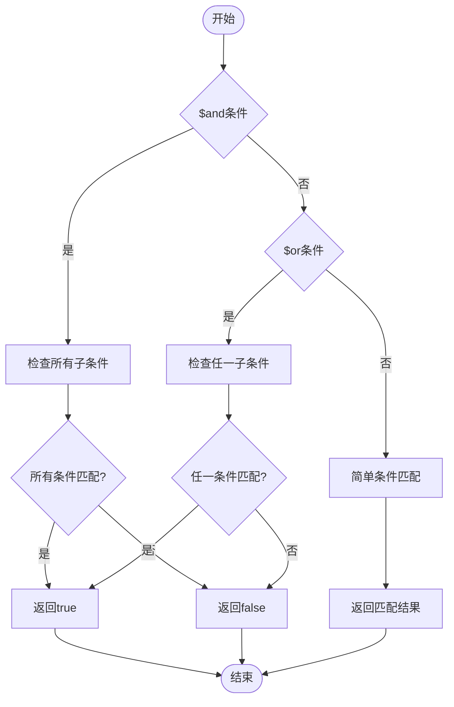

**Diagram sources**
- [filter-match.ts](file://packages/core/database/src/filter-match.ts#L45-L46)

**Section sources**
- [filter-match.ts](file://packages/core/database/src/filter-match.ts#L45-L46)

### 嵌套查询条件
系统支持嵌套的查询条件，允许在关联模型上应用过滤条件。这种机制通过解析点号分隔的字段路径来实现，可以跨越多个关联层级进行查询。

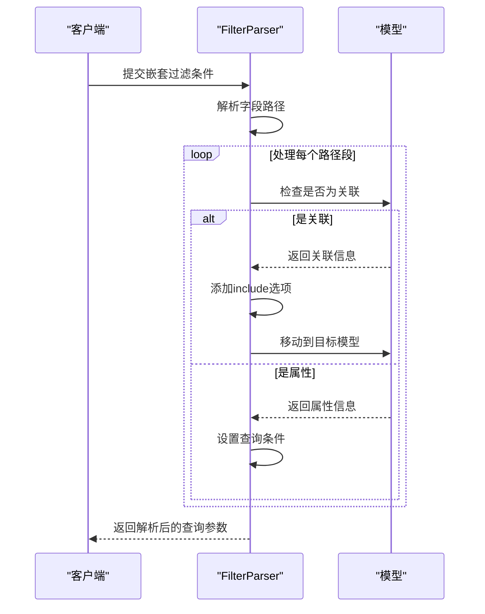

**Diagram sources**
- [filter-parser.ts](file://packages/core/database/src/filter-parser.ts#L111-L240)

**Section sources**
- [filter-parser.ts](file://packages/core/database/src/filter-parser.ts#L111-L240)

## 排序与分页实现
NocoBase提供了完善的排序和分页功能，支持多种分页策略和排序方式。

### 排序实现
排序功能通过parseSort方法实现，支持单字段和多字段排序，以及正序和倒序排列。系统会自动处理关联模型的排序需求。

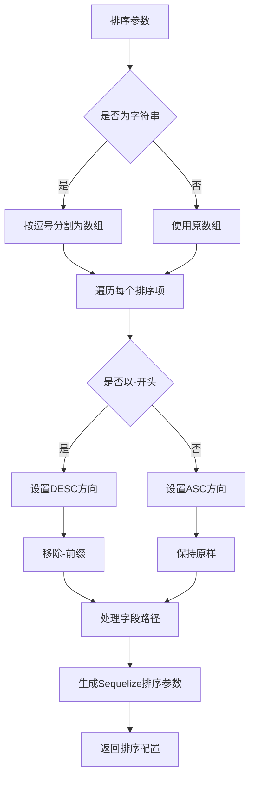

**Diagram sources**
- [options-parser.ts](file://packages/core/database/src/options-parser.ts#L134-L203)

**Section sources**
- [options-parser.ts](file://packages/core/database/src/options-parser.ts#L134-L203)

### 分页实现
系统支持两种分页模式：简单分页和标准分页。简单分页适用于大数据集，通过获取额外一行来判断是否有下一页；标准分页则返回完整的分页信息。

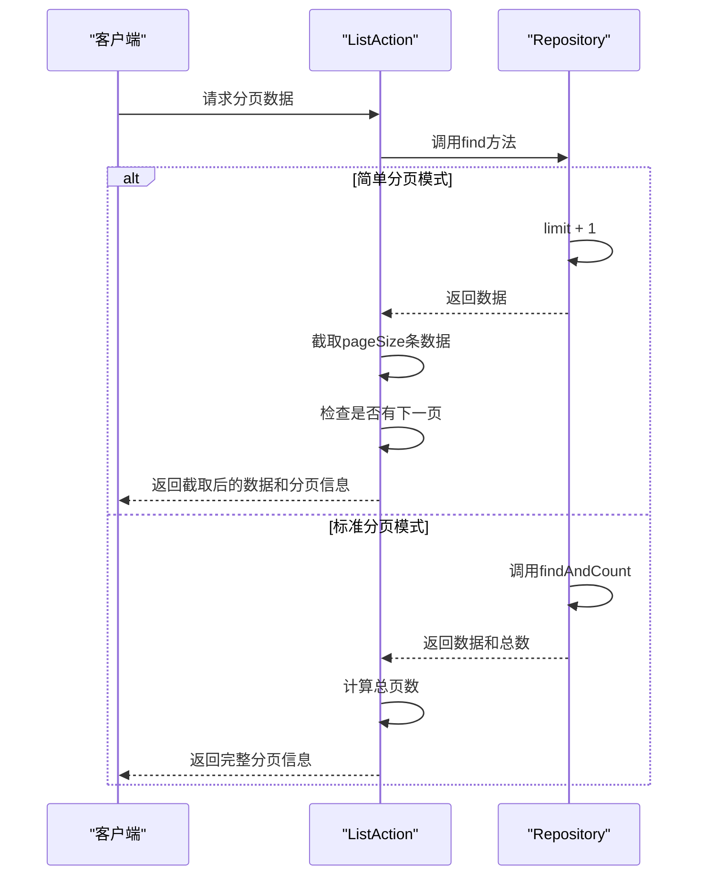

**Diagram sources**
- [list.ts](file://packages/core/actions/src/actions/list.ts#L67-L87)
- [default-actions/list.ts](file://packages/core/data-source-manager/src/default-actions/list.ts#L41-L77)

**Section sources**
- [list.ts](file://packages/core/actions/src/actions/list.ts#L67-L87)
- [default-actions/list.ts](file://packages/core/data-source-manager/src/default-actions/list.ts#L41-L77)

### 游标分页
对于超大数据集，系统提供了游标分页功能，通过chunkWithCursor方法实现。游标分页基于稳定索引字段，适合处理数百万行级别的数据。

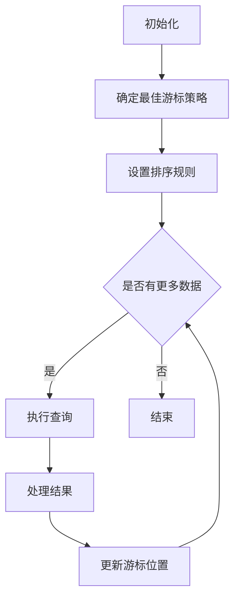

**Diagram sources**
- [cursor-builder.ts](file://packages/core/database/src/cursor-builder.ts#L201-L226)
- [repository.ts](file://packages/core/database/src/repository.ts#L500-L512)

**Section sources**
- [cursor-builder.ts](file://packages/core/database/src/cursor-builder.ts#L201-L226)
- [repository.ts](file://packages/core/database/src/repository.ts#L500-L512)

## 聚合查询
聚合查询功能通过aggregate方法实现，支持常见的聚合操作，如计数、求和、平均值、最大值和最小值。

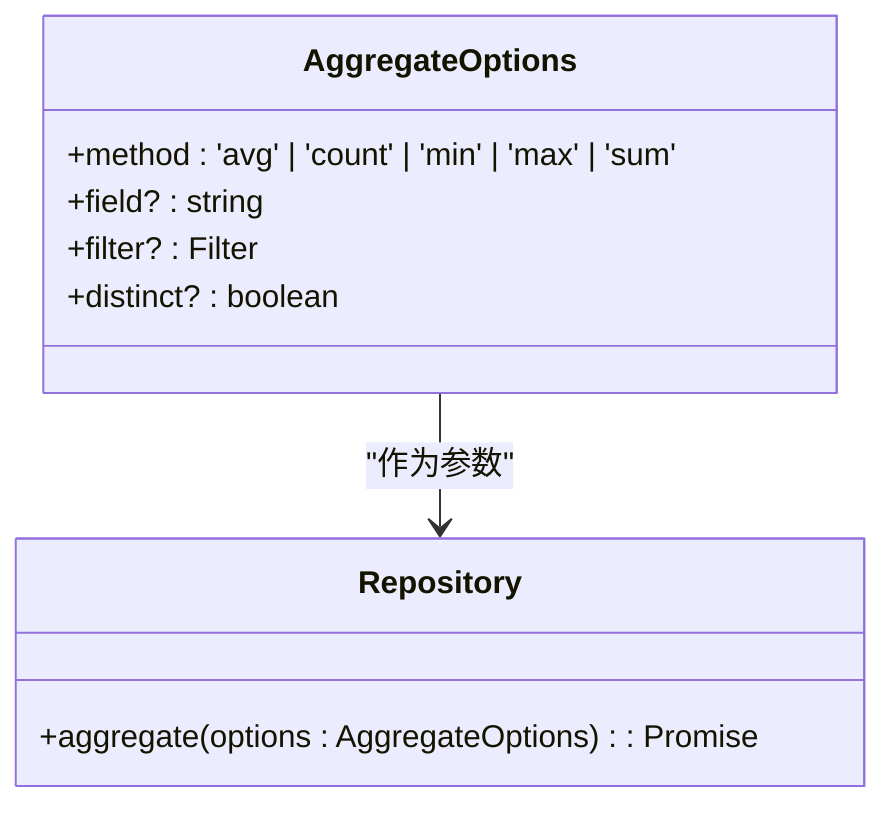

**Diagram sources**
- [repository.ts](file://packages/core/database/src/repository.ts#L390-L400)

**Section sources**
- [repository.ts](file://packages/core/database/src/repository.ts#L390-L400)

## 关联数据查询
NocoBase支持复杂的关联数据查询，可以通过appends参数指定需要加载的关联数据。

### 关联数据加载
系统通过parseAppends方法处理关联数据加载请求，支持多级嵌套关联的加载。

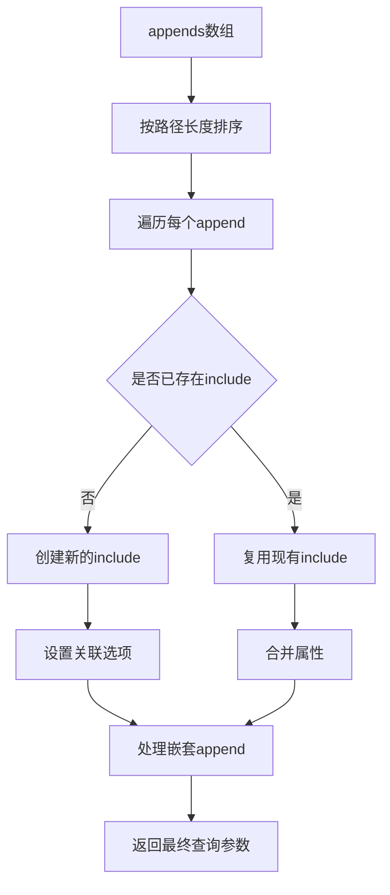

**Diagram sources**
- [options-parser.ts](file://packages/core/database/src/options-parser.ts#L317-L465)

**Section sources**
- [options-parser.ts](file://packages/core/database/src/options-parser.ts#L317-L465)

### 关联过滤
系统支持在关联模型上应用过滤条件，通过嵌套的过滤条件实现跨模型查询。

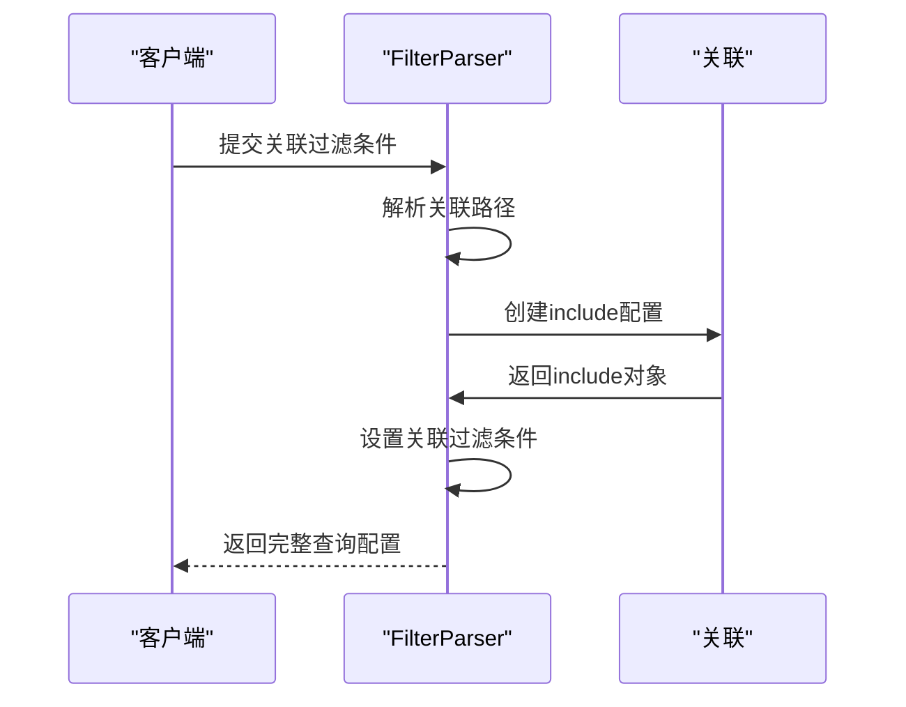

**Diagram sources**
- [filter-parser.ts](file://packages/core/database/src/filter-parser.ts#L173-L228)

**Section sources**
- [filter-parser.ts](file://packages/core/database/src/filter-parser.ts#L173-L228)

## 查询性能优化
NocoBase提供了多种查询性能优化机制，确保系统在处理大量数据时仍能保持良好性能。

### 自动分页模式选择
系统会根据数据量自动选择合适的分页模式。当数据量超过阈值时，会自动切换到简单分页模式以提高性能。

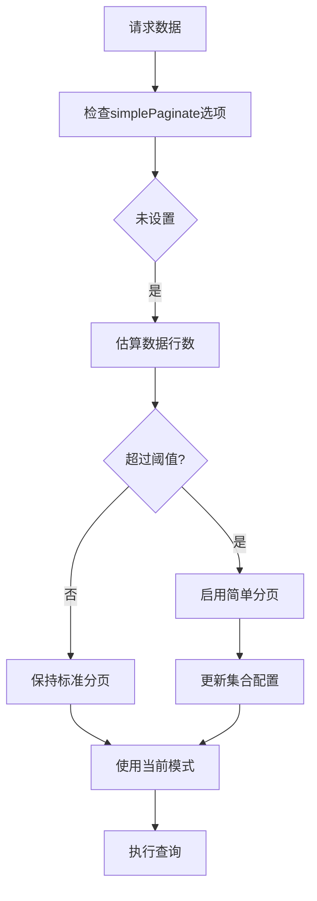

**Diagram sources**
- [list.ts](file://packages/core/actions/src/actions/list.ts#L51-L65)
- [default-actions/list.ts](file://packages/core/data-source-manager/src/default-actions/list.ts#L60-L77)

**Section sources**
- [list.ts](file://packages/core/actions/src/actions/list.ts#L51-L65)
- [default-actions/list.ts](file://packages/core/data-source-manager/src/default-actions/list.ts#L60-L77)

### 游标策略选择
游标分页会自动选择最佳的游标策略，优先使用主键，然后是唯一索引，最后是普通索引。

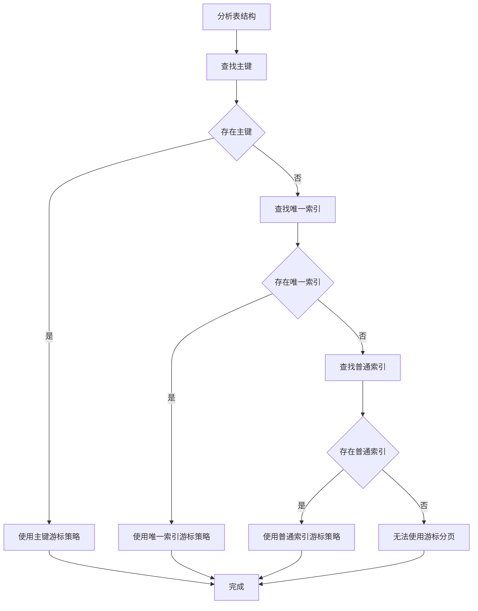

**Diagram sources**
- [cursor-builder.ts](file://packages/core/database/src/cursor-builder.ts#L151-L189)

**Section sources**
- [cursor-builder.ts](file://packages/core/database/src/cursor-builder.ts#L151-L189)