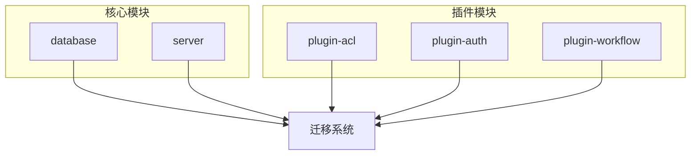
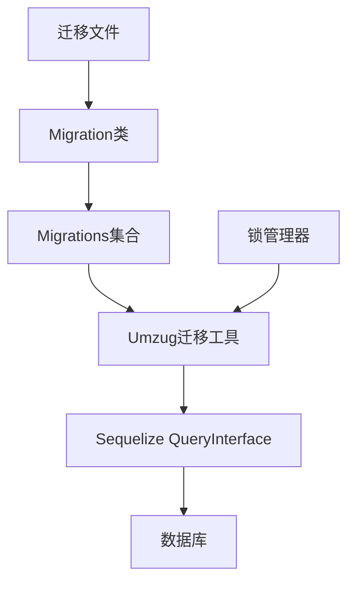
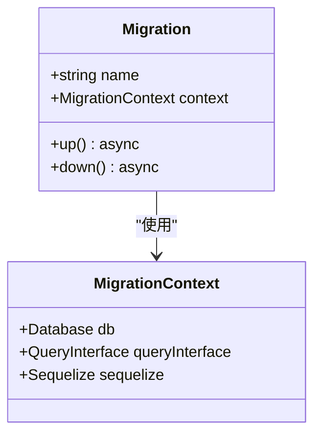
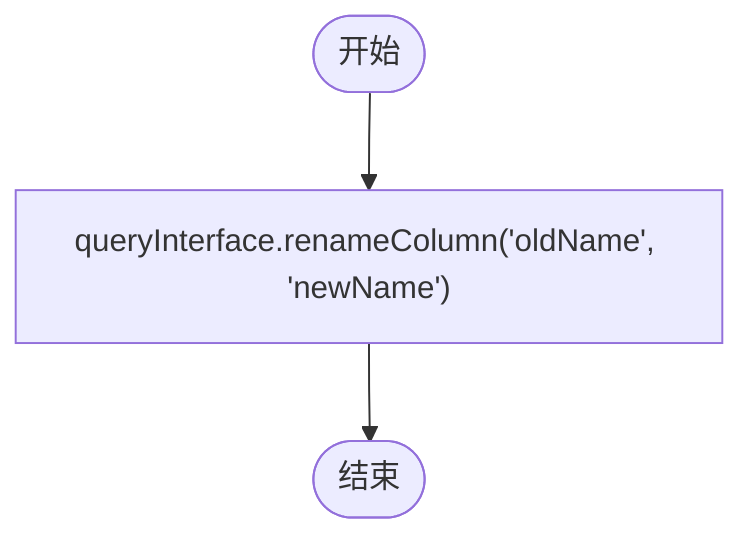
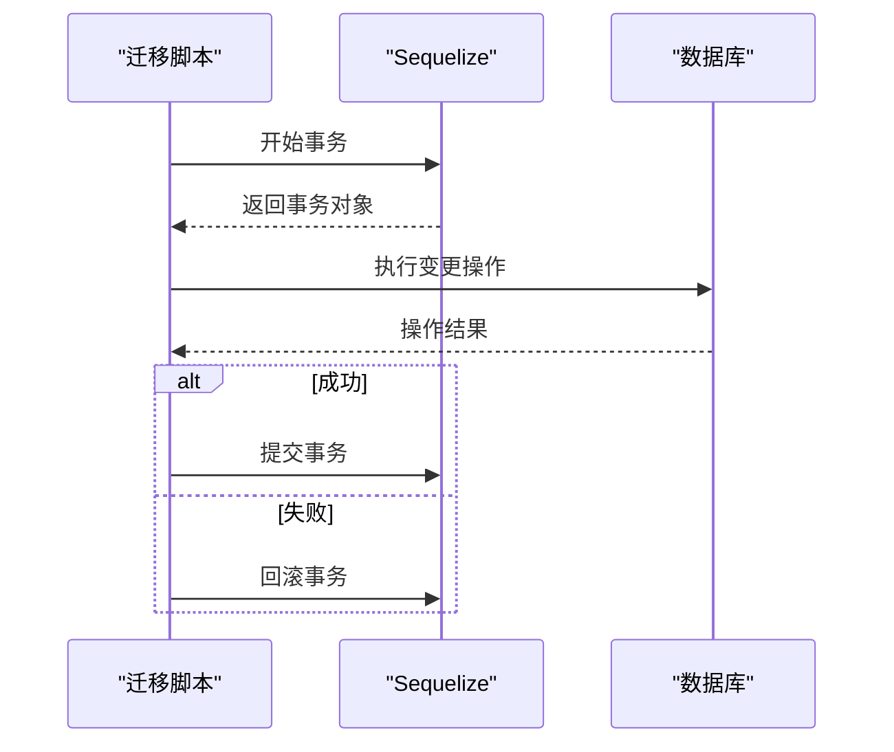
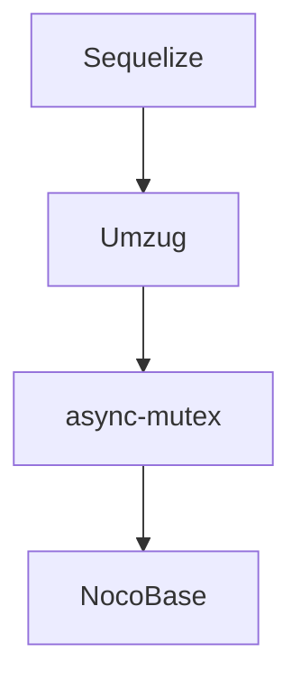

# 数据迁移

<cite>
**本文档引用的文件**   
- [migration.ts](file://packages/core/database/src/migration.ts)
- [database.ts](file://packages/core/database/src/database.ts)
- [create-migration.ts](file://packages/core/server/src/commands/create-migration.ts)
- [add-migration.ts](file://examples/app/migrations/add-migration.ts)
- [20230912193824-package-name-unique.ts](file://packages/core/server/src/migrations/20230912193824-package-name-unique.ts)
- [20240106082756-update-plugins.ts](file://packages/core/server/src/migrations/20240106082756-update-plugins.ts)
- [lock-manager.ts](file://packages/core/lock-manager/src/lock-manager.ts)
</cite>

## 目录
1. [引言](#引言)
2. [项目结构](#项目结构)
3. [核心组件](#核心组件)
4. [架构概述](#架构概述)
5. [详细组件分析](#详细组件分析)
6. [依赖分析](#依赖分析)
7. [性能考虑](#性能考虑)
8. [故障排除指南](#故障排除指南)
9. [结论](#结论)

## 引言
NocoBase的数据迁移机制是基于Sequelize的数据库迁移系统构建的，旨在提供一种可靠、可追溯的方式来管理数据库模式和数据的变更。该机制支持模式同步和数据迁移两种主要操作，确保在不同环境和实例之间保持数据一致性。通过使用Umzug作为迁移工具，NocoBase实现了迁移文件的创建、执行和回滚流程的自动化，并提供了事务管理、错误处理和版本控制等高级功能。

## 项目结构
NocoBase的项目结构清晰地组织了各个模块和组件，使得数据迁移相关的代码易于定位和维护。核心的数据库迁移逻辑位于`packages/core/database/src`目录下，而具体的迁移文件则分布在各个插件和核心模块的`migrations`子目录中。这种结构不仅便于开发人员理解和修改迁移逻辑，还支持多实例部署环境下的迁移协调策略。

**Diagram sources**
- [database.ts](file://packages/core/database/src/database.ts#L320-L333)
- [migration.ts](file://packages/core/database/src/migration.ts#L21-L49)

**Section sources**
- [database.ts](file://packages/core/database/src/database.ts#L320-L333)
- [migration.ts](file://packages/core/database/src/migration.ts#L21-L49)

## 核心组件
NocoBase的数据迁移机制由几个核心组件构成，包括`Migration`类、`Migrations`集合以及`Umzug`迁移工具。这些组件协同工作，确保迁移过程的安全性和可靠性。`Migration`类定义了迁移的基本结构，包括`up`和`down`方法，分别用于执行和回滚迁移。`Migrations`集合负责管理和排序迁移文件，而`Umzug`则提供了执行迁移的底层支持。

**Section sources**
- [migration.ts](file://packages/core/database/src/migration.ts#L21-L49)
- [database.ts](file://packages/core/database/src/database.ts#L320-L333)

## 架构概述
NocoBase的数据迁移架构基于Sequelize的`QueryInterface`和`Umzug`迁移工具，实现了对数据库模式和数据变更的全面管理。迁移文件以时间戳命名，确保了执行顺序的正确性。每个迁移文件都包含`up`和`down`方法，允许开发者定义正向和反向操作。此外，NocoBase还引入了锁管理器（Lock Manager）来协调多实例部署环境下的迁移操作，防止并发冲突。

**Diagram sources**
- [migration.ts](file://packages/core/database/src/migration.ts#L21-L49)
- [database.ts](file://packages/core/database/src/database.ts#L320-L333)
- [lock-manager.ts](file://packages/core/lock-manager/src/lock-manager.ts#L1-L170)

## 详细组件分析

### 迁移文件的创建与执行
迁移文件的创建通过`create-migration`命令行工具完成，该工具会根据指定的包名和迁移名称生成相应的迁移文件。迁移文件通常包含`up`和`down`方法，分别用于执行和回滚迁移。执行迁移时，NocoBase会按照时间戳顺序依次调用每个迁移文件的`up`方法，确保所有变更按预期顺序应用。

#### 迁移文件示例

**Diagram sources**
- [migration.ts](file://packages/core/database/src/migration.ts#L21-L49)
- [create-migration.ts](file://packages/core/server/src/commands/create-migration.ts#L36-L56)

**Section sources**
- [migration.ts](file://packages/core/database/src/migration.ts#L21-L49)
- [create-migration.ts](file://packages/core/server/src/commands/create-migration.ts#L36-L56)

### 复杂模式变更的处理
对于复杂的模式变更，如字段重命名、表结构调整和数据转换，NocoBase提供了灵活的API来支持这些操作。例如，可以通过`queryInterface.renameColumn`方法重命名字段，使用`queryInterface.changeColumn`调整字段类型，或者通过自定义SQL语句进行更复杂的数据转换。这些操作通常在`up`方法中定义，并在`down`方法中提供相应的回滚逻辑。

#### 字段重命名示例

**Diagram sources**
- [20230912193824-package-name-unique.ts](file://packages/core/server/src/migrations/20230912193824-package-name-unique.ts#L19-L38)

### 事务管理与错误处理
NocoBase的迁移机制内置了事务管理功能，确保每个迁移操作要么完全成功，要么完全失败并回滚。这通过Sequelize的事务API实现，允许在`up`和`down`方法中显式地开始和提交事务。如果在迁移过程中发生错误，事务将自动回滚，保护数据库的完整性。此外，NocoBase还提供了详细的日志记录和错误报告机制，帮助开发者快速定位和解决问题。

#### 事务管理示例

**Diagram sources**
- [20240106082756-update-plugins.ts](file://packages/core/server/src/migrations/20240106082756-update-plugins.ts#L18-L28)
- [lock-manager.ts](file://packages/core/lock-manager/src/lock-manager.ts#L1-L170)

## 依赖分析
NocoBase的数据迁移机制依赖于多个外部库和内部组件，形成了一个紧密耦合的生态系统。主要依赖包括Sequelize、Umzug、async-mutex等。Sequelize提供了数据库访问和模式管理的基础功能，Umzug负责迁移文件的执行和状态跟踪，而async-mutex则用于实现多实例部署环境下的锁管理。这些依赖共同确保了迁移过程的稳定性和可靠性。

**Diagram sources**
- [database.ts](file://packages/core/database/src/database.ts#L320-L333)
- [lock-manager.ts](file://packages/core/lock-manager/src/lock-manager.ts#L1-L170)

**Section sources**
- [database.ts](file://packages/core/database/src/database.ts#L320-L333)
- [lock-manager.ts](file://packages/core/lock-manager/src/lock-manager.ts#L1-L170)

## 性能考虑
在设计数据迁移机制时，NocoBase充分考虑了性能因素。通过批量执行迁移文件、优化SQL查询和减少不必要的数据库交互，NocoBase确保了迁移过程的高效性。此外，锁管理器的引入也有效避免了多实例部署环境下的并发冲突，进一步提升了系统的整体性能。

## 故障排除指南
当遇到迁移问题时，建议首先检查迁移文件的语法和逻辑是否正确，确保所有必要的依赖项都已正确安装。其次，查看日志文件以获取详细的错误信息，这有助于快速定位问题根源。最后，可以尝试手动执行迁移操作，以验证数据库的状态和配置是否符合预期。

**Section sources**
- [migration.ts](file://packages/core/database/src/migration.ts#L21-L49)
- [lock-manager.ts](file://packages/core/lock-manager/src/lock-manager.ts#L1-L170)

## 结论
NocoBase的数据迁移机制是一个强大且灵活的工具，能够有效地管理数据库模式和数据的变更。通过结合Sequelize、Umzug和锁管理器等技术，NocoBase不仅提供了安全可靠的迁移流程，还支持复杂的模式变更和多实例部署环境下的协调策略。未来，随着更多高级功能的加入，NocoBase的数据迁移机制将继续演进，为用户提供更加完善的数据库管理体验。