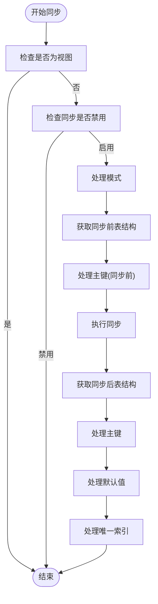
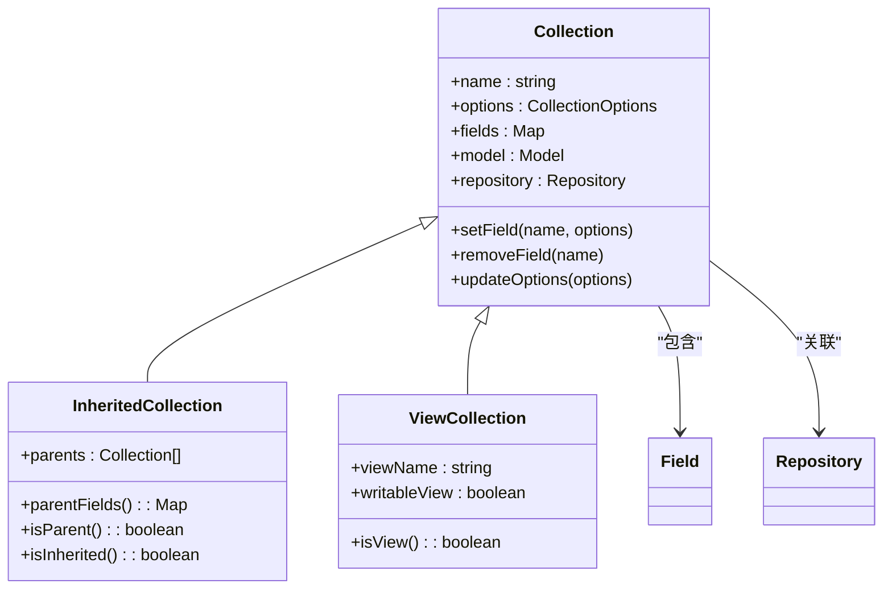
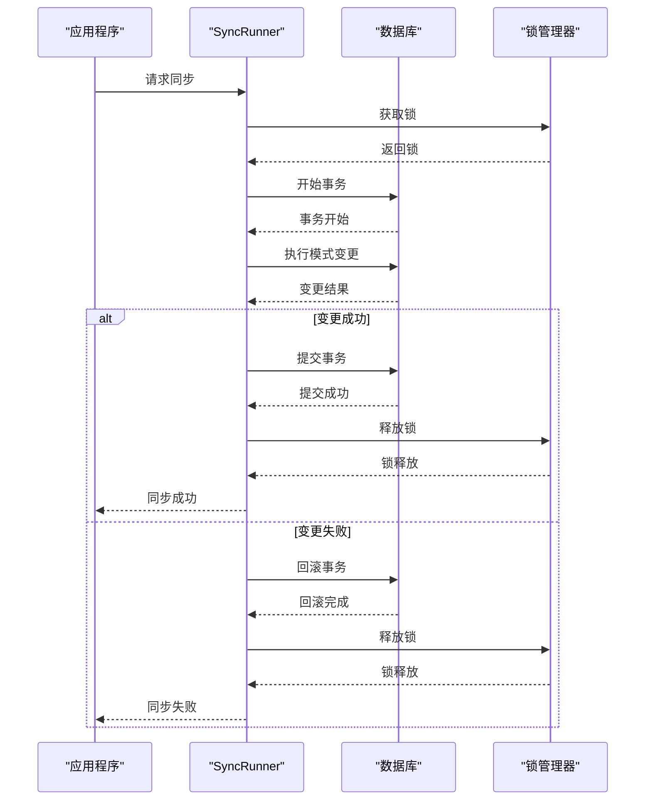

# 模式同步

<cite>
**本文档引用的文件**   
- [sync-runner.ts](file://packages\core\database\src\sync-runner.ts)
- [database.ts](file://packages\core\database\src\database.ts)
- [collection.ts](file://packages\core\database\src\collection.ts)
- [model.ts](file://packages\core\database\src\model.ts)
- [inherited-sync-runner.ts](file://packages\core\database\src\inherited-sync-runner.ts)
- [db-sync.ts](file://packages\core\server\src\commands\db-sync.ts)
- [lock-manager.ts](file://packages\core\lock-manager\src\lock-manager.ts)
</cite>

## 目录
1. [自动模式同步与手动迁移](#自动模式同步与手动迁移)
2. [SyncRunner工作原理](#syncrunner工作原理)
3. [复杂模式变更场景处理](#复杂模式变更场景处理)
4. [事务控制与并发处理](#事务控制与并发处理)
5. [生产环境最佳实践](#生产环境最佳实践)

## 自动模式同步与手动迁移

NocoBase提供了两种模式变更管理机制：自动模式同步和手动迁移。自动模式同步适用于开发环境和简单的模式变更，而手动迁移则更适合生产环境和复杂的模式变更场景。

自动模式同步通过`db:sync`命令触发，该命令会自动检测模型与数据库之间的差异并应用变更。这种方式简单快捷，但在生产环境中使用时需要谨慎，因为它可能会导致数据丢失或服务中断。

手动迁移则通过创建迁移文件来管理模式变更。每个迁移文件包含`up`和`down`方法，分别用于应用和回滚变更。这种方式提供了更好的控制和可追溯性，适合在生产环境中使用。

**Section sources**
- [db-sync.ts](file://packages\core\server\src\commands\db-sync.ts#L1-L41)

## SyncRunner工作原理

SyncRunner是NocoBase模式同步的核心组件，负责执行模型与数据库之间的同步操作。它通过比较模型定义和数据库实际结构来检测差异，并生成相应的变更计划。

SyncRunner的工作流程包括以下几个步骤：
1. 检查集合是否为视图或同步被禁用
2. 处理模式（schema）创建
3. 获取同步前的表结构描述
4. 执行主同步操作
5. 处理主键、默认值和唯一索引

**Diagram sources**
- [sync-runner.ts](file://packages\core\database\src\sync-runner.ts#L47-L97)

**Section sources**
- [sync-runner.ts](file://packages\core\database\src\sync-runner.ts#L19-L410)

## 复杂模式变更场景处理

NocoBase的模式同步机制能够处理多种复杂的模式变更场景，包括字段重命名、表结构调整和数据转换等。

对于字段重命名，系统通过元数据跟踪来确保数据的完整性。当字段被重命名时，系统会记录旧字段名和新字段名的映射关系，并在同步过程中正确处理数据迁移。

表结构调整的依赖分析通过`InheritanceMap`实现，它维护了集合之间的继承关系。当父集合发生变更时，系统会自动分析并处理所有子集合的相应变更。

**Diagram sources**
- [collection.ts](file://packages\core\database\src\collection.ts#L145-L800)

**Section sources**
- [collection.ts](file://packages\core\database\src\collection.ts#L489-L570)
- [inherited-sync-runner.ts](file://packages\core\database\src\inherited-sync-runner.ts#L13-L207)

## 事务控制与并发处理

NocoBase通过事务控制和锁机制来确保模式同步过程中的数据一致性和并发安全。

事务控制在同步过程中确保所有变更操作要么全部成功，要么全部回滚。系统使用数据库事务来包装模式变更操作，防止部分变更导致的数据不一致。

并发访问处理通过`LockManager`实现，它提供了分布式锁机制来防止多个实例同时执行模式同步。锁机制确保在同一时间只有一个实例可以执行模式变更操作。

**Diagram sources**
- [sync-runner.ts](file://packages\core\database\src\sync-runner.ts#L77-L91)
- [lock-manager.ts](file://packages\core\lock-manager\src\lock-manager.ts#L1-L169)

**Section sources**
- [sync-runner.ts](file://packages\core\database\src\sync-runner.ts#L77-L91)
- [lock-manager.ts](file://packages\core\lock-manager\src\lock-manager.ts#L1-L169)

## 生产环境最佳实践

在生产环境中执行模式变更时，应遵循以下最佳实践以确保系统的稳定性和数据的安全性：

1. **预检查**：在执行模式变更前，进行全面的预检查，包括备份现有数据、验证变更脚本和评估变更影响。

2. **备份策略**：始终在执行模式变更前创建完整的数据库备份。NocoBase的备份恢复插件提供了完整的备份解决方案。

3. **回滚计划**：为每个模式变更准备详细的回滚计划。确保能够快速恢复到变更前的状态。

4. **分阶段部署**：在生产环境中采用分阶段部署策略，先在预发布环境验证变更，再逐步推广到生产环境。

5. **监控与告警**：在模式变更过程中实施实时监控，设置关键指标的告警阈值，及时发现和处理异常情况。

6. **变更窗口**：选择业务低峰期执行模式变更，最小化对用户的影响。

7. **权限控制**：严格控制模式变更的执行权限，只有授权人员才能执行生产环境的模式变更操作。

**Section sources**
- [database.ts](file://packages\core\database\src\database.ts#L780-L797)
- [db-sync.ts](file://packages\core\server\src\commands\db-sync.ts#L19-L40)