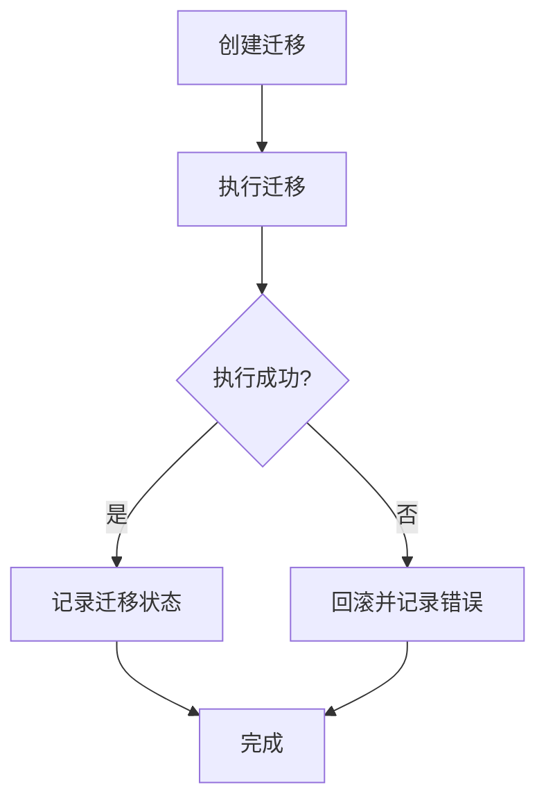
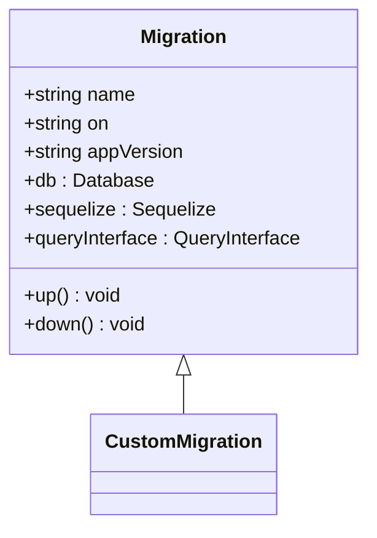
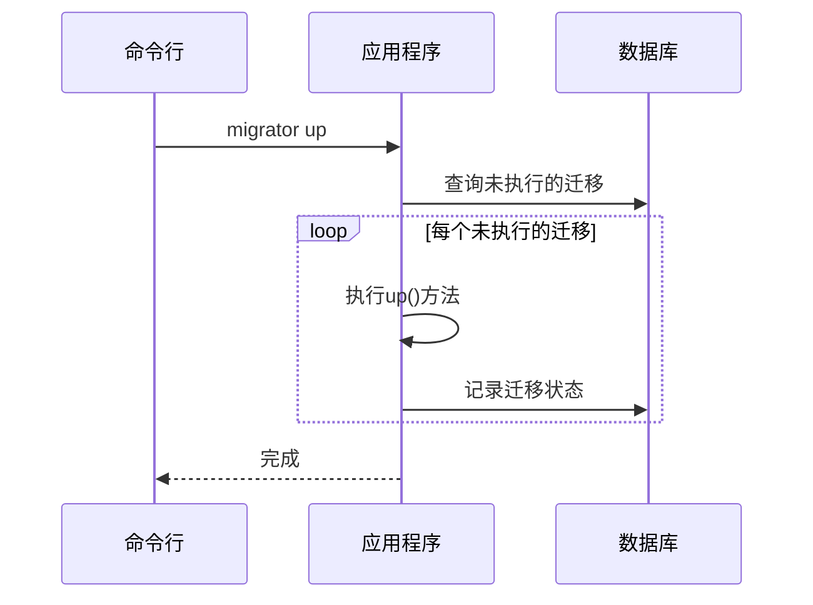
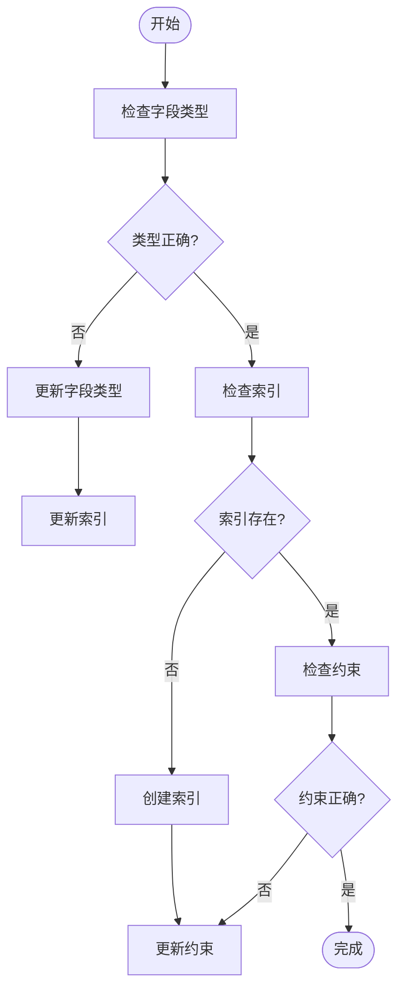
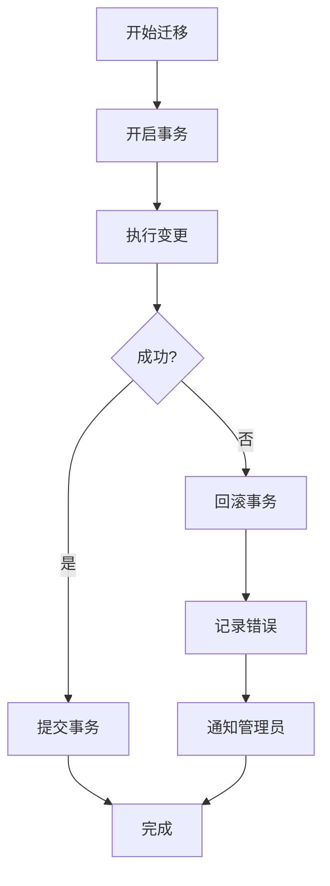

# 迁移管理

<cite>
**本文档中引用的文件**
- [migration.ts](file://packages/core/database/src/migration.ts)
- [database.ts](file://packages/core/database/src/database.ts)
- [migrator.ts](file://packages/core/server/src/commands/migrator.ts)
- [create-migration.ts](file://packages/core/server/src/commands/create-migration.ts)
- [add-migration.ts](file://examples/app/migrations/add-migration.ts)
- [20230912193824-package-name-unique.ts](file://packages/core/server/src/migrations/20230912193824-package-name-unique.ts)
- [20230912294620-update-pkg.ts](file://packages/core/server/src/migrations/20230912294620-update-pkg.ts)
- [20250613230000-clean-datasource-collection-schema.ts](file://packages/plugins/@nocobase/plugin-data-source-manager/src/server/migrations/20250613230000-clean-datasource-collection-schema.ts)
- [20221121111110-update-fk-type.ts](file://packages/plugins/@nocobase/plugin-data-source-main/src/server/migrations/20221121111110-update-fk-type.ts)
- [20221121111113-update-id-to-bigint.ts](file://packages/plugins/@nocobase/plugin-data-source-main/src/server/migrations/20221121111113-update-id-to-bigint.ts)
</cite>

## 目录
1. [简介](#简介)
2. [迁移生命周期管理](#迁移生命周期管理)
3. [迁移类结构与关键方法](#迁移类结构与关键方法)
4. [命令行工具管理迁移任务](#命令行工具管理迁移任务)
5. [复杂迁移脚本编写示例](#复杂迁移脚本编写示例)
6. [错误恢复策略与数据完整性保护](#错误恢复策略与数据完整性保护)
7. [总结](#总结)

## 简介
NocoBase的迁移管理系统提供了一套完整的数据库模式变更管理解决方案，支持迁移的创建、执行、回滚和状态跟踪。该系统基于Umzug库构建，与Sequelize ORM深度集成，确保数据库模式变更的安全性和可追溯性。迁移系统在应用启动的不同阶段（beforeLoad、afterSync、afterLoad）自动执行相应的迁移任务，保证数据库结构与应用代码的一致性。

**Section sources**
- [migration.ts](file://packages/core/database/src/migration.ts#L1-L104)
- [database.ts](file://packages/core/database/src/database.ts#L1-L1070)

## 迁移生命周期管理
NocoBase的迁移生命周期包括创建、执行、回滚和状态跟踪四个主要阶段。系统通过`Migrations`类管理所有迁移任务，使用`Umzug`作为底层迁移引擎。迁移文件按时间戳命名（如`20230912193824-package-name-unique.ts`），确保执行顺序的确定性。

迁移执行时，系统会自动在`_migrations`表中记录已执行的迁移，防止重复执行。回滚操作通过调用迁移类的`down()`方法实现，允许将数据库恢复到先前状态。迁移的状态跟踪机制确保了在分布式环境中迁移操作的一致性。

**Diagram sources**
- [migration.ts](file://packages/core/database/src/migration.ts#L59-L103)
- [database.ts](file://packages/core/database/src/database.ts#L323-L333)

**Section sources**
- [migration.ts](file://packages/core/database/src/migration.ts#L59-L103)
- [database.ts](file://packages/core/database/src/database.ts#L321-L373)

## 迁移类结构与关键方法
迁移系统的核心是`Migration`基类，所有具体的迁移都继承自该类。`Migration`类提供了`up()`和`down()`两个关键方法，分别用于执行和回滚迁移操作。`up()`方法包含正向变更逻辑，如创建表、添加字段、修改索引等；`down()`方法则包含逆向操作，确保可以安全回滚。

迁移类还提供了丰富的上下文属性，包括`db`（数据库实例）、`queryInterface`（查询接口）、`sequelize`（Sequelize实例）等，方便在迁移中执行各种数据库操作。通过`on`属性可以指定迁移的执行时机（beforeLoad、afterSync、afterLoad），`appVersion`属性用于版本控制。

**Diagram sources**
- [migration.ts](file://packages/core/database/src/migration.ts#L21-L49)
- [migration.ts](file://packages/core/server/src/migration.ts#L17-L34)

**Section sources**
- [migration.ts](file://packages/core/database/src/migration.ts#L21-L49)
- [migration.ts](file://packages/core/server/src/migration.ts#L17-L34)

## 命令行工具管理迁移任务
NocoBase提供了强大的命令行工具来管理迁移任务。通过`migrator`命令可以执行迁移的创建、执行和回滚操作。`create-migration`命令用于生成新的迁移文件，自动填充基本结构和元数据。

迁移状态检查通过查询`_migrations`表实现，可以查看哪些迁移已经执行，哪些尚未执行。特定迁移执行支持通过名称或时间戳指定单个迁移进行操作。批量迁移处理则按顺序执行所有未完成的迁移，确保数据库模式的完整更新。

**Diagram sources**
- [migrator.ts](file://packages/core/server/src/commands/migrator.ts#L14-L24)
- [create-migration.ts](file://packages/core/server/src/commands/create-migration.ts#L17-L57)

**Section sources**
- [migrator.ts](file://packages/core/server/src/commands/migrator.ts#L14-L24)
- [create-migration.ts](file://packages/core/server/src/commands/create-migration.ts#L17-L57)

## 复杂迁移脚本编写示例
复杂的迁移脚本通常涉及字段类型变更、索引创建和约束修改等操作。例如，在`20221121111110-update-fk-type.ts`迁移中，系统遍历所有关联字段，将外键字段类型更新为`bigInt`，同时更新相应的集合字段配置。

索引创建和约束修改通常通过`queryInterface.addIndex()`和`queryInterface.addConstraint()`方法实现。对于涉及多个表的复杂变更，建议使用事务确保操作的原子性。字段类型变更需要特别注意数据兼容性，避免数据丢失。

**Diagram sources**
- [20221121111110-update-fk-type.ts](file://packages/plugins/@nocobase/plugin-data-source-main/src/server/migrations/20221121111110-update-fk-type.ts#L126-L163)
- [20250613230000-clean-datasource-collection-schema.ts](file://packages/plugins/@nocobase/plugin-data-source-manager/src/server/migrations/20250613230000-clean-datasource-collection-schema.ts#L40-L59)

**Section sources**
- [20221121111110-update-fk-type.ts](file://packages/plugins/@nocobase/plugin-data-source-main/src/server/migrations/20221121111110-update-fk-type.ts#L126-L163)
- [20221121111113-update-id-to-bigint.ts](file://packages/plugins/@nocobase/plugin-data-source-main/src/server/migrations/20221121111113-update-id-to-bigint.ts#L165-L208)

## 错误恢复策略与数据完整性保护
迁移过程中的错误恢复策略至关重要。NocoBase在执行迁移时使用事务确保操作的原子性，任何失败的操作都会自动回滚。系统捕获并处理特定的数据库错误（如"cannot alter inherited column"），允许跳过不可变的字段而继续执行其他迁移。

数据完整性保护通过多种机制实现：在`beforeDestroy`钩子中执行引用完整性检查，防止删除被引用的记录；使用`SET FOREIGN_KEY_CHECKS = 0`临时禁用外键约束进行结构变更；在迁移前后验证数据一致性。对于生产环境，建议在执行重大迁移前备份数据库。

**Diagram sources**
- [20220704225714-drop-foreign-keys.ts](file://packages/plugins/@nocobase/plugin-data-source-main/src/server/migrations/20220704225714-drop-foreign-keys.ts#L36-L60)
- [20250316100513-change-table-name.ts](file://packages/plugins/@nocobase/plugin-workflow-manual/src/server/migrations/20250316100513-change-table-name.ts#L109-L128)

**Section sources**
- [20220704225714-drop-foreign-keys.ts](file://packages/plugins/@nocobase/plugin-data-source-main/src/server/migrations/20220704225714-drop-foreign-keys.ts#L36-L60)
- [20250316100513-change-table-name.ts](file://packages/plugins/@nocobase/plugin-workflow-manual/src/server/migrations/20250316100513-change-table-name.ts#L109-L128)

## 总结
NocoBase的迁移管理系统提供了一套完整、可靠的数据库模式变更管理方案。通过清晰的生命周期管理、灵活的迁移类设计、强大的命令行工具和完善的错误恢复机制，确保了数据库变更的安全性和可维护性。开发者可以基于这套系统高效地管理复杂的数据库模式演进，同时保障数据的完整性和系统的稳定性。