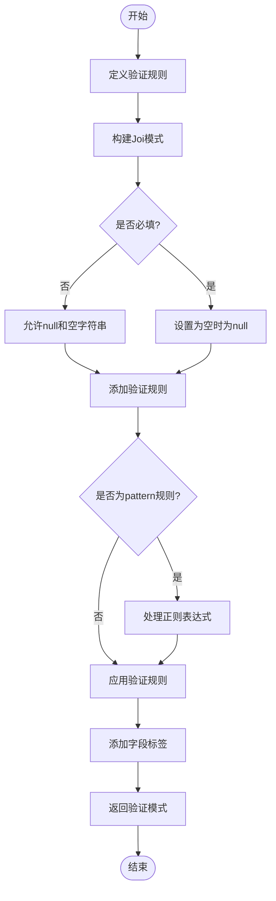
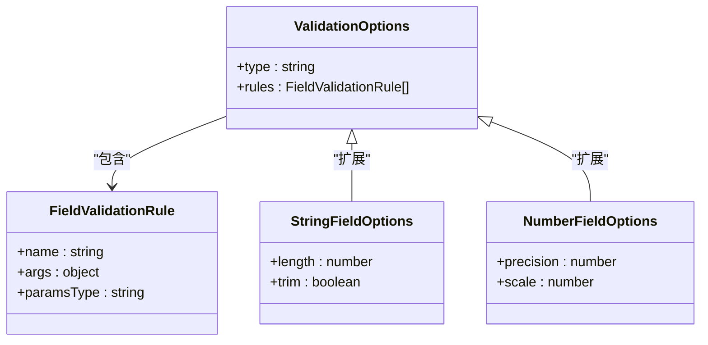
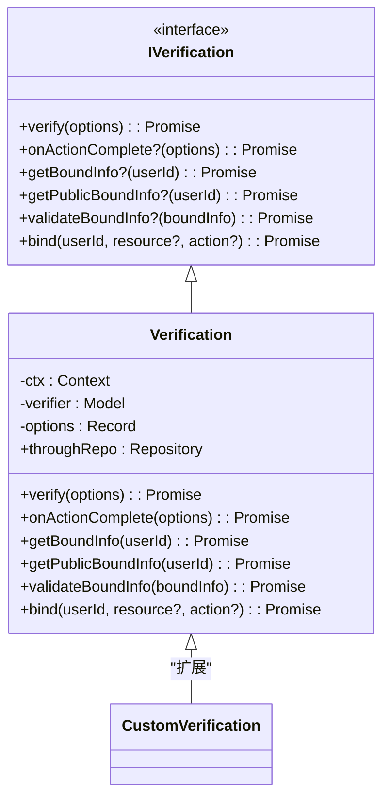
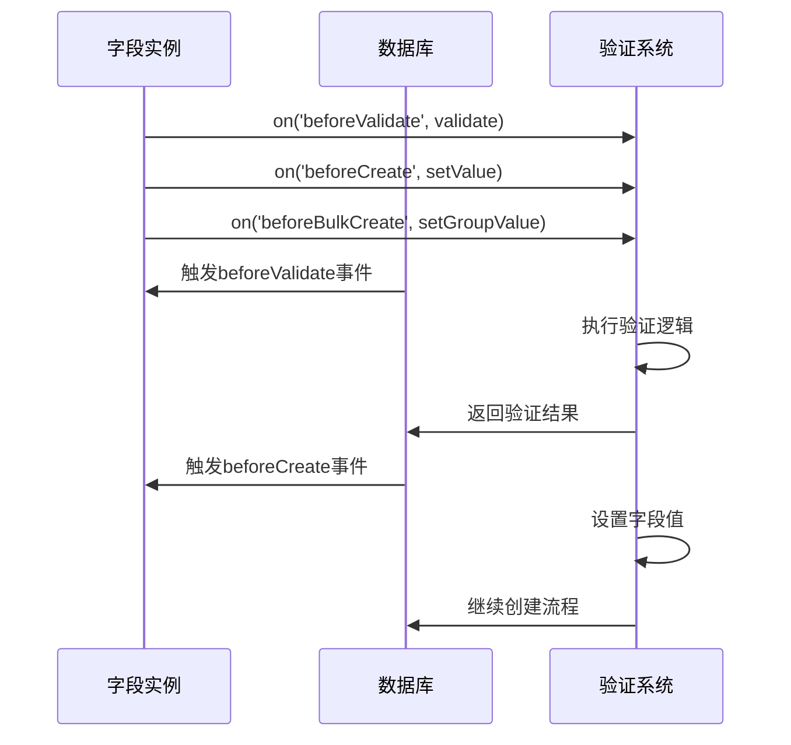
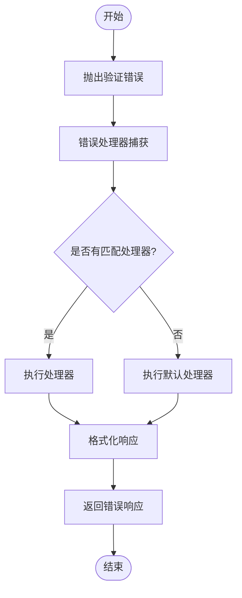
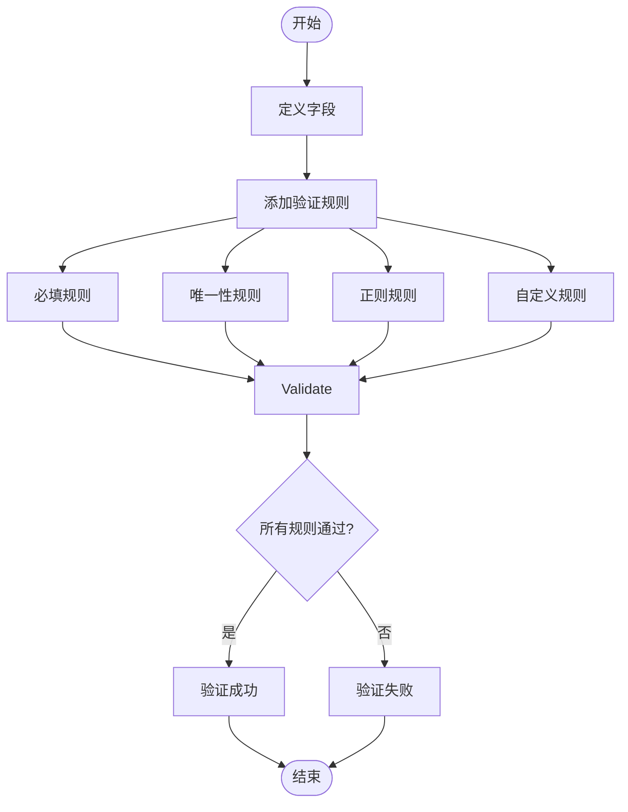
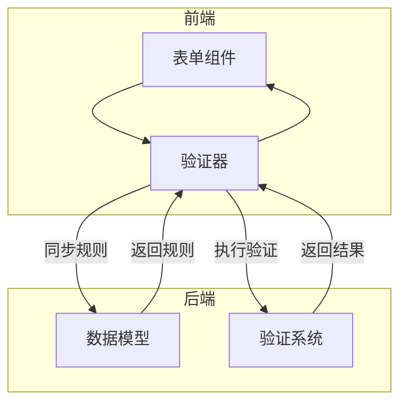

# 数据验证

<cite>
**本文档引用的文件**
- [field-validation.ts](file://packages\core\database\src\utils\field-validation.ts)
- [field.ts](file://packages\core\database\src\fields\field.ts)
- [verification.ts](file://packages\plugins\@nocobase\plugin-verification\src\server\verification.ts)
- [verification-manager.ts](file://packages\plugins\@nocobase\plugin-verification\src\server\verification-manager.ts)
- [error-handler.ts](file://packages\plugins\@nocobase\plugin-error-handler\src\server\error-handler.ts)
- [zh-CN.json](file://packages\plugins\@nocobase\plugin-error-handler\src\server\locale\zh-CN.json)
- [input.ts](file://packages\core\client\src\collection-manager\interfaces\input.ts)
- [constants.ts](file://packages\core\client\src\collection-manager\constants.ts)
</cite>

## 目录
1. [简介](#简介)
2. [基于模型定义的声明式验证系统](#基于模型定义的声明式验证系统)
3. [内置验证规则实现机制](#内置验证规则实现机制)
4. [自定义验证逻辑实现方式](#自定义验证逻辑实现方式)
5. [验证钩子函数执行机制](#验证钩子函数执行机制)
6. [验证错误处理流程](#验证错误处理流程)
7. [错误信息国际化支持](#错误信息国际化支持)
8. [复杂业务规则验证示例](#复杂业务规则验证示例)
9. [前端表单验证协同机制](#前端表单验证协同机制)

## 简介
NocoBase提供了一套完整的数据验证机制，通过声明式配置实现数据完整性保障。该机制基于模型定义，在数据操作的不同阶段执行验证规则，确保数据质量。系统支持内置验证规则和自定义验证逻辑，通过钩子函数在数据操作生命周期中执行验证，并提供完善的错误处理和国际化支持。

## 基于模型定义的声明式验证系统
NocoBase的数据验证系统基于模型字段定义实现声明式验证。验证规则直接定义在字段配置中，通过`validation`属性指定验证类型和规则。系统使用Joi库构建验证模式，将声明式规则转换为可执行的验证逻辑。

验证系统的核心是`buildJoiSchema`函数，它接收验证选项和字段上下文，生成对应的Joi验证模式。该函数根据字段类型创建基础验证模式，然后根据规则数组添加具体的验证约束。



**图示来源**
- [field-validation.ts](file://packages\core\database\src\utils\field-validation.ts#L14-L57)

**本节来源**
- [field-validation.ts](file://packages\core\database\src\utils\field-validation.ts#L14-L57)
- [field.ts](file://packages\core\database\src\fields\field.ts#L42-L46)

## 内置验证规则实现机制
NocoBase提供了多种内置验证规则，包括必填、唯一性、格式验证等。这些规则通过字段的`rules`数组配置，每个规则包含名称和参数。

### 必填验证
必填验证通过`required`规则实现。当字段配置了`required`规则时，验证模式会设置`empty(null)`，确保字段值不能为空。

### 唯一性验证
唯一性验证由数据库层面实现。当字段配置了`unique`属性时，数据库会创建唯一约束。验证失败时抛出"unique violation"异常。

### 格式验证
格式验证支持多种类型，包括字符串长度、数值范围、日期比较等。系统根据字段类型提供相应的验证规则：
- 字符串类型：支持`min`、`max`、`length`、`pattern`等规则
- 数值类型：支持`min`、`max`、`greater`、`less`等规则
- 日期类型：支持`min`、`max`、`greater`、`less`等规则



**图示来源**
- [field.ts](file://packages\core\database\src\fields\field.ts#L42-L46)
- [string-field.ts](file://packages\core\database\src\fields\string-field.ts#L43-L47)

**本节来源**
- [field-validation.ts](file://packages\core\database\src\utils\field-validation.ts#L24-L49)
- [constants.ts](file://packages\core\client\src\collection-manager\constants.ts#L205-L274)

## 自定义验证逻辑实现方式
NocoBase支持通过自定义验证器实现复杂的业务规则验证。自定义验证逻辑通过继承`Verification`抽象类实现，该类定义了验证的核心接口。

自定义验证器需要实现`verify`方法，该方法接收验证上下文和参数，返回验证结果。验证器还可以实现`onActionComplete`方法，在验证成功后执行后续操作。



**图示来源**
- [verification.ts](file://packages\plugins\@nocobase\plugin-verification\src\server\verification.ts#L13-L82)

**本节来源**
- [verification.ts](file://packages\plugins\@nocobase\plugin-verification\src\server\verification.ts#L38-L82)

## 验证钩子函数执行机制
NocoBase通过事件钩子在数据操作的不同阶段执行验证。字段类提供了`bind`和`unbind`方法，用于注册和注销验证钩子。

验证钩子在以下阶段执行：
- `beforeValidate`：数据验证前
- `beforeCreate`：创建记录前
- `beforeUpdate`：更新记录前
- `beforeDestroy`：删除记录前



**图示来源**
- [sequence-field.ts](file://packages\plugins\@nocobase\plugin-field-sequence\src\server\fields\sequence-field.ts#L545-L557)

**本节来源**
- [field.ts](file://packages\core\database\src\fields\field.ts#L108-L116)
- [sequence-field.ts](file://packages\plugins\@nocobase\plugin-field-sequence\src\server\fields\sequence-field.ts#L545-L557)

## 验证错误处理流程
NocoBase的验证错误处理通过错误处理器实现。当验证失败时，系统抛出相应的错误，由错误处理器捕获并格式化错误响应。

错误处理流程如下：
1. 验证失败抛出错误
2. 错误处理器捕获错误
3. 根据错误类型选择处理策略
4. 格式化错误响应
5. 返回客户端



**图示来源**
- [error-handler.ts](file://packages\plugins\@nocobase\plugin-error-handler\src\server\error-handler.ts#L10-L68)

**本节来源**
- [error-handler.ts](file://packages\plugins\@nocobase\plugin-error-handler\src\server\error-handler.ts#L10-L68)

## 错误信息国际化支持
NocoBase提供完整的错误信息国际化支持。系统通过多语言文件定义不同语言的错误消息模板，支持字段占位符替换。

错误消息模板使用`{{field}}`语法引用字段名称，确保错误信息的上下文相关性。系统支持多种语言，包括中文、英文、法文等。

```mermaid
erDiagram
LOCALE ||--o{ ERROR_MESSAGE : "包含"
LOCALE {
string code PK
string name
}
ERROR_MESSAGE {
string key PK
string message
locale_code FK
}
LOCALE ||--o{ ERROR_MESSAGE : "包含"
```

**图示来源**
- [zh-CN.json](file://packages\plugins\@nocobase\plugin-error-handler\src\server\locale\zh-CN.json#L1-L5)
- [en-US.json](file://packages\plugins\@nocobase\plugin-error-handler\src\server\locale\en-US.json#L1-L6)

**本节来源**
- [zh-CN.json](file://packages\plugins\@nocobase\plugin-error-handler\src\server\locale\zh-CN.json#L1-L5)
- [en-US.json](file://packages\plugins\@nocobase\plugin-error-handler\src\server\locale\en-US.json#L1-L6)

## 复杂业务规则验证示例
以下示例展示如何实现复杂的业务规则验证：



**图示来源**
- [input.ts](file://packages\core\client\src\collection-manager\interfaces\input.ts#L33-L41)

**本节来源**
- [input.ts](file://packages\core\client\src\collection-manager\interfaces\input.ts#L33-L41)
- [constants.ts](file://packages\core\client\src\collection-manager\constants.ts#L179-L274)

## 前端表单验证协同机制
NocoBase的前端表单验证与后端验证机制协同工作。前端使用Formily框架实现表单验证，验证规则从后端模型定义同步。

协同机制特点：
- 验证规则双向同步
- 前后端验证逻辑一致
- 错误信息统一管理
- 实时验证反馈



**图示来源**
- [input.ts](file://packages\core\client\src\collection-manager\interfaces\input.ts#L12-L15)

**本节来源**
- [input.ts](file://packages\core\client\src\collection-manager\interfaces\input.ts#L12-L15)
- [field-validation.ts](file://packages\core\database\src\utils\field-validation.ts#L14-L57)