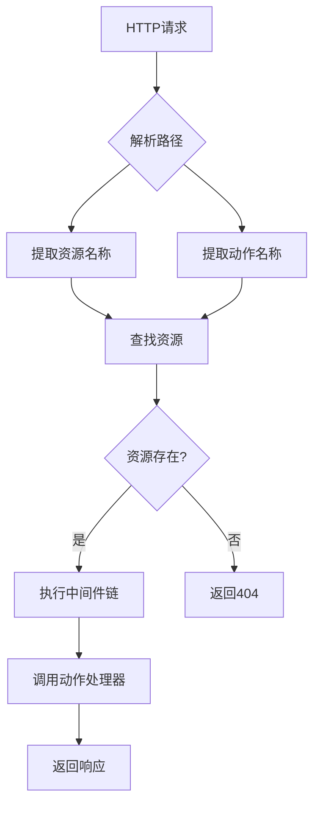
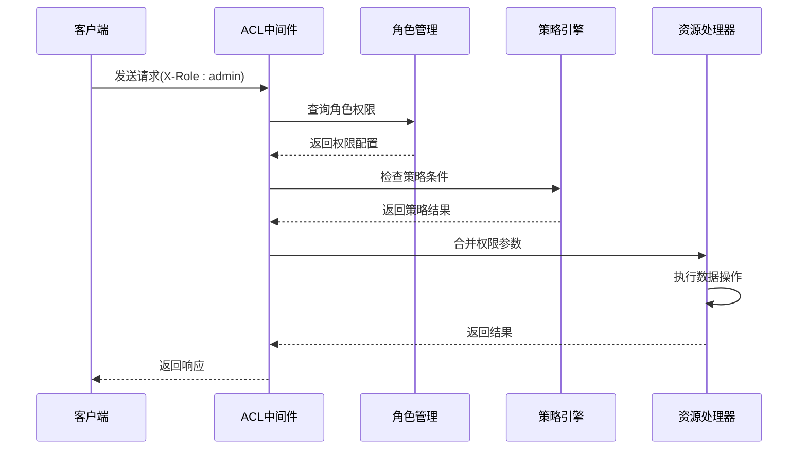
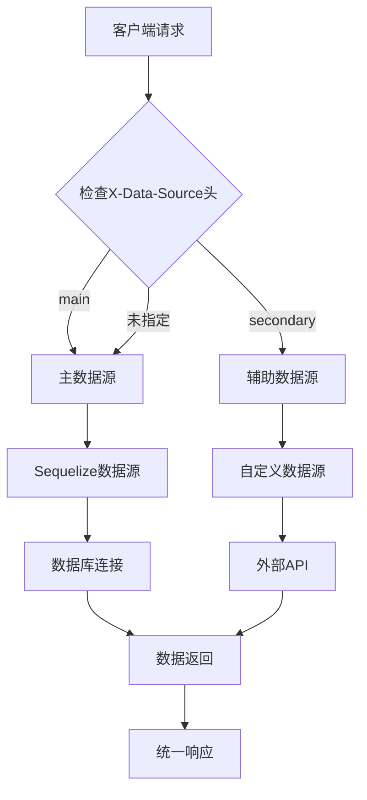

# 核心概念

<cite>
**本文档中引用的文件**  
- [index.ts](file://packages/core/app/src/index.ts)
- [resourcer.ts](file://packages/core/resourcer/src/resourcer.ts)
- [acl.ts](file://packages/core/acl/src/acl.ts)
- [data-source-manager.ts](file://packages/core/data-source-manager/src/data-source-manager.ts)
- [application.ts](file://packages/core/server/src/application.ts)
- [simple.ts](file://examples/app/resource-actions/simple.ts)
- [acl.ts](file://examples/app/acl.ts)
- [multi-app.ts](file://examples/app/multi-app.ts)
</cite>

## 目录
1. [微内核架构](#微内核架构)
2. [数据模型驱动范式](#数据模型驱动范式)
3. [资源管理器（Resourcer）](#资源管理器resourcer)
4. [访问控制列表（ACL）系统](#访问控制列表acl系统)
5. [多数据源支持](#多数据源支持)

## 微内核架构

NocoBase采用微内核架构设计，其核心理念是将系统分解为一个精简的核心内核和多个可插拔的插件。这种架构通过核心模块提供基础服务，而具体功能则由插件实现，从而实现了高度的可扩展性和灵活性。

核心模块包括应用管理、插件管理、资源管理、权限控制等基础服务。这些服务构成了系统的骨架，为插件提供了运行环境和接口。插件系统则允许开发者通过添加插件来扩展系统功能，而无需修改核心代码。

在NocoBase中，微内核架构通过`Application`类实现，该类作为系统的核心容器，负责管理插件生命周期、配置加载和系统初始化。插件通过`PluginManager`进行注册和管理，每个插件都可以定义自己的路由、服务和数据模型。

微内核架构的优势在于：
- **可扩展性**：通过插件机制轻松添加新功能
- **可维护性**：核心与功能分离，降低系统复杂度
- **灵活性**：可以根据需求定制功能组合
- **升级安全性**：核心升级不影响插件功能

**Section sources**
- [application.ts](file://packages/core/server/src/application.ts#L217-L800)
- [index.ts](file://packages/core/app/src/index.ts#L1-L22)

## 数据模型驱动范式

NocoBase采用数据模型驱动的开发范式，将数据结构与用户界面分离设计。这种设计原则使得系统能够根据数据模型自动生成相应的API接口和管理界面，大大提高了开发效率。

数据模型驱动的核心是`Database`模块，它负责管理数据集合（Collection）和字段（Field）的定义。每个数据集合都包含一组字段定义，这些定义不仅描述了数据结构，还包含了验证规则、默认值等元数据信息。

数据模型与界面分离的设计体现在：
- **数据层**：通过`Collection`和`Field`类定义数据结构
- **服务层**：通过`Repository`提供数据访问接口
- **表现层**：根据数据模型自动生成API和UI组件

这种分离设计的优势包括：
- **一致性**：数据模型变更自动反映到API和界面
- **可维护性**：集中管理数据定义，避免重复代码
- **灵活性**：支持动态修改数据结构
- **可扩展性**：易于添加新的数据类型和验证规则

**Section sources**
- [application.ts](file://packages/core/server/src/application.ts#L352-L359)
- [index.ts](file://packages/core/database/src/index.ts#L1-L66)

## 资源管理器（Resourcer）

资源管理器（Resourcer）是NocoBase中统一处理API请求的核心组件。它采用资源-动作模式，将API请求映射到相应的资源操作上，实现了RESTful风格的API设计。

Resourcer的核心功能包括：
- **路由解析**：将HTTP请求路径解析为资源名称和动作
- **中间件管理**：支持插件式中间件，用于请求预处理和后处理
- **动作执行**：调用相应的处理器函数处理请求
- **参数合并**：智能合并路径参数、查询参数和请求体

Resourcer的工作机制基于`ResourceManager`类，它维护了一个资源注册表，每个资源都关联一组动作处理器。当收到API请求时，Resourcer会：
1. 解析请求路径，提取资源名称和动作
2. 查找对应的资源和动作处理器
3. 执行中间件链进行权限验证等预处理
4. 调用动作处理器处理业务逻辑
5. 返回处理结果

**Diagram sources**
- [resourcer.ts](file://packages/core/resourcer/src/resourcer.ts#L161-L430)
- [simple.ts](file://examples/app/resource-actions/simple.ts#L1-L48)

**Section sources**
- [resourcer.ts](file://packages/core/resourcer/src/resourcer.ts#L161-L430)
- [simple.ts](file://examples/app/resource-actions/simple.ts#L1-L48)

## 访问控制列表（ACL）系统

NocoBase的访问控制列表（ACL）系统提供了一套完整的权限管理机制，包括角色、策略和权限检查的实现。该系统基于声明式权限控制，允许细粒度的访问控制。

ACL系统的核心组件包括：
- **角色管理**：通过`ACLRole`类管理不同用户角色
- **策略定义**：通过`ACLAvaliableStrategy`定义权限策略
- **权限检查**：在请求处理过程中进行权限验证
- **固定参数**：为特定操作设置固定的过滤条件

权限模型的工作流程：
1. 用户请求到达时，通过中间件识别用户角色
2. 根据角色查找对应的权限配置
3. 合并角色权限和资源策略
4. 将权限参数应用到数据查询中
5. 执行权限检查并返回结果

ACL系统支持多种权限控制方式：
- **字段级控制**：限制可访问的字段
- **记录级控制**：基于条件过滤可访问的记录
- **动作级控制**：控制可执行的操作类型
- **片段控制**：通过权限片段管理复杂权限逻辑

**Diagram sources**
- [acl.ts](file://packages/core/acl/src/acl.ts#L66-L603)
- [acl.ts](file://examples/app/acl.ts#L1-L70)

**Section sources**
- [acl.ts](file://packages/core/acl/src/acl.ts#L66-L603)
- [acl.ts](file://examples/app/acl.ts#L1-L70)

## 多数据源支持

NocoBase通过数据源管理器（DataSourceManager）实现了多数据源支持的架构设计。这种设计允许系统同时连接多个数据库实例，并通过插件机制扩展数据源类型。

多数据源架构的核心特点：
- **数据源注册**：通过`DataSourceManager`管理多个数据源实例
- **类型扩展**：支持通过插件添加新的数据源类型
- **请求路由**：根据请求头中的数据源标识路由到相应实例
- **统一接口**：为不同数据源提供一致的访问接口

数据源管理器的工作机制：
1. 初始化时注册支持的数据源类型
2. 根据配置创建并管理数据源实例
3. 通过中间件识别请求对应的数据源
4. 将请求路由到相应的数据源处理器
5. 统一处理连接管理和错误处理

通过插件扩展数据源类型的方式：
- 实现自定义的`DataSource`类
- 在插件初始化时注册到`DataSourceManager`
- 提供特定于数据源的配置和连接逻辑
- 实现数据源特定的查询优化

**Diagram sources**
- [data-source-manager.ts](file://packages/core/data-source-manager/src/data-source-manager.ts#L23-L136)
- [multi-app.ts](file://examples/app/multi-app.ts#L1-L71)

**Section sources**
- [data-source-manager.ts](file://packages/core/data-source-manager/src/data-source-manager.ts#L23-L136)
- [multi-app.ts](file://examples/app/multi-app.ts#L1-L71)