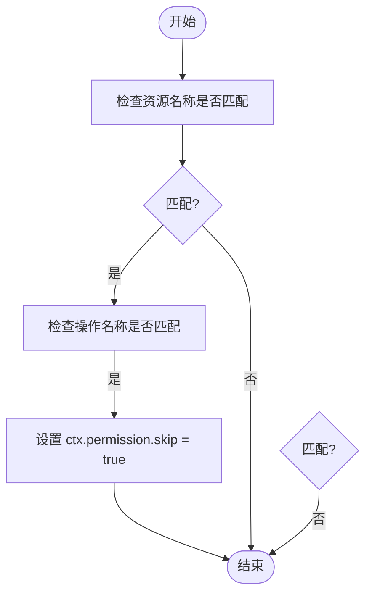
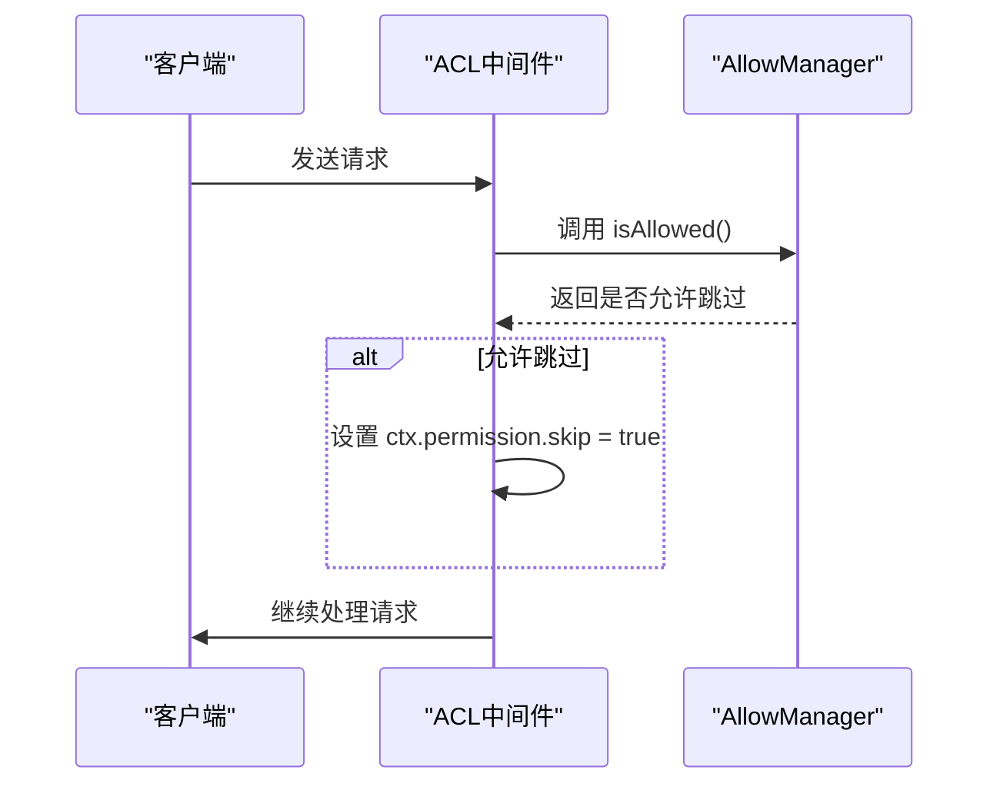
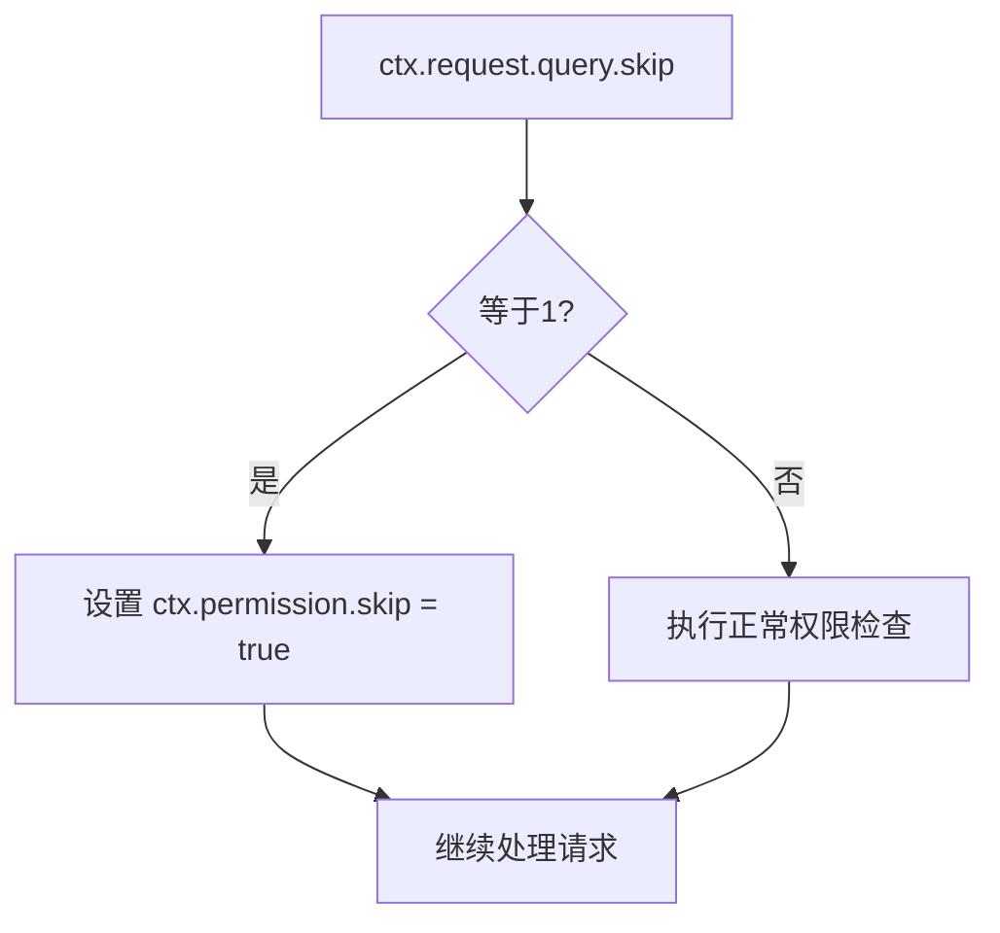

# 中间件机制

<cite>
**本文档中引用的文件**  
- [skip-middleware.ts](file://packages/core/acl/src/skip-middleware.ts)
- [allow-manager.ts](file://packages/core/acl/src/allow-manager.ts)
- [acl.ts](file://packages/core/acl/src/acl.ts)
- [index.ts](file://packages/core/acl/src/index.ts)
- [skip-middleware.test.ts](file://packages/core/acl/src/__tests__/skip-middleware.test.ts)
- [allow-manager.test.ts](file://packages/core/acl/src/__tests__/allow-manager.test.ts)
- [acl.ts](file://examples/app/middleware/acl.ts)
- [middleware.test.ts](file://packages/plugins/@nocobase/plugin-acl/src/server/__tests__/middleware.test.ts)
</cite>

## 目录
1. [介绍](#介绍)
2. [SkipMiddleware的设计目的与实现原理](#skipmiddleware的设计目的与实现原理)
3. [AllowManager与中间件的协同工作](#allowmanager与中间件的协同工作)
4. [插件开发中的使用示例](#插件开发中的使用示例)
5. [中间件执行顺序对权限检查的影响](#中间件执行顺序对权限检查的影响)
6. [安全边界与潜在风险点](#安全边界与潜在风险点)
7. [最佳实践建议](#最佳实践建议)
8. [总结](#总结)

## 介绍
NocoBase 是一个低代码平台，其权限系统通过中间件机制实现灵活的访问控制。本文档深入探讨了权限中间件的核心组件，特别是 `SkipMiddleware` 和 `AllowManager` 的设计与实现。我们将详细解释在何种情况下需要跳过权限检查，如何通过 `AllowManager` 实现灵活的权限绕过策略，并提供代码示例展示如何在插件开发中使用这些机制。此外，我们还将讨论中间件执行顺序对权限检查的影响，分析安全边界和潜在的风险点，并给出最佳实践建议。

**Section sources**
- [acl.ts](file://packages/core/acl/src/acl.ts#L1-L603)

## SkipMiddleware的设计目的与实现原理
`SkipMiddleware` 的主要设计目的是允许在特定条件下跳过权限检查，从而实现更灵活的访问控制策略。该中间件通过检查请求的资源名称和操作名称是否匹配预定义的条件来决定是否跳过权限验证。

在实现上，`SkipMiddleware` 接收一个包含 `resourceName` 和 `actionName` 的选项对象。当请求的资源和操作与这些选项匹配时，中间件会在上下文（`ctx`）中设置 `permission.skip = true`，从而通知后续的权限检查逻辑跳过验证。

**Diagram sources**
- [skip-middleware.ts](file://packages/core/acl/src/skip-middleware.ts#L10-L25)

**Section sources**
- [skip-middleware.ts](file://packages/core/acl/src/skip-middleware.ts#L1-L26)

## AllowManager与中间件的协同工作
`AllowManager` 是权限系统的核心组件之一，负责管理哪些操作可以被跳过权限检查。它通过 `isAllowed` 方法判断当前请求是否应该跳过权限验证。该方法会检查预注册的条件函数或布尔值，如果满足条件，则返回 `true`。

`AllowManager` 与中间件的协同工作体现在 `aclMiddleware` 方法中。该方法作为中间件链的一部分，在请求处理流程中被调用。它会调用 `isAllowed` 方法，并根据结果决定是否设置 `ctx.permission.skip = true`。

**Diagram sources**
- [allow-manager.ts](file://packages/core/acl/src/allow-manager.ts#L96-L111)
- [acl.ts](file://packages/core/acl/src/acl.ts#L124-L127)

**Section sources**
- [allow-manager.ts](file://packages/core/acl/src/allow-manager.ts#L1-L112)
- [acl.ts](file://packages/core/acl/src/acl.ts#L124-L127)

## 插件开发中的使用示例
在插件开发中，开发者可以通过 `app.acl.use` 方法注册自定义中间件，以实现特定的权限绕过逻辑。例如，以下示例展示了如何根据查询参数 `skip` 的值来决定是否跳过权限检查：

**Diagram sources**
- [acl.ts](file://examples/app/middleware/acl.ts#L43-L60)

**Section sources**
- [acl.ts](file://examples/app/middleware/acl.ts#L1-L88)

## 中间件执行顺序对权限检查的影响
中间件的执行顺序对权限检查有重要影响。NocoBase 使用 `Toposort` 来管理中间件的依赖关系，确保中间件按正确的顺序执行。`allowManager` 的中间件被标记为在 `core` 组之前执行，这保证了权限跳过逻辑在核心权限检查之前被处理。

如果中间件顺序不当，可能会导致权限检查失效或出现安全漏洞。因此，开发者在添加自定义中间件时必须注意其执行顺序。

**Section sources**
- [acl.ts](file://packages/core/acl/src/acl.ts#L124-L127)
- [middleware.ts](file://packages/core/resourcer/src/middleware.ts#L33-L92)

## 安全边界与潜在风险点
尽管 `SkipMiddleware` 提供了灵活性，但也带来了潜在的安全风险。主要风险包括：
- **过度授权**：如果条件设置过于宽松，可能导致未授权用户访问敏感资源。
- **逻辑漏洞**：复杂的条件判断可能引入逻辑错误，导致权限绕过。
- **中间件顺序问题**：不正确的中间件顺序可能导致权限检查被意外跳过。

为避免这些风险，应严格限制 `SkipMiddleware` 的使用范围，并进行充分的测试。

**Section sources**
- [skip-middleware.ts](file://packages/core/acl/src/skip-middleware.ts#L10-L25)
- [allow-manager.ts](file://packages/core/acl/src/allow-manager.ts#L74-L94)

## 最佳实践建议
为了安全有效地使用权限中间件机制，建议遵循以下最佳实践：
1. **最小权限原则**：仅在必要时使用 `SkipMiddleware`，并尽可能缩小其作用范围。
2. **明确条件**：确保跳过权限检查的条件清晰且不易被滥用。
3. **充分测试**：对所有权限相关逻辑进行彻底的单元测试和集成测试。
4. **监控与审计**：记录所有权限跳过事件，以便进行安全审计。
5. **定期审查**：定期审查权限配置，确保其符合当前的安全策略。

**Section sources**
- [allow-manager.test.ts](file://packages/core/acl/src/__tests__/allow-manager.test.ts#L1-L29)
- [skip-middleware.test.ts](file://packages/core/acl/src/__tests__/skip-middleware.test.ts#L1-L40)

## 总结
NocoBase 的权限中间件机制通过 `SkipMiddleware` 和 `AllowManager` 提供了灵活的权限控制能力。理解其设计原理和实现细节对于开发安全可靠的插件至关重要。通过遵循最佳实践，开发者可以在保证灵活性的同时，维护系统的安全性。

**Section sources**
- [acl.ts](file://packages/core/acl/src/acl.ts#L1-L603)
- [allow-manager.ts](file://packages/core/acl/src/allow-manager.ts#L1-L112)