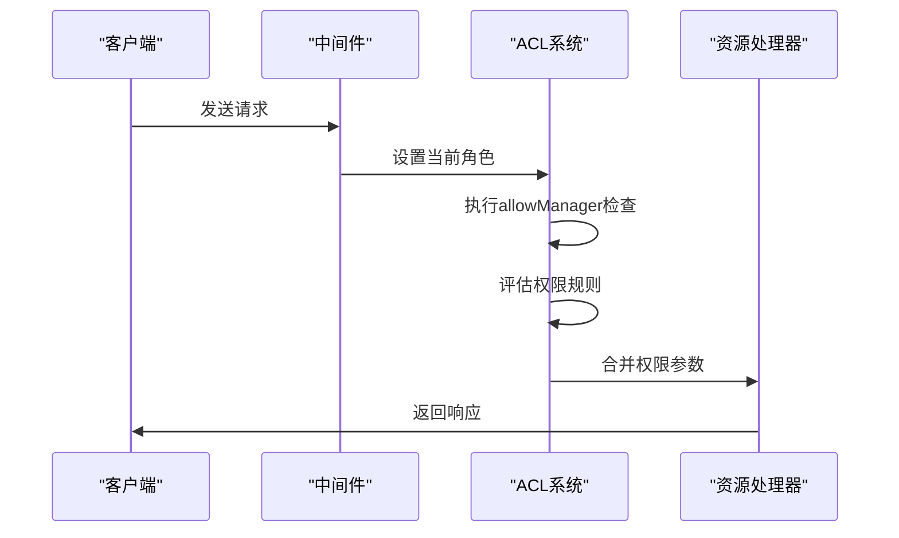
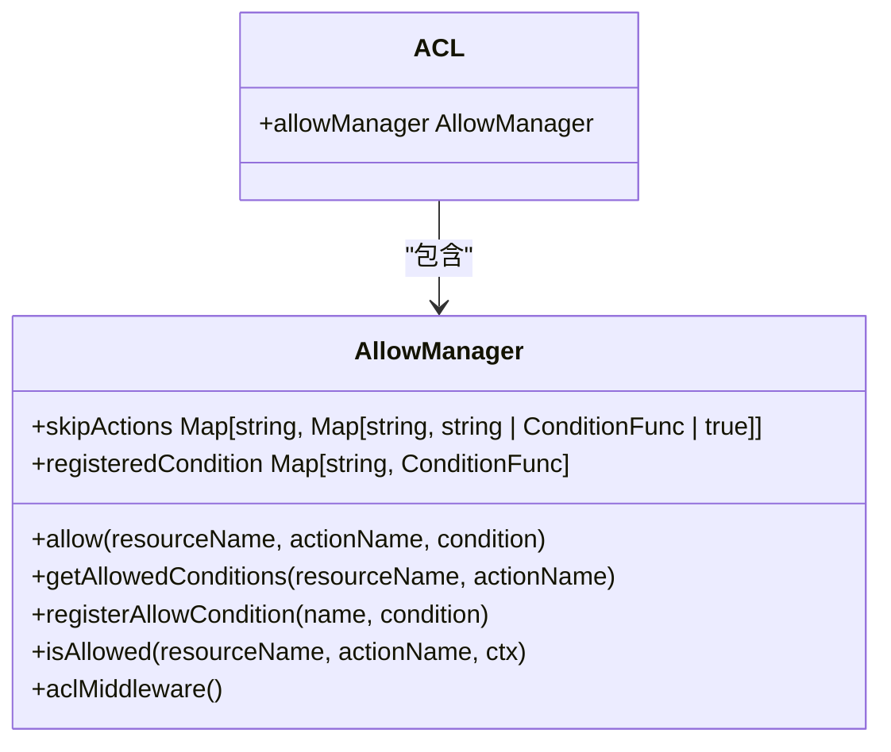
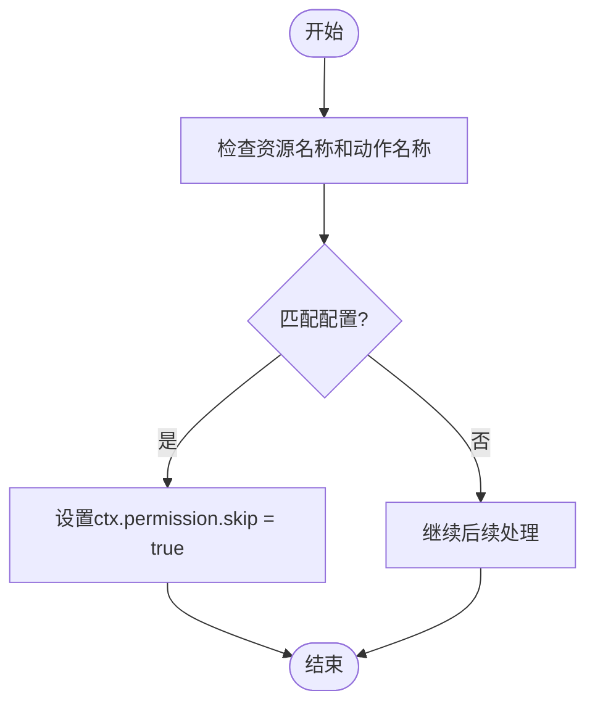
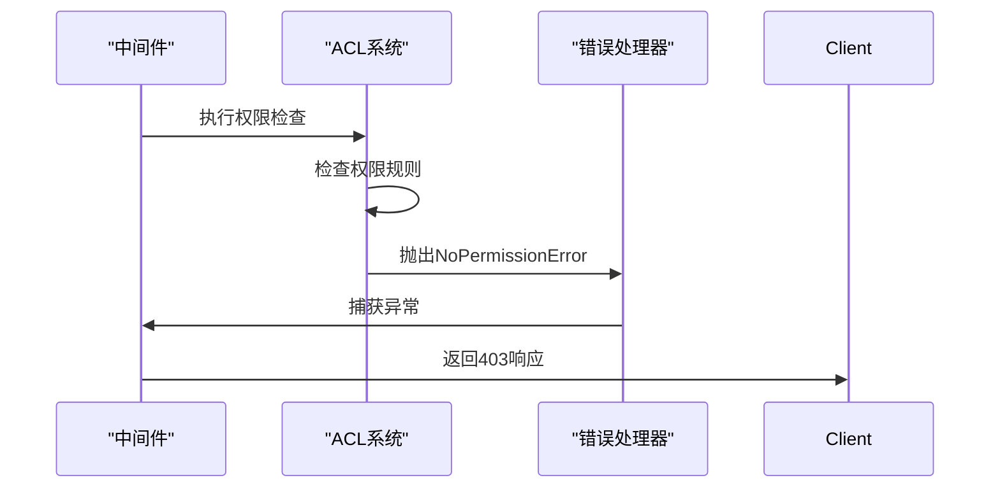

# 权限检查

<cite>
**本文档中引用的文件**  
- [allow-manager.ts](file://packages/core/acl/src/allow-manager.ts)
- [skip-middleware.ts](file://packages/core/acl/src/skip-middleware.ts)
- [acl.ts](file://packages/core/acl/src/acl.ts)
- [acl-role.ts](file://packages/core/acl/src/acl-role.ts)
- [acl-available-strategy.ts](file://packages/core/acl/src/acl-available-strategy.ts)
- [no-permission-error.ts](file://packages/core/acl/src/errors/no-permission-error.ts)
- [check-association-operate.ts](file://packages/plugins/@nocobase/plugin-acl/src/server/middlewares/check-association-operate.ts)
- [with-acl-meta.ts](file://packages/plugins/@nocobase/plugin-acl/src/server/middlewares/with-acl-meta.ts)
- [acl.ts](file://examples/app/acl.ts)
- [acl.ts](file://examples/app/middleware/acl.ts)
</cite>

## 目录
1. [介绍](#介绍)
2. [权限检查流程](#权限检查流程)
3. [AllowManager 实现机制](#allowmanager-实现机制)
4. [跳过中间件（SkipMiddleware）](#跳过中间件skipmiddleware)
5. [权限检查错误处理](#权限检查错误处理)
6. [性能优化策略](#性能优化策略)
7. [自定义插件集成](#自定义插件集成)
8. [常见问题排查指南](#常见问题排查指南)

## 介绍
NocoBase 的权限检查机制基于访问控制列表（ACL）系统，提供了一套完整的权限验证流程。该系统通过中间件链的方式拦截请求，评估权限规则，并做出访问决策。核心组件包括 AllowManager、权限策略管理器和各种中间件，共同构成了一个灵活且可扩展的权限控制系统。

**Section sources**
- [acl.ts](file://packages/core/acl/src/acl.ts#L1-L603)

## 权限检查流程
权限检查流程从请求进入开始，经过多个中间件处理，最终决定是否允许访问。流程包括请求拦截、角色识别、权限评估和决策执行等步骤。系统首先通过中间件获取当前用户的角色信息，然后根据角色配置的权限规则进行评估，最后在核心中间件中执行访问控制决策。

**Diagram sources**
- [acl.ts](file://packages/core/acl/src/acl.ts#L381-L418)
- [allow-manager.ts](file://packages/core/acl/src/allow-manager.ts#L96-L111)

**Section sources**
- [acl.ts](file://packages/core/acl/src/acl.ts#L381-L418)
- [allow-manager.ts](file://packages/core/acl/src/allow-manager.ts#L96-L111)

## AllowManager 实现机制
AllowManager 是权限检查的核心组件，负责管理权限跳过条件和评估逻辑。它维护一个跳过动作的映射表，支持通配符匹配和条件函数。当请求到达时，AllowManager 会检查是否满足跳过条件，如果满足则直接允许访问，否则继续后续的权限检查流程。

**Diagram sources**
- [allow-manager.ts](file://packages/core/acl/src/allow-manager.ts#L14-L111)
- [acl.ts](file://packages/core/acl/src/acl.ts#L75-L76)

**Section sources**
- [allow-manager.ts](file://packages/core/acl/src/allow-manager.ts#L14-L111)

## 跳过中间件（SkipMiddleware）
跳过中间件（SkipMiddleware）提供了一种机制，允许在特定条件下跳过权限检查。通过配置资源名称和动作名称，可以指定哪些请求应该被无条件允许。这种机制适用于需要绕过常规权限检查的特殊场景，如健康检查接口或公共API。

**Diagram sources**
- [skip-middleware.ts](file://packages/core/acl/src/skip-middleware.ts#L10-L25)

**Section sources**
- [skip-middleware.ts](file://packages/core/acl/src/skip-middleware.ts#L10-L25)

## 权限检查错误处理
权限检查系统通过 NoPermissionError 异常来处理权限不足的情况。当权限检查失败时，系统会抛出 NoPermissionError 异常，然后在中间件中转换为 HTTP 403 响应。这种统一的错误处理机制确保了权限错误的一致性和可预测性。

**Diagram sources**
- [no-permission-error.ts](file://packages/core/acl/src/errors/no-permission-error.ts#L1-L10)
- [check-association-operate.ts](file://packages/plugins/@nocobase/plugin-acl/src/server/middlewares/check-association-operate.ts#L37-L54)

**Section sources**
- [no-permission-error.ts](file://packages/core/acl/src/errors/no-permission-error.ts#L1-L10)
- [check-association-operate.ts](file://packages/plugins/@nocobase/plugin-acl/src/server/middlewares/check-association-operate.ts#L37-L54)

## 性能优化策略
权限检查系统采用了多种性能优化策略，包括权限规则的预加载、缓存机制和高效的匹配算法。通过将权限规则预加载到内存中，避免了每次请求时的数据库查询。同时，使用 Map 数据结构和通配符匹配算法，确保了权限检查的高效性。

**Section sources**
- [acl-role.ts](file://packages/core/acl/src/acl-role.ts#L37-L40)
- [acl-available-strategy.ts](file://packages/core/acl/src/acl-available-strategy.ts#L34-L80)

## 自定义插件集成
在自定义插件中集成权限检查非常简单。通过调用 app.acl.define() 方法，可以定义角色的权限规则。然后使用 app.resourcer.use(app.acl.middleware()) 将权限中间件添加到请求处理链中。这种方式使得插件可以轻松地实现细粒度的权限控制。

**Diagram sources**
- [acl.ts](file://examples/app/acl.ts#L31-L38)
- [acl.ts](file://examples/app/middleware/acl.ts#L68-L69)

**Section sources**
- [acl.ts](file://examples/app/acl.ts#L31-L38)
- [acl.ts](file://examples/app/middleware/acl.ts#L68-L69)

## 常见问题排查指南
当遇到权限检查相关问题时，可以按照以下步骤进行排查：首先检查角色配置是否正确，然后验证权限规则是否按预期工作，最后确认中间件的执行顺序。常见的权限问题通常与角色配置错误、权限规则不匹配或中间件顺序不当有关。

**Section sources**
- [with-acl-meta.ts](file://packages/plugins/@nocobase/plugin-acl/src/server/middlewares/with-acl-meta.ts#L97-L145)
- [acl.ts](file://packages/core/acl/src/acl.ts#L495-L573)