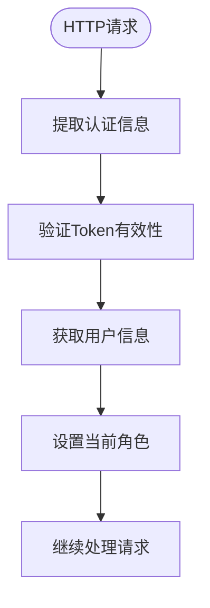
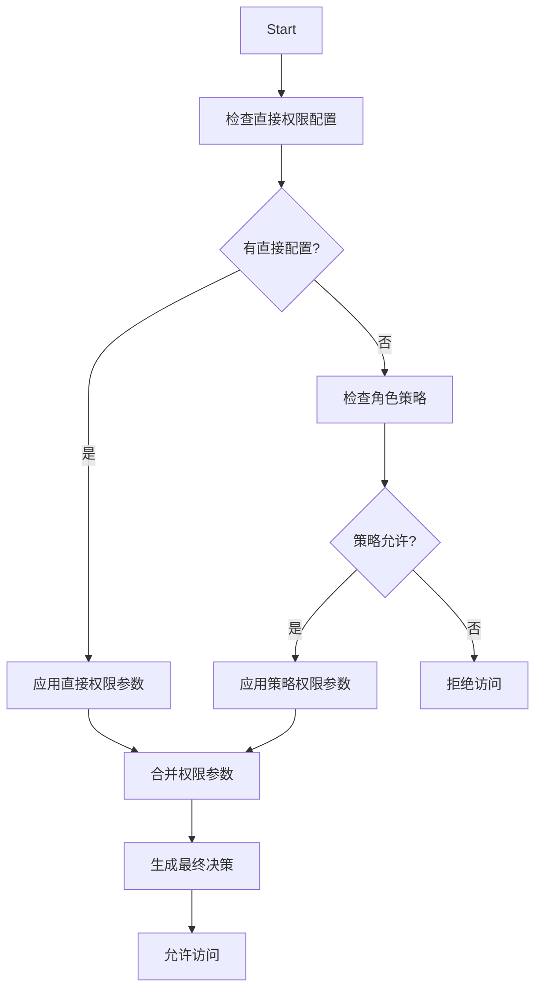
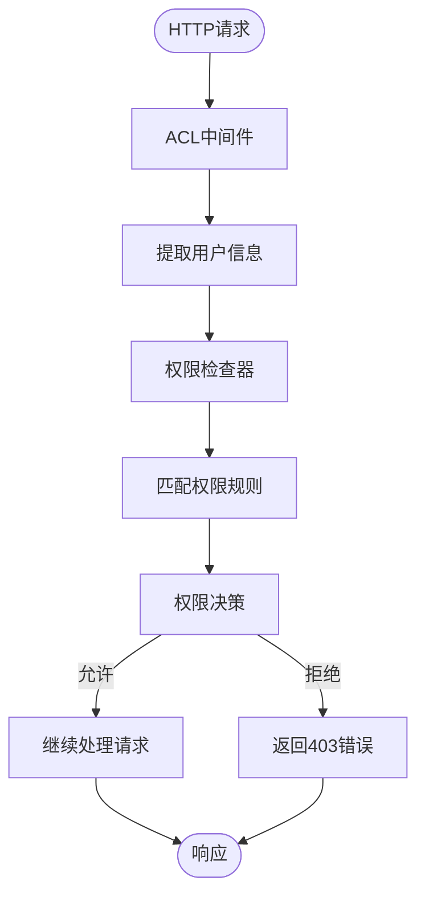

# 权限验证流程

<cite>
**本文档引用的文件**   
- [acl.ts](file://packages/core/acl/src/acl.ts)
- [allow-manager.ts](file://packages/core/acl/src/allow-manager.ts)
- [acl-available-strategy.ts](file://packages/core/acl/src/acl-available-strategy.ts)
- [acl-role.ts](file://packages/core/acl/src/acl-role.ts)
- [fixed-params-manager.ts](file://packages/core/acl/src/fixed-params-manager.ts)
- [snippet-manager.ts](file://packages/core/acl/src/snippet-manager.ts)
- [server.ts](file://packages/plugins/@nocobase/plugin-acl/src/server/server.ts)
- [check-association-operate.ts](file://packages/plugins/@nocobase/plugin-acl/src/server/middlewares/check-association-operate.ts)
- [with-acl-meta.ts](file://packages/plugins/@nocobase/plugin-acl/src/server/middlewares/with-acl-meta.ts)
- [auth.ts](file://packages/core/auth/src/auth.ts)
</cite>

## 目录
1. [介绍](#介绍)
2. [权限验证流程概述](#权限验证流程概述)
3. [ACL中间件](#acl中间件)
4. [权限检查器](#权限检查器)
5. [权限规则匹配算法](#权限规则匹配算法)
6. [同步与异步权限检查](#同步与异步权限检查)
7. [性能监控与日志记录](#性能监控与日志记录)
8. [流程图](#流程图)
9. [结论](#结论)

## 介绍
NocoBase的权限验证系统是一个基于角色的访问控制（RBAC）系统，它通过ACL（访问控制列表）中间件拦截HTTP请求，提取用户身份信息，并根据资源、操作和用户角色进行权限评估。该系统支持复杂的权限规则匹配算法和决策逻辑，确保只有授权用户才能访问特定资源。

## 权限验证流程概述
当HTTP请求进入系统时，首先由ACL中间件拦截。中间件从请求上下文中提取用户身份信息，并调用权限检查器来评估用户是否有权执行请求的操作。权限检查器根据预定义的权限规则进行匹配，最终决定是否允许请求继续执行。

**Section sources**
- [acl.ts](file://packages/core/acl/src/acl.ts#L381-L418)
- [server.ts](file://packages/plugins/@nocobase/plugin-acl/src/server/server.ts#L464)

## ACL中间件
ACL中间件是权限验证流程的第一道防线。它负责拦截所有进入系统的HTTP请求，并从中提取用户身份信息。中间件通过检查请求头中的认证信息（如Bearer Token）来确定当前用户的身份，并将用户角色存储在请求上下文中，供后续的权限检查使用。

**Diagram sources**
- [acl.ts](file://packages/core/acl/src/acl.ts#L384-L417)
- [auth.ts](file://packages/core/auth/src/auth.ts#L74-L81)

## 权限检查器
权限检查器是权限验证的核心组件。它接收来自ACL中间件的用户角色信息，并根据请求的资源和操作来评估用户是否有权执行该操作。权限检查器会查询预定义的权限规则，这些规则定义了不同角色对不同资源的操作权限。

**Section sources**
- [acl.ts](file://packages/core/acl/src/acl.ts#L210-L241)
- [acl-role.ts](file://packages/core/acl/src/acl-role.ts#L82-L96)

## 权限规则匹配算法
权限规则匹配算法是权限检查器的核心逻辑。它通过以下步骤来确定用户是否有权执行请求的操作：
1. 首先检查用户角色是否具有直接的权限配置。
2. 如果没有直接配置，则检查角色的策略（strategy）是否允许该操作。
3. 如果策略允许，则应用相应的权限参数。
4. 最后，将所有匹配的权限规则合并，生成最终的权限决策。

**Diagram sources**
- [acl.ts](file://packages/core/acl/src/acl.ts#L243-L322)
- [acl-available-strategy.ts](file://packages/core/acl/src/acl-available-strategy.ts#L60-L79)

## 同步与异步权限检查
NocoBase支持同步和异步两种权限检查模式。同步检查适用于简单的权限决策，可以在请求处理的早期阶段快速完成。异步检查则适用于复杂的权限评估，可能需要查询数据库或其他外部服务来获取必要的信息。

**Section sources**
- [acl.ts](file://packages/core/acl/src/acl.ts#L210-L241)
- [auth.ts](file://packages/core/auth/src/auth.ts#L70-L82)

## 性能监控与日志记录
为了帮助开发者诊断权限相关问题，NocoBase提供了详细的性能监控和日志记录机制。系统会记录每个权限检查的详细信息，包括请求的资源、操作、用户角色以及最终的决策结果。这些日志可以帮助开发者快速定位和解决权限问题。

**Section sources**
- [acl.ts](file://packages/core/acl/src/acl.ts#L505-L506)
- [server.ts](file://packages/plugins/@nocobase/plugin-acl/src/server/server.ts#L636-L637)

## 流程图
以下是NocoBase权限验证流程的完整流程图：

**Diagram sources**
- [acl.ts](file://packages/core/acl/src/acl.ts#L381-L418)
- [server.ts](file://packages/plugins/@nocobase/plugin-acl/src/server/server.ts#L464)

## 结论
NocoBase的权限验证流程设计精巧，通过ACL中间件、权限检查器和复杂的权限规则匹配算法，实现了灵活而安全的访问控制。系统支持同步和异步权限检查，并提供详细的性能监控和日志记录，帮助开发者轻松管理和调试权限问题。